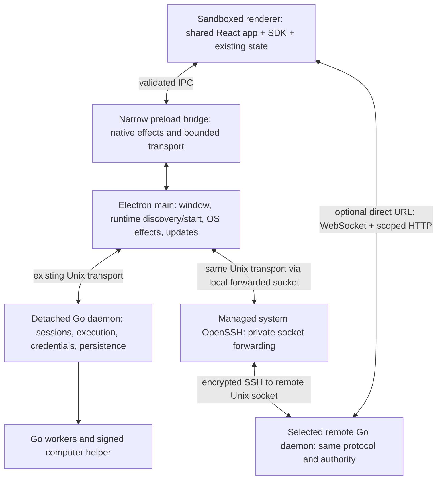

# Whip desktop app: research and implementation plan

Branch: not created; research and planning only.

Status: product scope confirmed; architecture proposed; implementation not authorized.
Research date: 2026-09-07. Repository inspected at `dd7aaa3a`, including the
existing working-tree changes. No implementation, dependency installation,
benchmark, daemon operation, or release was performed for this research.

## Recommendation

Use **Electron for the first desktop release**, with Electron Forge for packaging
and the existing Vite pipeline for the renderer. Keep the main process small and
reuse `@whip/app`, `@whip/ui`, and the existing Go daemon.

This is a judgment about delivery and maintenance risk, not a claim that Electron
is the fastest framework. Electrobun's system-webview design can reduce distribution
size and may improve startup and memory. However, its current 2.x release introduces
a new default JavaScript runtime and build system. Whip benefits more immediately
from a consistent renderer, established desktop APIs, and a documented upstream
maintenance policy. Require actual Whip performance measurements before accepting
Electron's overhead.

After implementation is authorized, timebox an Electron/Electrobun comparison to
2–3 engineering days. The default remains Electron if it meets the agreed budgets.
Reconsider if Electrobun provides a material, repeatable improvement and passes the
same compatibility, lifecycle, and distribution checks. Do not maintain two product
shells or create a framework-neutral desktop framework.

## Goal and confirmed scope

Deliver an installable, responsive desktop Whip with the current web workflows,
durable local work, and ordinary native app behavior.

The user confirmed the following scope after reviewing the initial research:

| Area | Confirmed requirement | Design consequence |
| --- | --- | --- |
| Launch platform | macOS first | Windows/Linux desktop packaging is later work |
| Local runtime | Package Whip and automatically start its daemon | Ship the companion runtime; reuse a compatible running daemon and start only when absent |
| Remote runtime | Remote connections, including built-in SSH, are required at launch | Make SSH the default remote workflow; retain direct URLs and gate host switching, content and reconnect |
| Product interface | Use the same UI for web and desktop | Shared React routes, settings, menus, tabs, splits and workflows remain in `@whip/app` |
| Desktop integration | Dialogs, notifications, automatic updates, window/session restoration | Add narrow host effects; retain minimal standard macOS app/edit/window menu roles |
| Deferred product features | No terminal, file editing or code review for now | Do not add IDE workspaces as part of packaging |

Apple Silicon and macOS 14+ remain planning defaults, not confirmed architecture
or minimum-OS requirements. macOS 14 matches `driver/Package.swift`; Intel support
would add a real Intel release/test lane. Direct signed/notarized download is
assumed; Mac App Store distribution is not included. External developer tools,
language toolchains, and arbitrary MCP servers are not all bundled by installing
Whip. SSH is confirmed for v1. The remote host initially needs a compatible Whip
installation and SSH access; connecting can start an installed, stopped daemon.
Automatic remote installation/upgrades are separate from the confirmed local
bundling requirement and are not assumed in this plan. Target Linux and macOS
remote hosts supported by the existing Go runtime; remote Windows is later work.

Non-goals: rewriting React or the daemon, changing agent execution, hosted accounts
or relays, a new connection-authentication/enrollment system, a plugin platform,
new editor/terminal/review surfaces, and multiple OS windows in the first release.
Existing in-window tabs and splits remain part of the product.

## What the research establishes

### Framework comparison

| Dimension | Electron | Electrobun 2.x | Implication for Whip |
| --- | --- | --- | --- |
| Renderer | Bundled Chromium | System webviews by default; optional bundled CEF | Electron gives one pinned rendering implementation; native webviews require testing OS-specific behavior |
| Main runtime | Node.js | Cottontail by default; Bun and native-language options available | Electron fits the repository's Node/npm tooling; Electrobun need not force a package-manager migration, but adds Hutch/devkit tooling |
| Startup and memory | Browser/runtime overhead must be measured | Smaller distribution is plausible; Whip latency advantage unmeasured | Do not equate download size, JS heap, resident memory, and launch time |
| Maintenance | Published support policy for the latest three stable major lines | Recent major transition and an explicitly limited maintainer contribution commitment | Electron is the lower-risk default; neither removes ongoing patch work |
| UI compatibility | Consistent browser engine, mature debugging APIs | WKWebView, WebView2, WebKitGTK; behavior follows the installed engine | Whip's Safari tests help, but Safari is not an embedded WKWebView acceptance test |
| Distribution | Forge signing/notarization and Electron updater; Linux update policy separate | Integrated installers and updater; native target builds | Both need real signed artifact and interrupted-update validation |
| Current macOS architecture coverage | Evaluate supported release binaries for launch targets | Official target table lists arm64 | Electrobun is an especially poor default if Intel is a launch requirement |

Electron's [process model](https://www.electronjs.org/docs/latest/tutorial/process-model)
separates the privileged main process from renderers. Its
[release policy](https://www.electronjs.org/docs/latest/tutorial/electron-timelines)
supports three stable major versions, with the newest line receiving the broadest
fix coverage. The [release index](https://releases.electronjs.org/) listed 44.2.0,
43.6.0, and 42.11.2 during research. Recheck and pin a supported stable patch when
implementation begins; do not freeze the release date's version into this plan.

Electrobun [v2.0.1](https://github.com/blackboardsh/electrobun/releases/tag/v2.0.1)
was the latest stable release during research, published August 22, 2026. The
release feed also contained 2.0.2 prereleases. Its
[migration guide](https://framework.blackboard.sh/electrobun/guides/migrating-to-v2/)
documents the move to Hutch and Cottontail, changed configuration, and external
bundler aliases. Existing npm ownership is supported explicitly. This is more
substantial than choosing a faster Node replacement for a thin shell.

The [current architecture](https://framework.blackboard.sh/electrobun/guides/architecture/overview/)
uses system webviews or CEF and separate privileged main-process APIs. The
[compatibility table](https://framework.blackboard.sh/electrobun/guides/compatability/)
lists macOS arm64, Windows x64, and Linux x64/arm64. It also says the CEF version is
pinned by Electrobun rather than overridden per app. The
[CEF guide](https://framework.blackboard.sh/electrobun/apis/bundling-cef/)
explicitly describes a material download/installed-size increase. CEF would reduce
engine variability, but weaken the principal footprint argument for Electrobun.

The [repository's contribution statement](https://github.com/blackboardsh/electrobun#contributing)
says contributors should have “no expectation that I will review, respond to, or
merge them.” That is a maintenance dependency to accept consciously, not evidence
that every release is unreliable. Its
[2.x changelog](https://framework.blackboard.sh/electrobun/guides/changelog/v2-x/)
also documents substantial test investment and fixes to lifecycle, persistence,
dialogs, signing, and platform behavior. The new runtime itself is not negligible:
the published macOS ARM64 example is about 57.7 MB extracted for Cottontail alone.
That is not total application size or memory usage.

No comparable, current, representative Whip benchmark was found. Framework marketing
figures and empty-window demonstrations are not accepted as Whip measurements.
Live documentation may describe fixes newer than the pinned stable release; the
comparison must use exact release artifacts and their version-matched source.

### Other option considered

Tauri 2 deserves a fallback evaluation if Electron cannot meet a hard footprint
budget. Its [process model](https://v2.tauri.app/concept/process-model/) uses a Rust
core with system webviews; its [distribution tooling](https://v2.tauri.app/distribute/)
and [signed updater](https://v2.tauri.app/plugin/updater/) cover desktop releases.
It adds a Rust shell toolchain and retains the OS-webview testing burden. There is
not enough reason to expand the initial comparison into three implementations.
Electrobun's Go main-process option similarly does not justify moving Whip's
daemon into the GUI process.

## Repository findings that shape the design

The canonical source remains [docs/frontend.md](../../../docs/frontend.md).
This proposal does not change the current architecture until implemented.

| Finding | Evidence | Planning consequence |
| --- | --- | --- |
| Renderer already separates app from host effects | `packages/app/src/platform.ts`, `apps/web/src/main.tsx` | Add `apps/desktop`; reuse the application instead of copying it |
| One application runtime owns SDK views, Query, drafts and composition | `packages/app/src/runtime.ts` | Keep that state in the renderer; the main process must not implement another session reducer |
| SDK accepts an endpoint string or a `TransportFactory` | `packages/sdk/src/client.ts`, `transport.ts`, `node.ts` | A narrow native transport adapter is possible without replacing protocol/recovery behavior |
| No product SSH connection layer exists yet | Search of `packages/app`, `packages/sdk`, `cmd/whip`, and `internal/daemon` | Add managed SSH connection behavior; this is implementation work beyond an installer |
| Unix transport already transfers content in bounded protocol chunks | `packages/sdk/src/content.ts` | Local desktop attachment can work with daemon networking disabled; measure attachment throughput |
| App currently validates only HTTP/WS endpoint strings | `packages/app/src/runtime.ts:373` | Native local attachment requires a small real app boundary extension; it is not implemented today |
| Network listener defaults to an ephemeral loopback port | `internal/daemon/network.go:25` | Renderer storage must not depend on the daemon's current origin |
| Browser origins currently accept exact HTTP/HTTPS origins only | `internal/daemon/network.go:47` | A custom desktop origin cannot simply connect directly without accounting for this restriction |
| Daemon control already reports machine-readable status and detaches on startup | `cmd/whip/daemon_manage.go`, `internal/daemon/autostart_unix.go` | Reuse lifecycle commands and readiness, rather than inventing an independent process supervisor |
| Workers execute Whip's own binary with `_kernel` | `internal/rlm/kernel.go:400` | Preserve a running daemon's executable across desktop app replacement |
| Swift computer helper is embedded/extracted; current release signing is ad hoc | `internal/computer/embed_darwin.go`, `.github/workflows/release.yml` | Desktop signing must cover the helper before embedding and validate its eventual launch location |
| Existing release matrix has macOS/Linux but no Windows | `.github/workflows/release.yml`; Unix daemon launch implementation | Cross-platform Electron support does not make the Go runtime Windows-ready |
| Web release acceptance remains open | `docs/roadmap.md`, `docs/web-app.md` | Desktop packaging does not close outstanding product/accessibility gates |

The current protocol is major 4, minor 1. Existing HTTP paths still contain
`/api/v3/`; use actual discovery/capabilities and generated contracts, not guesses
from path names or package versions. Compatible build differences must not trigger
automatic daemon replacement.

## Proposed architecture

### Renderer, build and storage

Create `apps/desktop`, importing `createWhipApplication` and implementing
`AppPlatform`. Preserve the StyleX/TanStack/Vite build contract, package exports,
code splitting, and early theme initialization. Use npm/Node 24 for build tooling;
bundle main/preload with the existing esbuild dependency and renderer with Vite.
Stage explicit production artifacts for Forge rather than copying the monorepo's
development dependencies into the application.

Web and desktop share the same product components, navigation and in-app menus.
Only bootstrap, OS effects and local-runtime attachment belong in the desktop
package. Avoid desktop-specific copies of screens and broad platform conditionals
in feature components. When a workflow needs a platform capability, expose that
specific capability through the existing boundary.

Use Forge for packaging/makers/signing. Its
[Vite plugin](https://www.electronforge.io/config/plugins/vite) is still documented
as experimental and permits breaking minor changes. The initial plan uses ordinary
Vite output and Forge build hooks instead of coupling the build to that plugin.
Keep this orchestration small; do not introduce another build framework.

Serve bundled UI assets from a stable app-owned origin, proposed
`whip-app://bundle`, with a persistent Electron session. Electron's
[protocol API](https://www.electronjs.org/docs/latest/api/protocol) requires standard
scheme registration for normal origin storage and URL resolution. Register the
needed secure/standard/fetch privileges and retain CSP enforcement. Validate
deep-route reloads, asset path confinement, `crypto.randomUUID`, Web Locks, fonts,
storage and clipboard under the packaged origin in the initial spike.

Use origin-local storage for existing preferences, drafts, and recovery metadata.
Preserve the current fallback/error behavior and existing key names. Persist a
small, bounded window-layout snapshot for reopening the desktop window: ordinary
`sessionStorage` alone is not a guarantee of restoration after quitting the app.
Keep layout separate from persistent drafts and from daemon state. No transcript,
Query, provider-secret, or attachment-body persistence is added.

### Local attachment

Prefer a bounded IPC transport adapter over the existing SDK Unix transport in
the main process. The renderer retains its single `WhipClient`; main forwards
transport messages and lifecycle only. `@whip/sdk/node` stays outside the renderer
and sandboxed preload. Use a narrow optional endpoint-resolution hook in
`AppPlatform` so the app can resolve a desktop local-host identity to an SDK
transport factory. The browser keeps the current HTTP/WS behavior.

The main process chooses the local socket from Whip's reported runtime paths;
page code cannot request arbitrary socket paths or spawn arbitrary binaries.
Enforce frame/queue byte bounds, ordering, connection epochs, cancellation and
backpressure across IPC as well as the socket. Closing a window closes its
transport, not the daemon. Reuse `kind: 'unix'` for the actual bridged Unix
connection so the existing scoped chunked content path remains truthful.

This approach avoids opening a listener or restarting a compatible daemon that
was started from the CLI with networking disabled. It adds one measured transport
hop. If its measured cost is unacceptable, evaluate a scoped network transport
alternative; do not duplicate the SDK or weaken durability to hide the cost.

### Remote attachment: required for v1

Keep the existing shared host-connection UI and the current one-selected-host
model. Offer a stable local-host identity beside saved SSH profiles and direct URLs.
SSH is the default remote connection method in desktop. Starting
the local daemon runs independently of connecting to the selected remote host;
remote startup must not wait for local daemon readiness. Restore the last selected
host on launch. An unavailable remote host stays visibly disconnected rather than
silently routing work to the local machine.

For directly reachable trusted endpoints, reuse the renderer's SDK WebSocket and
scoped HTTP content paths. They must satisfy CSP and the remote daemon's exact
origin policy. Plan a narrow explicit allowance for `whip-app://bundle` in
`internal/daemon/network.go` and its tests/configuration documentation. Validate
the packaged renderer's actual Origin value, HTTPS/WSS behavior and content
preflights during the initial spike. Older remote daemon installations will need
the compatible build and explicit origin configuration before desktop attachment;
surface this prerequisite without attempting automatic remote reconfiguration.
Do not broaden origins or disable browser security.

Direct URLs retain Whip's current trusted-network model. SSH supplies authenticated,
encrypted access to the remote user's daemon without adding public HTTP exposure.
Hosted accounts, relays and automatic remote daemon installation remain outside
this packaging scope. The custom-origin extension applies to direct URLs only;
SSH attachment must also pass with daemon networking entirely disabled.

Session creation paths, provider setup, tool permissions and execution belong to
the selected daemon. Local files chosen for attachments upload through the existing
scoped content API to that selected host. Remote workspace selection uses the
daemon's directory browser; it must never substitute a Mac filesystem path.
Host switches retain existing epoch guards, runtime-scoped drafts, bounded views
and uncertain-command recovery. Switching away does not stop remote work.

### Built-in SSH: connection design

Use macOS's `/usr/bin/ssh` instead of adding a JavaScript SSH implementation.
OpenSSH already supports host aliases, jump hosts, agent authentication and
Unix-socket forwarding. These are documented in the
[OpenSSH client manual](https://man.openbsd.org/ssh). The development Mac reports
OpenSSH 10.2p1; acceptance must also exercise the client shipped with the minimum
supported macOS rather than assuming identical versions.

The proposed transport is **private local Unix socket → OpenSSH → remote Whip
Unix socket**. The main process uses the existing SDK Unix transport on the local
forwarded socket. The same renderer IPC adapter then serves local and SSH hosts.
Retain the SDK's Unix transport kind and bounded, scoped content chunks: sessions,
uploads, downloads and permission decisions all travel through the authenticated
channel. SSH does not need a remote web listener, a browser-origin exception,
`socat`, a remote Node runtime, or a new daemon wire protocol.

V1 connection flow:

1. In the shared connection dialog, enter a saved SSH alias or host with optional
   username, port, identity-file reference and remote Whip executable/home override.
   Keep advanced fields collapsed. Persist profile metadata and a stable profile
   ID, never private-key bytes, passwords, passphrases or generated socket paths.
2. Resolve selected configuration through OpenSSH. Respect the user's identity,
   agent and proxy/jump-host settings; avoid implementing an SSH configuration
   parser. Configuration can contain executable directives, so treat the user's
   selected config as local code and never import directives from a remote host.
   Override tunnel lifecycle and unrelated forwarding/session options deliberately.
3. Establish an app-owned SSH connection/control socket. Reuse this connection
   for status/start commands and the forwarding channel so setup does not require
   repeated authentication. Do not attach the app's lifetime to an unrelated
   Terminal session's shared SSH master. Keep agent and X11 forwarding disabled;
   using the local agent to authenticate does not require forwarding it remotely.
4. Run the installed remote Whip's `daemon status --json` through that connection.
   If it reports stopped with no conflicting owner, the Connect operation may run
   `daemon start`, then repeat status. Reuse a compatible existing daemon; require
   an explicit repair/upgrade action for incompatibility or unhealthy ownership.
   A missing remote executable produces an actionable setup message. An override
   supports installations outside a noninteractive SSH session's PATH.
5. Read and validate the absolute socket path from bounded machine-readable status.
   Forward to a fresh local socket in a short, owner-only directory. Check Unix
   socket path-length and forwarding-syntax constraints explicitly. Do not bind a
   public local port, delete arbitrary existing sockets, or enable remote networking.
6. Mark connected only after the SDK initializes through the tunnel and validates
   the expected runtime identity/capabilities. Forward creation is not proof the
   remote daemon is reachable. Preserve the last visible state as stale until the
   existing SDK recovery completes.

OpenSSH's remote-command arguments are interpreted by the remote shell. A local
argument array is therefore not sufficient protection for remote executable/home
values. Use only fixed application command templates, correctly quote each remote
value for the supported shell contract, and reject unsupported input. Keep stdout
for bounded status data and stderr for bounded diagnostics; banner/noisy-shell
output is a setup error, not protocol input. Do not expose arbitrary SSH commands
through the renderer bridge.

The server must permit stream-local forwarding and the SSH user must be able to
access the daemon socket. Test policy-denied forwarding and provide an actionable
error without silently changing sshd policy or switching to an exposed TCP port.
The relevant server option is documented in
[sshd_config](https://man.openbsd.org/sshd_config#AllowStreamLocalForwarding).

#### Authentication and host verification

Reuse configured key files and the user's local
[SSH agent](https://man.openbsd.org/ssh-agent); do not create a second key vault.
Finder/Dock launch must locate the configured agent. Preserve ordinary OpenSSH
known-host checking. First connection presents the exact host/key fingerprint
for confirmation; a changed key blocks connection and is never automatically
removed or accepted. Existing trusted host keys should connect without extra UI.

Provide a signed askpass helper connected to the app's shared prompt components
for encrypted-key passphrases, passwords and keyboard-interactive challenges.
Do not provide a terminal emulator just to authenticate. Use per-attempt request
IDs, a private authenticated helper channel, cancellation, and in-memory responses;
exclude prompt answers from logs, persistence, crash diagnostics and command
recovery. Treat prompts as plain text and verify the calling attempt before
accepting an answer. Key-agent, password, multi-prompt authentication, cancellation
and hardware-key interaction need actual packaged-build coverage.

The [OpenSSH configuration reference](https://man.openbsd.org/ssh_config)
documents host-key verification, control connections, forwarding-failure reporting
and server-alive checks. Use connection deadlines and encrypted keepalives;
`ExitOnForwardFailure` is useful but does not prove the final socket is reachable.
Use askpass only on an explicit connection/authentication interaction; background
reconnects should surface an authentication-needed state instead of repeatedly
opening prompts. Do not impose the network setup deadline on a person answering
an interactive challenge.

#### SSH ownership, recovery and shared UI

One connection attempt owns its helper, SSH process group, control socket, forwarded
socket and pending prompts. Keep these resources bounded to the selected host and
dispose them on disconnect, host replacement or full app quit. Closing/hiding the
window can retain them while the app remains running for notifications.

Plan a small desktop-only helper mode in the already bundled Whip executable to
supervise OpenSSH and its proxy children. It observes a parent-lifetime pipe and
terminates/reaps its own process group when the app disappears. This covers main
process crashes that cannot run a JavaScript quit handler. Reuse the same signed
binary for the askpass entry mode where practical. The helper owns connection I/O
only; it does not own sessions or daemon state. Verify forced app termination and
orphan cleanup before accepting this design; PID-only cleanup is insufficient.

On temporary network loss or wake, use a single bounded retry loop with backoff
and jitter for SSH establishment. Once the tunnel is ready, the SDK alone owns
session replay and command recovery. Bind retries/prompts to a connection epoch;
old attempts cannot replace a newly selected host. Cancel all retries on explicit
disconnect. Tunnel loss or GUI quit never sends daemon stop or turn cancellation.
Never automatically replay a prompt submission to compensate for connection loss.

The profile's identity remains stable when its local socket changes. Verify the
daemon's persistent runtime ID after reconnect; replacing a remote runtime needs
an explicit host transition so drafts/recovery cannot land on another machine.
Expose connecting, verifying host, authenticating, starting daemon, connected,
reconnecting, authentication-needed and failed as truthful states in the shared UI.
The browser uses those same product components but only advertises connection
methods its host can provide; a browser cannot launch system OpenSSH by itself.

### Daemon lifecycle and installation

1. Paint the bundled application shell while discovering the local daemon
   asynchronously. Restore the selected local or remote host independently.
2. Reuse `whip daemon status --json` and protocol initialization/capability checks.
   Attach to compatible existing work even when build strings differ.
3. If no daemon owns the configured runtime, invoke the bundled runtime's existing
   start path. Readiness means a successful handshake; PID existence is insufficient.
4. Surface incompatible/stale/failed startup explicitly, with bounded diagnostics
   and a deliberate restart action. Never kill an existing process merely to launch.
5. Closing the window, Cmd-Q, and renderer crashes leave accepted daemon work
   running. Expose stopping the local runtime as a separate explicit action.
6. Reconnect after sleep/wake using existing SDK recovery. Sleeping the Mac still
   pauses execution; do not silently enable a system-wide sleep inhibitor.

Keep `~/.whip` (or the explicitly configured Whip home) authoritative for runtime
data so CLI and desktop see the same work. Electron user data holds only viewing
preferences, UI layout and desktop installation metadata. A bundled runtime is
not a second database or a new default Whip home.

For the confirmed self-contained installation, install the signed companion runtime at a
versioned, immutable user-owned location outside the replaceable `.app` bundle.
Launch each daemon from its own retained version path. This preserves the path
used for future `_kernel` spawns when the GUI updates. Atomically stage from the
signed app resource, validate identity/integrity, and retain versions still used
by a daemon or worker. Use the supported helper override to select the matching
signed computer helper from that retained version. Final paths and TCC identity
must be verified on an actual signed build before this design is accepted.

Do not auto-restart the daemon when the GUI updates. Keep the last usable app
release available if the new GUI cannot attach to the still-running daemon.
Daemon upgrade happens explicitly when interruption is acceptable. Database
schema compatibility is checked before opening/upgrading data; an app rollback
does not imply a safe database downgrade.

Finder/Dock launch must find expected developer tools without requiring launch
from a terminal. Test a clean GUI environment. Resolve configured executable
paths and, if needed, obtain the user's login-shell PATH asynchronously with a
timeout and cache only the needed path information. Do not block first paint on
shell startup or copy an entire secret-bearing environment into persistent UI state.

### Shared interface, OS integration and security boundaries

Start with one native window and existing shared tabs/splits. Retain product
navigation, context menus and settings in the same React UI used by the web app.
The macOS menu bar supplies only conventional App/Edit/Window roles needed for
Quit, Copy/Paste and normal window behavior; it is not a second product-navigation
surface. Provide ordinary focus/fullscreen/Dock behavior, external links,
save/attachment dialogs, and a local-directory picker. A local directory dialog
is valid only for a local daemon; remote directory selection remains host-owned.

Reuse current draft flushing and attachment-loss warnings on close/reload/update.
Cmd-W behavior must respect the app's current tab model. Native notifications
should be coalesced, actionable, and suppressed while the relevant work is focused.
Use bounded metadata observation rather than subscribing to every transcript.
Initial notification delivery is while the desktop app is running, including hidden
windows; notifications after Cmd-Q would require separate background product work.

Apply Electron's [security guidance](https://www.electronjs.org/docs/latest/tutorial/security):
sandbox and context isolation enabled, Node integration disabled, narrow validated
preload methods, sender/frame validation, constrained navigation/new windows and
external URL schemes, restrictive CSP, and limited app permissions. Agent output
and Markdown are untrusted renderer content. Do not expose generic shell execution,
filesystem access, Electron IPC objects, or arbitrary resource URLs to the page.

Preserve the current trusted-client daemon model and tool-permission authority.
Desktop code signing is distinct from the removed client signer/enrollment system.

## Performance plan and acceptance budgets

These are proposed acceptance targets, **not measured desktop results**. Agree on
a reference machine before implementation: proposed M1 MacBook Air, 8 GB RAM,
supported macOS, local SSD, no DevTools, no development server, production signing
and assets. Record power mode, OS, framework version, screen refresh and thermal
conditions. Also test the oldest supported OS and a current Mac.

| Metric | Proposed target | Measurement boundary |
| --- | --- | --- |
| Warm launch to usable shell | p95 <= 1.0 s | All GUI processes exited; OS caches warm; process launch to visible usable chrome/navigation |
| Cold launch to usable shell | p95 <= 2.0 s | Controlled cold-cache/reboot sample; first-launch extraction/Gatekeeper reported separately |
| Warm launch to usable retained local session | p95 <= 1.5 s | Existing healthy daemon; composer and recent transcript ready |
| Launch plus local daemon startup | p95 <= 3.0 s | No daemon; standard populated fixture; excludes first-run provider login |
| Typing under streaming load | p95 < 50 ms | Trusted key event to next paint estimate; retain censored samples |
| Cached session switch | p95 < 150 ms | User selection to restored usable view/anchor |
| Received event to DOM | p95 < 50 ms | Separate transport receipt, DOM update and paint boundaries |
| Durable commit to DOM | Initial reference p95 < 125 ms | Preserve existing successful-COMMIT-return boundary and clock error accounting |
| Idle desktop process memory | Initial investigation threshold 350 MiB | Sum process RSS for shell/renderer/GPU/helpers after settling; report shared-page caveat and system memory delta |
| Idle CPU | Average < 1% of one logical core | No active agents, 60-second settled sample; include main, renderer and associated helpers |

Record daemon/worker memory separately and report the complete application total;
do not hide it. Also record streaming/32-tab memory, peak transfers, memory after
closing views, CPU, wakeups, dropped frames, compressed download and installed size.
RSS is not JS heap and sums can count shared pages more than once. The memory number
is a proposed investigation threshold until the measurement method is calibrated.

Measure remote connection time separately from shell launch and local startup.
Exercise representative network delay, disconnect and packet-loss conditions;
the application must remain usable while connection attempts are pending. Do not
apply local COMMIT-to-DOM latency budgets to an arbitrary WAN. Local daemon startup
must not delay restoring a remote session, and a remote timeout must not delay
displaying the bundled UI.

For SSH, record DNS/connect, authentication, remote discovery/start, forwarding,
SDK handshake and first usable session separately. Human prompt time is its own
population. Measure already-authenticated reconnects and cold SSH setup, including
jump hosts. Include SSH/helper processes in memory and CPU reports. Exercise
large chunked transfers under latency while continuing to type and stream; the
sequential content path must not starve small control messages or silently lose
the app's current transfer limits. Benchmark-driven transfer changes, if needed,
belong in the SDK and must preserve scope, ordering and backpressure.

Existing evidence in [docs/web-app.md](../../../docs/web-app.md) includes a
10,000-message/100-child fixture, 32 drafts near the storage limit, and 16 concurrent
fake streams. Its approximately 10.6 MB retained JS heap is not an estimate of an
Electron app's RAM. Reuse `apps/web/scripts/performance.mjs`; adapt its event probes
to the actual IPC transport rather than leaving WebSocket-only instrumentation that
would miss desktop traffic.

The deferred comparison uses the same production renderer revision, fixture,
visible content, window geometry and daemon. Test Electron and Electrobun's default
system webview, recording the exact main runtime. A Bun variant is useful only if
Cottontail compatibility is the blocker. Do not compare Electron's full product
against an empty Electrobun window. Separate engine-only attachment tests from the
complete packaged launch path and run each package's actual native bridge tests.

Collect at least 30 warm trials, exploratory cold trials with explicit cache
method, and enough controlled cold repetitions before presenting a release p95 as
robust. Rotate framework order and report raw samples, median, p95 and variance.
First install, normal warm relaunch, cold launch, sleeping/resuming and reconnection
are different populations. Do not call `ready-to-show` alone “ready to work.”

Optimize measured costs first: local assets/theme immediately; daemon discovery
concurrent with renderer startup; defer update checks, provider catalog refresh,
heavy syntax/Markdown work and unused routes; mount only visible panes; keep current
retention limits. Avoid synchronous main-process filesystem/shell work and per-token
native effects. These align with Electron's
[performance guidance](https://www.electronjs.org/docs/latest/tutorial/performance).

Switching away from Electron requires a meaningful benefit: proposed at least
30% and 300 ms better cold usable-session latency, or roughly 100 MiB less measured
desktop-process memory, plus full acceptance and an acceptable upstream-support
plan. These are decision thresholds to agree on, not objective industry standards.

## Packaging, updates and release stability

Produce a signed/notarized macOS app and DMG plus the archive/feed required by the
selected updater. Use a stable bundle identifier, hardened runtime, minimal
entitlements, and Developer ID signing for Electron helpers, Go companion, and
Swift helper, including the desktop SSH/askpass helper entry modes. Sign the Swift helper before embedding it in the Go binary; verify
both the packaged and extracted execution path. Current CLI ad hoc signing is
not a sufficient desktop release pipeline.

Forge documents [macOS signing and notarization](https://www.electronforge.io/guides/code-signing/code-signing-macos).
Electron's [built-in updater](https://www.electronjs.org/docs/latest/api/auto-updater)
supports macOS and Windows; macOS requires signing. It does not provide built-in
Linux updates. Start with the platform updater and a static HTTPS release feed;
do not implement a delta-update engine. Separate beta/stable channels and identities
where needed to prevent profile/runtime conflicts.

Check for updates after the UI is usable. Validate interrupted downloads, tampered
artifacts, failed installs, relaunch, offline launch, and update during active work.
Never force quit while files exist only in memory. Treat GUI replacement, daemon
replacement and database upgrade as three separate operations. Verify notification,
Accessibility and Screen Recording behavior across a signed upgrade; don't assume
permission identity survives arbitrary helper relocation.

## Ordered implementation plan

All unchecked work is deferred until implementation is authorized.

| Phase | Work and files | Exit criterion | Estimate |
| --- | --- | --- | --- |
| 0. Prove the choice | Disposable Electron/Electrobun shells consuming the real app; startup/bridge/storage/signing, SSH socket-forwarding and direct-URL origin spike; record exact artifacts and results in this plan | Recommended framework meets agreed budgets and local/SSH/direct connectivity works, or a documented decision changes it | 2–3 days |
| 1. Shared desktop shell | New `apps/desktop/{package.json,src/main.ts,src/preload.ts,src/renderer.tsx,vite.config.ts,forge.config.*}`; narrow `packages/app/src/platform.ts` extension; reuse build configuration where actually duplicated | Packaged local UI, native window behavior, stable theme/drafts/layout, no Node in renderer | 2–3 days |
| 2. Local and remote runtime integration | New desktop daemon/transport modules; `packages/app/src/{runtime,platform}.ts`; shared host-selection UI; `internal/daemon/network.go` and origin-policy tests; reuse existing SDK public transport exports | Automatic local startup, existing-daemon attachment with networking off, remote session/content/permission parity, host isolation, crash/reconnect, executable lifetime safe across app update | 5–8 days |
| 2a. Managed SSH | Desktop SSH/profile module and shared connection/authentication UI; narrow new desktop helper/askpass modes under `cmd/whip` with bounded support code; system OpenSSH and existing Unix SDK transport | SSH alias/key/agent/jump-host support, host verification, password/challenge prompts, remote discovery/start, tunnel recovery, forced-crash cleanup and streaming/content parity | 4–7 days |
| 3. Distribution | Desktop release workflow, signing resources, helper build/sign path, updater/feed; review existing `.github/workflows/release.yml` integration | Downloaded signed artifact installs, launches, updates and recovers on a clean machine | 2–4 days |
| 4. Acceptance and polish | Desktop-specific automation plus shared browser workflows, minimal macOS menu roles, dialogs/notifications/restoration, performance tuning and manual accessibility | Budgets pass, shared UI and local/remote workflows pass, no lost/duplicated work, signed lifecycle matrix passes, release evidence recorded | 3–5 days |

Estimate: **18–30 engineering days** for one engineer familiar with the repository,
including the comparison, local/direct-remote integration and managed SSH. This
assumes Apple Silicon/macOS 14+, Linux/macOS remote hosts, and a compatible remote
Whip installation. Automatic remote deployment or a broader authentication/platform
matrix would require additional scope.
This is a planning estimate, not a commitment. Signing-account availability,
physical test machines, upstream problems, unresolved web acceptance, and additional
OS support can add calendar time. A useful local development build should exist
before public-release hardening is complete.

Update `docs/frontend.md` only as architectural decisions become implemented;
document desktop behavior/setup in `docs/desktop.md`, map behavior/code/tests in
`docs/features.md`, and update the desktop roadmap item when its gates pass. Keep
web acceptance gaps visible; do not mark them complete because a desktop app builds.

## Validation matrix

- Clean machine: Finder/Dock launch, no developer Node/Go runtime installed,
  missing provider setup, missing Git/MCP/tool executable, non-ASCII/spaced paths.
- Runtime ownership: daemon absent, compatible older/newer build, incompatible
  protocol/schema, networking disabled, simultaneous CLI/app startup, stale socket,
  renderer/main crash, full GUI quit, reopening, sleep/wake, active subtree/schedule.
- Data continuity: 32 tabs, four panes, multiple views of one session, drafts,
  queued input, uncertain acceptance, lost acknowledgment, attachments, restore,
  two clients racing an approval, history changes, host changes and backpressure.
- Remote parity: exact desktop-origin allowlist, HTTPS/WSS, HTTP content preflights,
  reverse-proxy configuration, incompatible daemon, session creation and provider
  setup on the remote host, attachment upload/download, permissions, host switching
  during pending work, remote offline/sleep/reconnect, no silent local fallback,
  local-startup failure while a remote connection is healthy.
- SSH authentication: configured alias, nondefault port/user, key file and agent,
  Finder-launched agent access, encrypted key, password, keyboard-interactive
  multi-prompt challenge, hardware-key interaction, ProxyJump, host-key acceptance
  and rejection, changed key, cancellation, no secret-bearing logs or persistence.
- SSH transport/lifecycle: remote networking disabled, missing/installed/stopped/
  incompatible daemon, remote executable/home overrides, stream-local forwarding
  denied, Unix path length/encoding, noisy shell output, remote-command injection,
  local socket ready with inaccessible destination, remote restart, main-process
  kill, proxy-child cleanup, repeated sleep/reconnect, stable profile/runtime
  identity, stale prompt/connection epoch, interrupted attachment transfer, no
  remote daemon/agent cancellation on disconnect.
- Shared UI: same product components and in-app menus in browser and desktop;
  remote directory selection remains host-owned; platform effects work without
  divergent workflow implementations.
- Native UI: IME composition, clipboard/image paste, drag/drop, keyboard menus,
  full screen, display/scale changes, dark/light themes, VoiceOver and reduced motion.
- Transport: preserve event order and identity, reject oversized frames and IPC
  queues, release listeners on close, scoped upload/read/hash validation, aborted
  transfer, invalid path/URL/sender/frame, untrusted Markdown and blocked navigation.
- Signed distribution: Gatekeeper on downloaded artifact, notarization/stapling,
  helper permissions, offline start, N→N+1 upgrade while work continues, new worker
  spawn by the old daemon after GUI replacement, bad/interrupted update, supported
  rollback without downgrading incompatible data, bounded old-runtime cleanup.

Use the repository's relevant `npm run check:web`, `npm run test:web`, SDK checks
and package tests, product browser fixtures, `task check`/acceptance and affected
Go race suites when implementation touches those layers. Electron automation can
reuse [Playwright's Electron API](https://playwright.dev/docs/api/class-electron),
which is itself documented as experimental: keep its adapter narrow and test real
packaged artifacts. Automation does not replace signed-install, TCC, VoiceOver, or
physical sleep/display tests.

## Remaining decisions and planning defaults

The launch OS, self-contained runtime, required remote and SSH support, and
shared-UI scope are confirmed. Do not ask those questions again.

1. Apple Silicon/macOS 14+ is the planning default; Intel support and another
   minimum OS require explicit release/test coverage before being promised.
2. Remote Linux/macOS with a compatible Whip installation is the initial support
   contract; SSH Connect can start a stopped daemon. Automatic remote installation
   or upgrades are not included by implication.
3. Reference hardware and startup/memory budgets remain proposed acceptance targets.
4. Direct signed/notarized download is the distribution default. Resolve release
   identity, signing access and update hosting when distribution work starts.

The user's answers define scope; they do not authorize implementation. All work
in this task remains research and planning until that instruction changes.
