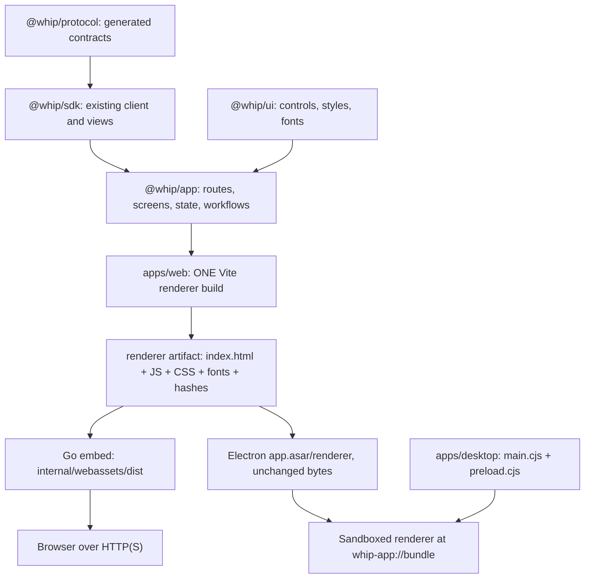

# Whip desktop: phased implementation plan

Branch: `desktop-app`.

Worktree: `/Users/samheutmaker/Desktop/context-labs/src/rlm/whip-desktop-app`.

Status: implementation in progress under the accepted full-plan goal. Baseline inspected against
`dd7aaa3a7f9b8c00bd4ec095b978def1c9231805` on 2026-09-07.

This is the detailed delivery plan linked from [the research](README.md). It
replaces that document's initial separate-renderer build and coarse phase sketch.
[docs/frontend.md](../../../docs/frontend.md) remains the authority for the
implemented frontend. Update it alongside the actual architectural changes.

## Decisions and scope

Use Electron with Forge packaging. Keep the existing Vite renderer build and
esbuild for the small main/preload bundles. The key decision is **one renderer
source tree, one production build, identical renderer files in web and desktop**.
Electron is an additional host for those files, not another React application.

V1 includes macOS, a bundled automatically started local daemon, existing-daemon
attachment, direct remote URLs, managed SSH, the existing shared UI, native save
and local directory dialogs, notifications, restoration, and automatic updates.
Keep standard macOS App/Edit/Window menu roles; product menus stay in React.
Terminal, file editing, and code review are outside this work.

Planning defaults: Apple Silicon, macOS 14+, direct Developer ID signed/notarized
distribution, one native window with existing tabs/splits. Linux/macOS SSH hosts
already have a compatible Whip installation; we can start a stopped daemon but
do not silently install or upgrade remote software. Intel is a separate tested
release target if added. Signing identity, bundle ID and update-host ownership
must be available before distribution gates can pass; they do not block drafting
or local implementation. No additional product decision is needed to start phase 0.

## 1. Exactly how the code is shared



The existing `@whip/app` and `@whip/ui` packages export TypeScript source. Vite
compiles them together with the host bootstrap, including StyleX extraction and
TanStack route splitting. The SDK supplies built JavaScript and the protocol
package supplies generated contracts. Preserve these boundaries and public
exports; do not introduce a second app build or publish the private packages.

`apps/web/src/main.tsx` becomes the common renderer entry. At startup it chooses
one adapter: normal browser services, or a versioned API supplied by Electron's
preload. Both call the same `createWhipApplication(platform)` and mount the same
application once. The desktop adapter is ordinary browser-compatible TypeScript:
it calls the supplied bridge, and imports no Electron or Node modules. The
browser bundle includes this small adapter too. Selection happens at bootstrap,
without user-agent sniffing, product component forks, or a desktop-only Vite mode.

The main/preload code lives in `apps/desktop`. A type-only bridge contract is
exported as `@whip/app/desktop-bridge`, with no Electron types or runtime imports.
The web adapter and desktop shell both use that public contract. Actual IPC calls,
filesystem access, process creation, and `@whip/sdk/node` stay in the desktop host.
This adds one contract export, not another workspace package or framework.

The packaged origin expects bridge version 1 and displays a recoverable startup
error if it is missing or incompatible. It must not accidentally treat
`whip-app://bundle` as a daemon URL. Ordinary HTTP(S) hosting needs no injected
configuration and keeps using its own origin as its default daemon address.

The guarantee is testable: build the renderer once, record a sorted SHA-256 file
manifest, and verify every file when copying into Go's embed directory and again
after extracting Electron's ASAR. Match paths and bytes, not just Git SHAs. Do not
patch HTML, substitute desktop URLs, re-minify, or rebuild per architecture/channel.
Same-release web and desktop contain the same renderer; an older running daemon
can naturally serve an older web release until deliberately upgraded.

### Proposed source layout

```text
apps/web/
  src/main.tsx                    common adapter selection and mount
  src/bootstrap.tsx               shared theme/render/connect/dispose lifecycle
  src/platform/browser.ts        existing browser host effects, moved here
  src/platform/desktop.ts        browser-safe bridge adapter
  src/platform/storage.ts        reusable synchronous storage wrappers
  vite.config.ts                 ONLY renderer build config
  dist/                          generated, ignored

packages/app/src/
  platform.ts                    host capabilities and connection resolution
  desktop-bridge.ts               type-only serialized host boundary
  connections.ts                 profile validation/migration and identities
  connection-dialog.tsx           extracted shared host-selection form
  runtime.ts                     sole app/SDK lifecycle owner
  ...                            existing product UI

apps/desktop/
  package.json                   private workspace; shell build dependencies
  tsconfig.json                  Node/Electron types isolated from app/web checks
  forge.config.cjs               packaging, fuses, signing, DMG/ZIP
  src/main.ts                    window, protocol, lifecycle orchestration
  src/preload.ts                 narrow contextBridge API
  src/transport.ts               existing SDK Unix transport + bounded IPC
  src/runtime.ts                 discovery, immutable install, start/attach
  src/ssh.ts                     OpenSSH connection orchestration
  src/native.ts                  dialogs, clipboard, notifications, OS links
  src/updates.ts                 built-in updater and safe restart flow
  scripts/build.mjs              esbuild + allowlisted staging + Forge hooks
  resources/                     icon, plist/entitlement inputs
  tests/                         shell, transport and installed-app acceptance

scripts/renderer-artifact.mjs     manifest/create/verify helper for both consumers
scripts/pack-web.mjs              existing Go-embed consumer of renderer output
internal/webassets/csp.txt        proposed shared production CSP source
```

Names describe intended responsibilities, not a requirement to split every short
function into a new module. No `apps/desktop/src/renderer.tsx`, duplicate routes,
desktop Vite config, or second CSS pipeline is needed.

## 2. Specific changes needed in the web application

### A. Separate mounting from browser services

Move the existing localStorage/sessionStorage wrappers, clipboard, external-link,
and Blob-download implementations out of `apps/web/src/main.tsx` into the browser
adapter. Keep early `initializeTheme`, one application instance outside React,
StrictMode, HMR disposal, visible storage errors, and browser page lifecycle.
Share the bootstrap with the desktop adapter. Desktop window readiness must not
wait for daemon installation, SSH authentication, or an update check.

Ordinary DOM code stays shared: focus/selection, `matchMedia`, virtualization,
ResizeObserver, drag/drop, file inputs, and browser history all work in Chromium.
Do not convert every `window` or `document` reference into an IPC method.

### B. Replace URL-only connection state with explicit profiles

`packages/app/src/runtime.ts:373` currently accepts only HTTP/WS strings and
directly constructs `createWhipClient({ endpoint })`. `shell.tsx` contains the
URL input and saved string list. That cannot represent a local Unix socket or
an SSH connection without pretending one is a URL.

Introduce this small app-owned model (proposed types, not implementation):

```ts
type ConnectionTarget =
  | { kind: 'url'; endpoint: string }
  | { kind: 'local' }
  | { kind: 'ssh'; host: string; user?: string; port?: number;
      identityFile?: string; remoteExecutable?: string; remoteHome?: string };

type ConnectionProfile = {
  id: string;                 // stable across reconnects and tunnel replacement
  label: string;
  target: ConnectionTarget;
  runtimeId?: string;         // last verified daemon identity, not routing authority
};

type ResolvedConnection = {
  endpoint: string | TransportFactory;
  dispose(): void;            // release local transport/tunnel ownership
};

// Extensions to AppPlatform, using only browser-safe types:
// defaultConnection: ConnectionProfile
// connectionKinds: readonly ConnectionTarget['kind'][]
// resolveConnection(profile, { signal, onProgress }): Promise<ResolvedConnection>
```

The browser resolver validates URL profiles and returns the existing SDK endpoint.
The desktop resolver returns a bounded IPC-backed `TransportFactory` for local or
SSH profiles. Direct URLs retain the existing renderer WebSocket/scoped-HTTP path.
`AppRuntime` still constructs the only product SDK client, session list, views,
queries, and command recovery store. Main forwards transport data and manages
processes; it does not reduce session events or implement command recovery.

Start the connection epoch and abort previous resolution **before** awaiting the
new resolver. Reject and dispose late completions, bind authentication prompts to
the same attempt, release the previous connection on host replacement, and let SDK
reconnection reuse the selected target. One SSH establishment loop owns the tunnel;
SDK retry owns protocol reconnection/replay. These loops must not spawn competing
SSH processes or resubmit accepted prompts.

Use the profile ID for selected-host/UI identity; use the handshake runtime ID
for session/draft/recovery ownership. Never key data on a temporary socket or port.
Recheck runtime identity before exposing recovered work following reconnect.
Changing a remote installation is a deliberate host transition, not an invisible
reuse of its previous identity.

Extract the connection dialog from `shell.tsx`. Browser shows URL connections;
desktop offers This Mac, SSH, and URL in the same component. SSH alias/host and
advanced path/port fields appear only when that capability exists. Shared progress
states cover discovery, authentication, host verification, startup, reconnect and
failure. Adjust `session-sidebar.tsx`, search-dialog keys, forget/reconnect actions,
and connection tests that currently assume `state.endpoint` is the identity.

Migration: read `whip.web.endpoint` and `whip.web.hosts.v1`, validate and deduplicate
the existing URLs, and write `whip.hosts.v2` plus `whip.selectedHost.v2` before
switching reads. Preserve old keys for rollback; malformed records fall back
visibly without deleting unrelated storage. Preserve existing max-16 saved-host
and field-size limits. Keep `whip.web.client.v1` and the runtime/root-scoped draft
and SDK recovery identities; renaming those would lose continuity for no benefit.
New desktop installs default to This Mac. Profiles store nonsecret connection
settings through AppStorage; passwords/challenges never enter browser storage.

### C. Preserve storage semantics and add desktop restoration

`AppStorage` is synchronous. Do not silently replace it with asynchronous IPC or
block the main process with synchronous renderer calls. Keep preferences, text
drafts, profiles and recovery identities in Chromium localStorage at the stable
desktop origin, with Web Locks and the current visible memory fallback.

Browser window layout keeps using sessionStorage. The one-window desktop adapter
supplies a namespaced localStorage-backed `windowStorage`, for example
`whip.desktop.window.main.*`, with bounded key enumeration and the existing tab
layout schema. This restores tabs/splits across full app quits. Electron main
stores OS window bounds separately using an atomic small file in app userData;
validate bounds against current displays. Do not persist transcripts/Query caches.
Browser and desktop preferences are separate devices/origins, not automatically
synchronized. Daemon data remains in the existing Whip home.

Flush draft text during normal operation and on hide/reload/quit/update. Add a
bounded close handshake so main can request a flush and learn about in-memory
attachments before destroying a renderer. A hung renderer offers recovery/force
close with a truthful loss warning. Preserve the existing browser beforeunload
and back-forward-cache handling. App updates must use this handshake too.

### D. Make existing effects awaitable and host-aware

| Existing source | Concrete change |
| --- | --- |
| `platform.ts` and browser adapter | Make `download` asynchronous with a cancellation result; make `openExternal` asynchronous so OS failures can be reported. Keep `copy` returning a promise. |
| `conversation.tsx:549`, `details/shared.tsx:289` | Await downloads, preserve current 64 MiB read cap, distinguish cancellation from failure, and retain busy/error state until saving finishes. |
| `settings.tsx` provider verification link | Handle the promise from `openExternal`; keep provider/device login in the shared UI. |
| `session-tab-strip.tsx:170` | Replace construction against `window.location.href` with a platform session-link formatter. Internal `whip-app://bundle` asset URLs must never be copied as useful session links. |
| `directory-picker.tsx` / `welcome.tsx` | Add an optional native local-directory choice only when attached to This Mac. Keep SDK directory browsing for SSH and direct remote hosts; a local path must never be submitted as a remote directory accidentally. |
| `composer.tsx`, settings file import | Keep current `<input type="file">`, File/Blob, image paste and upload flows. Electron already presents an OS file chooser for file inputs; a second file-read bridge is unnecessary. |
| `attention.tsx` and app notification lifecycle | Reuse the existing bounded attention query; avoid a second poller/session cache. Move its first-page observation to app lifetime where needed, and add a notification effect plus a separate OS-notification preference. Existing `attentionAnnouncements` controls screen-reader output, not OS notifications. |

For session links, browser behavior remains an ordinary URL. Desktop can produce
a URL for a configured reachable web host, otherwise a registered
`whip://session/<runtimeId>/<rootId>` link with validated route/search values.
Opening a desktop link resolves an already known host by verified runtime ID;
unknown hosts go through host selection. Links contain no credentials, shell
commands, identity-file paths, or instructions to auto-create SSH connections.
They are navigational references, not access grants.

Bridge native saves with a user-selected destination and bounded transfer
messages. Do not pass an unbounded byte array through IPC or add arbitrary path
write access. Bind the save handle to the calling window and dispose it on cancel.
Start with the existing size cap; stream optimization requires measured need.

Notifications initially cover permission/question attention and observed work
completion available from existing metadata. Use one deduplicating observer for
the selected host, coalesce bursts, and suppress the relevant focused work. Test
hidden-window delivery explicitly; Chromium background scheduling must not be
assumed to keep a three-second UI poll timely. If required, use a narrow wakeup
from main to that same observer, not another SDK/session implementation. No
promise of notifications for disconnected hosts or after full Cmd-Q.

### E. Make production asset serving work without the Go HTTP server

Electron serves the existing index and assets at `whip-app://bundle` through a
registered standard/secure scheme with fetch support and a persistent session.
Retain Vite's root asset paths and TanStack browser history. The protocol handler
provides the same SPA fallback for `/h/...` deep routes and real 404s for missing
assets. It serves only allowlisted packaged files, with correct MIME types and
GET/HEAD handling; decoded traversal, foreign hosts and arbitrary file URLs fail.
Do not use `file://`, inject HTML, enable Node in the page, or disable web security.
Electron documents the scheme requirements in its
[protocol API](https://www.electronjs.org/docs/latest/api/protocol).

The current CSP is a Go response header in `internal/webassets/assets.go`; copying
HTML alone loses it. Move the unchanged policy text to `internal/webassets/csp.txt`,
embed/read it in Go, and include it in the renderer artifact metadata consumed by
Electron's response handler. Update existing Go CSP tests to use that source.
Both hosts also preserve nosniff and no-referrer. Keep StyleX extraction and the
policy against inline scripts/styles; do not solve compatibility with unsafe-inline.

For direct remote URLs, update `internal/daemon/network.go` to permit the **exact**
desktop origin in explicitly configured origin allowlists. Verify the actual
Origin header emitted by the pinned Electron scheme first. Test WS upgrade and
HTTP content preflights, not just discovery. Do not allow wildcard/null origins
or enable daemon networking automatically for local/SSH use. HTTPS/WSS is the
remote URL path; ordinary insecure cross-network HTTP may be blocked by Chromium,
in which case guide users to HTTPS or SSH rather than bypassing browser security.
Old daemons unable to allow this origin remain reachable through compatible SSH.

### F. Enforce sharing in tests

Extend `packages/app/test/architecture.test.ts` to cover Electron and Node imports,
including dynamic imports. Validate the production renderer import graph too:
no `electron`, Node builtins, `@whip/sdk/node`, private package source imports, or
accidental native dependency externalization. Keep the existing real-package
consumer test at `packages/ui/tests/packed.mjs` passing with the new public export.
Run shared product fixtures against browser and packaged desktop; adapt only host
setup/effect assertions. The artifact hash check proves reuse of compiled files.

Update all AppPlatform test doubles and the packed-package consumer when changing
required methods. `packages/app/tsconfig.json` already includes `apps/web/src`;
keep that browser-only check and give `apps/desktop` a separate TS configuration.
Add root workspace scripts/lockfile entries explicitly, without introducing a
second lockfile or allowing Electron ambient types to leak into shared app code.

## 3. Packaging specification

### Build once; distribute to two consumers

The release graph should become:

1. **Renderer job:** clean `npm ci`, generate/check protocol, build SDK, run app
   checks/tests, run the existing Vite production build once. Produce an immutable
   renderer archive and metadata: renderer schema version, source commit, lockfile
   digest, CSP, and sorted file hashes. Do not put timestamps/channel substitutions
   into renderer assets. Validate size limits, missing files, symlinks and maps.
2. **Go jobs:** download and verify that artifact; `scripts/pack-web.mjs` copies
   the exact files into `internal/webassets/dist`. It must consume existing output
   without triggering a hidden renderer rebuild. Preserve plain Go development
   builds' missing-assets behavior and the tracked `.gitkeep` placeholders.
3. **macOS runtime build:** build the Swift helper, require a nonempty correct-arch
   executable, Developer ID sign it, and then embed those signed bytes into Whip.
   Build/sign Whip for arm64. Ship the same full daemon build as the corresponding
   macOS CLI release; do not add a desktop-only Go build that strips the web UI.
4. **Desktop assembly:** independently bundle `main.ts` and `preload.ts`, consume
   the already verified renderer and native binaries, then create an allowlisted
   staging directory. Forge packages that directory; it must not recursively ship
   the repository, workspace links, developer node_modules, tests or source files.
5. **Distribution:** finalize native code signatures and manifest, set fuses,
   sign/notarize/staple the application, make DMG and update ZIP, then verify and
   test the actual downloaded artifacts before promoting the release feed.

The present `.github/workflows/release.yml` rebuilds the web app separately in
each OS matrix job and uses ad hoc helper signing. Refactor its renderer work
into the shared artifact job; reuse that output across existing CLI platforms
and the new macOS desktop lane. Add desktop validation to the release dependency
graph. Keep unsigned pull-request builds separate from credential-bearing signing.

This provides repeatable inputs and provably identical renderer bytes. Entire
signed DMGs need not be bit-for-bit reproducible: signing/notarization contain
external timestamps. Record their final checksums and provenance separately.

### What is actually inside Whip.app

```text
Whip.app/Contents/
  Info.plist
  MacOS/Whip                          Electron executable
  Frameworks/...                      Electron frameworks and helpers
  Helpers/
    whip                              signed Go executable
    whip-computer                     signed Swift helper
  Resources/
    app.asar/
      package.json                    minimal production metadata
      main.cjs
      preload.cjs
      renderer/                       exact renderer artifact files
      renderer-manifest.json
      runtime-manifest.json
      third-party-notices.txt
    ...icons and standard resources
```

`app.asar/` above denotes archive contents, not a normal directory. Native
executables live outside ASAR. Put Mach-O tools in `Contents/Helpers`, with a
pre-sign packaging hook, rather than treating them as arbitrary resource data.
Apple documents this layout and inside-out signing in
[Code Signing In Depth](https://developer.apple.com/library/archive/technotes/tn2206/_index.html).
Resource copying uses Forge/Packager's supported hooks and resource facilities;
all native relocation completes before signing, and no bundle file changes after
the final seal. Manifest/data files remain under Resources.

Both main and preload are bundled CJS outputs. Main may use Electron and Node
builtins as runtime externals. All ordinary JS dependencies it needs are bundled;
do not leave unresolved private-workspace imports. Preload is one small bundle
using only sandbox-supported Electron APIs, with no `node:net`, SDK client, or
dynamic native requires. Sandboxed preload does not support ESM imports under
Electron's [ES module rules](https://www.electronjs.org/docs/latest/tutorial/esm).
The existing private ESM workspace convention remains unchanged for source packages.

Forge runs against the staged package with an exact pinned Electron version.
Strip build-only config/dev metadata before ASAR generation. Use ordinary Vite
and esbuild; the [Forge Vite plugin](https://www.electronforge.io/config/plugins/vite)
is documented as experimental and is unnecessary here. Configure packaging,
hooks and makers through [Forge configuration](https://www.electronforge.io/config/configuration)
and supported [Packager options](https://electron.github.io/packager/main/interfaces/Options.html).

New dependency families are limited to Electron, Forge core/CLI, DMG/ZIP makers,
and the supported fuses tooling. Use an official publisher only for the chosen
storage host. Reuse existing esbuild, Vite, TS, test tooling and the system OpenSSH.
No new React stack, SSH JS library, native Node addon, or updater implementation.
Pin versions in the root lockfile and document ongoing Electron security updates.

The Go binary still embeds the same renderer, while Electron also carries an
independent copy in ASAR. This intentionally duplicates asset bytes on disk. It
preserves `whip web` and lets the desktop paint before daemon startup. Measure the
size cost; do not create a special runtime variant to save unmeasured megabytes.
There is still only one source and one renderer build per release.

### Runtime installation and compatibility

On first use, atomically copy the verified signed companions to an immutable path:

```text
~/Library/Application Support/Whip/runtimes/<version>-<build>/darwin-arm64/
  whip
  whip-computer
  runtime-manifest.json
```

Use a content/build-qualified version directory so a reissued version never
overwrites live code. Manifest fields include app/runtime versions, build commit,
architecture, protocol major/minor, known data compatibility, renderer digest,
helper identity and final native hashes. Do not equate npm package versions,
`/api/v3/` paths, daemon protocol versions, and app release versions. Current
protocol is 4.1 despite the legacy API path names.

Generate compatibility metadata from the Go authorities, including the protocol
registry and `internal/session/migrations.go`, through a small build-time export
rather than a handwritten second version table. If a stopped-runtime preflight
needs additional machine-readable fields, extend the existing daemon status
command and tests. The current development database code can reject incompatible
schemas; desktop must report that condition without deleting/archiving user data
automatically or pretending a migration exists. Starting an incompatible runtime
is a blocked operation until a supported migration or explicit recovery is chosen.

Resolve helpers relative to the packaged app, never the current working directory.
Preserve executable bits. Validate signatures/digests during installation; verify
the existing installation asynchronously before use without hashing large files
on the first-paint path. Remove partial temporary installs after failed copies;
never mutate a directory that may be executing. Keep the previous usable runtime
and every version in use. If process ownership cannot be proven, retain it and
report the cleanup limit rather than deleting a potentially needed executable.

Launch the daemon from the retained absolute path with the existing Whip home and
`WHIP_COMPUTER_BIN` pointing to the matching retained helper. Use existing daemon
status/start and protocol initialization; reuse a compatible running daemon even
if its build differs. Do not change an attached daemon's helper/environment. Test
the signed helper at its actual retained path, including macOS Accessibility and
Screen Recording identity across upgrades. A path/TCC failure must be resolved in
the early signed-package milestone, not waived for launch.

Whip executes new workers via `os.Executable()` in `internal/rlm/kernel.go`. A daemon
started inside a replaced application bundle could later fail to spawn a worker.
The retained executable is required for correctness, not just update rollback.
App replacement leaves accepted daemon work running. Daemon upgrade/restart is an
explicit separate operation with compatibility and active-work handling. Reuse
the existing runtime data; do not create a second default database.

The existing `cmd/whip/update.go` runs the shell installer and requests a daemon
restart. **Do not call `whip update` from the Electron updater.** The desktop
updater replaces the GUI, and a separately implemented runtime action can select
an installed compatible runtime when a restart is appropriate. App rollback does
not downgrade the database. External CLI updates remain a real reconnect scenario.

### Signing, installation and automatic updates

Sign the Swift helper before Go embed; preserve those bytes when packaging its
external copy. Sign Go next. Final native digests must describe the final signed
files, and the embedded/external helper digests must still match after packaging.
Configure the signing stage so it does not unexpectedly re-sign and alter that
copy. Seal manifest, ASAR and the outer Electron app only after native contents
are final. Use hardened runtime with per-binary entitlements and stable identities.
Do not apply Electron JIT entitlements blindly to the Go/Swift executables.
Forge's [macOS guide](https://www.electronforge.io/guides/code-signing/code-signing-macos)
documents the signing and notarization integration.

Enable context isolation/sandbox and disable Node integration. Turn off unused
RunAsNode, NODE_OPTIONS and CLI inspect fuses; use ASAR integrity and ASAR-only
loading where supported by the pinned release. Set fuses before signing and verify
them in final artifacts. These are documented [Electron package-time controls](https://www.electronjs.org/docs/latest/tutorial/fuses).
No generic IPC channel, arbitrary shell command, or unrestricted filesystem bridge.
Validate sender frame/origin, arguments, handles, queue limits and navigation.

Produce an install DMG plus a ZIP containing the signed/notarized/stapled app.
Validate the final DMG notarization/stapling as part of distribution. Use native
`autoUpdater` / Squirrel.Mac with an HTTPS static JSON feed; macOS updates require
signed applications per the [updater documentation](https://www.electronjs.org/docs/latest/api/auto-updater).
Forge's [ZIP maker](https://www.electronforge.io/config/makers/zip) supports
`RELEASES.json` generation for this path. A DMG by itself is not the update artifact.

Use immutable versioned ZIP URLs and separate beta/stable, platform and architecture
feed paths. Publish artifacts first, verify remote checksums/downloads, then promote
the feed last with serialized updates so concurrent jobs cannot lose release entries.
The chosen bucket/domain is a release configuration value, not a renderer build
variable. Bundle ID/userData remains stable across upgrades; beta uses an explicit
separate identity/data policy and never automatically takes over a stable daemon.

Check updates after the UI is usable. Automatic download is fine; applying a
restart uses the shared draft/attachment close flow. Handle the updater-specific
quit event as well as ordinary quit. Test N-to-N+1 on the actual signed app while
the old daemon runs work, then start a new worker from that old daemon. Test offline
launch, interrupted downloads, invalid signatures, low disk space, failed install,
and supported rollback. Ship no required runtime download on first launch: users
need neither Node nor Go nor Swift installed. External developer tools/providers
remain dependencies of the workflows that use them.

### Developer commands to add

| Proposed command | Contract |
| --- | --- |
| `npm run dev:desktop` | Build/watch main/preload, start the one existing Vite renderer server, launch Electron with an explicitly development-only origin allowlist and isolated Whip fixture home. |
| `npm run build:web` | Preserve existing SDK-plus-renderer build behavior; same renderer input for both products. |
| `npm run pack:web` | Preserve build-plus-copy convenience locally; release jobs call copy/verify against their downloaded artifact instead. |
| `npm run build:desktop` | Build renderer once and shell bundles, assemble a production staging directory with a supplied/built local runtime; no signing or publication. |
| `npm run package:desktop` | Verify staging/native inputs and run Forge to produce an installable `.app`; fail if inputs are absent rather than shipping a partial app. |
| `npm run make:desktop` | Produce DMG/ZIP from the verified app with the selected signing profile; CI consumes exact staged release inputs. |
| `npm run check:desktop` / `test:desktop` | Check shell and bridge contracts; run host/packaging tests and the appropriate installed-app acceptance lane. |

Never let a dev script silently attach to, restart or overwrite the developer's
real daemon while exercising fixtures. Signed production launch tests deliberately
exercise real GUI environment discovery with dedicated accounts/Whip homes.

## 4. Phases, file ownership and exit gates

Implementation progress and verified checks are recorded in [progress.md](progress.md). Phase 1’s exit gate has passed; distribution and installed-app gates remain open. Each phase should be a reviewable
change or small series of changes, with the browser build kept working throughout.
Further performance testing was stopped at the user's request on 2026-09-08;
unpassed measurement targets below are retained as open findings, not active work.

### Phase 0 — prove performance and distribution assumptions (2–3 days)

- [ ] Run disposable Electron and Electrobun shells against the same production
  renderer and fixture. Measure first usable UI, retained-session startup, memory
  and content streaming; use the comparison criteria in the research document.
- [ ] Prove custom-scheme history, extracted styles, fonts, storage/Web Locks,
  clipboard/file input, actual Origin/CORS, local IPC and OpenSSH socket forwarding.
- [ ] Produce a minimal signed/notarized companion-containing macOS package as soon
  as signing credentials are available. Test helper extraction, TCC identity and
  executable survival outside the bundle. Record unavailable signing as an open
  distribution gate, not a successful proof.
- [x] Record measured results and pin a supported Electron/Forge version. Change
  the framework decision only for a demonstrated material gain with equivalent
  compatibility/stability. Remove disposable alternative scaffolding afterward.

**Exit:** framework choice has evidence; no unresolved fundamental renderer,
transport or packaging incompatibility. This is an experiment, not a dual-shell
product commitment. Files: disposable fixtures plus this plan's evidence log.

### Phase 1 — one renderer and the shared platform boundary (2–3 days)

- [x] Refactor `apps/web/src/main.tsx`, add the shared bootstrap/adapters, and extend
  `packages/app/src/platform.ts` plus the type-only bridge export.
- [x] Add the connection-profile model/migration and shared connection dialog.
  Browser URL behavior works throughout; native methods remain unadvertised until
  their shell implementations exist.
- [x] Make downloads/external links awaitable; fix link formatting and profile-based
  host keys. Add desktop windowStorage behavior and close/lifecycle contract.
- [x] Add renderer manifest creation and the native-import boundary checks.

**Status:** shared web tests, Chromium/Firefox product workflows, and isolated
production/development app/UI package consumers pass. See [progress.md](progress.md).

**Exit:** ordinary browser workflows and installed-package consumer tests pass;
one renderer boots with either a browser adapter or an isolated bridge fixture;
old saved hosts/drafts/recovery survive migration. No duplicate product UI.

### Phase 2 — production package and first local launch (2–3 days)

- [x] Create `apps/desktop` main/preload, strict custom-protocol asset serving,
  minimal native window/menu behavior, and the production staging/Forge pipeline.
- [x] Add the shared CSP source and update `internal/webassets/assets.go`/tests
  and `scripts/pack-web.mjs` to consume verified renderer output.
- [x] Package actual Go/Swift executables, immutable runtime installation, and a
  first-use local connection. Establish bundle identity and signed helper layout.
- [ ] Inspect the final ASAR/native files and compare renderer digests against the
  web/Go artifact. Download/install a signed build on a machine without toolchains.

**Exit:** a real `.app` launches from Finder, paints offline, starts its packaged
daemon from a retained path, and supports a basic local session. Two manually
installed signed versions prove bundle replacement does not remove the running
daemon's executable. Dependencies/signatures/layout are real, not stubbed.

### Phase 3 — robust local and direct-remote attachment (3–5 days)

- [x] Finish `apps/desktop/src/{runtime,transport}.ts`: attach before starting,
  compatible-build reuse, bounded readiness/diagnostics, simultaneous CLI startup,
  stale socket/error handling, clean-GUI PATH resolution and no silent fallback.
- [x] Implement the SDK TransportFactory bridge with ordering, UTF-8/frame limits,
  bounded queues/credits, accurate bufferedAmount, cancellation and close ownership.
  Begin with the existing Unix transport's 1 MiB frame limit; preserve protocol
  content chunk caps. Larger-transfer measurement remains a Phase 7 gate. Never duplicate the SDK client
  in main or replace backpressure with unlimited fire-and-forget IPC.
- [ ] Extend exact-origin configuration in `internal/daemon/network.go`; test
  direct HTTPS/WSS plus scoped HTTP content and reverse-proxy behavior.
- [ ] Complete host switching/identity/reconnect tests, including accepted commands,
  permission races, pending saves and attachment transfer during a switch.

**Exit:** local works with daemon networking disabled; direct remote parity passes;
closing/reloading/quitting the GUI does not terminate accepted work. A blocked
local startup cannot prevent restoring a selected remote host.

### Phase 4 — managed SSH, required for v1 (4–7 days)

- [x] Implement `apps/desktop/src/ssh.ts` using macOS `/usr/bin/ssh`, existing user
  config aliases, agent/keys and ProxyJump; discover effective settings through
  OpenSSH rather than implementing an SSH config parser/client.
- [x] Discover installed remote Whip through bounded, machine-readable commands;
  accept explicit executable/home overrides and start a stopped daemon. Quote
  remote shell arguments correctly; avoid interpolating raw profile input.
- [x] Own a private control connection and socket-to-socket Unix forwarding. The
  remote daemon need not expose TCP. Limit local directory/socket permissions and
  path length. A local listening socket is not proof of remote protocol readiness.
- [x] Add shared host-key/authentication dialogs and a narrow bundled Whip askpass
  mode. Respect known_hosts; display the host/fingerprint being approved, refuse
  changed keys without deliberate resolution, and never auto-accept unknown keys.
  Cancel/reject stale prompts and keep secrets out of logs/storage/process arguments.
- [x] Add a narrow desktop helper mode under `cmd/whip` that owns OpenSSH and proxy
  child processes, watches the parent lifetime pipe, and terminates/reaps only its
  process group if Electron crashes. Reuse the signed Go binary for askpass where
  practical. This helper manages connectivity, never remote session state.
- [ ] Test agent/key/password/challenge flows, hardware-key interaction, noisy remote
  startup output, disabled forwarding, changed runtime identity, connection churn,
  sleep/wake, interrupted transfers and forced main-process termination.

**Exit:** a fresh user can select an SSH host, verify/authenticate, attach/start its
existing Whip, stream/upload/download, reconnect and switch hosts without leaked
helpers, duplicated commands or lost host identity. Remote work survives disconnect.

### Phase 5 — native behavior and restoration (2–3 days)

- [x] Complete native effects and matching shared settings: save/cancel, clipboard,
  external provider login, local-only directory chooser, deep links, and bounded
  notifications. Reuse existing file inputs for upload/import dialogs.
- [x] Implement window bounds, tabs/splits/theme/text-draft restoration and the
  attachment-aware close flow. Cmd-W follows the existing tab command and hides
  the window when appropriate; Cmd-Q flushes/closes the GUI. Hidden windows can
  keep the selected connection for notifications; fully quitting releases tunnels.
- [ ] Validate IME, editing shortcuts, accessibility, display changes, fullscreen,
  dark/light theme, reduced motion and notification click routing.

**Exit:** web and desktop run the same workflows with correct host effects;
relaunch restores the viewing state without claiming in-memory files were saved.

### Phase 6 — release automation and safe updates (1–3 days)

- [x] Refactor `.github/workflows/release.yml` to the renderer-once artifact graph;
  add macOS desktop checks/signing and make release promotion depend on them.
- [x] Complete `apps/desktop/src/updates.ts`, static HTTPS ZIP feed, beta/stable
  channel handling, build manifest/provenance, final signatures and checksum checks.
- [ ] Prove an actual signed N-to-N+1 updater run, invalid/interrupted update,
  restart with memory-only attachments, active daemon continuity, and rollback.
  Uploading artifacts/promoting a feed remains a release action, not a side effect
  of local build commands.

**Exit:** install and update work from downloaded release artifacts, including an
old daemon spawning new workers after GUI replacement. No user toolchain or
first-launch runtime download is required.

### Phase 7 — performance, stability and release acceptance (2–3 days)

- [ ] Run shared product fixtures against web and packaged desktop; use isolated
  Whip homes and Linux/macOS SSH targets. Keep existing web milestone gaps visible.
- [x] Profile the actual startup path, including the current 2.66 MB minified initial
  JS chunk. Split/defer code only where traces show a benefit, using the one shared
  Vite/app source so both products receive the improvement. The signed M4 Max
  measurements pass the warm shell/session and normal daemon-start targets;
  they do not justify a speculative bundle split. Cold-cache and reference-Mac
  measurements remain open.
- [ ] Run the performance budgets below and the lifecycle/transport/OS matrix from
  the research. Record raw samples, hardware, OS and exact release versions.
- [ ] Run `task check`, relevant SDK/frontend/packed-package checks, and Go race
  suites for changed process/concurrency paths. Desktop-specific tests must exercise
  packaged artifacts; automation convenience must not weaken shipping fuses.
- [x] Add `docs/desktop.md`; update `docs/frontend.md`, the behavior/code/test map
  in `docs/features.md`, and the desktop checkbox in `docs/roadmap.md` only when
  acceptance is complete. Record failures and any explicit release limitations.

**Exit:** measured targets and signed distribution gates pass; no unexplained
work loss/duplication, cross-host state leakage, orphan processes, or browser
regressions remain. A development window alone does not satisfy this gate.

Estimate: **18–30 engineering days**, assuming the scope above and one engineer
familiar with Whip. Phases 2/3 produce a usable local build before SSH and release
hardening finish. Signing-account/test-hardware availability can add calendar time;
an unresolved feasibility result or framework change requires re-estimation.

## 5. Performance gates and validation evidence

Proposed targets on a reference Apple Silicon machine, using production assets
and no DevTools. These are targets, not results or guarantees:

| Metric | Gate |
| --- | --- |
| Warm process launch to usable shell | p95 ≤ 1.0 s |
| Controlled cold launch to usable shell | p95 ≤ 2.0 s; first-install extraction/Gatekeeper reported separately |
| Retained local session ready, daemon already running | p95 ≤ 1.5 s |
| Launch with daemon start, normal fixture | p95 ≤ 3.0 s |
| Typing under streaming load | p95 < 50 ms |
| Cached session switch | p95 < 150 ms |
| Settled idle desktop CPU | average < 1% of one logical core |
| Desktop process memory | investigate above 350 MiB aggregate RSS; report shared-page accounting and daemon/worker totals separately |

Measure first visible/usable UI separately from handshake and transcript-ready.
Report SSH DNS/authentication/tunnel/discovery/first-session separately, with human
prompt time excluded from machine latency populations. Collect at least 30 warm
runs, controlled cold samples and raw distributions; do not call an empty-window
benchmark or `ready-to-show` event end-to-end startup. Update checks and optional
metadata refresh happen after usable UI. Runtime install/discovery, authentication
and PATH resolution are asynchronous. Test cold launch offline.

Reproduce the existing large-session, 32-tab/draft and 16-stream fixtures. Capture
peak transfer memory and event-to-paint across IPC/SSH while typing. Adapt existing
`apps/web/scripts/performance.mjs` probes to the transport being measured. Preserve
existing four-root retention and current content/draft bounds. Memory or startup
claims need actual packaged measurements; the successful current browser build
does not establish Electron performance.

Additional required acceptance evidence:

- Renderer archive hashes match Go embed and Electron ASAR; executable architecture,
  executable bits, final signatures, entitlement/fuse settings, and manifests agree.
- Existing URL-only browser installs migrate safely; direct and SSH reconnect
  preserve identities. Aborted resolution cannot take over a new selected host.
- Main/renderer crash, sleep/wake, full quit, app update, remote restart and forced
  SSH-parent termination preserve accepted work and clean owned connection resources.
- Save cancellation, disk-full/quota failures, unsupported remote version and missing
  remote executable have actionable shared UI; local fallback is always deliberate.
- Downloaded signed app passes Gatekeeper and helper permission workflows; signed
  update preserves runtime executable availability and compatible data.

Current pre-implementation baseline: SDK build and `npm run check:web` passed;
`npm run test:web` passed 21 files / 166 tests. Those results came from worktree
preparation. Subsequent implementation and measurements are recorded separately in [progress.md](progress.md); this baseline is not desktop acceptance evidence.
