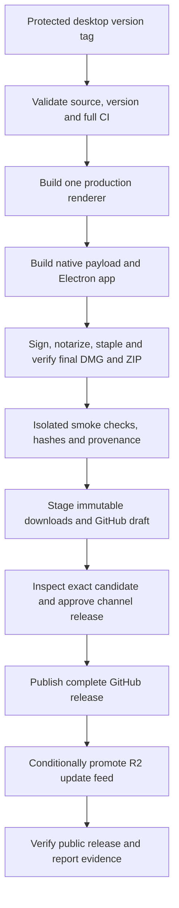

# Desktop publishing and CI release plan

Date: 2026-09-08. Status: implementation in progress; public release is not approved.
Branch: `codex/desktop-release`.

Current implementation and operations: [release runbook](../../../docs/desktop-releases.md).
Execution evidence and remaining gates: [progress](progress.md).
The findings below describe the pre-implementation audit; the runbook describes
current behavior.

## Goal and release scope

Publish a downloadable Whip desktop app that a new user can install, launch,
connect to a canonical `whipcode` backend, and update without a development
checkout, Node, Go, Xcode, or manual Gatekeeper workarounds. Every published
artifact must be traceable to reviewed source, signed and notarized, and verified
before the update feed advertises it.

The working scope is **an Apple Silicon public beta, distributed directly as a
DMG, with a ZIP for automatic updates**. macOS 14 remains the proposed minimum.
Apple Silicon versus simultaneous Intel support, and public versus private beta,
were asked during research; these are provisional defaults pending those answers.
Intel desktops, Windows/Linux desktop apps, and Mac App Store distribution are
later work. Matching standalone backend downloads for supported remote hosts
(initially Linux x64) are part of making this desktop release usable remotely.

Keep the existing Electron/Forge application, shared web renderer, native
Squirrel.Mac updater, and one installed `whipcode` per normal local setup. Keep
`Whip` as the desktop product name and `whipcode` as its backend executable. This
project does not require a new updater service, packaging framework, UI library,
account system, telemetry service, or changes to mobile pairing/notifications.

**Compatibility scope:** this establishes the first meaningful public release
baseline. Backward compatibility with earlier Whip builds, protocols, state,
configuration, installers, or update feeds is not required. The GUI and backend
can evolve together, including breaking changes. Do not add compatibility shims,
historical migrations, a supported-version matrix, or a rollback framework to
this release project. Existing development installations may require an explicit
reset or reinstall; describe that clearly rather than silently deleting data.

This plan does not publish the source-managed app currently installed on this
Mac, replace its daemon, enable its update feed, or repeat the historical-state
cleanup. That installation is a useful validation baseline, not a release input.

## What the repository already has

The current implementation is documented in [the desktop guide](../../../docs/desktop.md)
and [frontend architecture](../../../docs/frontend.md). The
[canonical installation record](../canonical-whipcode/README.md) records the
completed local signed/notarized installation and runtime checks. Those current
guides remain authoritative; this document describes proposed changes.

| Area | Observed implementation | Consequence for this work |
| --- | --- | --- |
| Desktop framework | Electron 44.2.0, Electron Forge 7.11.2, Node 24; Go version comes from `go.mod` (currently 1.27.0); Swift helper targets macOS 14 | Keep the stack and lockfile. Check supported security patches before release rather than changing frameworks. |
| Packaging | `build.mjs`, `package.mjs`, `verify.mjs`, and `distribution.mjs` already build, sign, notarize, staple, and inspect the final app/DMG/ZIP | Extend this path; do not build a parallel packager. |
| Renderer | One production renderer can be verified in both the embedded Go web server and Electron ASAR | Build it once per release and pass the same artifact through all consumers. |
| Native payload | The signed Swift helper is embedded in the Go executable; final native hashes and build/protocol metadata are checked | Preserve the existing signing order and exact-byte verification. |
| Local runtime | Desktop selects or explicitly installs a canonical `whipcode`; compatible existing daemons are reused and survive GUI exit | Preserve attach-before-start and GUI/backend lifecycle separation. |
| Updates | Native Squirrel JSON feed, delayed startup check, manual check, download/restart UI and draft-aware close handshake | Exercise the actual signed update path rather than replacing it. |
| Static publication | Conditional immutable object creation, public-byte verification, authoritative ETag checks, and feed publication last | Adapt the existing publisher to R2 and reusable staging/promotion. |
| CI signing | Temporary keychain, P12 import, raw notary API key, credential cleanup | Reuse it; local Keychain success is not evidence that GitHub credentials are configured. |

Key source entry points:

- [Reusable desktop package workflow](../../../.github/workflows/desktop-release.yml).
- [Legacy release graph](../../../.github/workflows/release.yml) and
  [whipcode branch releases](../../../.github/workflows/release-whipcode.yml).
- [Desktop build](../../../apps/desktop/scripts/build.mjs),
  [Forge configuration](../../../apps/desktop/forge.config.cjs), and
  [distribution verification](../../../apps/desktop/scripts/distribution.mjs).
- [Static publisher](../../../apps/desktop/scripts/publish.mjs),
  [GitHub publisher](../../../apps/desktop/scripts/publish-github.mjs), and
  [existing draft-first whipcode publisher](../../../scripts/publish-whipcode.sh).
- [Canonical runtime](../../../apps/desktop/src/runtime.ts) and
  [desktop updates](../../../apps/desktop/src/updates.ts).

## Findings that block reliable publishing

### 1. The desktop is attached to the wrong release graph

The reusable desktop workflow is called by `release.yml`, triggered by legacy
`v*` tags. That graph publishes the legacy `whip` CLI, while the desktop now
packages `whipcode`. The automatic `whip-rlm` branch workflow publishes
`whipcode-v0.0.<run>` prereleases but never packages the desktop. Its reusable CI
also lacks the desktop gate present in general CI.

Create an explicit desktop release track. A push to the development branch must
not automatically ship a public desktop update.

### 2. GitHub setup does not match the intended release guarantees

Read-only inspection on 2026-09-08 found:

- `context-labs/whip` is public; its default branch is `main`.
- No repository-level Actions secrets, variables, or environments were listed.
  This does not establish whether organization-level secrets could be granted.
- The returned active ruleset protects the default branch and requires `lint`,
  `test`, and `driver`. It does not require the complete `go` aggregate as CI
  comments suggest. No desktop tag ruleset or `whip-rlm` protection was returned.
- Local canonical-installation commits are ahead of the inspected remote
  `whip-rlm` source. They must be reviewed and landed before a release tag is made.
- The latest inspected remote whipcode release run failed lint, coverage, and
  packed-UI checks. It tested an older source SHA, so this is not a claim that
  the current local tree fails. It is a reason to require green CI on the actual
  candidate, not rely on earlier local success.

The inspected failure is [Actions run 34250981084](https://github.com/context-labs/whip/actions/runs/34250981084).
Recheck this live configuration during implementation; do not weaken existing
checks to make publication proceed.

### 3. Hosting configuration is incomplete

The existing workflow assumes AWS S3 with AWS OIDC. The documented Inference.net
desktop infrastructure uses Cloudflare R2, an S3 endpoint, and R2 access keys.
Those configurations are not interchangeable. The prior
[credential discovery record](../desktop-app/evidence/release-credentials.json)
identifies the existing HALO setup, but does not establish usable Whip bucket
write access. Its feed format and object namespace also belong to another app.

### 4. GitHub publication can expose an incomplete release

`publish-github.mjs` currently creates a visible release before uploading assets,
accepts only legacy `v<semver>` tags, and does not explicitly set prerelease/latest
behavior. Change it to draft → upload → verify → publish, reusing the pattern in
`publish-whipcode.sh`. Desktop releases should always use `latest=false` in this
shared repository and use explicit desktop-channel discovery instead of a
repository-wide latest-release lookup.

This also prepares for GitHub release immutability: published assets/tags become
locked, so assets must be attached while the release is a draft. Enabling that
repository setting requires every active release writer to use draft-first
publication. Obsolete pre-release writers can be retired instead of adapted.
[GitHub immutable releases](https://docs.github.com/en/code-security/concepts/supply-chain-security/immutable-releases).

### 5. The CI runner needs an upgrade

The desktop jobs use `macos-14`. GitHub has announced that this image becomes
unsupported on **November 2, 2026**. Use the standard Apple Silicon `macos-15`
runner, assert `process.arch === 'arm64'`, select a supported installed Xcode
explicitly, and record the image/toolchain versions. A newer build runner does
not prove compatibility with the oldest supported customer OS.
[Runner retirement notice](https://github.com/actions/runner-images/issues/13518),
[runner reference](https://docs.github.com/en/actions/reference/runners/github-hosted-runners).

### 6. Public onboarding needs a matching app and backend

The installation dialog currently proposes `/usr/local/bin/whipcode`, which a
normal user may not be able to create on a clean Mac. The installer deliberately
refuses to overwrite a different existing executable. GUI updates currently leave
the canonical backend unchanged. For the public baseline, a desktop update must
also update the canonical binary that desktop installed. The newly installed app
must synchronize that binary with its bundled payload before connecting. Supporting
old backend versions is unnecessary; the user applies one update and gets the
matching GUI/backend pair without a separate backend-installation task.

Custom app/DMG branding is also missing from the current Forge configuration.
The package copies the repository and Electron/Chromium licenses, but needs an
inventory of the Go/JS components actually shipped and their required notices.

### 7. Local success is not complete distribution acceptance

Signed local installation, native startup, CLI/GUI sharing, WebSocket recovery,
and provider messaging have passed. The remaining gates include a real
downloaded install on a clean machine, a real signed N → N+1 Squirrel update,
minimum-OS testing, helper permission continuity, and outstanding native
accessibility/device checks. The existing worker-continuity fixture is useful
but does not substitute for the actual updater.

## Recommended release architecture

### Product identity and channels

| Contract | Recommendation |
| --- | --- |
| Release source | Approved, protected `whip-rlm` commits initially; changing the repository's default branch is a separate decision. |
| Release tag | `desktop-v<semver>`; for example `desktop-v0.2.0-beta.1`. The example is not a reserved release version. |
| App version | The semver portion, validated against the tag and embedded package metadata. |
| Channels | Prerelease versions select beta; versions without a prerelease suffix select stable. No independently editable contradictory channel. |
| App identity | Preserve `com.contextlabs.whip.beta` / `Whip Beta` and `com.contextlabs.whip` / `Whip`, including their existing URL schemes. |
| Backend identity | Always the `whipcode` distribution. Record an unambiguous desktop release build ID and exact source SHA; test its interaction with the CLI updater before choosing the final version-string format. |
| Version support | Validate the GUI and backend shipped together. Other clients/remote hosts may need updating to that release; no cross-version support window is required. |
| Remote backend | Publish a standalone Linux x64 `whipcode` from the same release source and renderer, with release/build provenance and checksums. Remote upgrades remain explicit. |
| Normal local state | One selected executable and the existing `~/.whipcode` default; GUI channels retain their separate GUI preferences. |
| Artifact names | Version-, channel-, and architecture-specific DMG/ZIP names; never overwrite a published version with rebuilt bytes. |
| Updates | Separate HTTPS feeds per channel and architecture. Applying a desktop update also synchronizes its managed canonical backend; stable never discovers beta from its feed. |

A stable build cannot simply rename a beta ZIP: bundle identity, application name,
version, and feed URL are embedded. Build and validate stable from the approved
source under its own version. Within a channel, promotion reuses the exact
candidate bytes and never repackages them.

### Storage and distribution

Use **dedicated Whip Cloudflare R2 buckets with production custom domains**, one
bucket per channel where practical. This gives bucket-scoped publisher credentials
without assuming R2 supports AWS-style prefix-scoped IAM. Keep HALO's existing
bucket, objects, credentials, and update format separate. R2 supports the S3
conditional writes used by this publisher; configure its account endpoint and
`auto` region explicitly and test the pinned AWS CLI against it.
[R2 S3 compatibility](https://developers.cloudflare.com/r2/api/s3/api/),
[R2 S3 setup](https://developers.cloudflare.com/r2/get-started/s3/).

Proposed URL shape, with the actual domains selected during setup:

```text
https://<whip-beta-download-domain>/desktop/beta/darwin/arm64/RELEASES.json
https://<whip-beta-download-domain>/desktop/beta/darwin/arm64/<versioned-file>.zip
https://<whip-beta-download-domain>/desktop/beta/darwin/arm64/<versioned-file>.dmg
```

Use the same path-to-key mapping on the custom domain and in R2; avoid a proxy
rewrite that makes the publisher verify a different location. Versioned assets
get immutable cache headers. Feed responses must revalidate and bypass any CDN
rule that would keep an old pointer. Verify public GET/HEAD behavior, content
types, range requests for large files, TLS, and absence of login redirects or bot
challenges. Use custom domains rather than the development `r2.dev` endpoint.
[R2 public buckets](https://developers.cloudflare.com/r2/buckets/public-buckets/).

Publish a GitHub Release for notes, versioned DMG/ZIP downloads, checksums,
provenance, and support references. Use R2 as the stable, non-redirecting Squirrel
feed/download origin. Initially a small documentation/download page is enough;
no new website application is required.

The existing publisher enforces create-only artifact writes, not storage-level
WORM retention. Its credential holders remain privileged; keep their scope small.
Retain released artifacts even after their entries leave the bounded update feed.

Private distribution changes this recommendation: the current updater expects a
plain HTTPS feed, and neither an interactive Cloudflare Access login nor a secret
embedded in the application is an adequate substitute. For a private pilot, use
restricted GitHub artifacts and manual installation first, or separately design
authenticated update delivery before advertising automatic private updates.

### One explicit release workflow

Add `.github/workflows/release-desktop.yml` as the desktop entry point and reuse
`.github/workflows/desktop-release.yml` for packaging. Start with a single graph
whose jobs expose a concrete candidate before publication approval:



The details that make this graph reliable:

1. Validate the tag, approved source ancestry, channel, architecture, feed origin,
   and clean checkout before credentials become available. A desktop tag on an
   arbitrary branch is insufficient authorization to sign.
2. Reuse the current CI checks and add desktop coverage to the reusable candidate
   gate. Build the release renderer once, record its digest and lockfile/source
   provenance, then download and verify it in packaging. Validation jobs may
   compile fixtures, but must not substitute another renderer in release outputs.
3. Run dependency installation without signing secrets. Import signing material
   only for the packaging stage; use the current temporary-keychain lifecycle.
   Sign the helper before Go embedding, then sign the Go payload, then the app.
   Complete notarization/stapling before final archive hashing.
4. Verify the application extracted from each final ZIP and mounted DMG, including
   nested signatures, signing team, architecture, entitlements, production fuses,
   renderer identity, native manifest, and notarization. Preserve current bounds
   and symlink/path checks.
5. Retain exact final outputs, sanitized notarization identifiers/results,
   verification evidence, source/toolchain metadata, checksums, and dependency
   inventory. Attach GitHub artifact provenance to final files so promotion can
   verify the producing repository, workflow, commit, and file digests. Evidence
   JSON alone is not an authenticated trust boundary.
6. Stage versioned R2 objects using conditional creation and verify their public
   bytes. Create a GitHub draft, attach and verify all its assets. Do not modify
   the live feed during staging. First-ever publication must work when no feed
   exists, including the Forge manifest-generation path.
7. Put the promotion job behind the channel environment approval. The approval
   summary links exact candidate files, source SHA, checks, install/reset notes,
   and required manual evidence. Staged public-beta files may be reachable by
   their versioned URLs before announcement; this is not a private staging area.
8. On approval, reverify staged hashes and tag identity, publish the complete
   GitHub draft with explicit prerelease/latest flags, then promote the R2 feed
   with an authoritative ETag compare-and-swap. Read back the public feed and
   verify its referenced assets. Never treat a CDN response as a lock.
9. Serialize publication per channel with cancellation disabled for an active
   publisher. Keep version/ETag checks even with workflow concurrency: older
   waiting runs must not move a feed backward. Do not rely on queue ordering.
10. Retry failed publication using retained candidate artifacts and already
    staged immutable assets, not a new signing/build run. Timestamped signatures
    make a rebuilt version potentially different even with identical source.
    If trusted candidate bytes are unavailable, abandon the unpublished candidate
    and use a new version rather than silently replacing its objects.

GitHub publication and R2 feed promotion cannot be one transaction. Publishing
GitHub first means a feed failure leaves a complete manual download available
while existing clients remain on the previous update. A retry completes the feed.
Surface that partial state explicitly; never report the release fully complete
until both destinations verify.

Reuse functions in the current publishers for `stage` and `promote` operations;
do not introduce a separate release service. Keep the strict artifact allowlist.
If checksums/provenance/notices are also mirrored to R2, extend it with explicit
manifest-backed metadata types rather than permitting arbitrary directory files.

For an optional manual trigger later, register the workflow on the repository's
default branch as well as its intended source branch. If automation creates a
tag using `GITHUB_TOKEN`, explicitly call the reusable/dispatch path rather than
expecting that push to trigger a second workflow or adding a broad PAT.
[GitHub workflow triggers](https://docs.github.com/en/actions/how-tos/write-workflows/choose-when-workflows-run/trigger-a-workflow).

### Canonical backend installation and release updates

For a new Mac, offer a writable default such as `~/.local/bin/whipcode`, create
the parent directory explicitly, save that absolute executable path, and explain
the optional PATH step for terminal use. Desktop must work even if PATH was
never edited. A user can also explicitly select an existing path such as
`/usr/local/bin/whipcode` for the release's backend. No historical state import or
old-installation discovery/migration is required.

**Desktop owns updates to the canonical binary it installed.** The app bundle
contains the verified backend payload for that release. The installed executable
remains at its canonical path, so terminal commands and desktop use the same file.
The user should not have to run `whipcode update` separately.

There must be one update authority for this installation. Today,
`cmd/whip/update.go` reruns the branch installer and replaces its own executable.
Desktop-supplied payloads must instead identify their desktop update ownership
in build metadata and make `whipcode update` direct the user to desktop updates,
without downloading or replacing the binary. Suppress unrelated branch-update
notices for these builds. Standalone CLI artifacts retain their own explicit
update path; do not infer ownership from an executable's filename alone.

Record desktop management and the last installed payload hash alongside the
existing saved executable path. This is a small extension to current local-runtime
settings, not a separate installation registry. An explicitly chosen external
binary is not automatically adopted; a remote host is not updated by the local
desktop updater. Show how to update those hosts/builds separately. If something
outside desktop replaced a managed file, surface that change before overwriting it.

The normal update sequence is:

1. Download the signed desktop update, including its matching backend payload.
   Running daemon work continues during the download.
2. Offer **Restart and update Whip**. Include the backend restart in this one
   action, and explain interruption if local work is active. Persist approval for
   the intended release across relaunch; do not ask for a second backend install.
3. Let Squirrel replace and relaunch the app. The new Electron main process runs
   a local-runtime synchronization gate before connecting the normal workspace.
4. Compare the actual canonical file's digest and the running daemon's build with
   the bundled manifest. If both already match, attach immediately. Otherwise
   verify the signed payload, stage it beside the canonical executable, coordinate
   maintenance with daemon starters/admission, stop the old daemon, and atomically
   replace the executable at the same path. Reuse the Go ownership code so another
   CLI/desktop process cannot race startup or replacement.
5. Start the matching daemon and verify its build and readiness before connecting
   the workspace. Updating the file alone is insufficient: a process already
   running from the old file must also be restarted.
6. Record completion and clean up temporary files. If a step fails, show a bounded
   error with **Retry**; keep the workspace disconnected rather than attaching the
   new GUI to an old daemon. Retry by inspecting actual file/process state, so a
   crash after replacement does not require a rollback framework or reinstall.

Run the same gate on every launch. This covers Squirrel updates applied on a
normal restart, a manually replaced DMG installation, and an interrupted previous
update. When no release-specific approval exists, an installation with no running daemon can
be synchronized automatically; any running owner requires an explicit apply/
defer choice. Deferring leaves the daemon running and the new local workspace
waiting to finish its update. The current app and backend may temporarily differ
on disk, but normal local operation resumes only when the running pair matches.

Squirrel's app replacement and the canonical binary replacement are separate
filesystem operations; the startup gate makes them one user workflow, not a
cross-filesystem atomic transaction. Electron documents that a downloaded update
can also apply at the next app start, so the implementation cannot rely solely on
the **Restart and update** button being used.
[Electron autoUpdater lifecycle](https://www.electronjs.org/docs/latest/api/auto-updater).

The release baseline still allows breaking changes:

- Old protocols and stores may be rejected with an actionable update/reset
  message. If a reset is necessary, state what will be removed and require an
  explicit user action. Migration tooling and automatic database rollback are
  outside scope.
- Beta and stable keep separate app identities and feeds, but need not work
  simultaneously against one backend. Switching channels can require installing
  that channel's matching backend and resetting development state. Test each
  channel's own pair rather than a cross-version coexistence matrix.

Choose the shared native payload's signing identifiers for the new public
baseline and verify helper permission behavior. No continuity guarantee for
pre-release TCC grants or app identities is required. Actual N → N+1 testing still
validates the update mechanism and matching backend installation; it does not
require the new GUI to keep operating with the old daemon.

### Remaining implementation decisions

Use these defaults to keep the first release focused:

- **Writable installation:** use `~/.local/bin/whipcode` for desktop-managed
  installs. Check the directory and stage/verify the full replacement before
  stopping work, so permissions, disk-space, or payload failures leave the old
  daemon running. An administrator-owned destination needs explicit remediation;
  no privileged installer service is required for the default path.
- **Explicit interruption policy:** every running daemon requires approval for
  backend replacement. Work can arrive through clients and schedulers, so this
  baseline does not infer idle from a status snapshot. One Go maintenance lock
  excludes competing starters/updaters across stop, replace, start, and readiness.
  No new global admission/pause protocol is needed for an explicitly approved stop.
- **One active local channel:** separate beta/stable feeds do not make two
  desktops safe to synchronize the same canonical binary simultaneously. A
  non-owning channel must require an explicit switch/takeover rather than silently
  replacing the backend again. Reuse existing local installation settings and
  shared maintenance coordination; do not introduce a multi-version manager.
- **Remote release path:** build at least the Linux x64 CLI from the desktop
  release's source, using the same renderer artifact, and publish it with
  checksums on the GitHub Release. Document installation of that exact release on
  a remote host. Reuse existing CLI matrix/build/installer code where practical;
  the macOS app must not silently update SSH or URL hosts.
- **User data:** ordinary application/binary replacement leaves `~/.whipcode`
  and provider configuration alone. A format-breaking development release may
  require an explicit reset, but downloading or applying an update never implies
  permission to delete sessions or credentials. No migration framework is needed.
- **Useful failure UI:** show update progress and app/installed/running build
  identifiers, plus concise errors and Retry. Keep this shell available when the
  daemon cannot start; diagnostics must not depend on a working SDK connection.
  Local update failure should not unnecessarily block independently configured
  remote hosts from the matching release.

Before public promotion, the operational inputs are the selected domain/bucket,
authorized signing/notary material, and GitHub release reviewers. These do not
prevent implementation and isolated validation from starting. Platform/audience
remain the Apple Silicon public-beta assumptions stated above.

## Credentials, environments, and supply-chain controls

Use GitHub-hosted ephemeral runners for release builds. PR jobs, fork code, and
unreviewed refs receive no signing or publication secrets. Default workflow
permissions stay read-only. Grant `contents: write` only to GitHub publication
jobs; grant OIDC/attestation permissions only to the provenance-producing job as
required. R2 does not use the existing AWS role assumption configuration.

Pin third-party Actions to reviewed full commit SHAs and let Dependabot maintain
them. Extend the existing Dependabot configuration to npm, and include dependency
and license review for the components actually shipped. Retain Go lint, race,
coverage, vulnerability and CodeQL gates. Do not cache keychains, notary keys,
credential directories, or credential-bearing environment dumps.
[GitHub secure Actions guidance](https://docs.github.com/en/actions/reference/security/secure-use),
[artifact attestations](https://docs.github.com/en/actions/how-tos/secure-your-work/use-artifact-attestations/use-artifact-attestations).

Recommended environment split: `desktop-signing` for reviewed release refs;
`desktop-beta-stage` / `desktop-stable-stage` for immutable candidate uploads;
`desktop-beta-promote` / `desktop-stable-promote` for approved publication. Staging and promotion
can use separately issued tokens scoped to the same channel bucket; R2 credentials
must be treated as able to modify that bucket, so ref restrictions and reviewed
publisher code remain essential. If a smaller initial beta setup shares a token,
document that scope rather than claiming prefix-level isolation.

| Kind | Configuration | Setup/handling |
| --- | --- | --- |
| Apple signing secret | `WHIP_DESKTOP_CERTIFICATE_P12_BASE64` | Export the intended Developer ID Application identity and private key, or obtain the existing export from the credential owner/vault. |
| Apple signing secret | `WHIP_DESKTOP_CERTIFICATE_PASSWORD` | Store separately in the signing environment. |
| Apple notarization secret | `WHIP_DESKTOP_NOTARY_PRIVATE_KEY` | Raw `.p8` PEM expected by the existing CI script; do not pass HALO's base64 representation unchanged. |
| Signing variables | `WHIP_DESKTOP_SIGN_IDENTITY`, `WHIP_DESKTOP_TEAM_ID` | Preserve the current authorized team/identity unless an intentional publisher migration is approved. |
| Notary variables | `WHIP_DESKTOP_NOTARY_KEY_ID`, `WHIP_DESKTOP_NOTARY_ISSUER` | Must match the supplied API key and supported team-key flow. |
| R2 secrets, proposed | `WHIP_DESKTOP_R2_ACCESS_KEY_ID`, `WHIP_DESKTOP_R2_SECRET_ACCESS_KEY` | Bucket-scoped object credentials; map into AWS CLI environment names only within publishing steps. |
| Hosting variables | `WHIP_DESKTOP_BUCKET`, `WHIP_DESKTOP_UPDATE_URL`, proposed `WHIP_DESKTOP_R2_ENDPOINT` | Explicit channel allowlist, account endpoint, exact feed path and public origin. Use region `auto`; remove AWS role requirements from this R2 path. |
| Release policy | Protected source/tag rules and channel environment reviewers | Require actual aggregate checks, restrict tag creation/mutation, and require review of the concrete candidate before publication. |

The local signed installation proves access to a usable Developer ID identity
and local notarization, but not to a CI-ready API key. Existing HALO repository
secret values cannot be retrieved through GitHub; use their original secret
store/owner, or issue appropriate new credentials. No secret values belong in
plans, evidence files, logs, or app resources.

A public repo can use protected environments and artifact attestations; select
reviewers and bypass rules appropriate to the maintainers who actually exist.
Where practical prevent self-approval. Stable publication approval happens after
the candidate is concrete and reviewable, not before doing its build/validation.
[GitHub environments](https://docs.github.com/en/actions/reference/workflows-and-actions/deployments-and-environments).

## Phased implementation

### Phase 0 — Freeze the release contract and get the intended source green

- [ ] Resolve the two scope questions; select release version, distribution
  domains, channel ownership, and intended signing identity.
- [ ] Review/land the current canonical-runtime changes and this work through the
  appropriate branch process. Recheck remote SHA and live CI configuration.
- [ ] Add an explicit desktop tag namespace and validate source ancestry. Protect
  the release source and tags, and make the complete candidate gate required.
- [ ] Reconcile duplicated CI enough that desktop releases run the relevant full
  checks. Fix failures on the actual candidate; preserve existing coverage gates.
- [ ] Move relevant desktop macOS jobs to an arm64 macOS 15 runner; pin/record
  toolchain selection and keep the deployment target explicit.

**Exit:** one agreed product/channel contract, reviewed source, green checks on
that source, and no credential-bearing job available to an untrusted ref.

### Phase 1 — Finish the downloadable application's first-run contract

- [ ] Choose/create a production app icon and modest DMG branding; verify Finder,
  Dock, About/version, product name, bundle ID, URL scheme and support links.
- [ ] Make first-run canonical installation work without administrator access or
  development tools. Test matching-build reuse and unwritable destinations.
- [ ] Inventory shipped dependencies; package required notices and generate an
  SBOM or equivalent machine-readable dependency inventory with release evidence.
- [ ] Document local-only defaults, explicit remote/Tailscale setup, provider
  credential setup, uninstall behavior, and the expected Developer ID publisher.
  Public desktop distribution must not expose an unauthenticated daemon to the
  public network by default.
- [ ] Establish the release's matching GUI/backend pair and actionable version/
  reset diagnostics. Mark desktop-installed binaries as managed in the existing
  path settings. Do not add support for older builds or state formats.
- [x] Make desktop-supplied CLI builds route update requests to desktop, and
  prevent beta/stable apps from silently competing for the canonical binary.

**Exit:** a fresh user can install and start a session with the packaged payload
or select the same release's installed backend, with clear actionable failures.

### Phase 2 — Wire CI signing and dedicated release storage

- [ ] Configure Apple signing/notary credentials from the authorized source and
  validate them in a bounded CI preflight without printing secret material.
- [ ] Create channel R2 storage, scoped credentials, custom domains and feed cache
  rules; verify public path mapping and read/write permission using disposable
  test objects outside the live feed.
- [x] Add R2 endpoint/auth handling to the current S3 publisher and its tests.
- [ ] Configure environments and least-privileged job permissions. Pin Actions
  and add npm dependency update coverage.

**Exit:** a CI candidate can be signed/notarized and a scratch R2 path can be
conditionally written and read publicly, without touching a production pointer.

### Phase 3 — Produce a verified release candidate in one graph

- [ ] Add `release-desktop.yml`, calling the existing package workflow after the
  exact-source CI gate and single-renderer build.
- [ ] Keep native signing/embedding order and archive verification; fail on dirty
  provenance, mismatched renderer, wrong architecture, signature, or channel.
- [ ] Build the matching Linux x64 standalone backend from the same release source
  and renderer; retain its checksum/provenance for GitHub publication and test
  installation of the pinned release on a remote-host fixture.
- [ ] Add packaged startup and canonical-runtime smoke checks to the release
  graph itself, with isolated homes/ports and no access to a developer's daemon.
- [ ] Retain final artifacts, checksums, notices/inventory, provenance attestations,
  verification evidence and a human-readable candidate summary.
- [ ] Validate empty-feed bootstrap as well as an update from an existing feed.

**Exit:** a tag yields a complete, independently verifiable candidate and useful
failure logs, without advancing a live update feed.

### Phase 4 — Make staging, approval, and publication retryable

- [ ] Refactor existing publication code into shared staging/promotion operations;
  stage immutable R2 objects and a fully populated GitHub draft.
- [ ] Extend strict tag validation to the explicit desktop namespace; set
  prerelease/latest flags and current CLI release discovery deliberately. No
  compatibility with pre-release installers or discovery behavior is required.
- [ ] Put final publication behind the channel environment. Verify candidate
  origin, hashes, archive evidence, tag SHA and manual acceptance before promotion.
- [ ] Publish GitHub then update the authoritative R2 feed conditionally; verify
  the public result. Exercise partial failure and resume without rebuilding.
- [ ] Cut the obsolete desktop dependency out of legacy `release.yml` once the
  new graph is accepted; retire obsolete pre-release workflows where appropriate.
- [ ] Adapt active release writers to draft-first publication or retire them
  before optionally enabling repo-wide immutable GitHub releases.

**Exit:** the same candidate can survive a publication failure/retry, and no client
ever receives a feed entry for unavailable or unverified bytes.

### Phase 5 — Prove installation and updates on customer-like Macs

- [ ] Download the staged DMG through a browser on clean macOS 14 and a currently
  supported newer macOS, with quarantine present and no development checkout or
  build tools. Exercise normal Gatekeeper installation and Finder launch.
- [ ] Install signed beta N, run real work, publish signed beta N+1 to a test
  feed, and perform a real Squirrel update. Verify the resulting GUI/backend pair,
  canonical executable hash/path, running daemon build, one-action draft-aware
  restart, no interruption during download, and reconnection by clients from the
  tested release. No separate manual backend update should be necessary.
- [ ] Test interrupted/cancelled downloads, failed verification, relaunch failure,
  offline use, no-update responses, channel isolation, and manual Check for Updates.
- [ ] Complete applicable desktop acceptance for accessibility, keyboard/IME,
  sleep/wake, remote SSH prompts/hardware keys, helper TCC permissions, and startup/
  idle performance. Record exact artifacts/hardware/OS, with explicit limitations.
- [ ] Test bundled backend installation/replacement, including concurrent starters,
  cancellation, unwritable paths, startup failure, and explicit reset when needed.
- [ ] Exercise the startup synchronization gate after manual DMG replacement,
  ordinary relaunch, and crashes before/after binary replacement. Verify active-
  work deferral, idle automatic synchronization, retry, and refusal to connect
  until the managed binary and running daemon match the new app.
- [ ] Test CLI self-update routing, explicit channel takeover, remote/queued work
  during idle detection, preflight failure before shutdown, and failure UI without
  a daemon. Verify normal updates preserve session/configuration files.
- [ ] Test each channel's matching GUI/backend pair and helper permissions. Keep
  release-test state isolated; old versions and stores are not acceptance targets.

**Exit:** recorded evidence for actual downloaded installation and N → N+1 update;
the resulting app and backend work together. Known non-blocking beta limitations
and required resets are stated in release notes; unexpected data loss, startup,
signing, and updater failures are blockers.

### Phase 6 — Publish beta, then establish stable operations

- [ ] Publish the first approved beta through the workflow and verify both GitHub
  downloads and the public feed from a separate client.
- [ ] Add a straightforward download/install page and release notes with minimum
  OS/architecture, matching app/backend build IDs, any required reset/reinstall,
  and known limitations.
- [ ] Document the next-release procedure, certificate/API-token rotation,
  failed-job retry, feed diagnosis, and emergency withdrawal/forward-fix process.
- [ ] Keep a last-known-good release and its evidence. Do not force an installed
  app or database downgrade; recover with a higher-version fix where possible.
  Exceptional feed withdrawal must be explicit and audited, not an automatic
  bypass of monotonic-version checks.
- [ ] Rebuild stable from an approved source/version with stable identity/feed,
  repeat channel-specific acceptance, and publish after stable approval.
- [ ] Add Intel as a separate native build/feed/test matrix only when requested;
  universal binaries require verified slices for Electron, Go, Swift and native
  dependencies and are not a simple packaging flag.

**Exit:** another maintainer can publish, diagnose, retry and recover a desktop
release from the written runbook without access to this developer's machine.

## Validation matrix and ownership of checks

| Boundary | Required evidence |
| --- | --- |
| Source and workflow | Wrong tag/source/channel rejected; protected-ref policy exercised; candidate SHA has complete CI success; no secrets on fork/PR paths. |
| Build graph | One release renderer digest, matching embedded web/ASAR bytes, correct distribution/build identity, pinned lockfile and recorded toolchains. |
| Package | Correct architecture/minimum OS; nested code signatures/team; hardened runtime/fuses; clean provenance; notarized and stapled distribution; extracted DMG/ZIP checks. |
| Signing failures | Missing/invalid/expired credentials fail clearly; notarization rejection prevents publication; cleanup runs on failure/cancellation; evidence contains no private material. |
| First run | No developer tools required; writable install; matching runtime reused; mismatched/external runtime gets update/reset instructions; loopback/private defaults. |
| Publication | Empty bucket, existing feed, object conflict, stale ETag, corrupt artifact, interrupted upload, CDN mismatch, older candidate, GitHub partial failure, and idempotent retry. |
| Actual update | Real signed N → N+1 via Squirrel; one user update synchronizes the canonical binary and running daemon; correct hashes/builds; wrong channel/signature rejected; draft-aware restart and no interruption during download. |
| Backend installation | Managed versus externally chosen paths; startup synchronization after Squirrel/manual install; concurrent starters, atomic replacement, active-work deferral, interruption/retry, and explicit reset if needed; no old-version support matrix. |
| Human acceptance | Quarantined browser download, clean minimum/newer OS, Finder/Dock identity, TCC, accessibility/IME, sleep/wake/SSH and performance evidence. |

Use existing Go/TS/native/distribution tests and the repository's `task check` as
the baseline during implementation. Add regression tests at the boundaries being
changed rather than tests that merely mirror YAML or implementation details.
Run the required native signed-package and actual update checks separately;
successful unit tests do not imply those passed. Use an independent review of
the implementation diff before calling the release path complete, following the
repository feature-development workflow.

## Expected files and documentation changes

| Area | Files |
| --- | --- |
| CI/release graph | New `.github/workflows/release-desktop.yml`; existing `desktop-release.yml`, `release.yml`, `ci.yml`, `ci-whipcode.yml`, and applicable security workflow; `.github/dependabot.yml`. |
| Distribution/publication | `apps/desktop/scripts/{build,package,distribution,verify,ci-signing,publish,publish-github}.mjs` and their existing tests; narrowly reuse draft publication logic from `scripts/publish-whipcode.sh`. |
| Package identity/notices | `apps/desktop/forge.config.cjs`, `apps/desktop/resources/`, dependency inventory generation and release metadata. |
| First run/backend upkeep | `apps/desktop/src/{runtime,main,preload,updates}.ts`, native tests; existing path settings and a startup synchronization gate; `packages/app/src/{platform,desktop-bridge,host-dialog}.ts*`, `apps/web/src/platform/desktop.ts`, corresponding app tests. |
| Shared daemon coordination if needed | `cmd/whip/{desktop_runtime,daemon_manage,update}.go` and existing ownership/restart tests; align `internal/update` with the new release baseline where needed. |
| Current documentation | `docs/desktop.md`, `docs/features.md`, `docs/roadmap.md`, and download/install instructions in `README.md`. Update `docs/frontend.md` only if the implementation changes frontend architecture. |
| Acceptance/runbook | This plan and sanitized per-candidate evidence; operational instructions belong in the current desktop guide, not solely in historical plan files. |

No new runtime dependency is expected for the core CI/publication path. Prefer
existing Node scripts, GitHub CLI, AWS CLI configured for R2, Apple tools, and
current Forge/Electron APIs. Select an inventory-generation tool only if the
existing dependency metadata cannot supply the required shipped-component list.

## Research conclusions and alternatives

Electron officially supports signed macOS updates through Squirrel and static
storage feeds, matching the code already present. Forge supports the required
Developer ID signing/notarization flow. This makes extending the existing path
lower risk than replacing the updater or packaging system.
[Electron updates](https://www.electronjs.org/docs/latest/tutorial/updates),
[autoUpdater](https://www.electronjs.org/docs/latest/api/auto-updater),
[Forge macOS signing](https://www.electronforge.io/guides/code-signing/code-signing-macos).

The locked Electron 44 line is within the current supported release window;
verify the latest security patch and native compatibility at implementation time.
Do not couple every desktop release to a major Electron upgrade, but schedule
dependency maintenance before the line loses support.
[Electron support policy](https://www.electronjs.org/docs/latest/tutorial/electron-timelines),
[release schedule](https://releases.electronjs.org/schedule).

AWS S3 with OIDC remains a valid fallback if obtaining scoped R2 credentials or a
Whip domain is unexpectedly difficult; the current workflow is closer to that
configuration. R2 is recommended because the organization already uses it for
desktop downloads. GitHub-only downloads are sufficient for an initial manual
pilot, but do not justify replacing the existing direct static update path.
The Mac App Store is a separate distribution/sandboxing project and is outside
this release scope.

The outstanding setup inputs are small and concrete: target Macs/audience,
chosen public domains, authorized Apple API-key/P12 material, scoped R2 access,
and release reviewers. All code, tests, candidate evidence and documentation can
be prepared before asking anyone to approve a public release.
