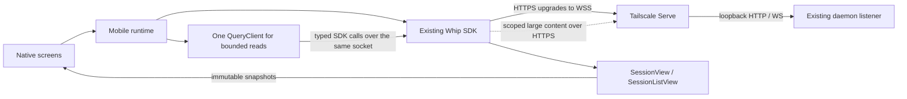
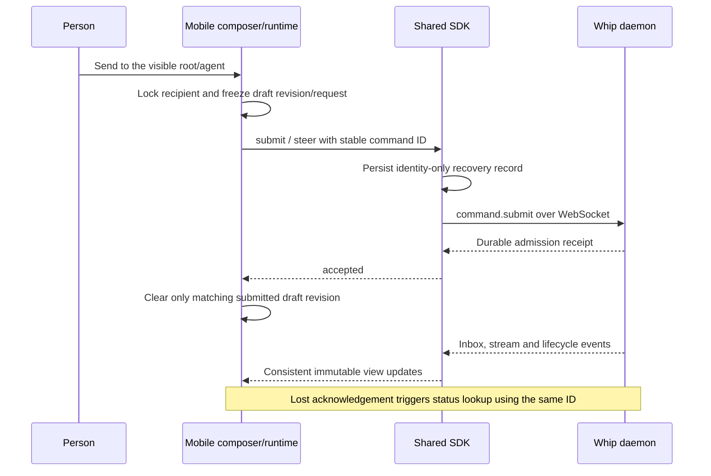

# Whip mobile: phased implementation plan

Branch: integrated into `whip-rlm` from `mobile-app` (checkpoint `0245ec9e6`).

Checkout: `/Users/samheutmaker/Desktop/context-labs/src/rlm/whip`

See [merge evidence](MERGE-EVIDENCE.md); the original mobile worktree is retained.

Status: core implementation is in place and repository/mobile automated checks
pass. Native Android and iOS simulator workflows have been exercised; the iOS
restart storage defect is corrected and a replacement signed phone preview is
ready, and the owner reports the app running on the selected iPhone. The private
`gpu-4090-sam` daemon now passes HTTPS/WSS and mobile-facing API reads from the Mac.
The owner subsequently confirmed successful phone connection after the diagnostic
update. Full physical-device workflow and distribution gates remain incomplete.
See [evidence and next action](EVIDENCE.md).
Checked work items below identify implementation, not completion of phase gates.

Build a native companion that behaves like the current web app for its core
workflows. Use the same Go daemon, generated protocol, WebSocket transport, SDK
views and durable commands. Mobile changes presentation and device lifecycle;
it does not introduce another execution or synchronization system.

This file owns phase order, implementation tasks and phase acceptance. The
[architecture proposal](README.md) owns scope, stack, connectivity and design
rationale; the [research record](RESEARCH.md) owns external evidence. Current
implementation remains governed by [docs/frontend.md](../../../docs/frontend.md),
[SDK documentation](../../../packages/sdk/README.md) and the source. Update those
canonical docs when code lands, not merely when a proposal is written.

## Fixed scope and delivery strategy

- iOS first; Android builds and basic device checks from the beginning, then a
  dedicated Android release phase.
- Manual HTTPS server URL entry. Phone and host share a Tailscale network;
  Tailscale Serve proxies the existing loopback listener. Tailnet reachability
  is the access boundary; reachable clients retain the existing trusted authority.
- No app login, QR pairing, device registry, authentication middleware,
  notifications, push service, public relay or new hosted backend.
- Sessions, root/child conversations, streaming, text submit/steer, new sessions,
  questions, Allow once / Deny, exact-turn stop, host settings and appearance.
- Full desktop tabs/splits, REPL/terminal inspectors, uploads, provider onboarding,
  permanent permission rules and host-wide configuration controls remain deferred.

Land small changes in dependency order. Each phase has a concrete demonstration
and evidence gate. Draft safety, host isolation and command identity accompany
the first applicable action; they are not postponed to a final hardening phase.
An early development build may expose only completed workflows. The useful iOS
beta requires phases 0–5, including answering questions and tool requests.

## What to carry over from the web app

The web implementation is both the behavioral reference and a source of reusable
code. Preserve these contracts while replacing DOM presentation with native UI.

| Web behavior and source | Mobile equivalent / reuse | Phase |
| --- | --- | --- |
| One application runtime outside React rendering: [bootstrap](../../../apps/web/src/main.tsx), [factory](../../../packages/app/src/index.tsx) | One mobile runtime created by the root bootstrap; providers and routes subscribe to it | 1–2 |
| Stable human client identity, host epochs, view leases, command observations: [AppRuntime](../../../packages/app/src/runtime.ts) | Same lifetime/ownership rules in a smaller native runtime; async SQLite replaces browser storage and Web Locks | 2 |
| Text JSON-RPC over WebSocket: [transport](../../../packages/sdk/src/transport.ts), [client](../../../packages/sdk/src/client.ts) | Reuse `createWhipClient`, `webSocket`/`TransportFactory`, initialization, heartbeat, backoff and limits | 0–2 |
| Snapshot/history/event synchronization: [state](../../../packages/sdk/src/state.ts), [subscription](../../../packages/sdk/src/subscription.ts) | Reuse `SessionView`, cursor recovery, ordered reduction, history revision and notification batching | 0, 2–3 |
| Session list with exact-directory grouping: [sidebar](../../../packages/app/src/session-sidebar.tsx), [sidebar state](../../../packages/app/src/sidebar-state.ts) | Native Sessions list, same directory identity and server ordering, observed SDK catalog | 3 |
| Search and host directory browsing: [search](../../../packages/app/src/session-search-dialog.tsx), [directory picker](../../../packages/app/src/directory-picker.tsx) | Native search route/sheet and host folder picker through the same bounded SDK reads | 3 |
| Create and navigate only if still on the initiating host/location: [welcome](../../../packages/app/src/welcome.tsx) | Same late-result guard; optional first prompt is a separate durable action after create | 3 |
| Recipient-scoped drafts, submit/steer, acceptance callback: [composer](../../../packages/app/src/composer.tsx), [compositions](../../../packages/app/src/compositions.ts) | Native growing composer with the same delivery semantics; text-only submission lock | 2–3 |
| Immediate authored-message previews and inbox reconciliation: [input presentation](../../../packages/app/src/input-presentation.ts), [timeline](../../../packages/app/src/timeline.tsx) | Extract the pure projection and use it in both web and native renderers | 2–3 |
| Stable reading place, Latest and bounded history: [reading list](../../../packages/app/src/reading-list.tsx), [bookmarks](../../../packages/app/src/reading-positions.ts) | FlashList with native measurements and the shared bookmark-target algorithm | 3, 5 |
| Single/batched questions and permission review: [requests](../../../packages/app/src/requests.tsx) | Native question wizard and permission sheet using current protocol types, with decision recovery strengthened | 4 |
| Advisory attention index: [attention](../../../packages/app/src/attention.tsx) | Foreground Attention destination and a bounded, explicitly qualified badge; one poll owner | 4 |
| Shared theme catalog and contrast helpers: [theme data](../../../packages/ui/src/theme-data.ts), [contrast](../../../packages/ui/src/theme-contrast.ts) | Portable public theme-data export and native semantic-role mapping | 1 |
| Isolated production workflows: [browser tests](../../../apps/web/scripts/browser.mjs), [message tests](../../../apps/web/scripts/user-messages.mjs) | Reuse fixture behavior and assertions for web/native two-client acceptance | 0–5 |

The web app's complete `AppRuntime` and `createWhipApplication` cannot simply be
mounted in React Native: they own browser routing, window tabs, synchronous
storage, DOM UI and StyleX. Likewise, `AppPlatform` is currently a web/Electron
boundary, not a universal native shell. Reuse the SDK directly and extract only
pure presentation helpers that have both real consumers.

Two current behaviors need explicit treatment rather than literal copying:

1. `WhipClient.close()` is terminal. There is no existing pause/resume API. Mobile
   needs a deliberate lifecycle contract before production suspension support.
2. `Permissions.decide()` is a typed one-shot RPC and generates a command ID when
   omitted. The current web component refreshes after uncertainty, but does not
   provide the durable identity/recovery lifecycle required after phone process
   death. Share a focused SDK improvement; do not copy that gap into mobile.

## Connection, data and state contracts

### Transport and refresh policy



- A user enters the base origin. Existing SDK derivation converts HTTPS to WSS
  and uses `/api/v3/ws`. The protocol currently reports wire major/minor 4.1;
  the historical URL segment is not a version negotiation mechanism.
- `initialize` exchanges protocol major, client ID/kind, build identity,
  capabilities and server limits. Persist a mobile client ID before connecting
  and use `clientKind: 'human'`, as web does. This ID is bookkeeping, not auth.
- Use ordinary SDK methods for RPC and commands. No Socket.IO server, REST mirror,
  GraphQL subscriptions, app-side event bus or second reconnection loop.
- Root history, live output and requests use `SessionView` snapshots/events over
  the socket. The SDK owns replay, gap detection, consistent resynchronization
  and the normal 16 ms subscriber-notification batching. React never reduces raw
  daemon events into a competing session store.
- Not every web value is push-driven. `SessionListView` currently polls revision/
  catalog through WebSocket RPC while observed, defaulting to 2 seconds; it opens
  no root subscriptions. Reuse it, with observation only while the native list is
  focused and the app active. Measure before changing that interval.
- Search, directories, provider catalogs and attention use TanStack Query calling
  the SDK, also over the socket. Start attention at the proposal's 10-second
  foreground interval, plus refresh on focus, reconnect and completed decisions.
  Web currently uses 3 seconds for this index; the mobile cadence is deliberate.
- Keep web Query defaults: `staleTime: 10_000`, `gcTime: 0`, `retry: false`,
  `networkMode: 'always'`, and no automatic focus/reconnect refetch. One lifecycle
  owner explicitly invalidates reads. Public-internet reachability does not tell
  us whether the tailnet daemon is usable.
- Only explicit bounded content reads use the existing separate HTTPS content
  endpoints. Preserve root/agent scopes, byte caps, cancellation and hash checks.
  They are not a substitute transport for session operations.
- New connections invalidate host/detail reads. Host replacement aborts waits,
  cancels reads, releases views, clears Query data and rejects old continuations
  before attaching another runtime. It never cancels accepted daemon execution.
- Gate actions/reads on the negotiated operations and capabilities as web does.
  A missing operation is an unsupported-host state, not an empty result or a
  reason to bypass the typed contract. Do not infer compatibility from URL paths.

### Ownership and native package shape

| State | Sole owner | Native persistence |
| --- | --- | --- |
| Work, sessions, commands, permissions, provider configuration | Go daemon | Existing host store |
| Socket, initialization, correlation, retries, command status | `WhipClient` / SDK commands | Existing metadata-only `RecoveryStorage` adapter |
| Root/child history, presentation, inbox, requests | SDK `SessionView` | Bounded memory only |
| Ordinary session catalog | SDK `SessionListView` | Bounded memory only |
| Search, directory and attention reads | One runtime QueryClient | None |
| Saved hosts, selected host, client ID, appearance | Mobile storage/runtime | Versioned encrypted SQLite records |
| Drafts and unsubmitted question forms | Mobile draft store | Bounded encrypted records; never an automatic send queue |
| Command-to-draft/request correlation | Mobile command observer | Small intent metadata committed with the SDK recovery record |
| Submitted previews / in-flight locks | Shared pure projection plus mobile command observer | Memory; command identity persists separately |
| Route, selected root/agent, reading place | Expo Router plus bounded bookmarks | Host/runtime-scoped hints; verified before restore |
| Focus, sheet state, unfinished URL form | Local React/native controls | Only where the workflow needs it |

Proposed files, not a requirement to create one module per item:

```text
apps/mobile/
  package.json, app.config.ts, eas.json, metro.config.js, tsconfig.json
  src/app/_layout.tsx                 bootstrap/providers and native navigation
  src/app/(tabs)/                     Sessions, Attention, Settings routes
  src/app/server.tsx                  add/edit server route
  src/app/session/[rootId].tsx        validated host/runtime/root/agent location
  src/app/new-session.tsx             host directory + optional initial prompt
  src/runtime/runtime.ts             client ownership, epochs, view leases
  src/runtime/storage.ts             SQLCipher setup, migrations, RecoveryStorage
  src/runtime/drafts.ts               bounded async writes and draft revisions
  src/runtime/commands.ts             observations, previews, action locks
  src/runtime/lifecycle.ts            AppState/focus integration and cleanup
  src/features/{hosts,sessions,conversation,attention}/
  src/components/                    small Whip native components
  src/theme/                         catalog mapping and native theme provider
  test/, .maestro/                    behavior tests and native user flows
```

New public exports: `@whip/app/presentation` for pure conversation projection,
submitted-input reconciliation and reading-target helpers;
`@whip/ui/theme-data` for resolved catalog/validation and portable contrast helpers.
Keep `packages/app/src/timeline.tsx` as the web renderer importing the extracted
projection. Do not place product presentation logic in the transport SDK.

Both entry points must have DOM/StyleX/browser-router-free import graphs. Prove
this with Metro and existing packed-consumer checks. If package-level resolution
still blocks a real native consumer, move only the blocked pure data/helpers to a
small shared package, updating web and mobile together. This is a measured
fallback, not permission to rebuild the web app or create a generic platform layer.

### Native lifecycle contract

Add a narrow SDK `pause()` / `resume()` capability if the phase-0 spike confirms
it is needed; current `close()` cannot fulfill it. This is a proposed SDK API,
not an existing method. Phase 2 must resolve and test the implementation before
shipping mutation screens. Keep the lifecycle adaptation in the SDK and mobile
runtime, with no wire-protocol change just for pausing observation.

Required behavior:

1. On actual backgrounding, flush already queued draft writes where possible,
   stop catalog/attention observation, cancel detail reads and pause connection
   heartbeat/reconnect/command timers. Persist critical records during normal
   operation; iOS may kill the process without a final callback.
2. Pausing is reversible local observation suspension. Distinguish it from
   `closed` and `incompatible`; reject new actions while paused. In-flight
   submissions retain uncertain/accepted identity, and waiting command observers
   can resume or be recreated from recovery metadata. Never report them failed
   merely because observation paused, and never resend them automatically.
3. Keep at most the selected bounded view as stale in memory. If disposing it is
   required, keep a bounded immutable display snapshot only, not another reducer.
   Release additional history/content consumers. Stop timers even if native
   navigation keeps tab screens mounted.
4. On active foreground, resume the connection, validate runtime continuity,
   reconcile unresolved commands, refresh the SDK view/catalog and visible Query
   reads, then enable applicable actions. An unresolved recipient stays blocked
   from duplicate submission until its prior admission is understood.
5. Handle rapid active/inactive/background transitions, a sheet/camera-like system
   interruption, host replacement during resume and late transport callbacks.
   A brief `inactive` state must not unnecessarily tear down keyboard/input state.
6. `close()` remains terminal and reserved for disposal or host replacement.
   No call to `connect()` on a previously closed instance. Existing browser and
   Node clients that never pause retain their current behavior.

The spike may demonstrate that an explicit close/recreate path is materially
simpler. Accept it only with the same recovery, stale-view and timer guarantees;
record that concrete decision before phase 2, rather than implementing two paths.

### Delivery and persistence contract



The SDK starts sending when a command handle is constructed, not when `run()` or
`accepted()` is called. Allocate preview/lock identity and verify readiness
before constructing the handle. Do not construct one during React rendering.

Command bodies remain frozen in the live handle. Persistent recovery records
contain runtime/client/command/operation/root metadata only. The encrypted draft
store remains separate; an edited or restored draft is not the original request.
Use a draft revision/token, not only text equality, when clearing accepted text,
so typing the same text again while a send is in flight does not erase new work.

The existing SDK record does not identify a child recipient or draft revision.
Keep small app-owned intent metadata beside it, keyed by runtime/client/command:
recipient ID or question/permission ID, draft key and submitted revision, and
creation workflow/step where needed. Prepare this association before constructing
the command handle; the SQLite `RecoveryStorage.put` adapter commits it with the
SDK record in one transaction before the first send. It contains no request body
and shares the combined recovery count/byte budget. Permission decisions use the
same atomic-storage discipline before their one-shot RPC.

After restart, use the association to reconcile the right composer/request and
clear only a matching accepted draft revision. If correlation is absent or
unreadable, preserve drafts and conservatively block new sends for the affected
root until its prior command is resolved; never guess by prompt text or whichever
agent is currently selected. A restored workflow does not automatically submit
its next create/effort/input step.

A submission preview must reconcile by command ID and authoritative inbox sequence,
never by prompt text. History commits at turn completion, so accepted/running user
input comes from inbox state before it appears in committed history. Preserve
Sending, Queued, Checking delivery, failed and interrupted distinctions.

Recovery is status-first. Retry requires authoritative `command_not_found`, an
original never-known-accepted request still available, the same ID/bytes, and an
explicit user action. A lookup failure is not absence. A previously accepted
command that disappears must not be replayed. After process death without the
original body, show the recovered result or an unresolved/unsent state and allow
a new explicit action only after resolving the old attempt.

## Phase map

| Phase | Usable result | Depends on | Estimated focused effort |
| --- | --- | --- | --- |
| 0. Web contract and native spike | Real-device proof of socket, streaming, UI and storage feasibility | Current proposal | 3–5 days |
| 1. Native shell, design and server setup | Install, enter URL, connect, save host, navigate themed screens | 0 decisions | 2–3 days |
| 2. Shared runtime and delivery foundation | Correct observations, durable recovery and native lifecycle | 1; reusable extraction can start after 0 | 3–4 days |
| 3. Sessions and conversations | Browse, create, read, send, steer and stop root/child work | 2 | 3–5 days |
| 4. Questions and permissions | Complete the mobile intervention loop | 2–3 | 2–3 days |
| 5. iOS beta acceptance and distribution | Installable, documented private TestFlight beta | 1–4 | 2–5 days |
| 6. Android release | Same product contract on Android | Shared implementation plus Android acceptance | Additional 1–2 weeks |

Phases 0–5 total **15–25 focused engineering days, approximately 3–5 weeks** for
one experienced engineer, subject to the spike. This refines the prior estimate;
it does not add six more workstreams on top. Store/account lead time, external
review waiting and substantial library incompatibilities are additional. Reuse
production-quality spike code and avoid building a disposable full prototype.

## Phase 0 — Verify the web contract and native feasibility

**Outcome:** one real iPhone can attach to an isolated Whip host, display a
streaming session, send text and answer a fixture question. Android gets a
build/connect smoke test. This is a feasibility build, not the beta.

**Work:**

- [x] Capture the implementation baseline and reconcile current batched-question
  changes. Read `docs/frontend.md`, current SDK APIs and the parity sources above.
  Do not restart/reset the developer's live daemon to obtain a fixture.
- [x] Create `apps/mobile` in the npm workspace using the researched stable Expo
  baseline and Expo-compatible dependencies. Recheck actual package compatibility
  when implementation begins; the root lockfile, Expo Doctor and native builds
  decide exact versions, not a copied historical dependency table.
- [ ] Build development clients with Expo UI, FlashList, Enriched Markdown,
  keyboard controller, SQLCipher, SecureStore and necessary Expo primitives.
  Keep one React instance; preserve the current Node/npm workspace toolchain.
- [ ] Use an isolated fake-provider daemon and Tailscale Serve. Prove WSS
  initialization, scoped HTTPS text content, cellular access and reconnect.
  Android release-emulator WSS and reconnect now pass through real Serve;
  physical-device/cellular evidence remains outstanding.
- [ ] Exercise actual SDK dependencies: UUID, SHA-256, TextEncoder/Decoder,
  base64, BigInt, abort methods, response streams, byte limits, WebSocket text
  events, close behavior and buffer reporting. Record pass/fail per platform.
- [ ] Use one realistic UI fixture: long conversation, growing composer,
  multi-question wizard, permission sheet, theme change, large type and selection.
  Verify Expo UI Host/RNHostView boundaries with the normal RN list/composer.
- [ ] Compare against the web behaviors for streamed-to-history transition,
  identical prompts, queue/steer and reconnect. Keep fixture protocol behavior
  reusable rather than copying an entire browser test runner into mobile.
- [x] Choose Expo UI or the existing Paper fallback, decide the narrow SDK
  lifecycle path and name any proven native adapter requirements. Expo UI is
  implemented and verified on Android; iOS acceptance remains open. Native abort
  compatibility, string socket URLs and missing native queue measurements are
  documented in `EVIDENCE.md` and the SDK README.

**Files:** new mobile workspace/config/fixture screen; SDK portability probes;
existing isolated daemon/browser fixture helpers only if extraction is useful.
No production protocol or authentication additions are justified by this phase.

**Gate:** no blocker to native text rendering/input, bounded transport or durable
local storage. A single mutation reaches the fixture once and streams back over
the existing socket. UI choice and lifecycle direction are decided with evidence.
If bounded HTTP reading fails in native fetch, identify the necessary adapter
before advertising content inspection; do not substitute an unlimited download.

**Reviewable change:** mobile development scaffold plus a short compatibility
record. Keep experimental screens out of production routes.

## Phase 1 — Native shell, visual foundation and manual connection

**Outcome:** install the app, enter a server URL, connect to Whip and see the
native Sessions / Attention / Settings structure using Whip themes.

**Work:**

- [x] Set up Expo Router, one bootstrap/provider tree, safe areas, font loading,
  keyboard-controller provider, app appearance and dev/preview/production profiles.
  Keep runtime creation outside render; clean up Fast Refresh/StrictMode instances.
- [x] Export portable theme data through `@whip/ui/theme-data`; map canvas, panel,
  secondary text, quiet borders, composer, code and status roles into native UI.
  Preserve stable theme IDs and source palettes. Reuse portable contrast helpers
  where appropriate without importing the browser ThemeProvider.
- [x] Build only needed components: status indicator, session row, request strip,
  choice row, sheet/dialog, empty/error state and composer frame. Use Expo UI
  controls and RN StyleSheet; no second complete styling or component framework.
- [x] Implement Add/Edit server with a bounded URL field and optional label.
  Normalize a bare host to HTTPS; reject credentials, query/fragment, invalid
  schemes and unsupported paths. Show the canonical destination before Connect.
- [x] Implement bounded connection test/handshake, cancellation, runtime-ID
  confirmation, stable mobile client ID and saved host persistence. No prompts
  or mutations during connection testing; no automatic connection from chat links.
- [x] Document the existing listener flags and validated Serve mapping. Keep
  daemon HTTP/WS on loopback, exact Host/browser Origin checks, and private tailnet
  access. Use existing network setup; add no mobile listener or CLI command tree.
- [ ] Design offline, invalid TLS, unavailable host, incompatible protocol,
  storage failure and unexpected-runtime states. Save/test edited URLs explicitly.
  Disconnect is local; Stop is an agent action; Forget clears local records.

**Files:** `apps/mobile/src/app`, `features/hosts`, `theme`, `components`, initial
`runtime/storage.ts`; `packages/ui/package.json` and portable export; setup section
of new `docs/mobile.md`. Backend edits only for a demonstrated proxy compatibility
bug. Preserve existing web/TUI listeners and defaults.

**Design gate:** compare native and web using the same theme and session fixture:
quiet chrome, readable assistant text, right-aligned user bubbles, compact tool
rows, visible host/session identity and attention color. Native back/sheet behavior
should feel natural on iOS; touch actions must not depend on hover.

**Gate:** fresh-install URL connection and later reopen work; local host settings
survive restart; wrong runtime cannot inherit old recovery state. A client blocked
by the configured Tailscale rule cannot reach the endpoint. Camera/notification/
auth permissions and infrastructure are absent.

**Reviewable changes:** theme export with unchanged web behavior; native shell
and setup flow. A placeholder screen must say unavailable, not claim an empty
session list before phase 3 is wired.

## Phase 2 — Shared runtime, storage and durable action foundation

**Outcome:** native screens can consume the same session truth as web, with one
connection owner, correct cleanup and safe command observations across suspension.

**Work:**

- [x] Implement the smaller mobile runtime using the web epoch/lease pattern:
  one current client, one QueryClient, SDK catalog, root/child consumers, command
  notices, drafts and bounded bookmarks. Subscribe with `useSyncExternalStore`
  and SDK React hooks; no duplicated session/event reducer.
- [ ] Add only the crypto/content/transport seams proven by phase 0. Keep Expo
  imports in the mobile adapter. Default SDK browser/Node behavior stays valid.
- [x] Implement the chosen pause/resume or close/recreate lifecycle contract.
  Guard connection attempts, detail reads and action callbacks by epoch and
  runtime ID. Stop timers when backgrounded even if tabs remain mounted.
- [x] Finish transactional SQLCipher persistence and schema/version handling.
  Commit client IDs and command metadata before network use. Draft writes are
  serialized, revisioned and bounded; surface pending/save-failed states.
  Use SecureStore only for the database key; no server credential storage.
- [x] Implement the SDK `RecoveryStorage` adapter with atomic put/delete/list.
  Refuse a new durable send when recovery cannot be persisted; do not claim
  restart-safe delivery after silently falling back to memory.
- [x] Commit bounded native command-to-recipient/request and draft-revision
  associations with SDK records. Restore locks and acceptance cleanup from those
  associations, with root-scoped conservative handling when association is missing.
- [x] Extract `messagePresentation`, `timelineRows`, `conversationRows`, the
  submitted-input reconciliation and the pure reading-target helper to a DOM-free
  `@whip/app/presentation` export. Web keeps its renderer and behavior tests.
  Parameterize a bound only if mobile actually needs a different value.
- [x] Build the native equivalent of `runtime.run`: admission versus completion,
  coalesced command observations, uncertainty/status inspection, explicit retry,
  recipient locks, accepted-draft revision checks and host-change guards.
- [x] Hydrate/reconcile stored unresolved commands for the matching runtime/client.
  Bound active status waiters and history notices. Unavailable status stays
  unresolved; no automatic replay or reconnection-triggered draft submission.
- [x] Add the typed permission-decision recovery seam needed by phase 4. Keep its
  own operation/result type: the current `permission.decide` RPC is not a generic
  runtime `CommandHandle` operation. Persist original decision IDs before send.
  Inspect the daemon's plain-error versus structured-failure persistence boundary
  and fix/test it if necessary; do not treat an undecodable outcome as absence.

**Files:** mobile runtime/storage/command modules; affected
`packages/sdk/src/{client,transport,util,content,command,services,state}.ts` and
exports/tests; new `packages/app/src/presentation.ts`/pure projection module;
web timeline imports/tests; existing daemon decision/status path only as needed.
Generated protocol changes require an actual contract reason and regeneration.

**Gate:** adversarial tests cover host switch during initialize/storage/admission,
late old-host queries, StrictMode acquire/release, background during send, lost
acknowledgement, accepted-but-missing status and restored metadata without a body.
The daemon admits each submitted ID once; drafts typed after submission survive.
Kill the phone after a child-send admission with separate root/child drafts;
restoration must reconcile that child's command without clearing the root draft
or a newer child revision. Repeat with missing correlation metadata.
No native dependencies enter SDK's browser or Node build. Web projection fixtures
produce the same rows before/after extraction.

**Reviewable changes:** (a) pure exports with web regressions, (b) narrow SDK
portability/lifecycle, (c) mobile persistence/runtime, (d) decision recovery fix.
Split these where it improves review, without leaving incompatible intermediate
public exports. Later phases consume this foundation instead of reimplementing it.

## Phase 3 — Sessions, conversations and directing work

**Outcome:** a person can browse the same sessions as web, start work, read root
or child output, send queued/steering text and stop an exact turn.

**Work:**

- [x] Wire Sessions to `createSessionListView`, `refresh()` and `loadMore()`.
  Group by exact host directory and preserve catalog order. Never open roots for
  labels. Show pagination, truncation, offline/stale and genuinely empty states.
- [x] Add cancellable debounced host search and a bounded host folder picker via
  `sessions.list(...)` / `host.directories(...)`. Include runtime/filter/cursor
  in keys. Directory shortcuts prefill creation; they do not start work.
- [x] Validate route runtime/root/agent before acquiring a view. Release the
  prior root before acquiring another; keep at most one selected child history.
  Back navigation retains draft and bounded reading hints, not hidden live roots.
- [x] Render the shared conversation projection with FlashList and native Markdown.
  Preserve stable row IDs, live-to-history reconciliation, inbox user messages,
  compact tool groups, recorded timestamps and truthful missing/truncated content.
- [x] Implement the native composer with explicit Send, growing multiline entry,
  visible recipient and queued/steer selection. Follow web dispatch: root uses
  `session.submit`, or `session.steer` when steering an active turn; child uses
  `session.command('agent.submit', ..., { commandId })` with explicit delivery.
- [x] Use the phase-2 lock/preview/draft/command machinery. Duplicate text remains
  separate authored messages. Disable unsupported, offline or unresolved actions
  without losing editable drafts. Route changes cannot clear another recipient.
- [x] Implement new-session directory/model selection from host catalogs/defaults.
  `client.sessions.create` takes cwd/kind/model/provider. If effort is selected,
  apply the existing `session.effort` command with `persist_default: false` once
  the root exists; only then send an optional first prompt. Journal each step.
- [x] Display a created root with an unsent prompt when a later step was never
  admitted. After timeout recover the original create ID; never create a second
  root to compensate. Late completion must not hijack the user's new location.
- [x] Match web's idle-root model/effort edits with no host-default persistence.
  Child composer shows its actual model. Provider setup and permission-mode
  toggles remain outside mobile scope; existing host permission policy stays visible.
- [x] Add Stop for the authoritative root or selected child turn ID. Capture the
  target when the action is initiated; a later new turn is not the old target.
  Distinguish root idle from descendants still working.
- [x] Implement Latest, older-page loading, selection/copy and revision-aware
  bookmark restore. Native layout changes cannot steal the reader's place. Show
  attachment metadata and explicit bounded text inspection; uploads remain absent.

**Files:** native sessions/conversation features, session/new-session routes,
composer/row components; existing SDK services through public APIs. Shared
presentation changes update both consumers and associated web tests.

**Gate:** web and phone observing the same fixture agree on session identity,
message sequence and delivery status. Sending from either updates the other.
Test identical prompts, active queue/steer, child targeting, create/effort/input
partial success, clear/rewind initiated elsewhere, selected text during streaming
and list pagination during catalog revision changes.

**Reviewable changes:** catalog/navigation/create; conversation/read behavior;
composer/steer/stop and two-client parity. The development app is now useful for
reading and directing work, but phase 4 is required to unblock human requests.

## Phase 4 — Attention, questions and tool permissions

**Outcome:** the complete away-from-desk loop works: discover a blocker, inspect
its context, answer it once and see work continue on both phone and web.

**Work:**

- [x] Add one foreground owner for `host.attention` refresh and its bounded pages.
  SDK events/successful decisions may coalesce an earlier refresh; never poll
  each root or build a second notification service.
- [x] Show index order, loaded/lower-bound count and an explicit Load more/Refresh.
  The index contains active-root summaries and limited question details, not a
  complete chronological inbox. Permission counts require selected-root detail.
- [x] Open the chosen root and selected request through the existing view lease.
  Include child requests and agent identity. Preserve the originating conversation
  and composer; request arrival does not move focus automatically.
- [x] Implement single/multi-select, option descriptions, recommendation marker,
  free-text answer, Back/Next and explicit Skip/Dismiss in the question wizard.
  Preselection is not submission. Closing a sheet is not dismissing the question.
- [x] Follow the current generated `question.answer` contract and batched answer
  order exactly. Use the shared SDK helper or explicit typed command with a stable
  ID; never derive the wire shape from a mock screen or an older protocol example.
- [x] Retain unfinished question forms by runtime/root/question and batch shape
  within the draft budget. Revalidate against the current request on restore;
  preserve obsolete text for copy/discard, never apply it to another question.
- [x] Show operation, agent, canonical target/command and relevant arguments in a
  native permission sheet. Offer Allow once / Deny only. Existing permanent rules
  and host policy remain honored, but no rule editor or policy toggle is added.
- [x] Use phase-2 decision recovery. Resolve accepted handoff, failed decision,
  answered elsewhere and unknown delivery separately. Persist command identity
  before sending; reuse it on a permitted explicit retry, never on a new decision.
  A decision receipt is not proof the tool itself completed successfully.
- [x] Disable stale controls while reconnecting/reconciling. After another client
  answers, remove the actionable state and retain useful unsent text for copy.
- [x] Refresh attention and selected detail on return to foreground. There are
  no closed-app alerts and no historical completion feed masquerading as attention.

**Files:** native attention/question/permission features; shared decision helper
from phase 2; current generated protocol and `packages/sdk/src/session.ts` question
helpers. Update web only for shared recovery behavior or a proven correctness fix.

**Gate:** phone and web race the same single question, batch and permission;
one authoritative answer wins and both clients converge. Test skipped batch pages,
free-text and multi-select, stale/replaced questions, large tool detail, app kill
before/after decision admission, denied decisions and failed status decoding.
Verify production `SetExternalPermissions(true)` behavior for new root/children
and existing host policy through reopen/restart using isolated fixtures.

**Reviewable changes:** attention index and navigation; native questions;
permission review/recovery. All original first-release companion workflows now
function; distribution still depends on phase 5 evidence.

## Phase 5 — iOS beta acceptance, native polish and release

**Outcome:** an installable private iOS beta with reproducible checks and setup
instructions. This phase validates integrated behavior rather than adding auth,
push, another transport or broad new product scope.

**Work:**

- [ ] Exercise the full matrix below on a named physical iPhone in a release/preview
  build: local Wi-Fi and cellular through Tailscale, airplane mode, host sleep,
  daemon restart, phone lock, foreground return and process termination.
- [ ] Verify draft/storage failure behavior, backup exclusions, key loss, schema
  upgrade and fresh install. Unresolved recovery records never disappear due to
  retention eviction; the UI gives a bounded review/forget path with clear scope.
- [ ] Test long mixed transcripts, 10,000-message host history with bounded loaded
  windows, large code/tables, repeated navigation and streaming child activity.
  Measure native and JS memory, not just payload sizes or virtualized row counts.
- [ ] Refine keyboard growth, safe areas, back gestures, sheet focus restoration,
  rotation, touch action access, native text selection and Copy failure handling.
- [ ] Test light/dark and representative catalog themes, VoiceOver, large Dynamic
  Type, contrast and reduced motion. Validate theme IDs/catalog generation across
  the full set without assuming every native OS control accepts every token.
- [ ] Verify unknown/unsafe transcript links cannot configure servers or execute
  actions, remote Markdown images do not auto-fetch, content remains capped, and
  diagnostic exports exclude prompt/content/key material.
- [x] Add redacted diagnostics: build/SDK/protocol, connection state, runtime,
  recent error codes, last sync and storage availability. Keep raw transcripts out.
- [ ] Complete EAS preview/production profiles, signing, icons/splash, build numbers,
  app privacy metadata and TestFlight installation. EAS Submit handles upload;
  store access, account setup and release controls remain explicit owner actions.
- [ ] Write `docs/mobile.md` setup/use/troubleshooting and record device evidence.
  Update `docs/frontend.md`, `docs/features.md`, `docs/concurrency.md` and relevant
  SDK docs for actual changes. Add the mobile roadmap milestone and mark complete
  only when its stated beta gate is met; retain deferred auth/push milestones.
- [ ] Run focused correctness/simplicity review, fix surviving issues and rerun
  affected checks. Keep Android building and resolve shared regressions now.

**Gate:** an owner installs the beta, enters the documented private URL, starts a
session, leaves the desk, reads/steers work, answers requests and resumes after a
lost connection without duplicate work or lost acknowledged drafts. Remaining
limitations are accurate and visible. All phases' acceptance evidence is linked.

**Reviewable changes:** native polish and failure fixes; CI/release/docs; dated
acceptance record. Public App Store launch is a separate distribution decision:
provide reviewer access or a deterministic demo without exposing the owner's
runtime publicly, and verify current store requirements against the final build.

## Phase 6 — Android follow-on

Keep the same routes, SDK behavior, storage semantics and themes. Focus this phase
on Compose/Expo UI differences, Android back/predictive back, keyboard/insets,
TalkBack, font scaling, process death, SecureStore/SQLCipher behavior and Tailscale
route permissions on the actual target API level. Native module configuration
must use Expo-supported versions; no second implementation of transport or state.

- [ ] Run the same protocol/recovery/two-client flows on a physical Android phone.
- [ ] Address platform-specific rendering, lifecycle and accessibility failures.
- [ ] Validate backup exclusions, app update retention and fresh install.
- [ ] Produce Play internal-testing artifacts and complete Android release metadata.
- [ ] Record device/build evidence and platform differences in `docs/mobile.md`.

**Gate:** Android passes the same functional contract as iOS. Estimates allow an
additional 1–2 weeks for platform issues and distribution; this is not a second
app build. Notifications, QR and auth remain deferred on both platforms.

## Cross-phase acceptance and resource budgets

These are proposed mobile limits, not changes to the daemon's advertised limits.
Keep them in one app configuration/module and test admission/overflow behavior.

| Resource | Initial mobile policy |
| --- | --- |
| Hosts and connections | Four saved hosts; one active client |
| Root/child observation | One retained root view and at most one inspected child; release the old root before switching. A root may survive navigation for 30 seconds only while no other root is opened |
| SDK history | Existing 8 MiB retained root-view payload and 512 messages per opened agent; show truncation and explicit pagination |
| SDK session catalog | Existing 2 MiB default; polling only while focused/foreground observed |
| Drafts, including question forms | 16 entries, 64 KiB each, 512 KiB aggregate; refuse excess admission without evicting unsaved work |
| Command/decision recovery | Combined 64 records / 64 KiB including native correlation metadata; never evict unresolved entries to admit a new send |
| Submitted previews | Existing shared 32-entry / 1 MiB ceiling, confirmed entries evicted first; no persistent prompt cache |
| Reading hints | 64 bookmarks / 64 KiB; a missing anchor falls back within retained rows, never unbounded fetch |
| Attention | 64 entries per page, at most four pages; 10-second coalesced foreground refresh plus explicit/event-triggered refresh |
| Bounded detail reads | 256 KiB in one explicit sheet; retain SDK/server lower limits and cancellation; no attachment-download product scope |

Use these scenarios as the shared functional acceptance matrix:

| Acceptance scenario | Required behavior | Primary gate |
| --- | --- | --- |
| Web + phone see one root | Same inbox/history/live state and accepted outcomes, distinct local drafts | 3–4 |
| Two identical prompts | Two authored messages, distinct command IDs; no text-based deduplication | 2–3 |
| Send while older history is selected | Message submits once, selection/reading place remains stable | 3, 5 |
| Kill before write / after send / after commit before reply | Truthful saved/unsaved and uncertain/accepted states; original-ID recovery | 2, 5 |
| Kill after child send with separate root/child drafts | Stored correlation restores the correct lock and draft revision; missing correlation preserves drafts and blocks the affected root conservatively | 2, 5 |
| New session succeeds, effort/input fails or is uncertain | Recover/open that root, preserve unsent draft, never create a duplicate root | 3 |
| Web answers while phone sheet is open | Phone resolves stale request and does not send another answer | 4 |
| Permission reply lost, including rejection | Typed status/pending reconciliation, no fresh-ID replay and no false tool-success claim | 2, 4 |
| Wi-Fi to cellular / VPN off then on | SDK handles transient reconnect; no duplicate app retry loop or queued offline send | 0, 2, 5 |
| App suspended while screens remain mounted | Pollers/heartbeat/reconnect stop; foreground refresh resumes truthfully | 2, 5 |
| Different runtime at a saved URL | Explicit host replacement; no old view, draft action or recovery applied to it | 1–2 |
| Old host action completes after switching | New host state and route remain untouched; old accepted execution continues | 2–3 |
| Rewind/clear or catalog change from web | Revision-aware resync and bounded reading fallback; no stale page merge | 3 |
| Full storage / missing encryption key | Visible recovery/data limitation; no silent plaintext or unsafe new send | 2, 5 |
| Unsafe or oversized content | No executable links, auto-loaded remote images or unbounded fetch/render path | 0, 3, 5 |
| Lower-end device, large text and screen reader | Responsive input, usable controls, stable focus and accurate announcements | 0, 5–6 |

Suggested performance targets remain experiments: selected session usable within
2 seconds after a healthy private connection, foreground recovery within 5
seconds on that path, responsive composer during streaming, and no monotonic
memory growth over 100 open/background/switch cycles. Separate daemon/network
latency from UI work; phase 0 measures and refines these targets.

## Validation, evidence and handoff

Reuse existing tests for shared behavior and add native evidence where browser
checks cannot prove it. Do not run exhaustive suites after every documentation
edit; implementation checks follow the affected boundary.

| Change boundary | Existing / proposed checks |
| --- | --- |
| SDK/protocol | Existing `npm run check`, `npm test`, `npm run acceptance`, `npm run test:browser`, `npm run test:package`; generated artifact drift where changed |
| Shared app projection/runtime behavior | Existing `npm run check:web`, `npm run test:web`; affected timeline/input/composer/request tests |
| Themes/public UI export | Existing `npm run check:themes`, UI checks and `npm run test:packed -w @whip/ui`; native import smoke |
| Daemon/recovery changes | Existing `task check`, affected Go race suites and `task acceptance` for integrated changes |
| Native behavior | Proposed `check:mobile` and `test:mobile` root scripts, Expo Doctor, Jest/RNTL, native build smoke and focused Maestro flows |
| Cross-client product behavior | Isolated fake-provider daemon with web + native client, controlled disconnect/admission/decision fixtures; existing browser fixtures as reference |
| Release correctness | Install actual EAS artifacts; physical device/network/accessibility checks recorded by build and OS |

Native scripts now exist in the root and mobile package manifests. Avoid a new
large test framework or copying all browser tests verbatim. Share fixture data or
daemon setup only where both runners benefit, and keep production-provider runs
out of deterministic acceptance.

For each phase, append to `EVIDENCE.md`: change/commit IDs, completed gate,
commands and results, device/OS/build, fixture source, screenshots/video or traces
where relevant, unresolved issues and the chosen next step. Preserve the phase
checkboxes until work is actually complete. At handoff, another engineer should
be able to identify the current phase and run its next check from the record.

Planning-only validation for this document consists of source/API reconciliation,
local-link/anchor and Markdown checks, consistency with the accepted reduced scope,
and a focused review of correctness and unnecessary work. The independent review
identified the missing persistent recipient/draft association; the metadata
contract and root/child restart test above incorporate that finding. No app or daemon was
implemented, installed, restarted, exposed or tested on a physical device as part
of writing this phased plan.
