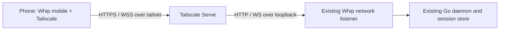

# Whip mobile companion: research and implementation plan

Branch: integrated into `whip-rlm` from `mobile-app` (checkpoint `0245ec9e6`).

Checkout: `/Users/samheutmaker/Desktop/context-labs/src/rlm/whip`

The original mobile worktree remains available. See [merge evidence](MERGE-EVIDENCE.md).

Status: core implementation and automated checks are in place; native/device and
distribution acceptance remain in progress. Researched September 7, 2026.
See [implementation evidence](EVIDENCE.md) for verified results and limitations.
Updated scope: manual server URL over Tailscale; app authentication, QR pairing
and notifications deferred at the user's request.

## Recommendation

Build an Expo React Native companion in `apps/mobile`. Reuse Whip's protocol,
SDK, synchronized session views, and theme data. Give the phone its own native
navigation and presentation. Enter the server URL manually and connect through
Tailscale Serve using HTTPS/WSS. Reuse the existing trusted network listener;
Tailscale access rules are the access boundary for this release. Keep execution
on the existing Go daemon. No app login, pairing service, notification service
or hosted execution backend is needed.

Use **Expo UI (`@expo/ui`) as the primary component library**, React Native
StyleSheet for Whip-specific layouts, Expo Router for navigation, FlashList for
conversations, and native Markdown rendering. Validate the component choice in
a small real-device spike before building every screen. React Native Paper is
the fallback if native control composition or theming fails that spike.

Expo SDK 57 is the verified stable baseline. The npm registry returned
`expo@57.0.20`; SDK 57 uses React Native 0.86 and React 19.2. Use the compatible
patch versions selected by Expo, then pin the resolved versions. In particular,
include the fixes present in `expo@57.0.17` and later for Hermes memory/startup
regressions. Do not start from SDK 58 canary. See the
[SDK 57 release notes](https://expo.dev/changelog/sdk-57) and
[research record](RESEARCH.md).

### Confirmed product decisions

The latest user direction supersedes the earlier request for QR pairing and
notifications in the first useful release.

| Decision | Consequence |
| --- | --- |
| iOS first, Android soon after | iOS leads release acceptance; keep Android building and exercise it during the initial spike |
| Phone and Whip host are on the same Tailscale network | Use private Tailscale Serve HTTPS/WSS; reuse the existing trusted backend listener |
| Enter the server URL manually | Add a small Add server form with connection testing and saved hosts; no camera or enrollment flow |
| Skip app authentication for now | No login, device credentials, pairing approval, roles, device registry or revocation API; permitted tailnet clients are trusted |
| Skip notifications for now | Keep the foreground Attention queue and refresh on return; no push, background polling or gateway |

There is no pending notification-hosting decision. App-store organization and
bundle IDs, supported minimum OS versions and eventual public distribution can
be settled during the spike. Start with an installable private iOS beta.

## Goal and boundaries

Let a person leave their desk, read what their agents are doing, send instructions,
answer pending questions and permission requests, and start a session on their
Whip host. The person should always know which machine, workspace, session, and
agent will receive an action.

### First useful beta

- Add a host by entering its Tailscale HTTPS URL; test the connection and save it.
- Remember several hosts; actively connect to one at a time.
- Browse recent sessions grouped by exact host directory; search and page them.
- Read bounded root/child transcripts, streaming answers and compact tool summaries.
- Send text to the selected root or child, preserving exact delivery semantics.
- Answer single and batched questions, including free text and multi-select.
- Approve once or deny an exact pending tool request after seeing its scope.
- Start a root session in an existing host directory with host defaults and an
  optional model/effort override. Show directory and model before submission.
- Stop a turn explicitly; distinguish it from disconnecting or closing a screen.
- See connection state, pending human work, and uncertain delivery truthfully.
- Preserve drafts and command recovery through navigation and normal process death.
- View connection status; edit a server URL, disconnect or forget the local host.
- Support system light/dark appearance and the shared built-in theme catalog.
- Show pending human input while open; refresh attention and session status on
  return. The first release does not alert while closed.

### Deferred

App authentication, QR pairing, per-phone access management, notifications, push
infrastructure, public tunnels/relays and direct-LAN discovery or certificate
pinning. Revisit these as separate product decisions after the private beta.

File editing, terminal interaction, full REPL/agent/budget/MCP inspectors, desktop
splits/tabs, provider login and API-key entry, host configuration editing,
arbitrary uploads, image/voice composition, scheduling UI, background execution
on the phone, multi-user collaboration, simultaneous connections to every host,
and a full persistent offline transcript cache.

An attachment sent elsewhere can still appear as a bounded attachment row.
Explicit text/evidence reads use the existing bounded content APIs and their
root/agent scope checks. Image/file upload can follow separately.

## What already exists

The canonical architecture remains [docs/frontend.md](../../../docs/frontend.md).
This proposal is a future extension, not a replacement specification for the web
app. The inspected working tree already contained unrelated in-progress changes,
including batched questions; implementation must reconcile those changes first.

| Existing foundation | Evidence and implication |
| --- | --- |
| Daemon owns all execution and persistence | [Feature map](../../../docs/features.md), [server](../../../internal/daemon/server.go). Mobile is an observing/directing client; disconnect never cancels accepted work |
| Typed JSON-RPC, durable command IDs, replay, bounded snapshots | [Protocol types](../../../internal/protocol/types.go), [registry](../../../internal/protocol/registry.go), [SDK command](../../../packages/sdk/src/command.ts), [SDK state](../../../packages/sdk/src/state.ts). Reuse rather than introducing REST copies of session operations |
| Current wire version is **4.1** | `internal/protocol/types.go`. The current HTTP paths still contain `/api/v3/`; the package version and historical protocol filename also lag the wire major. Do not infer protocol compatibility from a URL or npm package version |
| Session create/send/steer/questions and permissions have SDK APIs | [Session service](../../../packages/sdk/src/session.ts), [other services](../../../packages/sdk/src/services.ts), [request UI](../../../packages/app/src/requests.tsx). Batched answers must follow the generated contract, not an older single-question design |
| Session list, directory browsing, attention, summaries, themes | [Host handlers](../../../internal/daemon/host.go), SDK services and views. Reuse these bounded reads; do not subscribe to every session for a badge |
| A native WebSocket transport can be injected | [TransportFactory](../../../packages/sdk/src/transport.ts), [ClientOptions](../../../packages/sdk/src/client.ts). This is the mobile integration seam |
| Network access is currently trusted and unauthenticated | [Network handler](../../../internal/daemon/network.go), [HTTP server](../../../internal/daemon/network_server.go), `server.go:register`. Host/Origin checks are not phone identity. A caller supplies its own `client_id`/`client_kind` |
| HTTP content is separate from WebSocket RPC | [HTTP content handler](../../../internal/daemon/network_content.go), [SDK content](../../../packages/sdk/src/content.ts). Reuse the same private endpoint for both; preserve existing root/agent content grants and byte limits |
| Web packages are browser implementations | `@whip/app` depends on web routing; `@whip/ui` depends on Base UI, DOM and StyleX. Reuse behavior/data selectively; neither package is a native renderer |
| Go owns theme definitions and generation | [Theme generator](../../../cmd/themegen/main.go), [theme data](../../../packages/ui/src/theme-data.ts), generated catalog. Share the data through an explicit portable export |

## Entire application stack

| Layer | Proposed choice | Reason and boundary |
| --- | --- | --- |
| App framework | Expo SDK 57, React Native New Architecture, Hermes, TypeScript | Native app with maintained storage/build integrations; development builds from day one |
| Project/build | Existing npm workspaces, Node 24, Expo Metro, Continuous Native Generation | Add `apps/mobile`; retain the root lockfile. Config plugins own native configuration; no package-manager migration |
| Navigation | Expo Router stable stack/tab APIs | Sessions, Attention, Settings, with conversation/new-session routes; native back gestures and typed deep links |
| Components | Expo UI universal controls and sheets; platform-specific APIs only where needed | Native SwiftUI/Compose behavior. Small Whip wrappers for theme/context/labels; no homegrown general component framework |
| Authored styling | React Native `StyleSheet`, shared semantic theme data, Expo UI modifiers/theme inputs | DOM CSS/StyleX components do not transfer to native. One native styling approach, no Tailwind compiler alongside it |
| Typography/icons | System UI font for native chrome; bundled Inter for conversation and JetBrains Mono for code; `lucide-react-native` for custom controls | Familiar native navigation plus Whip's reading identity. Fonts bundled with `expo-font`; platform controls may retain system typography/icons |
| Conversation list | `@shopify/flash-list` 2.x | Recycling, variable heights and position maintenance; explicit app follow/anchor behavior and bounded SDK data |
| Markdown | `react-native-enriched-markdown`, native text component | Selection, copy, code and GFM rendering without a WebView; compatibility/performance/security spike required |
| Composer/keyboard | RN multiline `TextInput`, `react-native-keyboard-controller`, safe-area context | Controlled growing text entry, reliable keyboard avoidance and bottom inset behavior |
| Authoritative client state | `@whip/sdk`, `/state`, `/react`, `useSyncExternalStore` | Exactly one SDK reducer, recovery engine, session catalog and selected session view |
| Ordinary host/detail reads | Existing TanStack Query, one mobile QueryClient | Catalog/settings/detail queries only; no second session state store or mutation retry queue |
| Local encryption key | `expo-secure-store` | Database key only; no server credentials and no large transcripts or prompts in Keychain |
| Local metadata/drafts | `expo-sqlite` with its SQLCipher build option | Transactional encrypted metadata and bounded drafts; database key in SecureStore. `expo-crypto` supplies randomness/hashing; no custom record-encryption format |
| Network | Existing SDK WebSocket transport plus bounded HTTPS content | Start with the current transport; add native adapters only for demonstrated portability gaps. Check runtime continuity on attachment |
| Connectivity | External Tailscale app + Tailscale Serve | Manually entered HTTPS URL; private tailnet reachability on Wi-Fi/cellular; existing loopback listener behind Serve |
| Testing | Existing Go/SDK tests, `jest-expo` + React Native Testing Library, Maestro, physical-device acceptance | Test behavior across native, transport, lifecycle and daemon boundaries |
| Distribution | EAS Build + Submit, TestFlight and Play testing tracks | Automates native builds and uploads; store accounts, metadata, review and release controls remain required |
| Updates | Store-delivered beta; optional signed EAS Update later | Native changes always require new binaries. Any OTA channel must use compatible runtime versions and controlled promotion |
| Diagnostics | Local redacted status/export first | No prompt/transcript analytics. Add an external crash service only after defining scrubbing and opt-in behavior |

Primary documentation: [Expo development builds](https://docs.expo.dev/develop/development-builds/introduction/),
[monorepos](https://docs.expo.dev/guides/monorepos/),
[Expo UI](https://docs.expo.dev/versions/latest/sdk/ui/),
[Router](https://docs.expo.dev/router/introduction/),
[FlashList](https://shopify.github.io/flash-list/docs/usage/),
[Enriched Markdown](https://github.com/software-mansion/enriched-markdown),
[keyboard controller](https://docs.expo.dev/versions/latest/sdk/keyboard-controller/).
The choices and division of responsibilities in the table are our recommendations,
not claims that these libraries have already been integrated or benchmarked here.

### Component-library decision

| Candidate | Fit for Whip | Decision |
| --- | --- | --- |
| Expo UI | First-party native controls, sheets, pickers, switches and field groups; existing Expo dependency relationship. Native styling differs by OS and its universal layer is comparatively recent | Primary; prove keyboard/sheet/list composition, theme mapping and accessibility first |
| React Native Paper | Established Material Design library with broad controls and configurable themes. More work to make iOS feel native and to soften Material visual defaults | Fallback if Expo UI requires too many bridges or platform exceptions |
| Tamagui | Components plus token styling, optional compiler, native/web sharing | Good if rebuilding the web UI as a universal UI were a goal; here it introduces a second extensive design system without that payoff |
| React Native Reusables | Open component source with a shadcn-like look and NativeWind/Uniwind integration | Visually close to Whip, but adds utility styling and ongoing ownership of copied primitives |
| gluestack UI | Broad customizable component source and Tailwind/NativeWind integration | Similar ownership/styling tradeoff; no compelling advantage for this small native surface |

See [the cited comparison and acceptance experiment](RESEARCH.md#component-libraries).
Do not install several complete component systems. Expo UI is a recommendation
with a specific feasibility gate, not a claim that every chat element should be
a SwiftUI/Compose subtree. Keep FlashList and the composer in a normal RN layout;
use Expo UI for coherent control groups and modal surfaces. Validate each native
Host/RNHostView boundary and avoid a native Host per token or transcript fragment.

## Connectivity and trust

### First-release topology



Keep the optional Whip network listener on a fixed loopback address and put
Tailscale Serve in front of it. The phone enters the resulting HTTPS base URL,
for example `https://whip-host.example-tailnet.ts.net`. Serve handles the trusted
certificate and forwards WebSocket and HTTP traffic to the same local endpoint.
The daemon continues to use its existing trusted-client protocol.

This uses the existing `WHIP_NETWORK`, `WHIP_LISTEN`, `WHIP_ALLOWED_HOSTS` and
`WHIP_ALLOWED_ORIGINS` configuration in `cmd/whip/daemon.go`. Document a working
Serve mapping and host configuration after validating it in the spike. A new
mobile listener, mobile CLI command tree or authentication protocol is unnecessary.
Do not change the default listener binding or automatically alter Tailscale policy.

Keep the listener bound to loopback, use Serve rather than public Funnel, and
allow only the intended tailnet users/devices to reach the served port. Retain
exact Host and browser Origin checks; test the actual Host forwarded by Serve
and configure its expected value explicitly. Native requests may omit Origin;
that is existing client behavior, not evidence of identity. Do not enable wildcard
hosts/origins or router port forwarding as part of setup.

Tailscale provides private routing and encrypted transport between devices.
HTTPS/WSS also gives the native client ordinary certificate validation without
cleartext-network exceptions or custom certificate pinning. Manual URL entry
solves endpoint selection; both devices still need a working permitted tailnet
route. Host sleep, a stopped daemon or disconnected Tailscale makes the host
unavailable. The app reports this and retries when foregrounded.

Sources: [Tailscale Serve](https://tailscale.com/docs/features/tailscale-serve),
[Tailscale HTTPS](https://tailscale.com/docs/how-to/set-up-https-certificates).
Certificate issuance exposes certificate names in public transparency logs, so
use a neutral machine name rather than putting sensitive project names there.

### Add server flow

1. Open **Add server**. Enter a URL and optional friendly label. Accept a bare
   hostname by adding `https://` and showing the normalized address before Connect.
2. Validate a bounded HTTPS base URL locally. Reject embedded credentials, query
   strings, fragments and unexpected paths; use the SDK's endpoint derivation for
   `/api/v3/ws` and content paths. Do not accept a command or configure a host from
   a transcript link. No discovery, QR scanner or clipboard inspection is needed.
3. Connect using the existing SDK handshake; check wire compatibility and required
   operations, then read bounded host metadata. A failed test shows actionable
   URL, DNS, TLS, Tailscale, Host-check, host-offline or protocol diagnostics where
   the platform provides enough evidence. Otherwise report an unknown connection
   failure instead of guessing. Never offer a certificate-verification bypass.
4. Save the successful endpoint, friendly label, runtime ID and a stable local
   client ID. Open Sessions. Client IDs support protocol bookkeeping and recovery;
   they are caller-supplied identifiers, not credentials.
5. On subsequent launch, reconnect to the last selected saved host. Check runtime
   continuity before restoring views or command recovery. HTTPS authenticates the
   endpoint; `runtime_id` is only a continuity check, not cryptographic identity.

Remember up to four hosts but connect to one at a time. Settings can edit/test a
URL, disconnect, or forget its local metadata and drafts. An edited URL gets a
fresh connection check before adoption. A different runtime requires explicit
host replacement and separate recovery state; never replay old commands into it.
Disconnecting does not stop accepted work. Forgetting a server is local cleanup,
not revocation of network access. Access removal is handled in Tailscale.

### Trust and existing tool permissions

For this beta, **every client permitted to reach the Whip endpoint is trusted
with the existing network API's authority**. The app has no user login or
per-phone authorization. Being in the same tailnet reduces exposure; its access
rules determine who can actually connect. A broadly shared tailnet therefore
requires an appropriately scoped Serve access rule. This is a deliberate private
single-owner deployment model, not a multi-tenant boundary.

The mobile UI exposes the companion workflows, but omitting administration or
terminal controls does not restrict another network client. There is no server-side
mobile role in this release. Existing content scope checks, message bounds and
host/browser checks remain in place; they do not identify individual phones.

Skipping connection authentication does not change agent tool permissions.
`daemonToolServices` in `cmd/whip/daemon.go` already calls
`SetExternalPermissions(true)`. Reuse and test the production path, including
reopen/restart and recursive runners. Permission mode is runner state, not a
persisted session preference; an automatic-mode unit fixture does not establish
the production default. The mobile UI offers Allow once / Deny for pending
requests and does not offer policy changes. Existing sessions keep host policy.

### Later connectivity choices

Keep endpoint selection in the mobile host settings and transport in the existing
SDK boundary. Add application authentication and per-device access management
before expanding to public reachability. QR can later simplify entering an
endpoint or support enrollment once that design exists; neither is required now.

A future public tunnel can remove the phone VPN requirement, while a relay could
support other connectivity/privacy goals. Direct LAN with custom certificates
also has native trust and permission costs. Defer their implementation and
protocol design until beta feedback justifies them. No dormant auth, pairing or
push framework needs to be built into the first release.

## Mobile architecture and SDK work

### Package boundaries

```text
apps/mobile/
  app.config.ts, eas.json, metro.config.js
  src/app/                  Expo Router routes and layouts
  src/runtime/              client/view leases, lifecycle, commands, persistence
  src/features/hosts/        URL entry, saved hosts, connection diagnostics
  src/features/sessions/     list, search, create, conversation
  src/features/attention/    questions and permissions
  src/components/            small native Whip components
  src/theme/                 portable token mapping and native preferences
  modules/                   only native adapters proven necessary by the spike
  tests/, .maestro/

packages/sdk/               shared protocol/recovery/state; narrow portability seams
packages/protocol/          Go-generated operation/types/validators
packages/ui/                web UI plus an explicit DOM-free theme-data export
```

No new `mobile-sdk`, new session reducer, copied protocol types, universal app
rewrite, or package per screen. Start native product code in `apps/mobile`.
Extract pure shared presentation helpers only where there are two actual consumers
and no DOM dependency. In particular, `timelineRows` currently shares a file with
web rendering: extract/test its portable projection before reuse, rather than
importing that `.tsx` module into Metro. Keep platform reading-anchor presentation
separate. Expose those pure helpers through a DOM-free `@whip/app/presentation` subpath,
as detailed in the phased plan. Keep product presentation out of the transport
SDK and do not move the entire web runtime into a shared native abstraction.

Expose portable resolved palette/validation data through `@whip/ui/theme-data`;
never import `@whip/ui`'s DOM barrel or its private `src` directory in mobile.
If npm peer resolution pulls web-only React DOM dependencies through that export,
extract only the theme data to a small shared package, updating the generator and
web consumer together. This is a measured fallback, not an up-front package split.

### Portability spike: real gaps, not assumed polyfills

| Current SDK dependency | Required proof/change |
| --- | --- |
| `new WebSocket(url)` | Try the current transport in the native build; verify TLS, text frames, close handling and reported buffered bytes. Add an adapter only if needed |
| Global `fetch` in `content.ts` | Prove bounded content reads, cancellation, redirects, status and declared lengths; add a narrow HTTP adapter only if required. Upload UI is deferred |
| `crypto.randomUUID` / `crypto.subtle.digest` | Test Hermes/Expo globals. If missing, inject UUID/SHA-256 functions backed by `expo-crypto`; do not fake randomness or import Node crypto |
| `TextEncoder/Decoder`, `atob/btoa`, BigInt | Run generated validators and history/content integrity flows in a device build; polyfill only measured omissions |
| `AbortSignal.any`, `.timeout`, `.throwIfAborted` and streamed response bodies | Test actual SDK/Expo implementation. Preserve byte caps and cancellation if adapting; an unbounded `arrayBuffer()` fallback is not equivalent |
| Timers and foreground-centric reconnect | Add an explicit pause/resume observation seam if required; current `WhipClient.close()` is terminal, so do not close and then call `connect()` on that instance |
| Async recovery storage | Hydrate the stable client ID and storage before connecting; retain metadata-only recovery record schema and fail visibly if durable writes fail |
| `Permissions.decide()` uses a separate ephemeral RPC | Persist a decision recovery identity before sending; it is not automatically covered by `CommandHandle` recovery |
| Transport failures collapse into generic disconnects | Preserve native close/error details where available; give useful URL/TLS/network diagnostics and back off transient retries |
| Workspace ESM exports/builds | Build generated protocol/SDK before Metro and EAS; verify one React/native dependency instance and the installed-package boundary |

A URL test must not send a prompt or other mutation. Use bounded handshake/read
operations, cancel abandoned attempts and stop retrying when the user changes
hosts. No credential-status preflight or new authentication state is needed.

Keep Expo imports in mobile adapters. Node and browser SDK behavior remain valid
with default implementations. Avoid blanket global polyfills and a general
platform plugin framework; add only the functions/transport lifecycle needed.

The root uses React 19.2.8 and TypeScript 5.9.3 today. RN 0.86.3's registry peer
range accepts React 19.2.3 or later, and Node 24.3+ is accepted. Expo templates may
choose newer TypeScript tooling; inspect `expo install --check`/Expo Doctor and
dependency resolution before choosing a deliberate alignment. Never introduce a
second React instance in the native bundle or upgrade the web stack incidentally.

### Backgrounding, reconnect and command safety

On entering the background: save drafts, stop attention polling, release
unneeded views, and suspend connection/retry timers. The OS can kill the process
without a final callback, so recovery writes must happen before sending commands.
On foreground: unlock storage, restore the intended host, reconnect, check runtime
continuity, recover command statuses, refresh attention, then reattach the selected
session view. Treat network-change events as hints; public-internet reachability
is not proof that a local/tailnet daemon is reachable or unreachable.

There are no alerts while the app is closed in this release. Do not keep an
artificial always-running background WebSocket or use background task APIs as a
real-time alert mechanism. Their execution is OS-scheduled.
[Expo BackgroundTask](https://docs.expo.dev/versions/latest/sdk/background-task/).

Important states:

| State | Mobile behavior |
| --- | --- |
| Draft / offline | Editable and saved locally; Send disabled; reconnect never sends it |
| Sending | Freeze submitted request and identity; preserve later edits separately |
| Accepted / queued / running | Clear only matching submitted draft after committed acceptance |
| Acknowledgement lost | Show Checking delivery; recover with the original command identity |
| Authoritative missing result | Offer explicit retry of the identical frozen request only if still available |
| Process died and original request body is unavailable | Recover status from metadata; do not reconstruct and automatically resend a modified draft |
| Reconnecting | Retain last in-memory view as stale; never show a false empty transcript |
| Question answered on desktop | Reconcile to resolved state; preserve unsent answer text for copy if appropriate |
| Different runtime at remembered endpoint | Stop attachment; require explicit host replacement; never reuse old recovery records |

Permission decisions need a narrow recovery helper: persist runtime/client,
root, permission and decision command IDs before calling `permission.decide`.
Keep the frozen allow/deny payload in memory; do not let the SDK generate a fresh
ID on a retry. After timeout or process death, inspect authoritative pending state
and the daemon's recorded decision outcome using that same identity. Current
daemon decisions enter the command journal, but their SDK wrapper does not expose
that recovery lifecycle: add a typed status path if the normal runtime-operation
decoder cannot represent the decision result. Include failed decisions: their
current persistence path can contain plain error text while the general command
status reader expects structured failure data. Normalize/handle that boundary and
test it rather than treating an undecodable failure as missing. Resolved-by-another-client is a
distinct outcome. If still pending and the frozen payload was lost, require a new
explicit user decision only after the prior attempt is authoritatively absent;
never infer absence from a failed lookup. Share this helper where web can benefit.

First-message session creation uses durable `session.create`, then a durable input
command once the created root is known. Journal each separately. The current
creation contract accepts kind/cwd/model/provider, not effort; an explicit effort
choice needs the existing idle-root configuration command between those steps,
with its own recovery identity. If it fails, retain the draft and do not send with
an unintended configuration. Verify the production permission default before the
first input; the mobile UI never disables it.
If creation succeeds but the first message is uncertain, reopen that root and
resolve the input; never silently create another session. The UI should show a
created session with an unsent draft if the second action was never attempted.

### Storage and bounded retention

- SecureStore contains the per-install database encryption key; no server credentials.
- Use Expo SQLite's SQLCipher build configuration for host metadata, metadata-only
  SDK recovery records, bounded reading bookmarks and drafts. Set the SecureStore
  key before reading the database, use transactional writes and versioned schema
  migrations, and test ciphertext/WAL/backup behavior. Never log key setup or open
  an unencrypted fallback database. This avoids an app-owned encryption format.
- The local storage manager owns drafts; SDK views own session truth. Persisting
  drafts does not create a second source of session state.
- Keep bounded native recipient/request and submitted-draft revision metadata
  beside SDK recovery identities, atomically saved before sending. The phased
  plan specifies restart correlation and conservative handling when it is missing;
  no request bodies are added to recovery records.
- Exclude the key and draft database from cloud/device-transfer backups. If key
  material is unavailable, show unavailable-draft state and offer to discard the
  unreadable local data; never silently save plaintext. Use an installation marker
  to handle surviving iOS Keychain keys during reinstall. This is local data
  handling and does not grant or remove server access.
- Prefer device-only, unlocked key access on iOS; test Android behavior. App-lock
  biometrics are deferred; there is no app login or biometric prompt in this scope.
- Initial budgets: 4 remembered hosts; one active connection/root; at most one
  inspected child; SDK's existing 8 MiB/512-message per-agent view bounds; 16
  drafts including unfinished question forms, 64 KiB each, 512 KiB total; 64
  combined command/decision recovery records/64 KiB metadata, refusing
  new durable submissions rather than evicting unresolved records; 64 bookmarks.
- Load at most 64 attention entries per page, four bounded pages while visible;
  expose Load more/overflow. The current index is advisory and root-ID ordered,
  with counts rather than complete permission detail. Label badge counts as
  loaded/lower-bound (for example `12+`) when more pages exist; do not promise a
  global exact count or globally oldest-first ordering. Load details only when
  reviewing one root/request, through its single selected view. Do not poll every
  root. Start one coalesced attention
  refresh on focus/reconnect and at a modest 10-second foreground interval where
  no host-wide invalidation exists; measure and adjust.
- One selected session view; release old host views before switching. Retain the
  selected root for at most 30 seconds after leaving it, only while no other root
  is opened; drop it under memory pressure. Never retain a second root on switch.
  Budgets constrain payload, not total native/JS heap; measure both during the spike.

Storage APIs and limitations:
[SecureStore](https://docs.expo.dev/versions/latest/sdk/securestore/),
[Expo SQLite/SQLCipher](https://docs.expo.dev/versions/latest/sdk/sqlite/),
[Expo Crypto](https://docs.expo.dev/versions/v57.0.0/sdk/crypto/).
The encryption/retention policy above is the proposed application policy.

## Product and visual design

The user is away from the desk, checking ongoing coding work and removing blockers
in a short interaction. The app should feel like Whip's calm conversation surface
adapted to a hand-held device, with enough context to avoid a wrong-host action.

Design exploration:

- **Domain:** execution host, workspace/worktree, root session, child agent,
  mailbox, pending human decision, accepted command, live versus retained history.
- **Color world:** the selected Whip theme's canvas, graphite/slate panels,
  warm or cool reading foreground, amber attention, red failure/deny, green
  completion, restrained link/focus accent. These are semantic roles supplied by
  the existing theme, not a new fixed palette.
- **Signature:** a persistent decision surface tied to host → session → agent.
  It appears in the Attention queue, session attention marker, conversation
  request strip, question sheet and permission review. Its destination is always
  visible before submission.
- **Defaults to replace:** a dashboard metric grid becomes a recent-session list;
  desktop sidebar/tab chrome becomes native back navigation and a host picker;
  transient question toasts become retained, explicitly answerable decisions.

### Navigation and screen inventory

Use three top-level destinations: **Sessions**, **Attention**, **Settings**.
Sessions is the default after connecting to a server. Attention gets an
unresolved-count badge; use the bounded/lower-bound count described above. An
empty queue is a calm state, not a request to start new work.

| Screen | Main content and actions | States that must be designed |
| --- | --- | --- |
| Add server | URL, optional label, Test / Connect, concise Tailscale setup help | Invalid URL, invalid TLS, no VPN, host offline, protocol mismatch, unexpected runtime |
| Sessions | Host picker, exact-directory groups, recent activity, search, New session | No host, offline/stale, no sessions, loading more, duplicate directory basenames/worktrees |
| Conversation | Native back header, session/host context, root/child selector, transcript, requests, composer | Streaming, reading older, queued input, checking delivery, stop pending, unsupported content, disconnected |
| New session | Host workspace picker/recent directories, optional model/effort, first prompt | Host setup missing, invalid directory, create accepted but first input unsent/uncertain |
| Attention | Bounded question/permission groups in server index order; review one session's details at a time | Answered elsewhere, expired request, paged overflow/lower-bound badge, stale data; include children |
| Question sheet | One question per page, choice descriptions, recommended badge, free text, Back/Skip/Next/Send | Single/multi-select, long options, mixed skipped/answered batch, duplicate submission |
| Permission review | Tool/action, target/path and relevant arguments, session/agent, Allow once / Deny | Large detail collapsed with explicit expansion, stale/resolved request, uncertain decision |
| Settings | Saved server URLs, connection status, appearance, local data, diagnostics | URL edit/test, host replacement, disconnect versus stop, forget local data, unavailable storage |

### Conversation behavior and component rules

- User messages use restrained right-aligned theme-derived bubbles. Assistant
  content reads directly on the canvas; tool groups collapse into concise rows.
- A request strip above the composer shows **2 questions need your answer**, with
  a sheet that retains the current transcript context. It persists until the
  daemon resolves the requests. Do not cover the whole conversation on arrival.
- The growing composer remains reachable above the keyboard. Keep Send and the
  recipient visible. Newlines are the normal keyboard behavior; sending is explicit.
- Show **Jump to latest** when reading older history. Streaming and question
  arrival do not steal the reader's place or focus. Test list recycling with
  selectable native Markdown; pause following while text is selected.
- Native navigation and sheet chrome use platform conventions. Custom surfaces
  follow the shared palette, 4/8/12/16/20/24/32 spacing rhythm, restrained radii,
  fine separators and small surface shifts. No decorative gradients or metric cards.
- Start conversation text at 16–17 points with comfortable line height and Dynamic
  Type. Metadata is secondary but legible. Prefer at least 44-point iOS and
  48-dp Android interaction targets; icon size does not define the hit target.
- VoiceOver/TalkBack announces status changes coarsely, not every streamed token.
  Support large text, reduced motion, keyboard focus, selection/copy and screen
  rotation. An iPad may use the same single-pane layout initially.
- The app's chosen theme drives custom content. Respect native component contrast
  and system accessibility settings instead of forcing every system control into
  a palette that makes it unreadable. Expose theme limitations honestly.

### Untrusted transcript rendering

Treat Markdown, tool arguments, paths and links as untrusted content. Never execute
HTML/JavaScript or interpret a generated link as an approval or server-configuration command.
Intercept navigation: allow user-opened HTTPS links, handle mail links explicitly,
reject executable/custom schemes and unsafe file paths. Disable automatic remote
image loads in the first release to avoid leaking network identity or fetching
attacker-selected addresses. Test the Markdown renderer can enforce this before
adoption. Keep oversized text/code behind explicit bounded expansion, offer copy,
and never log content in parse failures.

## Deferred capabilities

Authentication, QR pairing and notifications are outside this release. Do not
add camera/push packages, OS notification permission prompts, device enrollment,
push-token storage, a daemon notification outbox or a gateway. There is no
notification-hosting choice to resolve and no hosted mobile backend to operate.

The foreground Attention view still shows pending questions and permissions.
Refresh it, the session catalog and selected session when the app returns, then
reconcile requests answered elsewhere. The current attention index does not
serve as a historical completion feed; completion state comes from session
catalog/detail refresh. Closing the app means no new alerts until it is reopened.

The [research record](RESEARCH.md#notifications-deferred-research) preserves the
push-delivery findings for later. If notifications return to scope, make service
ownership, registration and privacy a separate design decision then. Likewise,
future authentication and QR work should follow an explicit access model rather
than adding unused device tables or token adapters now.

## Publishing, operations and costs

Use development builds (`expo-dev-client`) from the first spike; Expo Go is not the
release acceptance environment. CNG/config plugins own permissions, URL schemes,
fonts, secure storage and any justified native network adapter. Build native iOS
and Android artifacts in CI at each milestone. EAS is hosted build tooling, not
the Whip backend or the phone's production runtime.

Create `development`, `preview` and `production` build profiles. Use TestFlight
and Play testing tracks, separate environment configuration, monotonically managed
build numbers and controlled store promotion. EAS Submit uploads binaries; it does
not complete store metadata, reviewer access or guarantee approval.
[EAS Build](https://docs.expo.dev/build/introduction/),
[store submission](https://docs.expo.dev/deploy/submit-to-app-stores/).

Public-store review is a real gate for a companion needing a private host. Supply
a built-in deterministic read-only demo and a workable reviewer walkthrough/access
arrangement; never ask reviewers to connect to a developer's personal runtime.
If necessary, provide an isolated disposable review host with tightly bounded
capabilities. Keep any live review host within the private-network model; public
exposure is not part of this beta. Explain in review notes that code execution
occurs on the configured host. Confirm current store requirements, privacy
disclosures, required manifests, any applicable local-network purpose and actual
encryption declarations against the final build. A demo is not a guarantee of
approval. [Apple review guidelines](https://developer.apple.com/app-store/review/guidelines/).

Start with store-delivered updates. If adopting EAS Update, require runtime
fingerprinting, preview validation, signed updates, staged rollout and rollback.
Keep the signing private key separate from ordinary runtime credentials. Native
modules/permissions require new binaries. Expo currently limits managed update
code signing to Production/Enterprise plans; if that cost is unwarranted, retain
store-only releases instead of silently dropping signing.
[Runtime compatibility](https://docs.expo.dev/eas-update/runtime-versions/),
[code signing](https://docs.expo.dev/eas-update/code-signing/).

Budget categories: Apple/Google developer accounts, EAS build usage/plan, an
optional signed-update plan, and Tailscale appropriate to the actual use. The beta
needs no gateway, hosted execution service or managed database subscription.
Check actual accounts/quotas before selecting a paid plan; published limits/prices
change. [Expo pricing](https://expo.dev/pricing).

## Phased implementation

The [phased implementation plan](IMPLEMENTATION.md) is the delivery checklist.
It maps current web behavior to native equivalents, specifies the shared
WebSocket/state/recovery contracts, and gives file ownership, tasks, evidence
and exit criteria for each phase. Follow that file for sequencing; this document
continues to own architecture and scope rationale.

| Phase | Result | Estimate |
| --- | --- | --- |
| 0 | Web-contract/native feasibility spike | 3–5 days |
| 1 | Native shell, theme foundation and manual server URL | 2–3 days |
| 2 | Shared runtime, native lifecycle and durable recovery | 3–4 days |
| 3 | Sessions, root/child conversations, create/send/steer/stop | 3–5 days |
| 4 | Attention, single/batched questions and permissions | 2–3 days |
| 5 | Physical-device acceptance and private iOS TestFlight beta | 2–5 days |
| 6 | Android platform acceptance and release | Additional 1–2 weeks |

The iOS estimate remains **15–25 focused engineering days, about 3–5 weeks**,
subject to native/SDK feasibility. Account setup, store waiting time and major
library incompatibilities are additional. App authentication, QR, notifications
and VPN-free connectivity remain later product decisions with no preparatory
infrastructure in the initial phases.

## File-level work map

Names of new files below are proposals; reuse existing owning modules where a
small change is enough.

| Area | Files to add/change |
| --- | --- |
| Mobile app | New `apps/mobile` workspace, app config, routes, host settings, runtime, native components/tests |
| Existing network setup | Read/reuse `internal/daemon/network.go`, `network_server.go`, `network_content.go`, `server.go` and `cmd/whip/daemon.go`; change only a demonstrated compatibility gap, not the listener's trust model |
| SDK | `packages/sdk/src/{transport,client,content,util,command,state,services}.ts` as justified; permission recovery/status helper, public exports and targeted tests |
| Decision recovery | Existing daemon command/status persistence path if the spike confirms the plain-error decoding gap; narrowly fix and test it |
| Protocol | Reuse `internal/protocol/{types,registry,host}.go` and generated `packages/protocol`; regenerate only if a necessary contract change is made |
| Shared presentation | Extract pure projection from `packages/app/src/timeline.tsx` through `@whip/app/presentation`; update package exports and retain web behavior/tests |
| Theme data | `packages/ui/package.json`, `@whip/ui/theme-data` export, `cmd/themegen/main.go` if needed; no copied palette catalog |
| Build/CI | Root scripts/lockfile, mobile EAS and Metro config, native test jobs; existing web checks remain |
| Docs | New `docs/mobile.md`; update canonical frontend/features/roadmap documentation when implementation lands |

Use the current wire 4.1 operation types and negotiate compatibility through the
existing handshake. The `/api/v3` paths remain unchanged. Adding a mobile client
alone does not require a protocol version bump or a mobile-auth capability.
If a recovery fix truly changes the contract, follow existing versioning and
regeneration policy for that specific change.

There are no planned backend device tables, enrollment migrations, mobile auth
modules, notification outboxes, push services or new mobile CLI commands. The
backend work should be limited to concrete SDK integration/recovery gaps found
in the spike; most feature work lives in the native app.

## Acceptance matrix

| Risk | Evidence required |
| --- | --- |
| URL onboarding | Valid/bare/invalid URL, credentials/query/fragment rejection, failed test, edit/cancel, saved host, runtime replacement and no mutation during connection test |
| Private connectivity | Serve targets loopback; intended tailnet client connects and a client excluded by the access rule cannot; no Funnel/public mapping; exact Host and browser Origin checks retained |
| Transport/rendering | Certificate failures have no insecure bypass; bounded HTTP/WSS behavior; redirects do not silently change the configured host; no automatic remote Markdown images |
| Delivery uncertainty | Kill before send, after send, after commit/before ack, after create/before first message; stable IDs and no duplicate work |
| Human decision races | Desktop and phone answer the same single/batched question or permission; one authoritative outcome and truthful mobile UI |
| Permission policy lifecycle | Production root/child prompt defaults hold through create/reopen/restart; mobile UI offers once/deny and no policy change; existing trusted-client authority is unchanged |
| Runtime lifecycle | Daemon restart, different runtime at endpoint, schema/protocol mismatch, reconnect gaps, history revisions, slow client |
| Mobile lifecycle | Wi-Fi↔cellular, Tailscale reconnect, airplane mode, OS suspend/kill, reboot, lock/unlock, app network permissions changed in Settings |
| Storage | Full disk, SecureStore failure, corrupted/missing key, interrupted draft write, uninstall/reinstall and backup restore; no plaintext fallback |
| Reading/performance | 10,000-message host fixture with bounded loaded data, large code/table, repeated identical prompts, child streams, stable selection/anchors |
| Accessibility | Physical iOS VoiceOver and Android TalkBack, large text, reduced motion, contrast, safe areas, keyboard/rotation and focus return |
| Network permissions | Validate the actual Tailscale route on target iOS/Android versions, including permission denial if the OS classifies that route as local-network access; no speculative permission prompts |
| Distribution | Install preview/release binaries, test first URL connection and update retention; incompatible native update is rejected |
| Foreground attention | Questions answered elsewhere reconcile on return; completed session status refreshes; no promise of closed-app alerts or background connectivity |

Measure a release build on a named mid-range device. Proposed goals: composer
input remains responsive under streaming; no repeated long UI stalls; existing
session usable within 2 seconds after a healthy private connection is established;
foreground recovery within 5 seconds on the same healthy path; no monotonically
growing memory over 100 open/background/switch cycles. Separate network/TLS/host
latency from UI cost. Record actual traces and adjust the numeric goals after the
spike rather than presenting them as measured guarantees.

Use `task check`, affected Go race suites, generated-contract and SDK
acceptance/package/browser checks for backend/shared changes. Add Expo Doctor,
native builds, `jest-expo` behavior tests and Maestro flows for mobile. Unit mocks
cannot establish native TLS, accessibility, clipboard or keyboard correctness.
See [Expo testing](https://docs.expo.dev/develop/unit-testing/).

iOS local-network permission and Android's target-dependent restrictions must be
implemented/tested explicitly for direct-LAN support. Android documentation now
specifies `ACCESS_LOCAL_NETWORK` enforcement for apps targeting API 37+, and says
not to request it for target 36 or lower. Validate the actual Expo target and VPN
route behavior instead of adding permissions speculatively.
[Apple TN3179](https://developer.apple.com/documentation/technotes/tn3179-understanding-local-network-privacy),
[Android local-network guidance](https://developer.android.com/privacy-and-security/local-network-permission).

## Documentation and completion criteria

When implementation lands, update `docs/frontend.md` with the native package,
styling, theme, state/lifecycle and trusted Tailscale connection decisions; retain
its authority for current behavior. Update `docs/features.md` with behavior → code →
tests, `docs/roadmap.md` with mobile/security milestones, protocol/SDK references,
and new `docs/mobile.md` with manual URL setup, Tailscale access, diagnostics,
release and local-data restore instructions. Explain the private trusted-client
model and absence of closed-app notifications. Update `docs/concurrency.md` if new
lifecycle ownership patterns are introduced. README changes should cover actual
shipped CLI/app usage.

This research change adds only this plan and its evidence record. It does not
mark roadmap work shipped or change the current frontend/security contract.

Planning validation: local source links and code-fence structure checked. The
prior independent review identified permission-decision recovery and bounded
attention semantics; those applicable findings remain in this reduced plan.
It also verified the production permission-prompt default, avoiding an unnecessary
new permission-policy persistence layer. Auth/pairing/push findings belong to
future work and are no longer release gates. This scope revision was checked for
stale dependencies and requirements. No implementation tests were run because
no runtime code changed.

Done means an installable iOS beta that connects to the existing Whip host by
URL over Tailscale, with recorded physical-device evidence, verified command and
decision recovery, accessible core flows and working setup documentation. App
authentication, QR pairing and notifications are not completion requirements.
