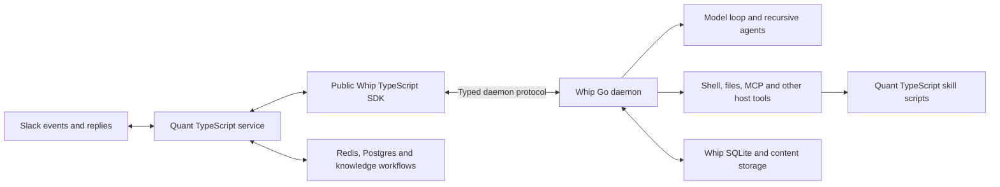

# Quant migration to Whip

Branch: planning only; no implementation branch created.

Status: research-backed draft, revised after the user's scope clarification. The shared runtime and authoring boundary is proposed in [architecture.md](/Users/samheutmaker/Desktop/context-labs/src/rlm/whip/.ai-docs/plans/quant-whip-migration/architecture.md). Remaining decisions are identified below. No application code, dependencies, runtime configuration, or deployments changed by this research.

## Goal

Make Quant a TypeScript application using Whip's public TypeScript SDK. The Whip Go binary owns the agent loop, provider execution, recursive agents, tool dispatch, runtime history, and execution recovery. Quant owns its Slack experience, business integrations, memory workflows, and application records.

This is feasible, but the current SDK is an attachment and control API, not yet a complete API for authoring a specialized service agent. Extend it with first-class TypeScript definitions, custom tools, blocking hooks, and subagents. Preserve the useful capabilities of Claude Agent SDK and Pi through vendor-neutral contracts. Do not implement a second agent loop in TypeScript or import Whip's Go internals into Quant.

Confirmed scope:

- Preserve nearly all Quant functionality while untangling its accumulated implementation complexity. Remove demonstrably dead or obsolete code, not useful features merely because the migration is easier without them.
- Use Quant as a demanding test of Whip's general agent-authoring API, not only as an adapter exercise.
- Support both the Whip coding agent and custom TypeScript-defined agents on one Go execution runtime.
- Whip owns the agent loop. Quant keeps one-off inference, external memory, and embeddings in TypeScript; moving these behind Whip is not required.
- Broad tools/hooks/subagents support is a core deliverable. Individual Quant heuristics can still be improved rather than copied literally.

Non-goals: a second loop, a JavaScript VM embedded in Go, a general workflow engine, a new external-memory platform, a wholesale Quant rewrite, or a requirement to move Whip's native coding agent into a Node/Bun process.

The recommended starting architecture is a persistent Whip session per Slack thread, with a separately supervised daemon colocated with Quant. Given Quant's documented Kubernetes deployment, a daemon sidecar using the same execution image is a practical first topology. These are recommendations, not settled requirements.

## Evidence and scope

Research examined the local source, manifests, tests, maintained architecture documentation, and official Claude SDK documentation. It did not connect to production, read service secret values, run agents, execute integration tests, or validate the deployed image. Source establishes the local implementation; operational documentation establishes intended deployment, not independently verified production state.

Local source snapshots:

| Repository | Checkout | Reference inspected |
| --- | --- | --- |
| Quant | `/Users/samheutmaker/Desktop/context-labs/src/rlm/quant`, branch `main` | `4879f1a46727015022fc7e59e6088b8222e85837` |
| Whip | `/Users/samheutmaker/Desktop/context-labs/src/rlm/whip`, branch `codex/desktop-release` | `d570a1610728ba148259539473bb768c3debd061` |

Research date: September 9, 2026. Whip frontend edits appeared concurrently during research and were left untouched. Rebase and recheck the relevant contracts before implementation.

Quant declares the Claude Agent SDK as `latest`, but its lockfile resolves **0.2.113**. It also includes Pi **0.84.1**, pi-subagents **0.50.0**, and a Bun compatibility patch. Whip's current wire contract is **5.1**; the package version is not the wire version. The SDK package declares Node **24** support and is private. Quant runs under Bun. [Quant dependencies][q-package], [Quant lockfile][q-lock], [Whip SDK][w-sdk], [protocol boundaries][w-frontend-protocol]

## What Quant currently does

### Application and execution boundaries

Quant is a Slack operations assistant, with channel mentions, DMs, incident-channel triggers, scheduled turns, a local terminal UI, a dashboard, and several memory systems.

The main path is:

1. `bot.ts` accepts Slack events, applies admission rules, serializes work per thread, and creates a reply placeholder.
2. `turn-launcher.ts` records an in-flight turn and establishes cancellation, correlation, and application lifecycle state.
3. `turn-executor.ts` retrieves Slack context and memory, resolves files and provenance, builds the prompt, invokes the harness, renders updates, and records results.
4. `harness.ts` selects Claude or Pi through `QUANT_HARNESS`.
5. Both harnesses ultimately drive a shared rendering pipeline currently expressed in Claude message shapes.

The seam exists, but is not neutral: `RunSessionOpts extends RunClaudeOpts`; Pi imports environment and event-mapping helpers from `claude-session.ts`. This dependency should be removed during the migration instead of making Whip emit synthetic Claude messages. [Harness][q-harness], [Pi adapter][q-pi], [turn executor][q-executor]

The relevant implementation is substantial: `claude-session.ts` is 1,027 lines, `pi-session.ts` 650, `turn-executor.ts` 1,467, `bot.ts` 647, and `slack-renderer.ts` 853 at the inspected revision. These counts identify concentration of responsibilities, not an estimate of how much needs replacement.

### Sessions and interruption

Ordinary completed Slack turns **start a fresh harness session**. Quant rebuilds context from Slack and its Redis thread context. Harness resume is used for crash recovery and an interrupted predecessor. The opaque `sessionId` means a Claude UUID or, for Pi, a session file path. [Resume selection][q-resume], [turn records][q-turn-store]

A new mention while a turn is active aborts the prior controller, waits for its teardown, marks its Slack message superseded, and runs a continuation that preserves the unfinished request unless the new message replaces it. This combines a product intent—follow-up modifies ongoing work—with a Claude process-control mechanism. Whip should preserve the intent without confusing client disconnection with cancellation. [Slack interruption][q-interrupt]

### Prompts, skills, and specialists

The runtime cwd is the repository root. The root `AGENTS.md` describes developing Quant; the runtime manual is the separate `quant/AGENTS.md`, explicitly inserted by Quant. At inspection it is about **45 KB**. There are **34** vendored skill directories under `quant/.agents/skills`. Root `.agents/skills` is absent, while `.claude/skills` is a generated union of links. [Runtime manual loader][q-manual], [repository instructions][q-agents]

The prompt contains Claude-specific instructions about `Skill`, `Bash`, `Agent`, `TaskCreate`, `TaskUpdate`, and parallel tool calls. Rewrite these for the chosen Whip tool interface: currently Starlark host modules, with named tool exposure proposed in the architecture design. Changing only the transport will leave the model following instructions for unavailable tools. [Prompt construction][q-prompt]

Named specialists are `explore`, `observability`, and `github-ops`, with descriptions, prompts, models, tool sets, and sometimes skill lists or turn limits. Their current tool sets are not equivalent: `github-ops` has no Bash. Preserve or deliberately revise those restrictions; do not silently give every child full shell access. Documentation reports known subagent limitations, but those reports were not reproduced against production. [Specialists][q-subagents], [harness operational notes][q-harness-doc]

### Environment, integrations, and observability

Quant injects per-turn `QUANT_SLACK_*`, `QUANT_THREAD_DIR`, `QUANT_TURN_ID`, promotion provenance, and trace context. Several TypeScript skill scripts consume these values to choose the user, thread, and output destination. The Slack action token is intentionally ephemeral and absent on crash recovery. [Environment overlay][q-env], [skill examples][q-skills]

The Claude path routes through Catalyst using per-turn headers and host credentials. Pi uses an OpenAI-compatible gateway path to LiteLLM, with similar task and Slack metadata. The requested migration should preserve correlation across root, child, helper, retry, and compaction calls. [Gateway configuration][q-proxy]

Most integrations are scripts and CLIs, not in-process SDK tools: Bun, `infisical`, `curl`, `gh`, SQL clients, chart/document generation, and other installed utilities. Operational notes report an unreachable MCP entry, so MCP should not be assumed to be the production integration backbone. No live MCP availability check was performed. [Integration notes][q-architecture], [execution image][q-docker]

### Memory, plans, and scheduled work

Quant has distinct application stores: Redis episode streams and user/thread state, Postgres/pgvector retrieval, graph memory, and a version-controlled knowledge tree. These are not interchangeable with an agent transcript and should remain Quant responsibilities. Current embeddings use Voyage, despite older documentation describing Gemini. [Embeddings][q-embeddings], [graph extraction][q-graph]

There are also two forms of plan state: Claude task calls rendered as live cards, and a separate persistent Redis thread plan managed by a TypeScript skill. Consolidating these two views is preferable to adding a third. [Rendering state][q-render], [thread plan][q-plan]

BullMQ owns delayed turns, recurring turns, and watches, with Slack routing in job payloads. Keep this scheduler initially; Whip's native schedules do not automatically replace Quant's Slack delivery contract. [Jobs][q-jobs]

Direct generative calls exist outside the main harness: model-choice disambiguation, memory lesson extraction, graph extraction, and graph maintenance. Graph extraction uses a forced structured tool response. **Thread compaction is currently deterministic omission, not an LLM summary**: after a size threshold it retains a tail and inserts a count of omitted messages. This corrects an assumption in an early clarification question. [Classifier][q-classifier], [memory consolidation][q-consolidate], [graph extraction][q-graph], [thread compaction][q-compaction]

The Stop hook starts a detached consolidation subprocess. The consolidator reads the latest entry from the global episode stream rather than a supplied exact episode ID. Episode writing occurs after the harness returns. These facts create a correlation/ordering risk; the migration should schedule consolidation after committing the specific episode and pass its identity explicitly. This is a source-level finding, not a reproduced production incident. [Stop hook][q-stop], [episode selection][q-consolidate-select], [episode write][q-episode-write]

## Target ownership

| Responsibility | Owner | Boundary |
| --- | --- | --- |
| Slack admission, deduplication, mentions, DMs, incident triggers | Quant TypeScript | SDK commands after application admission |
| Bot persona, domain instructions, specialist definitions | Authored in Quant TypeScript/data | Versioned definitions applied by Whip |
| Custom tool bodies and control-hook logic | Quant TypeScript | SDK callback host; Go owns invocation, cancellation, validation, and committed outcome |
| Model/tool iteration, retries, compaction, children, authority, budgets | Whip Go | No provider/tool execution loop in Quant |
| Runtime history, command status, mailbox, execution events | Whip Go | Read through SDK; never read Whip SQLite directly |
| Slack rendering and delivery bookkeeping | Quant TypeScript | Projection of SDK state plus durable delivery records |
| Episode retrieval, graph semantics, embeddings, promotion workflows, one-off inference | Quant TypeScript | Separate application data and helper calls, outside the agent loop |
| Existing integration scripts | Quant TypeScript | Executed by Whip shell or exposed through MCP when useful |
| Slack schedules/watches in the first release | Quant TypeScript/BullMQ | Due job submits one identified Whip command |
| Daemon installation and supervision | Deployment environment | SDK attaches; Quant business code does not shell out to drive Whip |

An event reducer, Slack queue, completion consumer, or TypeScript tool handler is application code. Go may invoke a TypeScript handler and receive its result while retaining loop ownership. It becomes an unwanted second agent loop if TypeScript consumes provider responses to orchestrate model/tool iteration, constructs the resulting provider conversation itself, or performs the next agent model request. Ordinary one-off inference in a memory workflow is explicitly outside this restriction.

## Capability and gap matrix

“Existing” means present in source, not accepted for Quant without integration tests. “Extension” means a proposed addition, not an existing public method.

| Quant requirement | Whip today | Migration action |
| --- | --- | --- |
| Typed session create/submit/status | Existing SDK commands and generated types | Reuse directly |
| Keep accepted work alive when the client disconnects | Existing daemon ownership | Replace Quant replay with status reconciliation |
| Persistent conversations | Existing retained roots/history | Recommend one root per Slack thread |
| Main agent and recursive subagents | Existing one-tool RLM loop and retained children | Reuse; rewrite delegation instructions |
| Model/effort selection | Existing session operations and child overrides | Port Quant's routing policy in TypeScript |
| Per-turn shell environment | Internal `SetProcessEnvironment`; no matching submit contract | Add scoped, immutable execution context |
| Provider-specific headers and per-turn trace metadata | Current public provider type lacks header map; normal requests stamp standard auth/content headers | Add host-resolved static headers and bounded per-call metadata |
| Bot instruction composition | Normal prompt composition; `run.configure.system` replaces the complete root prompt | Add compositional, restart-safe configuration or use an explicit static deployment layout |
| Explicit skill directories | Internal `PromptOptions.SkillDirs`; no SDK field | Expose selected directories or arrange a verified root directory link |
| Named specialist definitions | Child spawn accepts prompt/name/model/effort/capabilities/budgets; no SDK profile registry | Add first-class definitions, explicit inheritance, and public child spawning through the existing runtime |
| Automatic tool consent | Existing permission mode | Use the actual automatic mode; persist required service policy |
| TypeScript custom tools | No public handler registration/invocation contract | Add callback hosting over the existing protocol; Go owns dispatch and lifecycle |
| Synchronous hooks and context customization | No general TypeScript callback contract in the inspected API | Core authoring deliverable: typed lifecycle decisions with cancellation, ordering, and unavailable-handler behavior |
| Live progress and tools | Existing stream and correlated host-call events | Build native Whip-to-Quant presentation mapping |
| Final user answer | Command outcome plus transcript/lifecycle data | Separate explicit command completion from later autonomous turns |
| Completion after client downtime | Replay/snapshots/history exist; bounded event retention; no public completed-turn enumeration | Durable Quant delivery consumer plus a completed-turn read contract for autonomous replies |
| Task cards | No plan host module in the current registry | Reuse the existing Quant plan skill/store for first parity, or add a generic runtime plan contract if needed |
| Images and text attachments | Existing scoped uploads | Replace Anthropic image types with neutral bytes/descriptors |
| User questions | Existing `user.ask` and SDK answer operations | Add Slack routing if retained; distinguish from tool consent |
| Scheduled watches | Native schedules plus current BullMQ application scheduler | Retain one owner per schedule; do not run both for the same job |
| Direct helper inference | Not required for this migration | Keep current TypeScript calls and improve their boundaries where useful |
| Structured graph extraction | Quant owns the existing helper path | Retain current structured validation; no Whip helper API required |
| Bun support | Portable SDK core; declared/tested Node 24 baseline | Prove Bun support against packed packages and a real isolated daemon |
| Cross-repository distribution | SDK/protocol are private workspace packages | Produce pinned package artifacts plus a matching binary |

Primary Whip evidence: [SDK][w-sdk], [public runtime contract][w-contract], [runtime operation registry][w-registry], [recursive runtime][w-recursive], [prompt composition][w-prompt], [process environment][w-process], [provider type][w-provider], [events][w-events], [permissions][w-permissions].

## Required design work

### 1. First-class agent definitions and a TypeScript callback host

Keep authored agent definitions in TypeScript. Split serializable definitions from executable tool/hook callbacks. Go validates and retains the definition; a TypeScript callback host runs the functions when Go requests them. The same definition contract describes the first-party coding agent. Start with instructions, selected built-in/custom tools, skills, model/effort defaults, consent policy, hooks, and specialist definitions with explicit inheritance and narrowing. See [architecture.md](/Users/samheutmaker/Desktop/context-labs/src/rlm/whip/.ai-docs/plans/quant-whip-migration/architecture.md) for ownership, lifecycle contracts, and acceptance gates.

Build on `session.create`, existing configuration operations, and the current SDK transport/recovery foundation. Add a focused authoring entry point rather than a parallel SDK. Configuration can be supplied atomically at creation or through a durable configure operation with an explicit “ready to accept input” boundary. Required callbacks must be registered before dependent work starts. A crash between create and configure must not launch a partially configured agent.

`run.configure` currently changes in-memory runner fields; it is not a durable agent profile. Its `system` text replaces Whip's runtime prompt verbatim and only applies to the root. Passing Quant's persona there alone would remove the Starlark operating contract and would not configure children. Separate the selected tool interface's instructions from the coding persona and application instructions. Custom agents must not automatically inherit coding advice, workspace discovery, or personal instructions; the coding preset keeps these defaults. [Configure implementation][w-configure], [prompt refresh][w-prompt-refresh]

Define whether file-based instructions refresh on each turn or remain pinned to a revision. Whip currently refreshes normal root/child prompts at turn boundaries. A practical choice is a pinned declarative definition plus normal scoped repository instructions, with provenance recorded for each applied prompt.

Static layout can simplify the initial connectivity probe, but does not replace the required authoring API. Do not assume the existing per-skill `.claude/skills` links work unchanged: Whip discovers different roots, and its prompt scanner skips directory entries that are symlinks. Verify explicit directories and any whole-directory link for both root and child discovery. [Skill directories][w-skill-dirs], [catalog scanner][w-skill-scan]

### 2. Execution context scoped to a turn

A long-lived daemon cannot use global environment mutation for concurrent Slack turns. Nor can a mutable root-wide map safely represent a user token while older descendants are still running.

Proposed contract, exact names to settle during implementation:

| Data | Lifetime and treatment |
| --- | --- |
| Application/thread/work identifiers and trace correlation | Non-secret, bounded, durable with command admission |
| Slack channel, thread, user, provenance, scratch path | Frozen execution context for the admitted turn |
| Long-lived provider and integration secrets | Resolved on the execution host by reference |
| Slack action token | Ephemeral binding, scoped to root/command with expiry; excluded from journals, transcripts, recovery records, and logs |
| Descendant context | Copy the originating context at admission; do not pick up a later root user's values |
| Autonomous/mailbox continuation context | Explicit origin/work correlation; no invented fresh Slack action token |

Reuse the internal process-environment mechanism, but specify replacement/unset semantics. The existing method merges maps, so using it naïvely can retain an earlier token. Apply the context consistently to foreground and background shell work and other subprocess paths that Quant uses. Keep process markers when models change. [Process configuration][w-process]

An ephemeral binding operation followed by an identified submit is one possible design. Missing/expired bindings should produce explicit behavior, and identical-command recovery must not silently replace the original payload or resurrect an expired token. Static secrets should not be copied into the command just to simplify this API.

Environment variables provide routing and provenance to existing scripts. They are not an authorization boundary against a model that has arbitrary shell access. Any stronger user/channel enforcement would need to live in a trusted tool service.

### 3. Provider routing and observability

Use Whip's provider implementations for all migrated calls. Quant's existing Pi gateway path provides a plausible OpenAI-compatible route for Anthropic and other models, but gateway behavior must be tested with Whip's actual requests. Do not assume the Claude `/v1/messages` proxy environment can be reused as an OpenAI chat-completions configuration.

Add host-owned header configuration with secret references where required by Catalyst/LiteLLM, and a bounded request-context mechanism for task IDs, Slack metadata, and trace propagation. Apply it across root calls, children, retries, compaction, and other calls made by Whip on behalf of the session, including model switches. Quant's retained helper calls keep their own instrumentation with shared correlation IDs. Never mutate a shared `http.Client` or header map per Slack turn. [Whip provider configuration][w-provider], [HTTP requests][w-http], [Quant headers][q-proxy]

Separate two acceptance levels: gateway request correlation, and full parent/child OpenTelemetry span parity. The current Go dependency list does not contain an OTel implementation. Complete trace export may require a justified dependency; it should not be presented as a free effect of adding headers. Quant can retain TypeScript lifecycle spans, but source instrumentation for the Claude SDK will no longer observe Whip's Go loop.

Report unknown costs and incomplete token counts truthfully. Use Whip's microdollar string counters without converting them through JavaScript `Number`. Do not sum a subtree total again with its descendants. [SDK accounting][w-sdk]

### 4. Durable thread, command, and delivery records

Recommend one Whip root per `(Slack workspace, channel, thread timestamp)`. Include workspace identity even if today's deployment is single-workspace. DMs and incident-created investigation threads use the same mapping with their surface/trigger metadata.

Replace the overloaded `sessionId` field with a tagged runtime reference containing the backend, persistent runtime ID, and root ID. Store stable SDK client and command identities with the Quant turn before sending. Session creation needs its own durable identity so lost create acknowledgements do not create duplicate roots.

The application record should distinguish:

1. Input admitted to Quant.
2. Whip session creation/configuration acknowledged or uncertain.
3. Execution command acknowledged or uncertain.
4. Runtime queued/running/waiting/terminal outcome.
5. Slack result delivery pending/succeeded/uncertain.
6. Episode write and consolidation job status.

Use the SDK's `recoveryStorage` contract as intended: await durable identity storage before transmission. The adapter can associate it with existing application records using preallocated command IDs. Keep original non-secret input separately only when needed for an explicit retry after authoritative non-admission. [SDK command implementation][w-command]

On bot restart, reconcile the existing command; do not submit another prompt just because the bot disappeared. On daemon restart, use the authoritative interrupted/terminal status and retained history. Whip cannot promise to resume an in-flight external effect exactly where it stopped. Retrying an interrupted effect requires checking what actually happened.

### 5. Follow-ups, cancellation, and autonomous replies

Preserve the user's intent to continue unfinished work unless a later request replaces it. Keep explicit Stop distinct from a follow-up. There are two viable interaction designs:

- Preserve the current superseded-message experience using explicit command-targeted cancellation, wait for the actual outcome, then submit a continuation on the same root.
- Use Whip steering at a loop boundary, with a defined policy for which Slack message owns the eventual answer.

Do not select steering solely because it is available: it changes cancellation timing and reply ownership. `AbortSignal` on a wait only stops observing; `client.close()` only detaches. Root command cancellation also does not mean every retained child and background process has stopped. Define work/subtree ownership and stopping policy explicitly for the user's Stop action. [SDK lifetimes][w-sdk], [cancellation tests][w-cancel-test], [Quant interruption][q-interrupt]

A root command completing does not imply its children, mailbox, or schedules have completed. Whip can subsequently run a root turn in response to child mail. A Quant adapter that waits for `command.result()` and then unsubscribes would lose those replies.

Build a durable output consumer that observes root lifecycle/history independently of an individual submit promise. Map runtime turn identity to a Slack target, persist the intended delivery before sending, and deduplicate updates. Handle output produced while Quant was offline. Whip retains 10,000 events per root and pages replay at up to 1,000 events, so a replay cursor alone is insufficient for indefinite downtime. [Event storage][w-event-store], [agent loop events][w-agent-events]

The recovery gap is concrete: current history entries expose message sequence and content, not the producing turn ID; the `turns` table records identity/status/timestamps but no final output or transcript bounds, and the public registry has no completed-turn listing. `last_turn` only retains the latest outcome. Replaying raw assistant messages after an expired cursor cannot reliably distinguish all intermediate text from final autonomous replies. Add a bounded completed-turn query backed by the existing turn records, retaining final outcome or content reference, transcript bounds, trigger/origin, and a stable completion cursor committed with the turn. Use this to backfill the Quant delivery records; keep Slack delivery acknowledgements in Quant. This is required if autonomous replies must survive downtime longer than event retention. [Turn storage][w-turn-store], [history entries][w-history-entries], [public operations][w-registry]

For explicit requests, update the recorded placeholder. For later autonomous results, define when to update the same reply or post a new one. Do not claim exactly-once external delivery: a new Slack post with an uncertain acknowledgement needs reconciliation, whereas repeated updates to a known message are easier to make convergent.

The SDK has a 16-root subscription limit per connection. Bound active views and use a connection pool if the workload requires more simultaneous observed roots. Do not raise global limits or open every historical thread by default. If retained autonomous work exceeds practical observation limits, a host-level durable notification index becomes a separate, justified extension.

### 6. Native presentation and application hooks

Extract a small harness-independent application state/event contract. Keep existing Slack formatting, pagination, rate limiting, redaction, fallback behavior, and incident analysis presentation where they remain useful.

Use `stream.cell.host.started` and completion data for meaningful operations such as shell or file work; otherwise every operation will appear to be just `rlm_exec`. Correlate root, agent, turn, cell, and invocation IDs. Text/reasoning deltas append; tool arguments/results may be cumulative replacements. Reuse SDK synchronization rather than copying its reconnect reducer into Quant. [Event contracts][w-events], [SDK presentation rules][w-sdk]

Treat public assistant progress and provider reasoning as separate data. Do not blindly map Whip's raw reasoning stream into a user-visible “thought” field. Preserve the current public incident-update contract and final-answer de-duplication through explicit application presentation rules.

Replace the four Claude hook uses individually:

| Hook use | Recommended replacement |
| --- | --- |
| Stop → memory consolidation | Quant terminal-outcome consumer → exact episode write → idempotent job |
| PreToolUse duplicate-agent denial | Preserve the behavior if useful through a before-spawn/tool hook; domain deduplication policy stays in Quant |
| PostToolUseFailure releases dedupe slot | Pair with typed spawn/tool failure and cancellation outcomes; use stable invocation identity |
| PostToolUse nudges Bash batching | Use instructions or after-tool context injection, matched to the chosen tool interface; measure usefulness |

A post-execution SDK event cannot replace a pre-execution deny hook. A real bidirectional callback contract is now required: invocation IDs, bounded waits, cancellation, reconnect handling, explicit unavailable-handler behavior, ordered decisions, and validation after argument changes. Place interception at the underlying operation boundary so Starlark calls and named tool calls cannot bypass it. Keep post-commit notification consumers distinct from callbacks that control execution.

For live task cards, the smaller first solution is to make the existing Quant plan skill/store the authoritative source and render its updates during a turn. Remove instructions to use unavailable Claude task tools. A generic Whip plan operation is reasonable only if richer shared UI integration or direct runtime ownership is a requirement. Existing `PlanEvent` type declarations alone do not establish an active recursive-runtime plan feature.

### 7. Memory and helper model calls

Keep retrieval, episode schemas, embeddings, graph semantics, knowledge promotion, and forgetting in TypeScript. Whip history replaces the runtime conversation buffer, not organizational memory.

For persistent roots, ingest Slack history once and then only new external messages. Track Slack message identity and the last ingested position; avoid feeding Quant's mirrored outputs back into its own session. Account for non-mentioned messages, bot-authored context, edits, thread recovery, and the current behavior for deleted messages. Old context should remain retrievable rather than be silently discarded by two independent compactors.

Keep the existing one-off classification, lesson extraction, graph extraction/maintenance, and Voyage embedding calls in TypeScript. They are explicitly outside Whip's required ownership. Preserve structured-output validation in the graph workflow and maintain correlation with the triggering Quant work. Do not add a Whip stateless-generation or embedding API for this migration. [Graph tool schema usage][q-graph]

### 8. Packaging and deployment

Quant's documented deployment is one bot replica in AKS, with dind and dashboard containers, shared Redis/Postgres, and separate home/scratch PVCs. The deployment manifests live in the charts repository; they were not inspected. [Deployment documentation][q-deploy]

Recommended first production topology:

- A separately supervised Whip daemon in the same pod or execution host as Quant.
- The daemon runs the same tool-rich image, or an equivalent image with the same scripts, binaries, cwd, user, filesystem mounts, and network reachability. A tiny Go-only image would break the shell-based integrations.
- Whip's home, SQLite WAL, immutable content, and required scratch files use persistent storage with one daemon writer. Do not place one live SQLite database behind multiple daemon replicas.
- Quant connects using the public SDK over a private Unix socket or loopback WebSocket. Use the existing declared transport and test it under the selected Bun version. Do not expose the unauthenticated daemon publicly.
- Pin a binary build and SDK/protocol artifacts together; negotiate wire capabilities. Select `whip` versus the `whipcode` distribution explicitly because the compiled identity changes homes and environment-variable names.
- Preserve runtime identity and content across upgrades. Separate bot restart tests from whole-pod/daemon restart tests.

Bun compatibility should be proved before rewriting Quant around Node 24. The portable SDK core is promising, but a standards-compatible WebSocket alone does not prove content streaming, abort, crypto, packaging, and recovery behavior. If support is incomplete, prefer a focused SDK compatibility fix; decide on a Node migration only from observed incompatibilities.

Whip requires Go 1.27 at the inspected revision; Quant's execution Dockerfile installs Go 1.23.4 for tools. Use a compatible build stage or verified prebuilt release rather than trying to build Whip with that older toolchain. Production should not need to install Go just to execute the binary. [Whip module][w-go], [Quant image][q-docker]

## Delivery plan and gates

### Phase 0 — settle contracts and collect parity fixtures

- [ ] Answer the product decisions below and identify which harness/model/image actually runs in production.
- [ ] Establish the supported deployment, Bun/Node runtime, binary distribution, and package distribution channel.
- [ ] Select representative sanitized fixtures: normal mention, DM, incident, image, skill invocation, specialist task, follow-up, schedule, memory, failure, and recovery.
- [ ] Record expected user-visible behavior and current latency/cost/completion baselines using approved test data.
- [ ] Define throughput, simultaneous active roots/children, retention, and maximum acceptable reply delay.

Gate: a signed-off behavior matrix and measurable release criteria. No production traffic is required to begin the hermetic fixtures.

### Phase 1 — prove the unextended SDK boundary

- [ ] Install packed SDK/protocol artifacts into a minimal Quant-side test consumer.
- [ ] Use an isolated fake-provider daemon and the real public SDK from Bun.
- [ ] Create a session, submit text, observe meaningful tool events, upload an image, retrieve large output, and cancel a specific command.
- [ ] Restart only the TypeScript client and recover the command without another execution.
- [ ] Verify the deployed filesystem/toolchain layout can run a harmless Quant TypeScript skill with fixture credentials/data.

Gate: demonstrate the requested TypeScript → SDK → Go execution boundary end to end. This is the first implementation milestone, not a production rollout.

### Phase 2 — implement the necessary Whip capabilities

- [ ] Separate coding defaults from the shared runtime through a common definition contract; preserve coding behavior and native binary operation.
- [ ] Add versioned definitions, selected tool sets, compositional prompts, and restart-safe execution policy.
- [ ] Add TypeScript tool and hook hosting over the existing protocol, including disconnect, cancellation, and uncertain-effect semantics.
- [ ] Add durable non-secret turn context and ephemeral secret bindings, with correct descendant inheritance.
- [ ] Add provider header references and per-call correlation; agree on OTel parity scope.
- [ ] Add completed-turn outcome enumeration and durable output association if autonomous replies must survive replay expiration.
- [ ] Add specialist definitions and SDK spawning that use the existing retained child runtime and authority checks.
- [ ] Prove a noncoding agent with a TypeScript tool, a blocking hook, and a child alongside the unchanged coding preset before broad Quant migration.
- [ ] Resolve the RLM-versus-named-tools decision; if both are selected, keep one loop and enforce the same operation policies in both.
- [ ] Extend Go registry, generated protocol, public SDK, and reference documentation together.

Gate: all new behavior works through public TypeScript APIs; no Quant-specific logic or identifiers are hardcoded in Go. Configuration is restored before autonomous execution after restart.

### Phase 3 — introduce a Whip-native Quant adapter

- [ ] Extract neutral session options, attachments, outcomes, and rendering state from Claude-specific modules.
- [ ] Add a Whip backend behind the current harness seam for staged validation.
- [ ] Replace process-driven cancellation/replay with identified command and delivery records.
- [ ] Implement native event presentation, final reply handling, late child results, and questions if required.
- [ ] Rewrite prompt/tool instructions and configure skill discovery for both root and descendants.
- [ ] Update the local CLI and dashboard's harness-specific names and telemetry assumptions.

Gate: representative Slack workflows pass against Whip without synthesizing Claude SDK messages or retaining a TypeScript provider loop.

### Phase 4 — session and memory cutover

- [ ] Introduce a versioned Slack-thread → runtime/root mapping if persistent roots are chosen.
- [ ] Import bounded Slack context at first use; incrementally ingest thereafter.
- [ ] Keep existing episodes, graph/vector data, user scratch, plans, and knowledge intact.
- [ ] Replace Stop-hook timing with exact-episode, idempotent consolidation jobs.
- [ ] Retain TypeScript helper generation and embeddings with their existing data contracts.
- [ ] Keep BullMQ schedule ownership initially and identify each job occurrence, not merely the recurring job definition, in command deduplication.

Gate: no duplicate prompt execution, Slack delivery, episode enrichment, or scheduled occurrence after restart/retry. Historical Claude/Pi transcripts are not masqueraded as Whip runtime state.

### Phase 5 — canary, failure drills, and release

- [ ] Deploy pinned artifacts to a test environment with persistent daemon storage.
- [ ] Exercise client crash, daemon crash, full pod replacement, acknowledgement loss, slow Slack, expired event cursor, and ephemeral token expiry.
- [ ] Canary selected threads/users or one test workspace. Assign one execution backend per thread; do not execute a live mutating request in two harnesses for comparison.
- [ ] Exercise explicit cancellation with active descendants and background shell jobs.
- [ ] Prove the rollback path and the fate of still-running Whip work before switching admission.
- [ ] Increase traffic only after quality, reliability, latency, cost, and memory results meet the agreed thresholds.

Gate: Quant behaves correctly through real service failures, not just a successful happy-path response.

### Phase 6 — remove the old harnesses

- [ ] Drain or explicitly stop remaining legacy turns; keep backend-tagged recovery records until resolved.
- [ ] Remove Claude/Pi adapters, instrumentation, compatibility patches, and harness-specific configuration no longer used.
- [ ] Remove direct Anthropic dependencies only after all remaining helpers and skills have been audited.
- [ ] Audit multi-model orchestration skills that launch external agent CLIs; they may bypass the intended Whip-only execution boundary.
- [ ] Remove the legacy thread compactor only after no remaining path depends on its Redis representation.
- [ ] Keep old artifacts/readable records for an agreed retention period; do not make destructive database or transcript conversion part of the cutover.

Gate: Quant's application and agent execution paths use only its TypeScript contracts and the public Whip SDK. Remaining direct model/CLI use is either removed or explicitly documented as out of scope.

## Expected code surfaces

These are planning locations, not changes already made. New filenames are illustrative.

| Repository | Existing surfaces | Expected change |
| --- | --- | --- |
| Quant | `quant/src/harness.ts`, `claude-session.ts`, `pi-session.ts` | Extract neutral contract; add Whip adapter; eventually remove legacy adapters |
| Quant | `turn-launcher.ts`, `turn-executor.ts`, `turn-store.ts`, `active-turns.ts`, `bot.ts` | Durable identity, thread mapping, cancellation, output delivery and recovery |
| Quant | `slack-renderer.ts`, `live-analysis.ts`, `slack-files.ts`, `cli.tsx`, dashboard turn detail | Native Whip events, neutral attachments, truthful runtime state |
| Quant | `slack-history.ts`, `runtime-manual.ts`, `thread-context.ts`, `thread-compaction.ts` | Prompt rewrite and incremental history ingestion |
| Quant | `subagents.ts`, `pi-route.ts`, `pi-models.ts`, `pi-sticky.ts`, `model-classifier.ts` | Neutral specialist and model-routing policy |
| Quant | `stop-hook.ts`, `tools/memory/consolidate.ts` | Exact-episode jobs; retain graph helpers and other one-off inference in TypeScript |
| Quant | `inference-proxy.ts`, `telemetry.ts`, `instrumented-sdk.ts`, `config.ts` | Runtime routing, tracing boundaries, configuration cleanup |
| Quant | `quant/package.json`, `bun.lock`, `Dockerfile`, `.github/workflows/quant-image.yaml` | Pinned SDK/protocol/binary artifacts and runtime packaging |
| Shared skills | Source repository `context-labs/inf-internal-skills` | Update vendor-owned scripts/instructions upstream; refresh lock/symlinks in Quant |
| Whip | `internal/protocol/{runtime_contract,runtime_registry,types,events}.go` | Authoritative wire contracts and capabilities |
| Whip | `internal/daemon/{client_control,prompt,agent_session,recursive_runtime}.go` | Configuration, turn context, child inheritance, optional policy |
| Whip | `internal/session` | Persist newly required runtime configuration/context and completed-turn output association; bounded reads and migrations |
| Whip | `internal/tools/tools.go`, `internal/tools/bashrun`, subprocess call sites | Context-scoped environment application |
| Whip | `internal/config`, `internal/llm`, `internal/daemon/provider_*`, `budget.go` | Header references and request context for runtime-owned calls |
| Whip | `packages/sdk/src/{client,services,session,command}.ts`, `packages/protocol` | Public generated TypeScript API and runtime compatibility |
| Deployment | charts `apps/development/quant` and `apps/azure-development/quant` | Daemon supervision, mounts, probes, rollout behavior; paths from Quant docs, not yet inspected |

Whip documentation changes belong in `docs/features.md`, `docs/roadmap.md`, `packages/sdk/README.md`, the protocol reference, and `docs/frontend.md` when shared SDK ownership or contracts change. Quant documentation belongs in the current `knowledge/quant-dev` guides, its runtime manual, and deployment docs. Do not add lessons to AGENTS.md; respect the upstream ownership of vendored skills. [Quant repository rules][q-agents]

## Acceptance tests

Use existing real-SDK/fake-provider daemon acceptance infrastructure, rather than mocks of the full execution boundary. Existing tests are useful starting points; they have not been run as part of this research. [Whip SDK tests][w-sdk-tests], [prompt tests][w-prompt-tests], [Quant tests][q-tests]

| Scenario | Required assertion |
| --- | --- |
| Basic message and tool call | Go sends agent model requests, chooses the next loop step, dispatches the tool, and commits results; TypeScript only runs its requested handler |
| Coding/custom definition parity | Coding prompt/tool behavior remains intact; custom agents receive only selected instructions/tools and run on the same runtime |
| Callback failures | Lost host, duplicate replies, cancellation, deadline, and wrong definition revision cannot bypass a required hook or repeat an uncertain effect automatically |
| Bun/package installation | Packed packages work outside Whip's workspace with the selected runtime, transport, crypto, upload, and abort behavior |
| Two threads running concurrently | Shell environment, user/thread routing, tokens, metadata, and scratch paths never cross |
| Retained child during another root turn | Child retains its originating context; it does not inherit the next user's action token |
| Lost submit/create acknowledgement | Stable IDs recover the original admission; no duplicate root or turn |
| Bot restart while the daemon runs | Work continues; result reaches the intended Slack message and produces one episode |
| Daemon restart during a tool effect | Outcome is interrupted/uncertain as appropriate; no automatic replay of external effects |
| Profile/policy restart | Instructions, skills, consent mode, route, and child restrictions restore before work resumes |
| Mid-turn follow-up and Stop | Defined old/new reply ownership; explicit handling of children and background jobs |
| Child result after root command completes | Result is observed and delivered without requiring a new human mention |
| Long downtime / expired cursor | Completed-turn reconciliation recovers final output, including multiple autonomous replies, without replaying execution or publishing intermediate text |
| Slow Slack or unknown acknowledgement | Runtime stays independent of rendering; delivery records preserve pending/uncertain state |
| Image/file input | Missing/oversized/unsupported content produces clear behavior; an image is not silently treated as text |
| Task progress and incident updates | Native operation labels, plan changes, incident revisions, and final answer are correct after reconnect |
| Questions and permission mode | No unattended hidden wait; automatic consent is not implemented as `headless: true` |
| Concurrent completion/memory jobs | Each exact episode is enriched once after its record exists |
| Retained helper workflows | Existing TypeScript classification, graph extraction, and embedding behavior remains intact |
| Model route change | Explicit user pick, sticky route, effort, actual-model label, tracing, and accounting agree |
| Recurring schedule recovery | A due occurrence submits once; one scheduler owns it |
| Cutover and rollback | Backend-tagged old records remain readable; one backend owns each admitted work item |

For implementation, run Whip's protocol generation/drift checks, SDK/package acceptance, `task check`, and `go test -race` for context, lifecycle, subscription, or callback changes. Run Quant's existing Bun tests/typecheck and targeted new integration fixtures. Keep live service effects outside hermetic tests; later canary criteria should use a designated test workspace and explicit fixtures.

## Rollback and migration boundaries

Keep Claude/Pi as temporary backend options while the Whip adapter is being proven. Select the backend on a thread or explicit routing policy, record it durably, and keep the selected backend attached to outstanding work. A global environment fallback to Claude must not reinterpret Whip root IDs as Claude session UUIDs.

When rolling back, stop new Whip admissions, reconcile or explicitly stop accepted Whip work, then move eligible threads. Reconstruct a new legacy conversation from Slack plus application memory where needed. Whip and Claude/Pi internal transcripts are different representations; seamless live conversion is not a release requirement unless requested.

Preserve Redis/Postgres schemas additively through the rollback window. Preserve the Whip home and content directory even when no new work is admitted. Never run two daemon writers against one SQLite store or assume a previous binary understands a newer schema.

Do not treat the current manifest's `latest` SDK declaration as a rollback strategy. Pin the complete binary, protocol, SDK, Quant image, and skill revision tuple used for each release.

## Open product decisions

The motivation, broad parity target, first-class TypeScript authoring, and ownership of helper inference/memory/embeddings are settled in the Goal section. These remaining choices determine implementation details. Proposed defaults are not recorded as user decisions.

| Decision | Proposed default | Why it matters |
| --- | --- | --- |
| Deployment | Colocated, separately supervised daemon; Kubernetes sidecar if current topology remains | Defines process ownership, shared filesystem, and persistence |
| Session lifetime | One retained root per Slack thread | Changes history ingestion, memory footprint, and follow-up behavior |
| Model-facing tool interface | Coding preset retains RLM; propose optional named tools for custom definitions through the same runtime | Changes the existing all-requests-use-rlm_exec invariant and expands the validation matrix |
| Internal Starlark | Allowed as a Whip implementation detail; all Quant-authored definitions/handlers remain TypeScript | Distinguishes application authoring language from model-generated execution code |
| Callback-host lifetime | Independently supervised when uninterrupted tool availability is required; explicit wait/failure when unavailable | UI detachment must remain independent from a required executor disconnect |
| Specialists/hooks | Preserve useful policies through the new authoring contract; reassess duplicate-dispatch heuristic | Avoids confusing behavior parity with copying an old workaround |
| Follow-up behavior | Preserve unfinished-work semantics; settle cancel versus steer explicitly | Affects interruption timing, child scope, and Slack reply ownership |
| Task cards | Reuse Quant's current plan store/skill for the first implementation | Avoids adding a runtime plan feature solely for UI parity |
| Schedules | Keep BullMQ first | Preserves Slack routing and avoids duplicate schedule owners |
| Rollout | New/test threads first, one backend per thread | Minimizes cross-format recovery complexity |
| Throughput and retention | Measure before setting service limits | The 16-root connection cap and durable output recovery need a real target |

Additional questions for the next design pass:

1. Which production harness/model is authoritative today, and which behaviors cause the most pain?
2. May custom definitions select conventional named model tools, and is internally generated Starlark acceptable for Quant? The architecture recommends supporting both tool interfaces on one runtime.
3. Which existing skills launch other agent CLIs? Agent loops in those paths should move to Whip if they are part of Quant's execution; one-off inference and embeddings remain in TypeScript by agreement.
4. Must a bot deployment leave work running, must a whole daemon/pod restart resume unfinished work automatically, or is an explicit interrupted state acceptable?
5. What are the expected number of simultaneously active Slack threads/children, normal and longest task durations, and retention needs?
6. Which specific features are demonstrably unused or obsolete? Preserve specialists, task cards, incident updates, watches, CLI, dashboard, and useful routing behavior unless evidence or an explicit decision justifies retirement.
7. Where should autonomous child results appear after the initial reply, and when should they notify a person?

## Sources

Local implementation is the primary evidence. Operational notes are useful context but sometimes lag source: the embedding provider, thread compaction, skill layout, and runtime assumptions illustrate why the code must be checked directly.

Official external references, accessed September 9, 2026:

- [Claude Agent SDK TypeScript reference](https://code.claude.com/docs/en/agent-sdk/typescript): external baseline for query options, session identity, and structured result options. The full page fetch exceeded the fetcher's size limit; targeted indexed sections were available. Installed Quant usage and its lockfile are the decisive evidence here.
- [Claude Agent SDK hooks](https://code.claude.com/docs/en/agent-sdk/hooks): hooks can intercept and modify execution, unlike post-execution observation events.
- [Claude Agent SDK sessions](https://code.claude.com/docs/en/agent-sdk/sessions): sessions persist conversation history; filesystem state is a separate concern.
- [Claude Agent SDK system prompts](https://code.claude.com/docs/en/agent-sdk/modifying-system-prompts): distinguishes complete replacement from preset composition. Whip behavior was separately verified in its source.
- [Pi extensions](https://pi.dev/docs/latest/extensions) and [Pi SDK](https://pi.dev/docs/latest/sdk): current first-party references for tool callbacks, lifecycle interception, context/compaction customization, and the distinction between programmatic execution and UI extensions. These latest docs inform the broader capability target; they are not evidence of what Quant's pinned Pi version supports.

Local source links used throughout:

[q-package]: /Users/samheutmaker/Desktop/context-labs/src/rlm/quant/quant/package.json
[q-lock]: /Users/samheutmaker/Desktop/context-labs/src/rlm/quant/quant/bun.lock:90
[q-agents]: /Users/samheutmaker/Desktop/context-labs/src/rlm/quant/AGENTS.md
[q-harness]: /Users/samheutmaker/Desktop/context-labs/src/rlm/quant/quant/src/harness.ts:1
[q-pi]: /Users/samheutmaker/Desktop/context-labs/src/rlm/quant/quant/src/pi-session.ts:12
[q-executor]: /Users/samheutmaker/Desktop/context-labs/src/rlm/quant/quant/src/turn-executor.ts:232
[q-resume]: /Users/samheutmaker/Desktop/context-labs/src/rlm/quant/quant/src/turn-executor.ts:912
[q-turn-store]: /Users/samheutmaker/Desktop/context-labs/src/rlm/quant/quant/src/turn-store.ts:21
[q-interrupt]: /Users/samheutmaker/Desktop/context-labs/src/rlm/quant/quant/src/bot.ts:253
[q-manual]: /Users/samheutmaker/Desktop/context-labs/src/rlm/quant/quant/src/runtime-manual.ts:1
[q-prompt]: /Users/samheutmaker/Desktop/context-labs/src/rlm/quant/quant/src/slack-history.ts:269
[q-subagents]: /Users/samheutmaker/Desktop/context-labs/src/rlm/quant/quant/src/subagents.ts:1
[q-harness-doc]: /Users/samheutmaker/Desktop/context-labs/src/rlm/quant/knowledge/quant-dev/quant-harnesses.md
[q-env]: /Users/samheutmaker/Desktop/context-labs/src/rlm/quant/quant/src/claude-session.ts:211
[q-skills]: /Users/samheutmaker/Desktop/context-labs/src/rlm/quant/quant/.agents/skills/slack-search/SKILL.md:37
[q-proxy]: /Users/samheutmaker/Desktop/context-labs/src/rlm/quant/quant/src/inference-proxy.ts
[q-architecture]: /Users/samheutmaker/Desktop/context-labs/src/rlm/quant/knowledge/quant-dev/quant-architecture.md
[q-docker]: /Users/samheutmaker/Desktop/context-labs/src/rlm/quant/quant/Dockerfile
[q-embeddings]: /Users/samheutmaker/Desktop/context-labs/src/rlm/quant/quant/src/embeddings.ts:1
[q-graph]: /Users/samheutmaker/Desktop/context-labs/src/rlm/quant/quant/scripts/graph-core.ts:475
[q-render]: /Users/samheutmaker/Desktop/context-labs/src/rlm/quant/quant/src/slack-renderer.ts:65
[q-plan]: /Users/samheutmaker/Desktop/context-labs/src/rlm/quant/quant/src/thread-plan.ts:1
[q-jobs]: /Users/samheutmaker/Desktop/context-labs/src/rlm/quant/quant/src/job-queue.ts:17
[q-classifier]: /Users/samheutmaker/Desktop/context-labs/src/rlm/quant/quant/src/model-classifier.ts:1
[q-consolidate]: /Users/samheutmaker/Desktop/context-labs/src/rlm/quant/quant/tools/memory/consolidate.ts:310
[q-consolidate-select]: /Users/samheutmaker/Desktop/context-labs/src/rlm/quant/quant/tools/memory/consolidate.ts:129
[q-compaction]: /Users/samheutmaker/Desktop/context-labs/src/rlm/quant/quant/src/thread-compaction.ts:1
[q-stop]: /Users/samheutmaker/Desktop/context-labs/src/rlm/quant/quant/src/stop-hook.ts:25
[q-episode-write]: /Users/samheutmaker/Desktop/context-labs/src/rlm/quant/quant/src/turn-executor.ts:1330
[q-deploy]: /Users/samheutmaker/Desktop/context-labs/src/rlm/quant/quant/docs/k8s-deploy.md:1
[q-tests]: /Users/samheutmaker/Desktop/context-labs/src/rlm/quant/quant/test
[w-sdk]: /Users/samheutmaker/Desktop/context-labs/src/rlm/whip/packages/sdk/README.md
[w-frontend-protocol]: /Users/samheutmaker/Desktop/context-labs/src/rlm/whip/docs/frontend.md:1197
[w-contract]: /Users/samheutmaker/Desktop/context-labs/src/rlm/whip/internal/protocol/runtime_contract.go:11
[w-registry]: /Users/samheutmaker/Desktop/context-labs/src/rlm/whip/internal/protocol/runtime_registry.go:15
[w-recursive]: /Users/samheutmaker/Desktop/context-labs/src/rlm/whip/internal/daemon/recursive_runtime.go:1092
[w-prompt]: /Users/samheutmaker/Desktop/context-labs/src/rlm/whip/internal/rlm/environment.go:78
[w-process]: /Users/samheutmaker/Desktop/context-labs/src/rlm/whip/internal/tools/tools.go:268
[w-provider]: /Users/samheutmaker/Desktop/context-labs/src/rlm/whip/internal/config/config.go:21
[w-events]: /Users/samheutmaker/Desktop/context-labs/src/rlm/whip/internal/protocol/events.go:11
[w-permissions]: /Users/samheutmaker/Desktop/context-labs/src/rlm/whip/internal/tools/permission.go:109
[w-configure]: /Users/samheutmaker/Desktop/context-labs/src/rlm/whip/internal/daemon/client_control.go:226
[w-prompt-refresh]: /Users/samheutmaker/Desktop/context-labs/src/rlm/whip/internal/daemon/prompt.go:12
[w-skill-dirs]: /Users/samheutmaker/Desktop/context-labs/src/rlm/whip/internal/rlm/environment.go:231
[w-skill-scan]: /Users/samheutmaker/Desktop/context-labs/src/rlm/whip/internal/skills/prompt_catalog.go:79
[w-http]: /Users/samheutmaker/Desktop/context-labs/src/rlm/whip/internal/llm/openai.go:770
[w-command]: /Users/samheutmaker/Desktop/context-labs/src/rlm/whip/packages/sdk/src/command.ts:11
[w-cancel-test]: /Users/samheutmaker/Desktop/context-labs/src/rlm/whip/internal/daemon/cancel_command_test.go:14
[w-event-store]: /Users/samheutmaker/Desktop/context-labs/src/rlm/whip/internal/session/event.go:15
[w-turn-store]: /Users/samheutmaker/Desktop/context-labs/src/rlm/whip/internal/session/migrations.go:79
[w-history-entries]: /Users/samheutmaker/Desktop/context-labs/src/rlm/whip/internal/session/transcript_page.go:30
[w-agent-events]: /Users/samheutmaker/Desktop/context-labs/src/rlm/whip/internal/daemon/agent_session.go:86
[w-models]: /Users/samheutmaker/Desktop/context-labs/src/rlm/whip/internal/daemon/recursive_runtime.go:1003
[w-go]: /Users/samheutmaker/Desktop/context-labs/src/rlm/whip/go.mod:3
[w-sdk-tests]: /Users/samheutmaker/Desktop/context-labs/src/rlm/whip/packages/sdk/test
[w-prompt-tests]: /Users/samheutmaker/Desktop/context-labs/src/rlm/whip/internal/daemon/prompt_test.go:184
