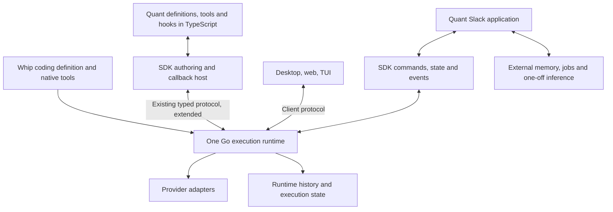

# One Whip runtime, multiple agent applications

Branch: planning only; no implementation branch created.

Status: proposed architecture, September 9, 2026. Incorporates the user's clarified goals. Tool-interface choice and operational defaults remain proposals. This document complements the [migration inventory and delivery plan](/Users/samheutmaker/Desktop/context-labs/src/rlm/whip/.ai-docs/plans/quant-whip-migration/README.md); it does not change current runtime requirements or authorize implementation.

## Recommendation

Place the boundary between **execution mechanics**, **agent behavior**, and **application interaction**. Keep one Go runtime that executes an agent definition. Make the Whip coding agent a first-party definition with native implementations and strong defaults. Let Quant author another definition, tools, and hooks in TypeScript through the public SDK.

Whip owns when execution advances and what its authoritative state is. A definition supplies instructions, available capabilities, and behavior at documented extension points. A surface supplies user input and presents output. An application owns its business records, integrations, external memory, and one-off inference.

This does not require turning the coding agent into TypeScript or embedding a JavaScript engine in Go. Native coding tools can stay in Go. TypeScript functions run in Node/Bun when the Go runtime invokes their registered handlers. Both obey the same lifecycle and authority rules.

These are responsibility boundaries, not a proposal for six new services or packages. Quant's SDK client and callback host can initially share its existing Bun process. They need distinct lifecycle semantics even when they share a process or connection.

## Ownership

| Concern | Shared Go runtime | Definition / extension | Surface / application |
| --- | --- | --- | --- |
| Model iteration | Requests, retries, tool-result ingestion, next step, completion | Model defaults; validated changes at boundaries | Submits work and displays outcome |
| Context | Canonical history, context limits, compaction lifecycle, prompt assembly | Instructions, retrieval/context transforms, optional compaction strategy | Quant memory and Slack history ingestion |
| Tools | Available-tool enforcement, invocation identity, schema validation, cancellation, outcome | Native or TS implementation; schema; selected tool set | Optional rendering and delivery |
| Hooks | Defined execution point, ordering, deadline, validation, failure behavior | TS policy or transformation | Post-commit event consumption |
| Subagents | Admission, retained identity, scheduling, budgets, authority, mailbox, recovery | Named definitions, delegation policy, prompts, model/tool overrides | Inspection and result presentation |
| Permissions | Enforces host authority and records decisions | Can further restrict or request permitted decisions | Supplies human answers or configured service policy |
| State | Runtime facts needed to continue or explain execution | Bounded serializable extension data when necessary | Slack IDs, episode records, business databases, delivery outbox |
| Environment | Execution-host resolution, immutable turn context, child inheritance | Explicit directories, capabilities, environment references | Deployment, credentials, domain routing |
| Coding behavior | Generic mechanisms used by the coding definition | Coding prompt, repository instructions, skills, file/shell/browser tools, coding-specific context treatment | Diffs, workspace browser, terminals, coding interactions |

The useful litmus test is: **would this behavior still be necessary for a two-tool customer-support agent with no repository?** If yes, its mechanism probably belongs in the runtime. If it is a choice about how an agent should work, it belongs in a definition or extension. If it concerns Slack, a desktop window, or business data, it belongs in the application.

Not every broadly useful function belongs in the core. Embeddings, retrieval, graph extraction, and one-off classification are useful but do not need to participate in the agent state machine. The user explicitly keeps those in TypeScript.

## Current seams and coupling

The repository already provides a plausible starting point:

- [`agent.NewRuntime`](/Users/samheutmaker/Desktop/context-labs/src/rlm/whip/internal/agent/agent.go) explicitly constructs a provider loop without choosing its tool surface. `Agent.Events` also has a loop boundary callback used for steering. These are internal seams, not a public authoring API.
- [`RecursiveRuntime.newNode`](/Users/samheutmaker/Desktop/context-labs/src/rlm/whip/internal/daemon/recursive_runtime.go) creates the Starlark kernel and installs `rlm_exec` as the exclusive model-facing tool. Root and child execution already share the same session implementation.
- [`rlm.ComposePrompt`](/Users/samheutmaker/Desktop/context-labs/src/rlm/whip/internal/rlm/environment.go) combines the RLM contract, coding identity/advice, current environment, repository instructions, skills, and personal instructions. These concerns need separable composition. [`BuildPrompt`](/Users/samheutmaker/Desktop/context-labs/src/rlm/whip/internal/rlm/prompt.go) itself includes a coding persona.
- [`refreshPrompt`](/Users/samheutmaker/Desktop/context-labs/src/rlm/whip/internal/daemon/prompt.go) applies a complete prompt override only to the root. [`run.configure`](/Users/samheutmaker/Desktop/context-labs/src/rlm/whip/internal/daemon/client_control.go) changes live fields; it is not a durable definition model.
- [`tools.Tool`](/Users/samheutmaker/Desktop/context-labs/src/rlm/whip/internal/tools/tools.go) currently returns a string plus error. Custom tool results need a deliberate typed representation for content, progress, structured data, and bounded content references. Avoid pretending the present string result already supports the whole authoring contract.
- The [`public SDK`](/Users/samheutmaker/Desktop/context-labs/src/rlm/whip/packages/sdk/src/index.ts) exposes attachment, commands, state, and recovery. It does not register executable tool or hook handlers.

Keep the existing daemon/session/agent separation initially. Extract coding composition and introduce narrow execution interfaces where these seams require them. Do not begin by moving the entire repository into a new package hierarchy or publishing Go internals as a public library.

## A definition is data plus bindings

The authoring API needs two related concepts:

1. **Definition:** stable identity/revision, instructions, tools, hooks, child definitions, model and budget defaults, context policy, and required host capabilities. Its wire representation is serializable and validated by Go.
2. **Bindings:** implementations of the declared TS tools and hooks, attached by a callback host. Functions and captured database clients remain in TypeScript; the daemon stores handler identities, not closures.

Provide an authoring entry point such as `@whip/sdk/agents` alongside the current client API. Names are provisional. Its job is definition helpers, schema conversion/type inference, registration, and callback dispatch. Existing SDK command/recovery/transport behavior remains shared. Browser observers must not acquire Node/Bun execution dependencies by importing the base SDK.

A practical authored agent should be able to express:

- An instruction string or instruction provider, model defaults, and selected built-in tools.
- Custom tools with schemas and async handlers, streamed progress, neutral content results, cancellation, invocation identity, and immutable application context.
- Ordered hooks that can deny or transform a proposed operation, contribute context, or request another bounded iteration before final completion.
- Named subagents using the same definition shape, with explicit tools, instructions, model settings, budgets, and inheritance.
- Explicit skill/instruction sources and context behavior, without requiring filesystem discovery for agents that do not use files.

The coding definition should have one source for its prompt, tool catalog, and defaults. Go assembles it and binds native implementations. TypeScript can refer to it as a preset and extend it through the same authoring semantics; do not duplicate the coding prompt or tool list in the SDK.

Definitions are pinned to a declared revision for a running agent. A deployed TS bundle identifies the revision it can serve; hashing a manifest alone cannot prove that two handler implementations are identical. Changes apply at an explicit idle/turn boundary and record the new revision. Required bindings must be available before admitting dependent work. Root and child inheritance is deliberate, not an accidental consequence of a global registry.

## Callback execution is the main new protocol capability

A TypeScript callback host is an executor, distinct from a UI observer. Closing a desktop window must not affect the loop. Losing the sole process implementing a required tool or hook affects execution and must have an explicit outcome.

The minimum invocation contract carries runtime/root/agent/turn identity, invocation ID, handler ID and definition revision, validated input, deadline, cancellation, and bounded execution context. It accepts progress and one terminal response. Reuse existing protocol transport, event/content facilities, and durable operation identity where suitable; do not build a second RPC stack.

Tool lifecycle:

1. Go receives the model's proposed operation and resolves its permitted binding.
2. Go runs applicable pre-operation decisions, then revalidates changed arguments and enforces authority on the effective request.
3. Go records admission and dispatches to a native tool, MCP server, or TS handler.
4. The handler reports progress and a result. Go applies allowed result transformations, records the outcome, and admits the bounded model-facing result into context.
5. Go chooses the next iteration or final completion. Observers receive committed state and presentation events.

Specify these failure semantics before treating callbacks as production-ready:

- Required control hooks never silently disappear on timeout or disconnect. Default to an explicit waiting state with a bounded deadline, then an explicit failure if no compatible host returns. Ordinary observation consumers need not block execution.
- Reconnection can query pending invocation state; expired stream replay alone is insufficient. There is one active executor binding per scoped handler, with a generation/lease to reject stale replies after replacement.
- After an invocation has been dispatched, an unknown result is an uncertain effect. Do not automatically run an arbitrary effect again. Stable IDs support idempotent handlers and reconciliation; they cannot guarantee exactly-once effects in external services.
- Cancellation propagates to the handler's signal and invalidates late results as appropriate. An uncooperative TS function may continue its external work; Go cannot promise to undo or forcibly stop arbitrary remote effects.
- Do not wait for a callback while holding the locks or permits needed to process its response, cancellation, progress, or an authorized child request. Prohibit a hook from synchronously resubmitting to its own blocked turn.
- Bound concurrent invocations, progress buffers, content size, and pending callbacks. Slow UI rendering must not backpressure the execution callback channel.

For Quant, colocated processes and shared mounts are the simplest initial deployment. The contract should nevertheless say where a TS tool executes: paths on the daemon host are not automatically paths on a remote callback host. A TS handler is trusted application code, not a sandbox; selected model tools and Go capability checks do not constrain arbitrary OS/network access inside that process.

Existing MCP support remains an executor option for external tool servers. Reuse it where it fits. Do not force every local TS callback through an application-authored MCP server just to expose a function, or treat MCP tool support as a replacement for lifecycle hooks.

## Hooks: expressive decisions, explicit limits

Separate hooks that control execution from notifications about committed facts. Both Claude's [SDK hooks](https://code.claude.com/docs/en/agent-sdk/hooks) and Pi's [extension API](https://pi.dev/docs/latest/extensions) demonstrate why tools plus an event stream are not sufficient: applications also intercept execution, customize context, and influence completion. These references inform capability coverage, not a requirement to reproduce their exact names or internals.

Proposed capability groups:

| Boundary | Meaningful extension behavior | Runtime invariant |
| --- | --- | --- |
| Input / turn start | Transform input; retrieve and append context; select permitted defaults | Preserve admitted input/provenance and record the effective context |
| Before model request | Transform the model-visible context and select a permitted tool subset | Preserve canonical history, valid tool-call/result pairing, limits, authority, and accounting |
| Before tool / spawn | Deny; rewrite arguments; narrow options | Validate after changes; cannot expand authority |
| After tool | Transform model-visible result; add context; report domain progress | Preserve original execution evidence and effect status |
| Before turn completion | Accept answer or request bounded additional work | Go remains responsible for iteration, cancellation, and budgets |
| Compaction | Supply a custom summary or context strategy | Go preserves canonical history and validates the committed context boundary |
| Session / child / turn outcome | Observe lifecycle and trigger application work | Post-commit consumers cannot rewrite an already committed outcome |

Start with the hooks exercised by real authoring fixtures and Quant; keep this capability matrix visible so the broader scope is not quietly reduced to four Quant-specific callbacks. Define deterministic handler order, transformed-input chaining, explicit failure policy, and root/child scope. Keep persisted extension state bounded and versioned; large business state stays in the application's store.

Provider neutrality means a typed context/model contract plus explicit provider capability checks. Unsupported features must produce a clear error or an explicitly selected fallback. It does not require an untyped hook that mutates any provider's raw HTTP payload. Pi exposes such a hook; adopting it would enlarge Whip's compatibility surface and is not needed to express the core authoring contract. Custom gateway configuration and tracing can use host-resolved configuration and typed request metadata.

Arbitrary TUI widgets and browser components are surface extension APIs. Portable interaction should cover questions, decisions, progress, content, and optional presentation metadata. Surface-specific custom renderers can build on that contract without being evaluated inside the agent runtime. This preserves room for high-quality coding interfaces without making every custom agent implement a desktop UI.

## RLM versus ordinary named tools

The current [roadmap](/Users/samheutmaker/Desktop/context-labs/src/rlm/whip/docs/roadmap.md) and [features](/Users/samheutmaker/Desktop/context-labs/src/rlm/whip/docs/features.md) require every provider request to expose exactly `rlm_exec`. Supporting ordinary named tools would deliberately revise this requirement. It must not resurrect the removed direct-tool agent implementation.

Recommendation, pending the user's choice: separate **which operations exist** from **how the model invokes them**. Keep RLM as the coding definition's default. Allow a custom definition to select conventional named tools when that suits its model/task. Both routes use one provider loop, one retained agent type, one invocation/authority lifecycle, one history store, and one callback host contract.

RLM and direct calls are not semantically identical. RLM adds generated Starlark, batching/control flow, scratch state, focusing, and kernel resource limits. Direct calls use the model/provider's native tool syntax and require no Starlark program. Keep each interface's instructions and resource behavior explicit; do not force artificial cells or kernel capacity reservations onto direct-only agents.

Do not expose every tool twice in one agent by default. The definition selects one model-facing interface. RLM custom tools should be callable through a generic, schema-described host operation backed by the same registered TS handler; developers do not write a Starlark wrapper per tool. Required hook/permission checks must happen for each underlying operation, including child spawn, not only for the outer `rlm_exec` cell.

This adds a tool-exposure strategy, not another loop. It still adds complexity: inspect current kernel lifecycle, child admission, focusing, prompt assembly, and UI assumptions before sizing it. If dual exposure creates separate session semantics or dispatch rules, the boundary has been implemented incorrectly.

If the user chooses universal RLM, keep the same definition/handler design and defer the direct adapter. Quant authors still use TypeScript exclusively; model-generated Starlark would be internal Whip execution. That interpretation needs explicit confirmation rather than assuming that “TypeScript only” decides it either way.

## Subagents use the same runtime and definition model

Use one definition type for roots and children. A named specialist is a definition plus explicit inherited limits/context; it is not another SDK runner. Both an SDK-requested child and a model-requested child must use the existing retained admission/scheduling/mailbox path.

Add the missing public spawning and definition binding APIs. Preserve current tools/model/budget restrictions, and let definitions choose whether the parent receives a result, a notice, or explicit messages. A TS tool may request a child through this API, but it must not start another provider loop itself. Parent/child budget and cancellation semantics remain Go-owned.

Do not couple a child handler to the lifetime of its parent's current JavaScript call stack. Bind it to the declared definition and execution host. A root command completing may leave children active; callback availability and Quant's output consumer must cover that lifetime.

## Preserving both products' quality

Keep the first-party coding definition opinionated and native. Preserve its prompts, current RLM strategy, built-in tools, repository rules, skills, contextual diagnostics, model tuning, and specialized UI presentation while extracting their ownership. Generic must not mean reducing the coding product to a minimal chatbot.

Make custom definitions complete independently. A no-filesystem agent should not discover personal coding instructions or receive tools it did not select. Quant should not have to fork a daemon or patch a built-in prompt to express its behavior.

Use three maintained examples as architecture checks:

1. **Existing coding agent:** current execution and surface regression suite; no mandatory Node/Bun callback process for built-in behavior.
2. **Small custom agent:** no repository, one TS tool, one blocking hook, one child, streamed output, interruption and restart cases.
3. **Quant:** retained functionality, real application context, multiple tool implementations, domain hooks, specialists, memory, Slack output, jobs, and recovery.

The small example prevents extracting abstractions that only happen to accommodate Quant. Quant prevents designing an API that works only for toy examples. Coding regression coverage prevents shifting all engineering attention onto the framework use case.

Keep broad capability coverage as the destination and deliver vertical slices. Avoid treating every feature of both reference frameworks as a prerequisite for the first useful release. For each capability record: supported now, required for Quant, required for the general authoring contract, or deliberately surface/provider-specific. A deferral should have a named capability and rationale, not disappear under “MVP.”

## Ordered implementation slices

1. **Lock the boundary and behavior fixtures.** Confirm tool-interface choice and callback-host deployment assumptions. Preserve Quant's functional inventory. Enumerate reference-framework capability coverage and select coding/custom/Quant baselines.
2. **Introduce definitions and separate coding composition.** Keep existing coding behavior; support an explicitly configured custom agent. Persist the definition/revision and restore it before execution. No large directory reorganization.
3. **Deliver one TS tool and one blocking hook end to end.** Extend the existing protocol/SDK; test real Go dispatch to a TypeScript handler. Include duplicate/late replies, disconnect, deadline, cancellation, and uncertain effects before expanding the catalog.
4. **Add retained subagent authoring and context hooks.** Use the same runtime for children. Verify inheritance, child availability after parent completion, model/tool restrictions, compaction, and budgets. Implement the selected tool-exposure strategy here or in slice 3 as its first fixtures require.
5. **Migrate Quant by responsibility.** Untangle the harness contract and rendering first; port definitions/tools/hooks; integrate durable command and delivery records; preserve helpers, memory, plans, schedules, CLI, and dashboard. Improve exact-episode consolidation ordering.
6. **Run comparative quality and failure acceptance.** Coding regressions, custom authoring fixtures, and sanitized Quant scenarios must pass. Compare task completion, instruction adherence, latency, cost, and recovery; then use the staged canary/rollback plan in the inventory.
7. **Remove obsolete adapters after drain.** Delete Claude/Pi agent-loop adapters and proven dead code. Retain any provider libraries still used legitimately by one-off inference.

Do not start by wrapping every Claude option, creating a plugin marketplace, introducing a generic workflow graph, or abstracting every Go package. The substantive new abstraction is an executable agent definition with external handler bindings. The substantive new engineering work is making those bindings reliable under the same lifecycle guarantees as native execution.

## Acceptance criteria for the boundary

- Quant imports only public TypeScript contracts for agent execution; no private Go database, filesystem protocol, subprocess-prompt parsing, or raw provider agent loop.
- The coding agent and custom agents share one provider iteration and retained child implementation.
- Tool-body location does not change invocation identity, authority checks, hook semantics, cancellation, or result accounting.
- Control hooks run before the governed action; post-commit notifications cannot impersonate them.
- Coding defaults retain their quality; custom agents receive only explicitly selected persona/instruction discovery/tools.
- Browser/UI attachment is independent of executor availability. Missing required callbacks cannot quietly disable policy.
- Restart restores definitions and pending/uncertain execution facts; it does not pretend JavaScript closures or arbitrary external effects were checkpointed.
- Quant's memory, embeddings, one-off inference, business records, and Slack delivery remain application-owned.
- Code and protocol remain vendor-neutral without silently dropping unsupported model capabilities.

## Reference notes

Local source is authoritative for Whip's current implementation. The Go and TypeScript references above were inspected at the revisions recorded in [README.md](/Users/samheutmaker/Desktop/context-labs/src/rlm/whip/.ai-docs/plans/quant-whip-migration/README.md).

Official external references accessed September 9, 2026:

- [Claude Agent SDK hooks](https://code.claude.com/docs/en/agent-sdk/hooks): lifecycle interception and decision behavior.
- [Pi extensions](https://pi.dev/docs/latest/extensions): tool callbacks, lifecycle/context customization, compaction, and separate UI capabilities. Latest docs also expose provider-payload mutation, an explicit design tradeoff rather than a requirement to copy.
- [Pi SDK](https://pi.dev/docs/latest/sdk): programmatic sessions, resource loading, and selected tools. These current references are broader than Quant's pinned dependency versions.

The ownership split, callback failure semantics, and implementation sequence in this document are recommendations derived from the local code and the user's goals, not claims that the external frameworks share Whip's proposed architecture.
