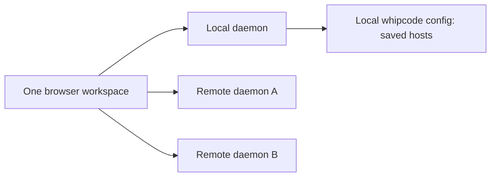

# Multiple daemon hosts in the web app

Branch: `whip-rlm`

Status: implementation and validation complete, including the final physical
Kuzco repeat over Tailscale, 2026-09-08.
The user approved end-to-end delivery and use of `ssh sam@kuzco-4090` for testing.

## Current implementation evidence

- Config RPC round trips, revision conflicts, provider preservation, optional
  compatibility, protocol generation, and focused Go tests pass.
- `task check` passes; affected config/daemon `go test -race` passes. The latest
  web unit run passes 218 tests, including config races, colliding root/command
  identities, layout migration and directory-picker stale responses.
- The packed Local-plus-two-remotes browser suite passes all nine workflows in
  Chromium 153 and Firefox 155: creation, saved profiles shared by browsers,
  distinct model catalogs, concurrent turns, mixed panes/drafts,
  permissions/search, remote upload, actual daemon outages/reconnect, explicit
  disconnect, removal/re-addition with a retained draft and reload. Maximum root
  subscriptions across all hosts: four.
- Existing tab, split workspace, search and sidebar suites pass in Chromium and Firefox.
  Core product browser checks pass with no page/CSP errors. Actual Safari 26.3.1
  passes its single-host smoke, and `task acceptance` passes. The sidebar checks
  cover theme variants, scroll anchors, keyboard/focus and narrow layouts.
  A final packed-build check in Chromium and Firefox confirms unusually long
  host names remain editable and their actions stay visible at a 390px viewport,
  with no horizontal overflow. Host status stays separate from the shortened label.
- After Tailscale reconnected, the final packed build passed nine physical-host
  workflows in Chromium and Firefox against Local and Kuzco at
  `http://100.75.4.112:43111`: remote folder creation, concurrent streaming,
  remote HTTP upload, mixed-layout/draft reload, independent disconnects,
  continued accepted work after detachment, an actual Kuzco daemon restart,
  profile removal/re-addition and fresh-browser profile discovery. Maximum
  observed root subscriptions was two; there were no page/CSP errors or stale
  global error banners. The uploaded Linux binary's SHA-256 matched the local build.
- Three additional physical-host checks passed in both browsers: HTTP content
  download matched uploaded bytes; the wrong root was refused with HTTP 403;
  Kuzco's fully qualified Tailscale hostname was recognized as a duplicate
  runtime; changing its saved address to another daemon was refused without
  changing configuration. The short hostname had intermittent DNS delays on
  this Mac, while the full Tailscale name resolved promptly.
- Follow-up screenshot review caught an expected observer `AbortError` surfacing
  as a global banner after detachment. Shared error reporting now ignores that
  cancellation, with a regression proving real failures and timeouts still appear.
  Both the physical-host and three-daemon browser suites assert no leftover banner.
- The full Go check also exposed a pre-existing stdout-capture pipe deadlock in
  `TestBrowserInstall`. The shared test helper now captures to a temporary file;
  a large-output regression guards against blocking or truncation. The full
  `task check` rerun, CLI package tests, and targeted CLI race tests pass.
- Tests use isolated daemon homes and fake providers with exact allowed origins.
  No user credentials were copied and no normal daemon was restarted.
- Review fixed obsolete config reads/writes, stale host edits, closed-history
  loss during migration and oversized v3 metadata. Whole layouts that cannot
  fit remain available as individual previous tabs in Execution hosts.

## Implementation choices

Primary view IDs retain their former root ID when it is free in the window;
collisions and duplicated views receive fresh IDs. All root lookups use the pair
(runtime ID, root ID). This preserves existing view hints while allowing equal
root IDs on different hosts. Reading positions are window-memory only, so cold
legacy migration has no persisted bookmarks to rewrite; live duplicates retain
the existing independent reading/caret behavior.

The v1/v2 source records stay intact. A validated v3 document records which old
host layouts were restored/dismissed, so failed writes cannot destroy their
source. Other layouts, including closed tabs, remain recoverable. Whole-layout
restoration refuses to evict active tabs or prior closed history; individual
restoration is available when the combined layout cannot fit.

Reproducible multi-host check: `node apps/web/scripts/multiple-hosts.mjs` after
`npm run pack:web`. Local fixture origins are explicit. The fixture's small
`/api/` proxy serves the actual-Safari test wrapper on its own origin; production
connection traffic stays direct and Origin handling is unchanged.

## Goal

Use one locally launched web workspace to connect to several existing daemons,
browse their sessions, work across hosts in tabs and split panes, and create a
session in a folder on an explicitly selected host. Reuse the SDK's existing
independent clients and the daemon's existing session and directory operations.

## Confirmed product decisions

- Open the app locally through `whipcode web` on the user's computer.
- Add existing daemon URLs, including LAN and Tailscale addresses.
- Keep multiple daemons connected and display sessions from each.
- Use one window workspace: sessions from different hosts can share tabs and
  split panes.
- New session explicitly offers Local or Remote, then guides host and folder
  selection.
- Store saved remote hosts in local whipcode configuration, shared by browsers
  connecting to that local daemon.

## Non-goals and deferred work

- **Exact browser Origin and stable local web address:** explicitly deferred by
  the user. This plan assumes the browser can reach each daemon and that existing
  Host/Origin configuration permits the current app origin. Configure isolated
  test fixtures explicitly; do not weaken checks or make this fix a prerequisite.
- SSH setup, remote installation, discovery, a connection relay, or new network
  authentication. Remote session traffic goes directly to existing daemon URLs.
- Moving sessions, files, provider credentials, or running work between hosts.
- Synchronizing tab layouts or drafts between browsers. Only saved host profiles
  are shared through local configuration.
- Redesigning general context, execution, or memory limits. Keep current visible
  workspace bounds and measure aggregate resource use as hosts are added.

Session execution and provider credentials continue to belong to the selected
daemon. No new dependency is expected for this feature.

## Research baseline before implementation

| Area | Evidence | Consequence |
| --- | --- | --- |
| Saved addresses | `AppRuntime` stores `whip.web.hosts.v1` in browser storage, but its snapshot has one `client`, `list`, and `endpoint`. `connect()` calls `detach()` before attaching the replacement. [runtime.ts](../../../packages/app/src/runtime.ts) | This is a saved-address switcher, not concurrent host support. |
| Connection engine | Each `WhipClient` owns its transport, reconnection, streams, command handles, and runtime identity. [client.ts](../../../packages/sdk/src/client.ts), [transport.ts](../../../packages/sdk/src/transport.ts) | Reuse one client per daemon. A new transport or daemon aggregator is unnecessary. |
| Identity | Handshake includes persistent `runtime_id`, connection ID, OS/architecture, protocol/capabilities and limits. URLs already include `/h/$runtimeId/s/$rootId`. [types.go](../../../internal/protocol/types.go), [conversation.tsx](../../../packages/app/src/conversation.tsx) | Keep daemon identity separate from its editable URL and user-facing name. |
| Tabs and splits | `TabWorkspace` owns one `runtimeId`; its individual `SessionTab` has only a root ID. View leases are keyed by root ID and use the current client. [session-tabs.ts](../../../packages/app/src/session-tabs.ts), [workspace-views.ts](../../../packages/app/src/workspace-views.ts) | Mixed-host panes require a real layout/state migration, not just a host dropdown. |
| Folder selection | `host.directories.list` browses the selected daemon's filesystem without creating a session. `host.directory.pick` opens the OS dialog on that daemon's machine. [host.go](../../../internal/daemon/host.go), [directory-picker.tsx](../../../packages/app/src/directory-picker.tsx) | Reuse native selection locally and the in-app browser remotely. Do not open a desktop dialog on a remote machine. |
| Creation and models | `NewSession` already creates through an explicit SDK client and loads that client's provider catalog. [welcome.tsx](../../../packages/app/src/welcome.tsx) | Extend this form with host selection and keep its folder/model state scoped to that host. |
| Navigation and attention | Sidebar, search, attention, settings, and tab routing consume the single current client. [session-sidebar.tsx](../../../packages/app/src/session-sidebar.tsx), [session-search-dialog.tsx](../../../packages/app/src/session-search-dialog.tsx), [attention.tsx](../../../packages/app/src/attention.tsx), [settings.tsx](../../../packages/app/src/settings.tsx) | All these surfaces need explicit host ownership; a sidebar-only change would leave actions targeting the wrong host. |
| Durable configuration | `config.get/update` provides a typed, redacted view and revision-checked writes via `config.UpdateVersioned`. No saved-host field exists. [provider_service.go](../../../internal/daemon/provider_service.go), [revision.go](../../../internal/config/revision.go) | Add typed host profiles to the existing configuration path, rather than a second persistence mechanism. |

At the research baseline, the canonical [frontend guide](../../../docs/frontend.md) and
[React lifetime rules](../../../docs/concurrency.md#react-application-lifetimes)
documented the single-host design. Both now describe the multi-host implementation.
The [roadmap](../../../docs/roadmap.md) separates hosted execution
and relays from the existing attach-only client. Prior OpenCode research documents
URL-based attachment, but does not establish a simultaneous-host implementation
to port: [existing research](../../../docs/learnings/other-harnesses/opencode/opencode-ux.md#6-cli-surface).

## Proposed connection ownership

Keep an explicit local/home connection, derived from the local launch origin,
as the owner of saved-host configuration. Remote session traffic goes directly
from the browser to the corresponding daemon. Losing the local connection must
not close healthy remote connections; configuration edits can show unavailable
until the local daemon reconnects.

Proposed defaults, unless changed during review:

- Local is the launch daemon and is always present. Newly saved remote hosts
  connect on launch; users can disable that preference or disconnect for the
  current window. A window-only disconnect does not affect another browser.
- Removing a saved host disconnects its observation in the current window and
  retains its open tabs and drafts as unavailable. It never deletes sessions or
  cancels accepted daemon work. Other browsers discover profile changes when
  configuration refreshes on focus/reconnect or before an edit.
- An established remote connection survives a local outage. A fresh page load
  still needs the local daemon to load saved profiles; do not introduce a second
  persistent host registry to mask that distinction.
- Labels identify the host in tabs, search, attention, and the creation form.
  Focus chooses which session is visible, not which daemon owns other actions.

Replace the single-client state in `AppRuntime` with host connection records.
Each record owns its SDK client, lightweight session-list view, connection
state, local wait cancellation, and observation cleanup. Changing the focused
tab only selects a view. Disconnecting a host only releases that host's resources;
accepted work remains on the daemon.

Keep one app Query client with fully scoped keys and targeted invalidation.
Current blanket query clearing, global command-wait cancellation, attachment
invalidation, and command notice handling must become host-specific. Key leased
roots and command/recovery UI by their complete identities, including runtime ID.
Reuse the SDK's synchronization and reconnection; do not add a second event reducer.

A saved profile should contain a stable profile ID, friendly name, URL, verified
runtime ID, and connect-on-launch preference. These are metadata, not credentials
or session copies. Verify a saved runtime identity before starting session queries.
If an address now serves another runtime, show that explicitly and require a
deliberate rebind. Two URLs for the same runtime must not duplicate its sessions
or create competing observers.

Extend the existing typed config read/update contract and regenerate protocol
artifacts. Save profiles through the local connection even while a remote tab
is focused. Browser-specific tab layout, drafts, and appearance retain their
existing owners. Offer migration of existing browser-only saved URLs to local
config; do not silently overwrite a host list another browser has edited.

## Proposed user flow

1. **New session → Local or Remote.** Keep the choice and host name visible
   throughout creation. A directory's existing + action can preselect its host
   and folder without creating anything.
2. **Local:** use the local launch daemon and its native folder picker, with
   the existing in-app directory browser as fallback.
3. **Remote:** select a saved host, or Add host with a name and daemon URL.
   Connect and verify compatibility; display connection errors on that host.
4. **Choose a folder on that host.** Remote selection always uses the in-app
   directory browser, with typed absolute paths and `~/` support. Changing hosts
   resets incompatible folder/model selections and ignores stale picker replies.
5. **Choose the model or host default, then create.** Show the target host and
   working directory together. Submit to that client's existing session-create
   operation and open the result in the shared workspace.

Group the sidebar as **host → directory → sessions**, retaining the existing
directory hierarchy. Host headings show connection state and an Add/Manage hosts
entry replaces the current switch-host footer. Search and attention should span
connected hosts with explicit host labels and host filtering. Provider/config
settings need an explicit target host; viewing-device settings remain separate.

Move runtime identity into each tab descriptor and use one window split tree.
Retain the current session URLs, Back/Forward behavior, duplicate-view semantics,
draft isolation, and reading anchors. Migrate existing per-host layouts without
silently dropping tabs or drafts when their combined size exceeds current bounds.
Visible panes lease only the roots they show; background catalogs and summaries
must not hydrate every session. Preserve a window-wide memory budget instead of
multiplying all existing caches by the host count.

## Network research and the deferred Origin issue

The daemon already accepts cross-origin WebSockets and HTTP content requests
when the exact Host and browser Origin are allowed. Its CSP permits HTTP(S)
and WS(S) connections. There is no built-in network authentication: this remains
the existing trusted-network deployment model. See
[network.go](../../../internal/daemon/network.go),
[assets.go](../../../internal/webassets/assets.go), and
[deployment documentation](../../../docs/web-app.md#trusted-network-and-phone-access).

Two separate addresses matter: the local browser application's origin and each
remote daemon's endpoint. Every remote must allow the local application's exact
origin. Local networking currently defaults to an ephemeral port. That can
invalidate remote Origin allowlists after restart, and browser storage is also
origin-specific. **The stable-address/exact-Origin solution is a separate future
task, excluded from every phase below.** Persisting hosts in config solves
host-list durability; it does not alone solve Origin changes or migrate drafts
between browser origins. No listener or allowlist has been changed during research.

Prefer HTTPS/WSS endpoints for consistent remote-browser behavior. A supported
LAN HTTP connection can still encounter browser local-network permissions or
mixed-content rules. Implementations vary, so do not promise that every browser
can reach every HTTP LAN URL or label every connection failure as a dead daemon.
[MDN local-network access](https://developer.mozilla.org/en-US/docs/Web/Security/Defenses/Local_network_access)
and [WebSocket guidance](https://developer.mozilla.org/en-US/docs/Web/API/WebSockets_API/Writing_WebSocket_client_applications)
describe these restrictions.

Tailscale Serve can provide a private HTTPS reverse proxy with a provisioned
certificate, making it a suitable documented option for existing daemons.
WHIP's exact Host/Origin checks still need correct configuration behind it.
[Tailscale Serve documentation](https://tailscale.com/docs/reference/tailscale-cli/serve).

Connection checks must cover both WebSocket RPC and HTTP content transfers;
successful streaming alone does not prove uploads and artifact reads work.
The SDK derives content URLs at the endpoint's origin root, so arbitrary reverse
proxy path prefixes are not currently supported end to end. Use a root-mounted
daemon endpoint for the initial supported setup.

## Phased implementation plan

Implement in order. Each phase includes its own tests and documentation changes;
the final phase verifies the integrated product. Intermediate changes are
reviewable milestones, not a claim that multi-host support is complete.

### Phase 1 — Persist host profiles in local configuration

**Outcome:** the local daemon can store and serve the same saved remote hosts to
different browsers without clobbering unrelated configuration.

- [x] Add a typed `remote_hosts` configuration field for profile ID, name, URL,
  expected runtime ID, and connect-on-launch preference. Use the existing build's
  config path: normally `~/.whipcode/config.json` for whipcode. Keep Local implicit,
  so its ephemeral launch URL is not saved as a remote profile.
- [x] Extend the existing redacted `config.get/update` types and guarded,
  revision-checked writes. Regenerate protocol/schema artifacts and consume them
  through the existing SDK configuration service. Do not create a parallel file
  or new CRUD protocol solely for host profiles.
- [x] Validate profile identities, names, and supported URL formats; reject
  embedded credentials and duplicate records. Endpoint validation and successful
  runtime verification are separate: a valid URL alone does not establish trust
  in a runtime identity.
- [x] Keep older config files valid with an empty default list. New host-profile
  support is required on the local config-owning daemon; remotes need only the
  session/directory capabilities they actually use. Surface incompatible local
  config support without falling back to a browser-owned registry.

**Primary files:** [config.go](../../../internal/config/config.go),
[revision.go](../../../internal/config/revision.go),
[types.go](../../../internal/protocol/types.go),
[provider_service.go](../../../internal/daemon/provider_service.go), generated
`packages/protocol` artifacts, and [SDK services](../../../packages/sdk/src/services.ts).

**Exit checks:** round-trip profiles through the real config RPC; two clients
editing the same revision produce a recoverable conflict; unrelated provider
configuration and secrets survive a profile update; legacy config still loads.
Run affected Go config/daemon tests and protocol-generation/SDK contract checks.

### Phase 2 — Maintain independent connections and host catalogs

**Depends on:** Phase 1.

**Outcome:** Local and multiple remotes stay connected, with separate status and
session catalogs visible in one sidebar.

- [x] Replace the singleton client/list in `AppRuntime` with connection records
  and an explicit home connection for profile reads/writes. Each record owns its
  client, list view, connection epoch, waits, errors, and cleanup. Reuse the SDK's
  reconnect machinery; one failed bootstrap must not reject the whole set.
- [x] Scope root leases by `(runtimeId, rootId)` and command notices/recovery UI
  by their SDK identity `(runtimeId, clientId, commandId)`. Audit query keys,
  attachment ownership, pending inputs, late callbacks, and global cleanup.
  Disconnect/reconnect invalidates only the affected host; app disposal still
  releases everything. Existing runtime-scoped drafts keep their current identity.
- [x] Verify the handshake's runtime ID before starting lists or session reads.
  Deduplicate aliases of the same runtime, including an alias of Local. A changed
  identity requires explicit rebind; old tabs and drafts retain their old runtime
  identity and never silently attach to a replacement daemon.
- [x] Replace the switch-host dialog with Add/Manage hosts: name, URL, connection
  preference, edit, reconnect, disconnect, and remove. New profiles are verified
  before saving. Keep failures scoped to the host; distinguish known incompatible
  protocol/identity errors from connection failures whose browser cause is opaque.
- [x] Offer import of browser-only saved URLs. Verify and save selected entries
  through the local config API; retain unavailable entries for later import.
  Mark imported entries only after persistence succeeds. On config conflicts,
  refetch and reconcile without overwriting another browser's changes.
- [x] Render **host → directory → sessions** using one existing lightweight
  `SessionListView` per connected runtime. Keep host-specific pagination, revision,
  loading/error/stale state, and directory identities. An offline host must not
  look like a host with zero sessions. Reuse current list observation/polling
  behavior instead of introducing another catalog poller.
- [x] Introduce an isolated multi-daemon test fixture now for all later phases.
  Test mocked clients with colliding root/command IDs as well as real SDK clients
  connected to distinct fake-provider daemons.

**Primary files:** [runtime.ts](../../../packages/app/src/runtime.ts),
[context.tsx](../../../packages/app/src/context.tsx),
[shell.tsx](../../../packages/app/src/shell.tsx),
[session-sidebar.tsx](../../../packages/app/src/session-sidebar.tsx), existing
runtime tests and browser fixture helpers. Extend SDK code only if a concrete
gap remains after composing its existing independent clients and views.

**Exit checks:** connect Local plus two remotes; disconnect/reconnect any one and
prove the others retain lists, streams, drafts, and command waits. Cover local
outage, duplicate aliases, changed runtime identity, React cleanup, and refresh
of profiles edited by a second browser. No global query clear or host switch may
detach unrelated connections.

### Phase 3 — Share tabs, routing, and split panes across hosts

**Depends on:** Phase 2.

**Outcome:** sessions from different hosts work side by side in the same window,
with correct restoration and no host ambiguity.

- [x] Put `runtimeId` on each tab and persist one versioned window split layout.
  Give each view a unique ID independently of its root ID. Preserve duplicate
  chat/REPL views, drag/reorder, close/reopen, focus, and host labels.
- [x] Route `/h/$runtimeId/s/$rootId` directly to that runtime's connection.
  Switching tabs must never reconnect another host. Preserve Back/Forward and
  view hints; unknown or unavailable hosts get a reconnect/add-host state, never
  a lookup against the focused daemon. Added endpoints must match the URL's
  runtime identity before that session is opened.
- [x] Reconcile visible root leases across the entire split tree. Deduplicate
  views of the same root on the same host, distinguish equal root IDs on different
  hosts, and release obsolete leases before admitting replacements. Keep current
  root-cache and pane bounds window-wide, not multiplied per connection.
- [x] Batch tab summaries separately per host. Closed/background tabs and host
  catalogs must not load full session trees. Scope stale-result guards and actions
  in conversation/detail views to the actual source connection and location.
- [x] Migrate `whip.web.workspace.v2` to a new workspace version. Import the
  current/last-used host layout first, adding runtime identity to each tab. Preserve
  other saved host layouts as explicit **Restore previous host tabs** entries;
  restore their tabs into the shared layout when capacity allows. Keep remaining
  entries recoverable instead of truncating them or increasing the existing
  32-tab/four-pane bounds to fit all old workspaces.
- [x] Validate and persist the new layout before marking migration successful.
  Retain legacy records until their contents are restored or explicitly dismissed.
  Preserve root-scoped draft keys; migrate view-keyed reading positions alongside
  any renamed view IDs. Storage failures must leave the previous state recoverable.

**Primary files:** [session-tabs.ts](../../../packages/app/src/session-tabs.ts),
[session-tab-routing.ts](../../../packages/app/src/session-tab-routing.ts),
[session-tab-strip.tsx](../../../packages/app/src/session-tab-strip.tsx),
[workspace-views.ts](../../../packages/app/src/workspace-views.ts),
[conversation.tsx](../../../packages/app/src/conversation.tsx), existing tab,
workspace, routing, composition, and reading-position tests. Reuse UI workspace
primitives; change `packages/ui` only if their generic API needs it.

**Exit checks:** two hosts stream in adjacent panes; navigation, permissions,
cancel, uploads, and reconnect each reach the correct daemon. Exercise identical
root IDs, duplicate views, cold reload, disconnected-host restoration, migration
at capacity, failed storage writes, and preserved drafts/reading positions. Run
the existing tab/layout browser suites against the updated ownership model.

### Phase 4 — Guide creation and finish host-aware controls

**Depends on:** Phase 3; consumes the profiles/connections from Phases 1–2.

**Outcome:** the user can create on Local or Remote and use search, attention,
and settings without guessing which machine an action targets.

- [x] Add the explicit Local/Remote choice to New session. Remote offers saved
  hosts or Add host, then folder selection. Keep the selected host visible and
  use its provider catalog/defaults. Folder + actions preselect their source host
  and directory while leaving the target editable before submission.
- [x] Use native folder selection only for Local when supported, with the current
  in-app fallback. Remote always browses that daemon's directories in the app.
  Preserve typed absolute paths and `~/`; never reuse a local path just because
  the remote has a similarly named directory.
- [x] Reset host-bound folder/model choices on target changes; cancel or ignore
  replies from an earlier selection. Pin the target connection at submission,
  preserve uncertain-command recovery, and never retry creation on a different
  host. A late success remains discoverable on its source host without redirecting
  the user away from unrelated work.
- [x] Search across connected hosts with source labels, a host filter, independent
  cursors, and partial results if a host fails. Aggregate advisory attention with
  host identity; answer permissions/questions through their owning session.
- [x] Give host configuration/provider settings an explicit target, initially
  the focused session's host or Local when no session is focused. Saved-host
  management always writes to Local; appearance remains a viewing-device setting.
- [x] Audit remaining singleton-client consumers, including attachments/content,
  inspectors, pin/delete actions, and notices. Every host operation must derive
  its client from an explicit host/session identity, not a global fallback.

**Primary files:** [welcome.tsx](../../../packages/app/src/welcome.tsx),
[directory-picker.tsx](../../../packages/app/src/directory-picker.tsx),
[session-search-dialog.tsx](../../../packages/app/src/session-search-dialog.tsx),
[attention.tsx](../../../packages/app/src/attention.tsx),
[settings.tsx](../../../packages/app/src/settings.tsx), and affected action callers.

**Exit checks:** create locally and remotely using different directories and model
catalogs; prove the remote flow never invokes a remote OS picker. Change hosts
while directory/model requests are in flight; navigate away during creation;
exercise missing optional capabilities, partial search failure, and two hosts
awaiting permission simultaneously. Verify settings edits hit their displayed host.

### Phase 5 — Prove the complete workflow and document it

**Depends on:** Phases 1–4 and their exit checks.

**Outcome:** the feature has reproducible production-browser evidence and current
documentation, with the Origin follow-up still explicitly separate.

- [x] Run a packed production web build against Local plus two isolated remotes
  with distinct runtime IDs, folders, and provider catalogs. Add a dedicated
  multi-host browser scenario using existing fixture infrastructure.
- [x] End-to-end: save hosts; load them in a second browser; create on each host;
  open mixed tabs/splits; send concurrently; upload/read content on the correct
  host; answer attention; reload; interrupt one connection; reconnect and recover
  without duplicate commands or disruption to the others. Include local outage
  while remote sessions are active and removing a host with an unsent draft.
- [x] Check cleanup and resource use as connected hosts and catalog sizes grow:
  one client/list observer per runtime, full trees only for observed views plus
  the existing bounded cache, no leaked subscriptions after reconnect/remove,
  no duplicate pollers. Measure aggregate retained data and polling; do not add
  arbitrary host-count limits or silently truncate saved hosts.
- [x] Exercise light/dark, keyboard navigation/focus return, narrow layouts, long
  host names, offline/loading/stale/error states, and accessible status labels.
  Check Chromium, Firefox, and actual Safari where available and record exactly
  which ran. Use explicitly allowed fixture origins; LAN/Tailscale reachability
  evidence is separate from mocked UI and local fixture results.
- [x] Update canonical [frontend ownership](../../../docs/frontend.md),
  [React lifetimes](../../../docs/concurrency.md#react-application-lifetimes),
  [feature map](../../../docs/features.md), and [web setup](../../../docs/web-app.md).
  Document profile/config fields and protocol changes in their existing references.
  Update the relevant [roadmap](../../../docs/roadmap.md) entry to reflect what
  shipped; retain this document as planning/acceptance history, not a competing
  source of implementation requirements.
- [x] Run `npm run check:web`, `npm run test:web`, affected SDK/contract and UI
  tab/layout checks, `task check`, affected Go race suites, `task acceptance`, and
  affected production browser suites. Record failures or unavailable environments
  explicitly; do not infer live-browser coverage from unit tests.

**Completion criterion:** one browser can use Local and two remote daemons in the
same tabs/splits, create in the correct host's folder, and keep healthy hosts
usable when another fails. Host profiles survive browser changes, old workspace
state remains recoverable, and every action retains its host identity.

The exact-Origin follow-up remains deferred. Canonical docs describe the current
implementation; this document retains the plan and verification record.
