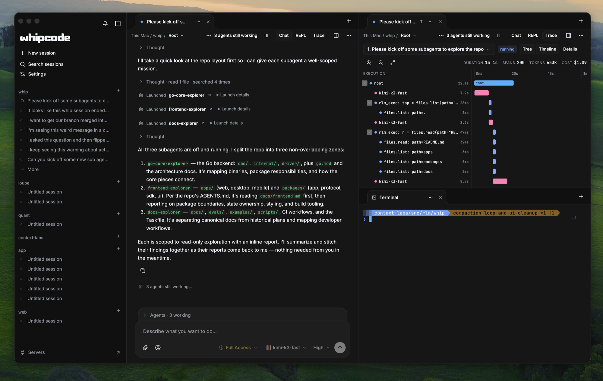
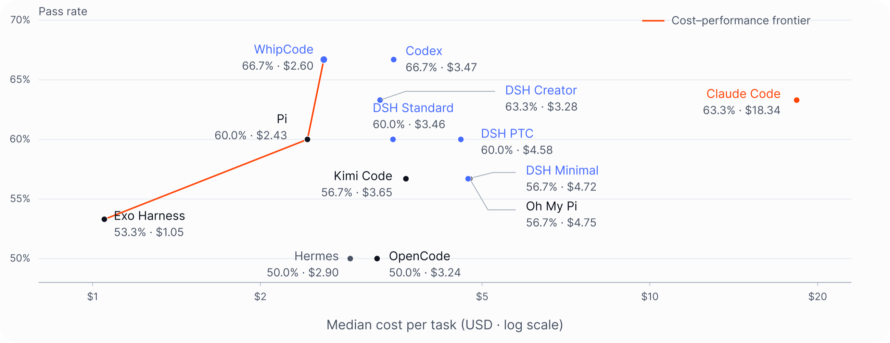

<h1 align="center">
  <br>
  <a href="https://github.com/context-labs/whip"></a>
   <br>
  WhipCode
  <br>
</h1>

<p align="center"><strong>A coding agent built for work that doesn’t fit in one context window.</strong></p>

<p align="center">
  <a href="LICENSE"></a>
  <a href="https://github.com/context-labs/whip/releases"></a>
</p>

<p align="center">
  <a href="#quickstart">Quickstart</a> ·
  <a href="#what-is-this">What is this?</a> ·
  <a href="#how-it-works">How it works</a> ·
  <a href="#benchmarks">Benchmarks</a> ·
  <a href="#development">Development</a>
</p>

[](docs/assets/whipcode-desktop.png)

## Quickstart

**[Download Desktop Beta](https://github.com/context-labs/whip/releases)** — Apple Silicon · macOS 14 or newer.

Use a release built after the clean-project reset; old Desktop releases are not an upgrade path.

1. Download `whipcode-desktop-darwin-arm64.dmg`, open it, and drag **Whip Beta** into Applications.
2. Launch it and choose **Set up this Mac** if prompted. The app includes its matching backend; no separate CLI installation is needed.
3. Connect a model provider, open your project, and describe what you want to do.

Bring an API key or use a supported subscription login. Provider access is separate from installing WhipCode. See [providers and authentication](docs/models-providers.md).

Prefer the terminal? Install the standalone CLI on macOS or Linux:

```sh
curl -fsSL https://raw.githubusercontent.com/context-labs/whip/main/install.sh | WHIPCODE_CHANNEL=prerelease sh
whipcode
```

The new CLI track starts at `v1.0.0-alpha.N`. Prerelease installation is explicit;
default stable installation becomes available with `v1.0.0`. Existing internal
installs must follow the [manual reset checklist](docs/team-reset.md), not upgrade in place.

Desktop-managed installations update through Desktop; standalone CLI installations use `whipcode update`. [Setup and upgrades →](docs/setup.md#desktop-installation-and-upgrades)

For the web client, start the daemon with `whipcode daemon start`, then run
`whipcode web`. It opens your browser and stays running as a separate gateway;
Ctrl+C stops web access, not daemon work. Ordinary daemon and Desktop startup
open no web listener. See [web access](docs/web-app.md#run-the-packaged-application-locally)
for `--no-open`, managed startup, and trusted-network configuration.

## What is this?

WhipCode is an open-source coding agent with a Desktop app, terminal UI, and web client. A shared daemon owns the work, so closing a window doesn’t end the session.

- **Delegate recursively.** Agents split work into focused tasks, launch their own agents, and coordinate through messages.
- **Keep context within reach.** Search and read history, files, and large tool outputs in bounded slices instead of cramming everything into a prompt.
- **See what’s happening.** Follow conversations, inspect the execution tree and timeline, and track model usage and cost.
- **Stay in control.** Choose models, set tool permissions, and connect local or remote execution hosts. Extend agents with skills and MCP servers.

## How it works

1. **Describe the task.** Give an agent a goal and the context it needs.
2. **Let it work.** A recursive language model (RLM) loop uses short Starlark or JavaScript programs to inspect context, call tools, and delegate—not just a growing chat transcript.
3. **Inspect and steer.** Follow the trace, send another instruction, or reconnect later. The daemon keeps session state independent of the UI.

[Explore the runtime →](docs/rlm-runtime.md)

## Benchmarks

WhipCode solved **20 of 30 tasks (66.7%)** in a retained Frontier evaluation: 21 Terminal-Bench tasks and nine code-repository tasks.

[](docs/assets/whipcode-benchmarks.png)

**Read the comparison with context:** providers and execution environments differ. The supplied chart’s $2.60 WhipCode point and cost-axis definition are not yet reconciled with the retained reports; this is not a matched cost comparison or an official leaderboard ranking. [Results, sources, and limitations →](docs/benchmarks.md)

## Development

Requires **Go 1.27+, Node.js 24, and [Task](https://taskfile.dev/)**.

```sh
git clone --branch main https://github.com/context-labs/whip.git
cd whip
npm ci
task build
```

This builds locally without replacing an installed app or restarting its daemon. See the [development and setup guide](docs/setup.md), [Desktop guide](docs/desktop.md), and [contributor checks](CONTRIBUTING.md).

[Documentation](docs/README.md) · [Architecture](docs/architecture.md) · [Frontend](docs/frontend.md) · [Evaluations](evals/README.md)

## License & contributing

[Apache-2.0](LICENSE). Issues and pull requests are welcome—start with [CONTRIBUTING.md](CONTRIBUTING.md).
