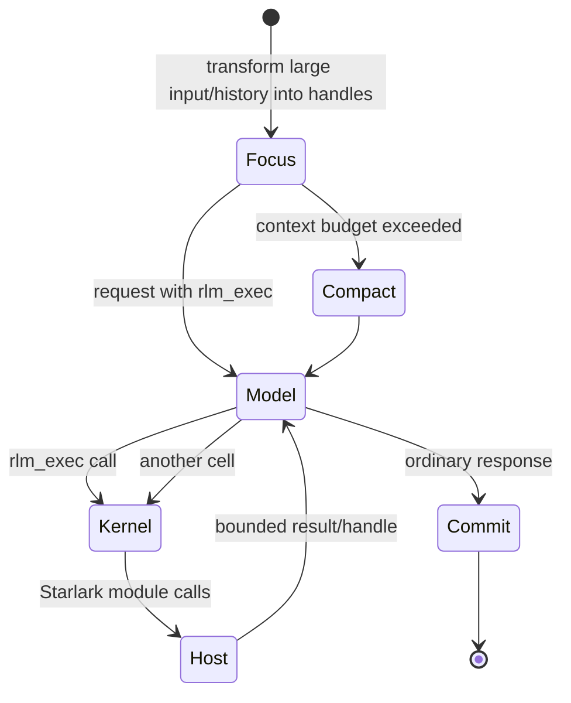

# The agent loop

`internal/agent` contains one provider loop. Runtime ownership chooses its
single model-facing tool (`rlm_exec`), while `AgentSession` binds that tool to
the session’s kernel and host identity.

The ordinary assistant response completes only the current agent’s turn. It
is persisted in that agent’s transcript, but it is not injected into the
parent. Cross-agent communication is an explicit durable message.

## Context focusing

At activation, the model receives a bounded recent history plus handles for
the complete history or oversized input. `context.inspect/search/read` lets a
cell retrieve only relevant spans. This keeps large corpora out of every model
request without making them inaccessible.

Proactive compaction runs when estimated context crosses the configured
fraction of the model window. A provider context-limit error may trigger one
reactive compaction and retry. Compaction summaries and raw-history cutoffs
are committed with the root turn.

## Child activation

`agents.spawn` performs these steps:

1. validate requested capabilities, budgets, and ancestry;
2. build an identical `AgentSession` and reserve a kernel worker;
3. commit the retained child and delegated grants atomically;
4. launch its first turn asynchronously.

Later message or agent-change notifications can activate the retained child
again. Notifications are coalesced metadata; the child inspects durable state
to decide what to do. On restart, the daemon reconstructs retained sessions,
their focused transcripts, authority, model route, and kernels.

The default recursion limit is two edges: root → child → grandchild.

## Model fan-out

`models.batch` runs independent completion calls concurrently and returns
results in input order. These calls share the caller’s durable token, cost,
elapsed, and active-operation budgets but do not create agent identities.

## Failure behavior

- A failed cell returns an error to the tool loop; committed host state is not
  rolled back speculatively.
- A worker crash loses Starlark globals only. The next execution starts a new
  worker against durable host state.
- A child turn may fail and remain retained/idle for a later activation.
- Stopping or deleting a child terminalizes its whole subtree and cancels its
  live processes and kernels.
- Daemon recovery keeps committed outcomes and marks uncertain work
  interrupted rather than replaying side effects.
