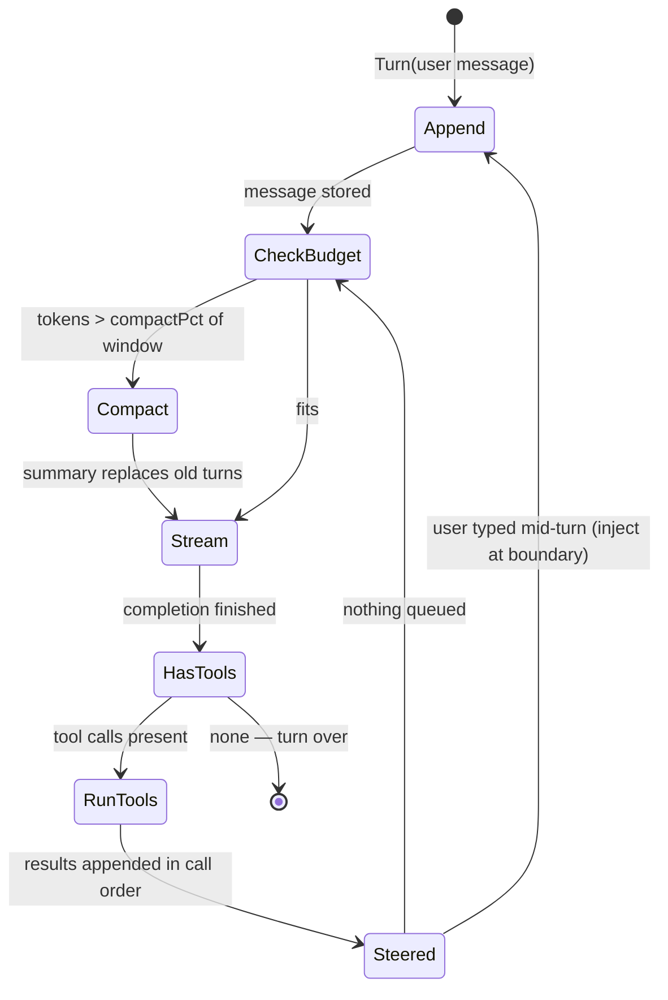
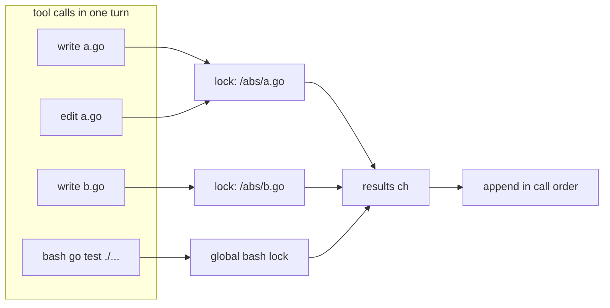
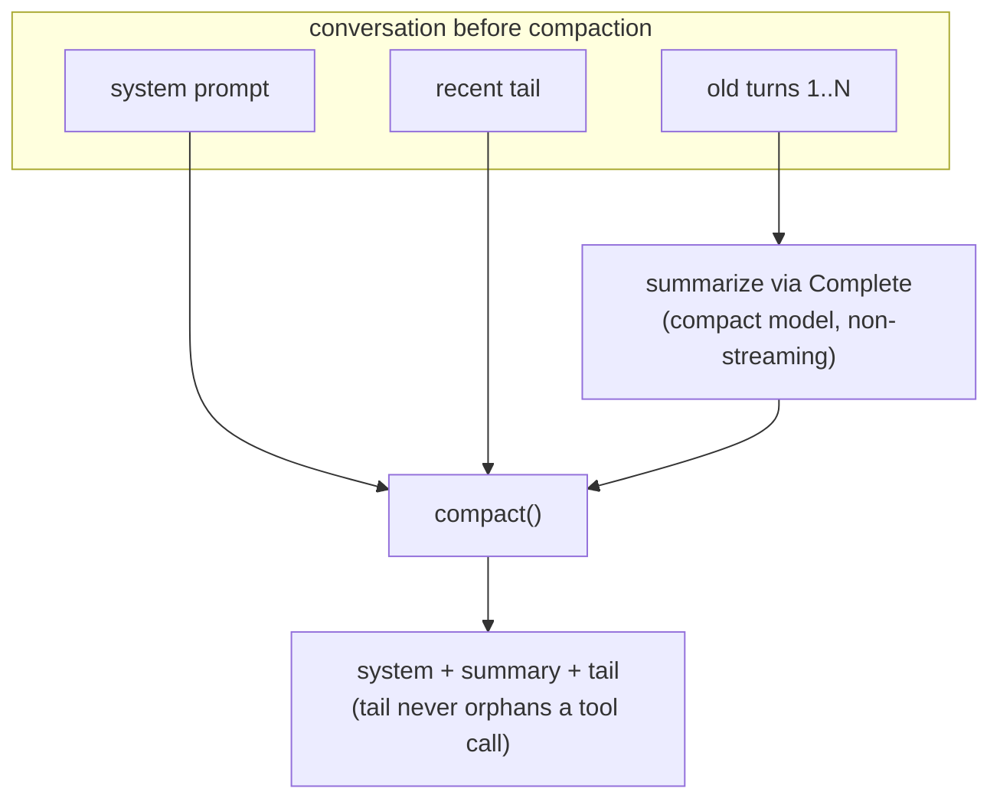

# The agent loop

`internal/agent/agent.go` — `Agent.Turn` is the whole idea: append the user
message, stream a completion, run any tool calls, append results, repeat
until the model stops calling tools.

## The cycle

Three properties worth knowing:

1. **Steering injects at loop boundaries only.** `Steer` queues a message;
   it lands between iterations, after tool results are appended — never
   mid-generation. Same mechanism delivers background-subagent reports.
2. **A context-limit error is recoverable.** If the provider rejects a
   request (`context_length_exceeded`, `prompt_too_long`, HTTP 413), the
   loop compacts once and retries. A `compacted` guard prevents retry loops.
3. **The loop is headless.** Events (tokens, tool start/end, compaction)
   flow out through a typed `Events` struct; the TUI is one consumer, tests
   are another. `Events.FanIn` merges subagent event streams.

## Parallel tool calls

When the model emits several tool calls in one turn, `runTools` fans them
out to goroutines. Mutations to the same file serialize through a
per-canonical-path channel lock; everything else runs truly in parallel.
Results land back in **call order**, because the chat API matches tool
results to call IDs.

`bash` takes the global lock because a command's side effects aren't
attributable to one path. Reads don't lock. The why and the Go idiom:
[concurrency.md](concurrency.md).

## Compaction

Context is a budget, and the loop spends it deliberately:

- **Proactive** — `maybeCompact` runs before each request once the estimated
  token count crosses a percent of the advertised window (default 50%,
  `compactPct` in config, slidable ←/→ in the ctrl+p palette).
- **Reactive** — a provider context-limit error triggers one compaction +
  retry.

`compact()` keeps the system prompt plus a recent tail, and is
**orphan-safe**: a tail that begins with a `tool`-role message walks back to
its owning assistant message, so no tool result references an erased call ID.

The summarizer uses the configured `compactModel`/`compactProvider`, or defaults
to `deepseek-v4-flash-0731` (`config.DefaultCompactModel`). Without an explicit
`compactProvider`, it uses the summarizer model's configured provider rather than
the conversation's default provider. If the default model is unavailable, it uses
the conversation's own model. `/compact [model] [provider]` does it by hand.

## Context decay

Compaction is the emergency brake; **decay** is the daily hygiene. Old tool
output is the main way context gets polluted — a 2,000-line file read from
thirty turns ago keeps taxing (and distracting) every request. Decay shrinks
it deterministically (no LLM call) once per turn, in `Agent.decay()`
(`internal/agent/decay.go`), before the new user message lands.

The cache-stability invariant: the newest **~24k tokens** of context (the
"hot window", `decayHotWindow`, measured from the back of the message list
with the same len/4 estimate compaction uses) are never mutated. Pruning only
touches content older than the window, so the pruned prefix stays
byte-identical across turns and the provider's prompt cache keeps hitting;
the only cold recompute per turn is the window itself.

Two mechanisms, both keyed off the tool-call graph, plus a dedupe pre-pass:

1. **Duplicate reads.** A re-read of the same region (identical path, offset,
   limit) returning identical bytes carries no new information: the later
   copy collapses to `⟨duplicate read of foo.go — same content as the first
   read above⟩`. Runs first so it compares pristine contents.
2. **Superseded reads.** When a file is re-read or written, the older `read`
   result collapses in place to
   `⟨read of foo.go superseded by newer read (4120 lines)⟩` (or "file changed
   by a later write/edit"). The model follows the newest vintage; it never
   needs two copies of the same file. The rewrite is idempotent, so after the
   one-time replacement the prefix re-stabilizes for the cache.
3. **Age decay.** A tool result that was big at ingestion (>8KB, ~2k tokens,
   `decayMinBytes`) and has since aged out of the hot window collapses to
   `⟨bash "go test ./..." output, 41k bytes — ran here 3 turn(s) ago; full
   output: /tmp/…⟩` — what ran (the actual command from the tool call's args,
   or the path for file tools), how big it was, how many authored turns ago
   it landed, and where the full text lives. When the result was never
   truncated at ingestion, the full content is spilled at decay time so the
   placeholder always points at a recoverable copy. Small results (errors,
   short greps — the semantic glue) stay inline forever. Assistant messages
   are never rewritten: reasoning chains matter.

Rewritten messages fire `Events.OnDecay`; the TUI responds by re-persisting
the prefix (the session store `INSERT OR REPLACE`s rows), so a resumed
session inherits the pruned state.

Decay composes with **truncation at ingestion** (`internal/tools/tools.go`):
any single tool output over 50KB (`maxOutput`) is middle-elided — first and
last quarters kept, the repetitive middle replaced with a marker — and the
full output spilled to a temp file (`bashrun.Spill`). Truncation protects a
single turn; decay protects every turn after.

## Background subagents

the `subagent` tool with `background: true` runs a subagent concurrently and reports back
as a steered message on completion — one channel close wakes the tool
caller, the TUI redraw, and `/subagents` simultaneously. Details:
[concurrency.md](concurrency.md#2-background-subagents--one-channel-close-many-waiters).

## Read next

- [concurrency.md](concurrency.md) — the channel primitives
- [tools.md](tools.md) — what the tool calls actually do
- [features.md](features.md#the-agent-loop) — the same loop, linked to code and tests
