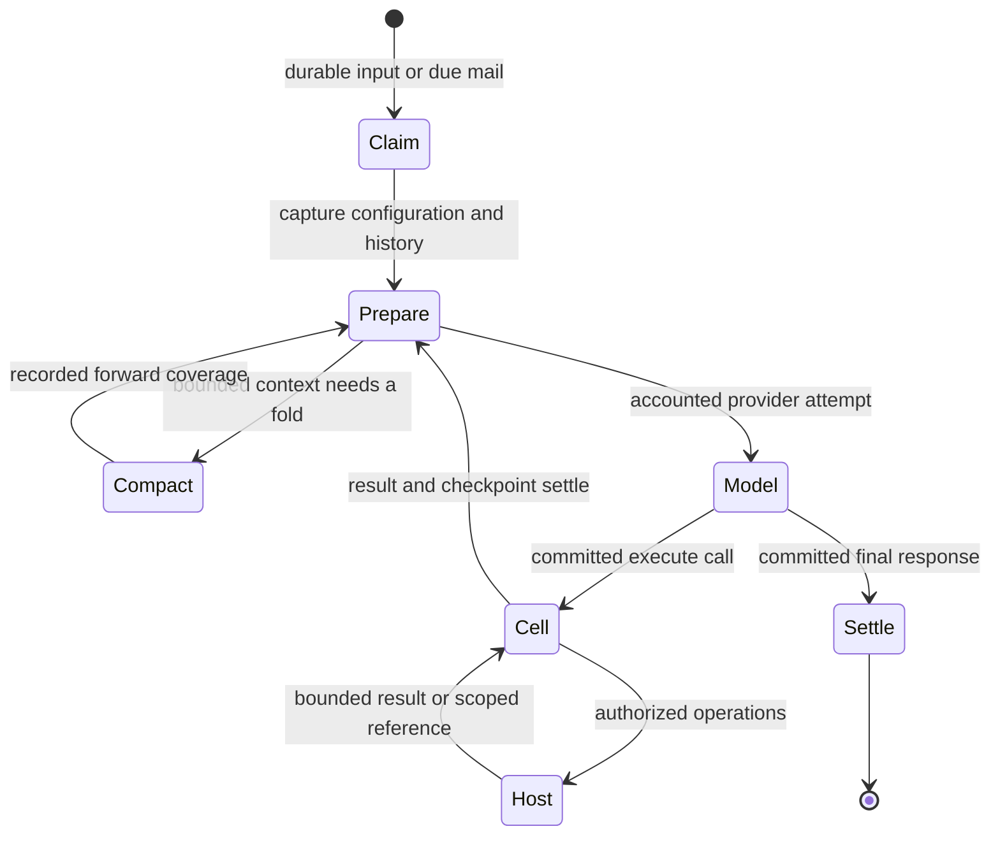

# The agent loop

[`internal/runner`](../internal/runner/runner.go) implements the shared native
provider/code loop through injected provider, transcript and host-operation
boundaries. The runtime owns scheduling and live resources; the store owns
transactional facts. Roots and children run this same path.

The model sees one `execute` tool. Its Starlark or JavaScript code calls captured
host modules and custom tools. A declaration describes available syntax; a
separate authorization check admits each effect.

```mermaid
stateDiagram-v2
    [*] --> Claim: durable input or due mail
    Claim --> Prepare: capture configuration and history
    Prepare --> Compact: bounded context needs a fold
    Compact --> Prepare: recorded forward coverage
    Prepare --> Model: accounted provider attempt
    Model --> Cell: committed execute call
    Cell --> Host: authorized operations
    Host --> Cell: bounded result or scoped reference
    Cell --> Prepare: result and checkpoint settle
    Model --> Settle: committed final response
    Settle --> [*]
```

Admission, running work and terminal outcome are different facts. Disconnecting
an observer does not cancel the turn. An ordinary assistant response completes
only that session's turn. A child's captured report policy can publish bounded
completion mail to its parent; the child's entire transcript is never inserted
into the parent's context.

## Context and compaction

Raw history is retained independently from the selected model context. The
runner assembles bounded messages using recorded summaries and exact source
boundaries. Guest context inspection/search/read accesses scoped history without
making every byte part of every model request. Instruction capture occurs once
per turn; later filesystem or configuration edits affect a subsequent turn.

Compaction preserves assistant/tool exchanges and the exact opening input of a
partially covered prompt turn. It must make forward coverage progress and produce
a shorter replacement. An indivisible input, exchange or summary that cannot fit
fails explicitly. Proactive compaction uses a declared window and current-turn
usage or bounded estimates; unknown windows disable that proactive check.
An estimate alone is not proof of a provider context rejection.

A complete recognized structured HTTP context rejection permits one bounded
replan after the rejected attempt settles. Compaction must advance coverage before
a new ordinary model round. Generic errors, partial streams, transport uncertainty
and failed settlement do not authorize replay. Completed cells are not repeated.
Manual compaction and summary selection use explicit revisioned controls.
See [raw history and selected context](backend-domain.md#raw-history-and-selected-model-context)
for limits, helper routing and the intra-turn opening-input rule.

## Cells and checkpoints

Completed assistant calls are committed before admitting their cells. The runner
bounds logical model calls and dispatched cells per turn. Each cell records its
turn, assistant message and provider call identity; atomic begin admits one
execution. One serialized kernel belongs to the session, and its process slot
stays pinned through settlement before the next provider request.

Checkpoint bytes are staged first. The result, cell outcome and checkpoint
reference commit together, so a failed candidate cannot become restorable.
A language error can retain changed globals and a valid checkpoint. Transport
loss or cancellation instead leaves uncertain execution. A completed result
without a usable checkpoint remains readable, but further code fails rather than
silently loading an older image.

Restore checks digest, size, engine build/ABI/profile and fidelity. Starlark
records skipped globals in a partial checkpoint; QuickJS preserves its whole
image within its resource contract. Neither restores by evaluating old cells.
History rewind invalidates the REPL boundary even if every message is retained.
See [checkpoint ownership](backend-domain.md#code-execution-and-checkpoint-boundary).

## Recursive work and coordination

Spawn atomically records child identity, captured configuration, delegated grants,
scoped input references and ordinary input admission. Children wait for execution
capacity without becoming a second orchestration type. A delegated standing grant
must match its direct parent's scope and retain a valid issuer chain.

`agents.wait_after_cell` records descendant input targets and returns immediately.
The cell finishes, commits its result/checkpoint and releases its kernel and
execution permit before waiting. Resumption reacquires permission. This permits
recursive progress with one worker and one kernel slot and replaces same-cell
blocking joins. Failed child outcomes resolve as data; they do not automatically
retry the child or fail the parent.

Mail, shared/private state and history have separate authorities. Inspection is
not delivery acknowledgement. A bounded publisher transfers a child's exact
completion evidence into parent-owned mail/content; capacity failure leaves that
evidence pending without rerunning the child. `models.batch` fans out stateless
accounted calls in input order without creating child identities. See
[child admission and waits](backend-domain.md#child-admission-delegation-and-waits),
[completion reports](backend-domain.md#child-completion-reports) and
[mail](backend-domain.md#mail-and-presentation).

## Failure and recovery

Every dispatched model attempt has durable accounting, including helper calls.
Missing usage/cost stays unknown. Confirmed retryable attempts may retry within
the active turn under the provider contract; uncertain streams and effects do
not. Retrying a database write or terminal settlement never redispatches work.

A failed cell returns recorded evidence to the loop; it cannot roll back an
external effect speculatively. Failed or uncertain turns require explicit new
input. Stop, cancellation and deletion have distinct scopes; stop retains queued
input. Restart preserves unclaimed input and completed evidence and interrupts
claimed work. It never reconstructs a suspended interpreter continuation or
replays an entire turn.

The [concurrency guide](concurrency.md) records resource lifetimes, the
[domain guide](backend-domain.md) owns exact semantics, and the
[development record](backend-redesign-development.md) distinguishes deterministic
checks from live-provider, platform and final-cutover acceptance.
