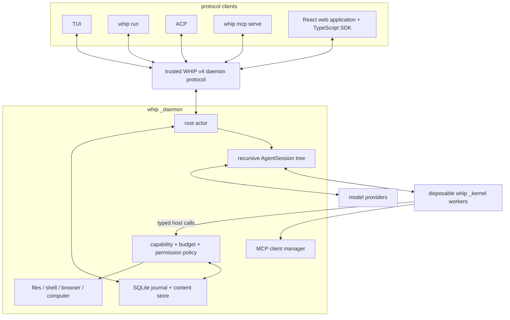
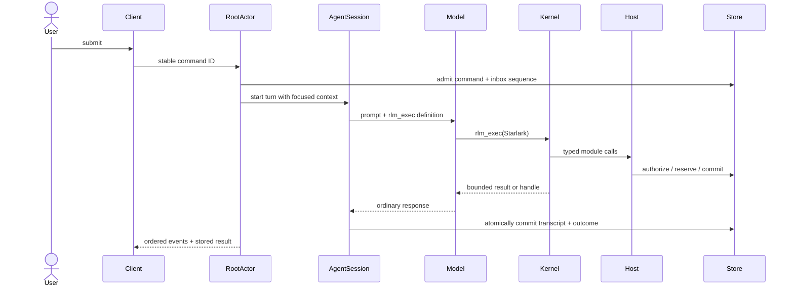

# Architecture

For the React application and component system, start with the canonical
[frontend architecture and design guide](frontend.md). It explains frontend
decisions, package boundaries, state ownership, and extension patterns.

The TypeScript SDK in `packages/sdk` is another thin protocol client. Browser and
Node WebSockets and Node Unix sockets feed one request/command engine; optional
framework-independent views reconstruct daemon state, and React subscribes to
those views. It never starts a daemon, runs an agent loop, owns provider keys, or
creates another history database. See [SDK usage](../packages/sdk/README.md) for
identity, cancellation, recovery, content and application ownership contracts.

whip is organized around one recursive agent abstraction. A root and a child
are both `AgentSession`s: each owns a provider loop, a bounded Starlark kernel,
a durable transcript, and an identity. Every model sees exactly one tool,
`rlm_exec`.

## Core invariants

1. **One model-facing interface.** Neither root nor child receives direct JSON
   file, shell, MCP, or child tools. Those capabilities are Starlark modules
   behind `rlm_exec`.
2. **One recursive session type.** Children are not one-shot tasks. They are
   retained sessions that can take later turns and create their own children
   within the configured depth and budget limits.
3. **One authority path.** Built-in effects enter the capability dispatcher;
   state, messages, schedules, and lifecycle changes enter root-actor APIs.
4. **Admission precedes durable execution.** Client commands are journaled
   before a turn. Child kernel capacity is reserved before the child record is
   committed, so a rejected spawn cannot leave a ghost agent.
5. **Communication is explicit.** An agent response is local to that agent.
   Parent and child exchange durable messages; notifications contain metadata,
   never message bodies.
6. **Large values are referenced.** SQLite holds metadata and small values.
   Large bodies live in the content store and cross boundaries as handles and
   bounded excerpts.
7. **Recovery does not guess.** Committed results survive. Uncertain external
   effects become interrupted and are not automatically replayed.

## A root turn

Child turns use the same `AgentSession` model and tool path. Today the root
actor and child wake path still use different scheduling/commit adapters; the
single-runtime consolidation plan removes that final lifecycle split. The
intended differences are only parent ID, delegated capabilities, effective
budgets, and private transcript.

## Process and storage boundaries

- `whip _daemon` is the sole owner of the runtime database, live agents,
  integrations, permissions, and managed processes.
- `whip _kernel` evaluates Starlark with bounded steps, host calls, memory,
  wall time, output, and frames. It has no ambient provider credentials or
  direct filesystem/network API.
- Clients use one typed WHIP v4 contract in JSON-RPC 2.0 envelopes over Unix
  newline framing or WebSocket text messages. Transport adapters share validation
  and application handlers. No v1 codec or build-equality attachment check remains.
- Commands acknowledge committed acceptance; the daemon supervises execution.
  Status and structured outcomes survive reconnect/restart, with deduplication
  by client namespace and command ID. Queries and ephemeral secret/terminal
  operations never enter the command journal.
- Reconnect reads a bounded snapshot and event cursor consistently, then subscribes
  strictly after that cursor. Raw transcript pages carry history revisions;
  collection pages carry collection revisions. Clients discard replaced stream IDs.
- Every connected client is trusted to answer permission requests and change
  permission modes. There is no pairing, signing key or client authentication.
  Agent capabilities, budgets, content grants and delegated MCP authority remain
  daemon-enforced; browser Host/Origin validation remains transport-owned.
- Provider onboarding, credentials, workspace completion and shared configuration
  are execution-host services. Only presentation preferences remain client-owned.
- SQLite WAL with synchronous=NORMAL retains daemon-crash durability. Schema 7
  is a clean break: incompatible databases fail without deletion or migration.
- New data lives under `~/.whip/runtime-v2/` (or
  `$WHIP_HOME/runtime-v2/`). The older `~/.whip/sessions.db` is deliberately
  left untouched by this clean break.

## Package map

| Package | Responsibility |
| --- | --- |
| `internal/protocol`, `packages/protocol` | typed operation/event contract, generated Draft-07 schemas, TypeScript and Ajv |
| `internal/daemon` | shared handlers, Unix/WebSocket/HTTP adapters, root actors, recursive runtime, lifecycle |
| `internal/session` | durable commands, transcripts, agents, messages, budgets, recovery |
| `internal/agentdef` | agent definitions and their registry: instructions and discovery toggles, selected modules and capabilities, model and compaction defaults, named children, and the capability-to-operation mapping; `Coding()` and `JuniorDeveloper()` are the first-party definitions |
| `internal/rlm` | kernel process, Starlark modules, runtime guide fragments, focused-context composer |
| `internal/capability` | identities, grants, path policy, operation admission |
| `internal/tools` | concrete built-in services reached through host modules |
| `internal/mcp` | external MCP connections and named tool calls |
| `internal/agent` | provider loop, streaming, compaction, usage accounting |
| `internal/tui`, `internal/acp` | presentation and protocol adapters only |
| `packages/sdk` | attach-only transports, commands, subscriptions, bounded reconstructed views and optional React hooks |
| `packages/ui` | Base UI components, extracted StyleX tokens/styles, shared generated themes, fonts and read-only syntax rendering; no SDK or host state |
| `packages/app` | React routes and workflows, SDK view leases, host query presentation, application drafts and preferences; no daemon/process ownership |
| `apps/web` | browser entry, storage/clipboard/download/link adapters, Vite build and browser acceptance |
| `internal/theme`, `cmd/themegen` | renderer-independent theme resolution and deterministic UI catalog generation |
| `internal/webassets`, `cmd/whip/web.go` | embedded web asset serving/discovery and explicit browser launch against an existing daemon |

## Browser application ownership

`createWhipApplication(platform)` creates one application runtime, TanStack Query
client and router. The platform supplies storage, external links, clipboard and
downloads; a future Electron shell can provide those effects without replacing
the application or SDK. The browser entry initializes appearance before mounting
React, connects explicitly, and disposes local resources on page teardown.

The SDK remains authoritative for reconstructing session state from protocol
snapshots, history and events. TanStack Query handles bounded host reads and
revisioned settings, not a second conversation cache. The app keeps unsent drafts
separate from metadata-only command recovery records. Switching recipients,
routes, hosts or themes cannot move one recipient's late acceptance onto another
draft. Runtime identity mismatches surface instead of silently adopting a new host.

UI and app are private source packages compiled by the official StyleX plugin.
The web build owns route splitting and CSS/font assets. Production UI uses no
runtime style compiler; validated custom themes set only known CSS variables.
The shared Go resolver owns terminal ANSI/Chroma semantics, and the UI derives
readable browser foregrounds while retaining the exact source catalog. Theme
changes preserve route, draft, scroll and highlighted-code identities.

The daemon serves packaged assets and API traffic on its existing optional
listener. `whip web` discovers and opens that endpoint; it never starts or
replaces the daemon. Browser clients are trusted to make permission decisions,
while internal capabilities and content grants remain daemon-enforced. See
[web-app.md](web-app.md) for launch, development proxy and trusted-network setup.

Read [rlm-runtime.md](rlm-runtime.md) for the programming model and
[concurrency.md](concurrency.md) for ownership and ordering.

See [protocol-v2.md](protocol-v2.md) for the wire contract, generation workflow,
content grants, and opt-in local/trusted-network setup.

### Session tab ownership

The web window owns up to 32 root-tab identities per connected runtime, while only
one conversation is mounted and at most four SDK views are retained. TanStack
Router owns selection and child/inspector search state; window sessionStorage owns
only bounded layout metadata. The bounded `sessions.summaries` query
supplies advisory descendant activity and human-input counts without opening roots.
Uploads and reading bookmarks belong to AppRuntime so navigation can release a
view without losing unsent work or the reader's place. Closing a tab has no daemon
execution meaning. See [web-app.md](web-app.md#session-tabs) for limits and behavior.

Model budget rows distinguish finite limits from explicit unlimited values.
Root cost/token/elapsed rows always exist for accounting, even when unlimited;
missing rows are not an unlimited fallback. Each transport attempt carries its
model's immutable prices, while the session store atomically enforces finite
ancestor allowances. Known usage, in-flight reservations, and uncertain exposure
are separate counters. Model settlement can record an estimate overage and
exhaust a finite allowance without losing the response or holding live capacity.
Resource limits retain their strict semantics. See [concurrency](concurrency.md)
and [frontend usage presentation](frontend.md#usage-and-execution-limits).
