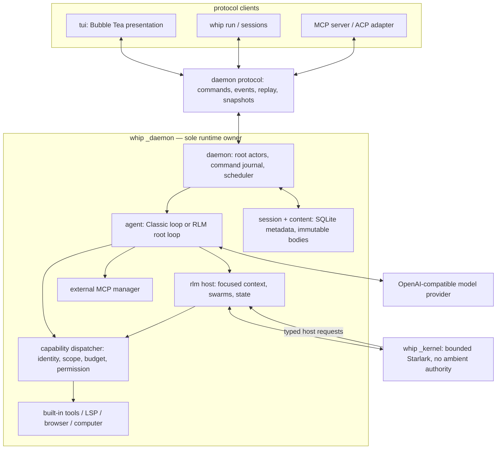

# Architecture

whip ships as one Go binary with three runtime roles: thin clients, one local
daemon, and disposable RLM kernel workers. The process boundary matters more
than the package boundary: only the daemon owns behavioral state and side
effects.

## The moving parts



The public clients do not open SQLite, construct an agent, call a provider,
or invoke a concrete tool. They submit stable protocol commands and render
authoritative events. The daemon owns one serialized actor mailbox per root,
while different roots can progress concurrently.

RLM and Classic differ only at the model-facing layer:

- **RLM (default):** the model sees `rlm_exec`. A persistent but disposable
  Starlark worker calls typed host modules; the daemon remains the source of
  truth and the only authority.
- **Classic:** `Agent.Turn` presents the familiar JSON tools directly. It
  still uses the same daemon, command journal, dispatcher, store, process
  manager, and event stream. It starts no kernel.

See [rlm-runtime.md](rlm-runtime.md) for the module and operational contract.

## One turn, end to end

```mermaid
sequenceDiagram
    actor You
    participant Client as TUI / run / ACP
    participant Daemon
    participant Root as root actor
    participant Model
    participant Kernel as RLM kernel (RLM only)
    participant Policy as capability dispatcher
    participant DB as journal + content

    You->>Client: submit
    Client->>Daemon: stable command id + last cursor
    Daemon->>DB: admit once; assign ingress sequence
    Daemon->>Root: enqueue command
    Root->>Model: focused RLM or Classic request
    opt RLM cell
        Model->>Kernel: rlm_exec(Starlark)
        Kernel->>Policy: bounded typed host calls
    end
    opt Classic tool call
        Model->>Policy: JSON tool request
    end
    Policy->>DB: validate, reserve, commit outcome
    Root->>DB: commit turn + ordered events
    Daemon-->>Client: stream events and stored command outcome
    Client-->>You: render
```

Key invariants:

- **Admission precedes execution.** Stable command IDs make reconnect retries
  idempotent; per-root ingress sequences define order.
- **A client never owns a turn.** Closing the TUI or losing an ACP connection
  does not cancel daemon work unless an explicit cancel command is admitted.
- **One policy path owns built-in effects.** Classic built-ins and RLM file or
  shell modules converge on the capability dispatcher, which revalidates
  identity, grant, scope, path, budget, operation state, and any permission at
  execution time. Durable state and child operations use root-actor APIs;
  external MCP tools remain daemon-owned integrations.
- **Large values are referenced.** SQLite holds metadata, grants, and small
  values. Larger bodies are immutable content-addressed files and cross model,
  worker, and protocol boundaries as bounded handles/excerpts.
- **Recovery is conservative.** Committed results survive. Uncertain in-flight
  effects become `interrupted` and are never automatically replayed.
- **Rendering is replaceable.** Every client reaches `live` only after ordered
  replay or an authoritative behavioral snapshot.

## Where things live on disk

| Path | What | Format |
| --- | --- | --- |
| `~/.whip/config.json` | provider, model, RLM, MCP, browser, and computer policy | JSON/JSONC |
| `~/.whip/daemon.sock` | local owner-only protocol endpoint | Unix socket, `0600` |
| `~/.whip/daemon.lock` | cross-process daemon ownership | advisory file lock |
| `~/.whip/daemon.log` | detached daemon diagnostics | text, `0600` |
| `~/.whip/sessions.db*` | durable runtime metadata and journal | SQLite WAL |
| `~/.whip/artifacts/sha256/` | immutable large-value bodies | content-addressed files |
| `~/.whip/models.json` | provider model-catalog cache | JSON |
| `~/.whip/memory.md` | installation memory | Markdown checkboxes |
| `.agents/skills/`, `~/.agents/skills/` | project and user skills | `SKILL.md` |
| `.mcp.json` | project MCP servers | JSON |

`WHIP_HOME` replaces `~/.whip`, primarily for hermetic tests. If that path is
too long for a Unix socket, the endpoint and lock move to an owner-specific,
hashed directory under the system temp directory; durable data stays in
`WHIP_HOME`.

## Package map

| Package | Responsibility |
| --- | --- |
| `internal/daemon` | Unix protocol, auto-start/checkpoint replacement, root actors, reconnect/replay/snapshot clients, scheduler, service lifecycle |
| `internal/session` | SQLite command/event/swarm/capability/budget/permission metadata and recovery transitions |
| `internal/content` | immutable SHA-256 bodies outside SQLite |
| `internal/capability` | shared admission dispatcher, workspace mutation ordering, and managed process ownership |
| `internal/rlm` | bounded Starlark kernel/worker protocol, module registry, focused prompt/history helpers |
| `internal/agent` | provider tool-use loop, compaction/decay, subagent machinery, todos |
| `internal/tui` | presentation, input, reconnect state, event rendering, human permission UX |
| `internal/llm` | OpenAI-compatible streaming/completion client and usage parsing |
| `internal/tools` | concrete built-in tools and daemon-owned services |
| `internal/mcp` | external MCP client manager and thin daemon-backed MCP server surface |
| `internal/acp` | ACP translation over a reconnecting daemon root client |
| `internal/lsp`, `internal/browser`, `internal/computer` | daemon-owned integration services |
| `internal/skills`, `internal/memory`, `internal/schedule` | prompt inputs and durable scheduling helpers |

## Read next

- [rlm-runtime.md](rlm-runtime.md) — modes, modules, limits, recovery, and operations
- [agent-loop.md](agent-loop.md) — the Classic loop and RLM root loop
- [concurrency.md](concurrency.md) — actor, channel, and process-lifetime rules
- [tools.md](tools.md) — model-visible operations and shared dispatch
- [features.md](features.md) — full feature map linked to code and tests
