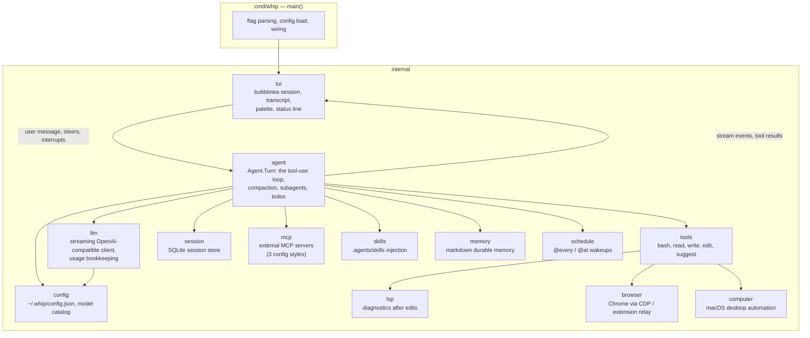
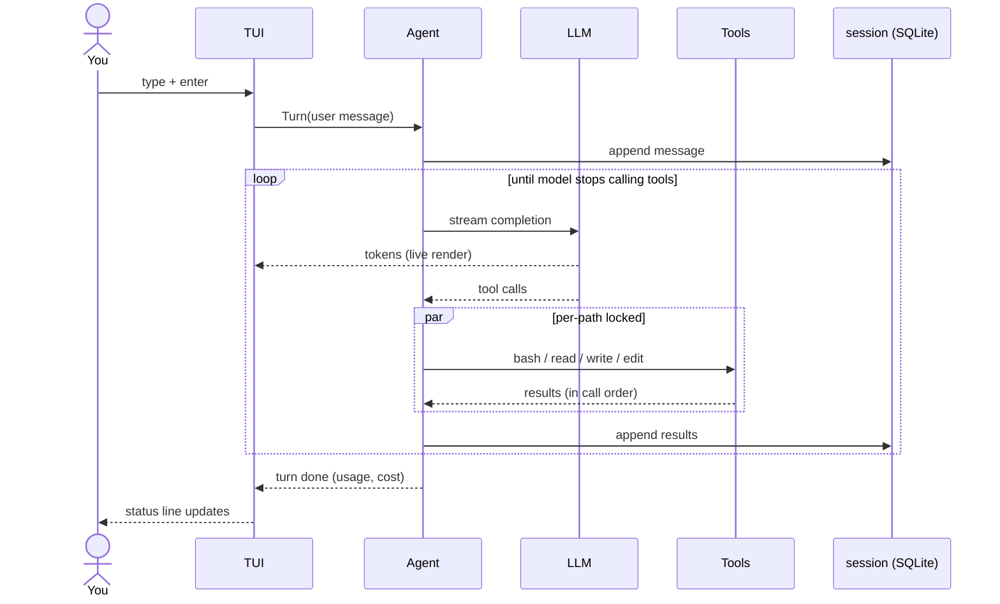

# Architecture

How a keystroke becomes a tool call. whip is a single Go binary with no
framework between you and the code — each box below is one package under
`internal/`.

## The moving parts

Dependencies point one way: `tui` owns the screen, `agent` owns the
conversation, everything else is a leaf the agent calls. Nothing imports
`tui` except `cmd/whip` — the loop is headless-testable, and `whip mcp serve`
reuses the tools without a UI.

## One turn, end to end

Key invariants:

- **The loop is synchronous; concurrency is internal.** From the TUI's view a
  turn is one call. Parallelism (fan-out tool calls, background subagents)
  happens inside `agent` and reports back through typed events.
  See [concurrency.md](concurrency.md).
- **Steering happens at loop boundaries.** A message you send mid-turn is
  queued and injected between iterations — never spliced into a half-streamed
  completion.
- **The provider is just an HTTP endpoint.** `llm` speaks OpenAI-compatible
  chat completions with streaming; routing, discovery, and pricing live in
  `config` + `~/.whip/models.json`. See [models-providers.md](models-providers.md).

## Where things live on disk

| Path | What | Format |
|---|---|---|
| `~/.whip/config.json` | providers, models, MCP, browser mode | JSON, hand-editable |
| `~/.whip/sessions.db` | conversation history, tasks | SQLite |
| `~/.whip/models.json` | provider `/models` catalog cache | JSON, 24h TTL |
| `~/.whip/memory.md` | durable memory the model maintains | Markdown checkboxes |
| `~/.whip/browser/extension/` | the Chrome extension for `browser.mode=extension` | unpacked extension |
| `.agents/skills/` (repo) | project skills injected into sessions | Markdown `SKILL.md` |
| `~/.agents/skills/` | user skills injected into sessions | Markdown `SKILL.md` |
| `.mcp.json` (repo) | claude-style MCP servers | JSON |

Everything is a file you can diff, grep, back up, or delete. There is no
daemon, no hidden state directory schema, no lock file that outlives the
process.

## Package map

| Package | One-liner |
|---|---|
| `internal/agent` | the tool-use loop: `Agent.Turn`, compaction, background subagents, todos |
| `internal/llm` | streaming chat-completions client, usage/cost parsing |
| `internal/tools` | bash, read, write, edit, suggest + tool schema definitions |
| `internal/tui` | bubbletea session: transcript, input, palette, status line |
| `internal/config` | config file, model catalog cache, provider resolution |
| `internal/session` | SQLite persistence for conversations and tasks |
| `internal/mcp` | MCP client: three config styles, lazy connect, auto-reconnect |
| `internal/skills` | skill discovery and injection |
| `internal/lsp` | gopls diagnostics surfaced to the model after edits |
| `internal/browser` | Chrome automation: live attach, dedicated, headless, extension relay |
| `internal/computer` | macOS computer-use: AX tree, screenshots, Chrome AppleScript |
| `internal/memory` | markdown-file durable memory |
| `internal/schedule` | `@every` / `@at` wakeups |

## Read next

- [agent-loop.md](agent-loop.md) — the loop in detail
- [concurrency.md](concurrency.md) — the channel patterns
- [features.md](features.md) — full feature map linked to code and tests
