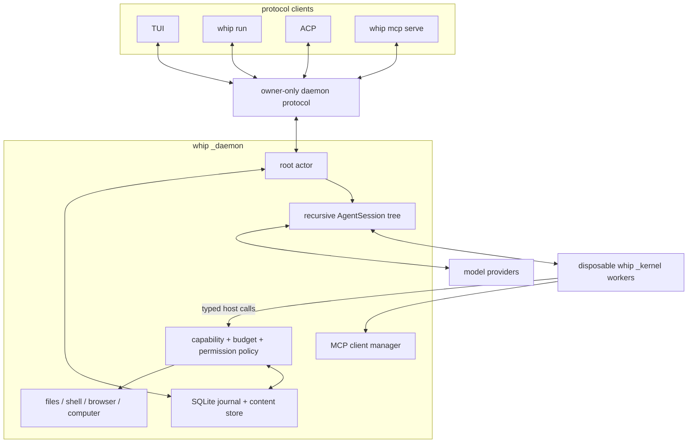
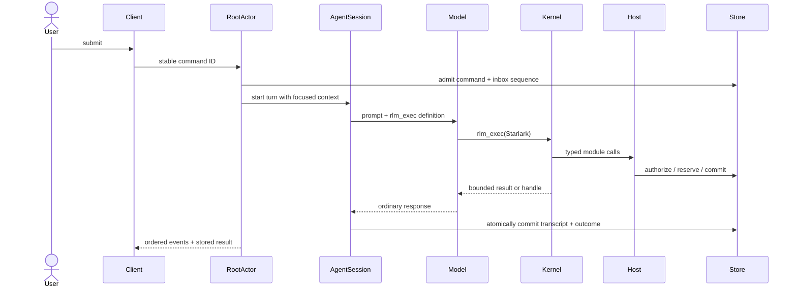

# Architecture

whip is organized around one recursive agent abstraction. A root and a child
are both `AgentSession`s: each owns a provider loop, a bounded Starlark kernel,
a durable transcript, and an identity. Every model sees exactly one tool,
`rlm_exec`.

## Core invariants

1. **One model-facing interface.** Neither root nor child receives direct JSON
   file, shell, MCP, or child tools. Those capabilities are Starlark modules
   behind `rlm_exec`.
2. **One recursive session type.** Children are not one-shot tasks. They are
   retained sessions that can take later turns and create their own children
   within the configured depth and budget limits.
3. **One authority path.** Built-in effects enter the capability dispatcher;
   state, messages, schedules, and lifecycle changes enter root-actor APIs.
4. **Admission precedes durable execution.** Client commands are journaled
   before a turn. Child kernel capacity is reserved before the child record is
   committed, so a rejected spawn cannot leave a ghost agent.
5. **Communication is explicit.** An agent response is local to that agent.
   Parent and child exchange durable messages; notifications contain metadata,
   never message bodies.
6. **Large values are referenced.** SQLite holds metadata and small values.
   Large bodies live in the content store and cross boundaries as handles and
   bounded excerpts.
7. **Recovery does not guess.** Committed results survive. Uncertain external
   effects become interrupted and are not automatically replayed.

## A root turn

Child turns use the same `AgentSession` model and tool path. Today the root
actor and child wake path still use different scheduling/commit adapters; the
single-runtime consolidation plan removes that final lifecycle split. The
intended differences are only parent ID, delegated capabilities, effective
budgets, and private transcript.

## Process and storage boundaries

- `whip _daemon` is the sole owner of the runtime database, live agents,
  integrations, permissions, and managed processes.
- `whip _kernel` evaluates Starlark with bounded steps, host calls, memory,
  wall time, output, and frames. It has no ambient provider credentials or
  direct filesystem/network API.
- Clients submit idempotent commands and rebuild presentation state from event
  replay or a snapshot. A client disconnect is not an execution boundary.
- New data lives under `~/.whip/runtime-v2/` (or
  `$WHIP_HOME/runtime-v2/`). The older `~/.whip/sessions.db` is deliberately
  left untouched by this clean break.

## Package map

| Package | Responsibility |
| --- | --- |
| `internal/daemon` | protocol server, root actors, recursive runtime, lifecycle |
| `internal/session` | durable commands, transcripts, agents, messages, budgets, recovery |
| `internal/rlm` | kernel process, Starlark modules, focused-context prompt |
| `internal/capability` | identities, grants, path policy, operation admission |
| `internal/tools` | concrete built-in services reached through host modules |
| `internal/mcp` | external MCP connections and named tool calls |
| `internal/agent` | provider loop, streaming, compaction, usage accounting |
| `internal/tui`, `internal/acp` | presentation and protocol adapters only |

Read [rlm-runtime.md](rlm-runtime.md) for the programming model and
[concurrency.md](concurrency.md) for ownership and ordering.
