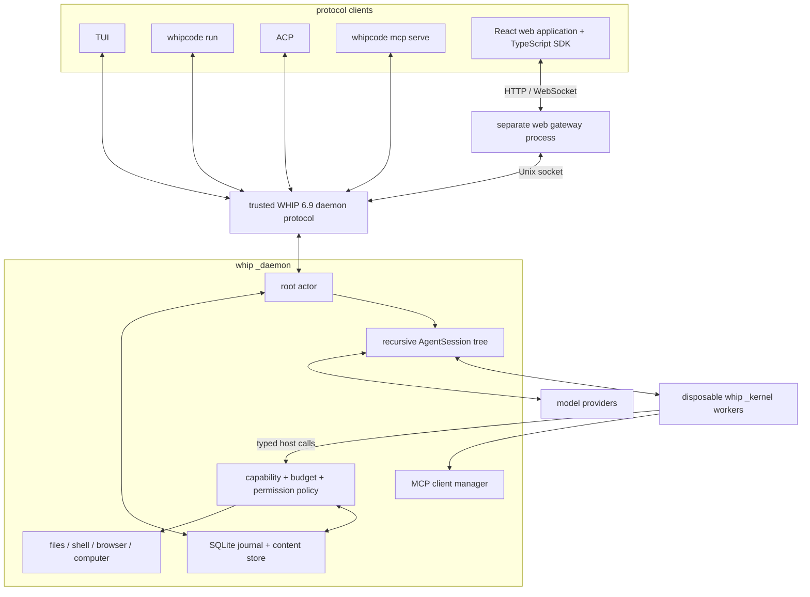
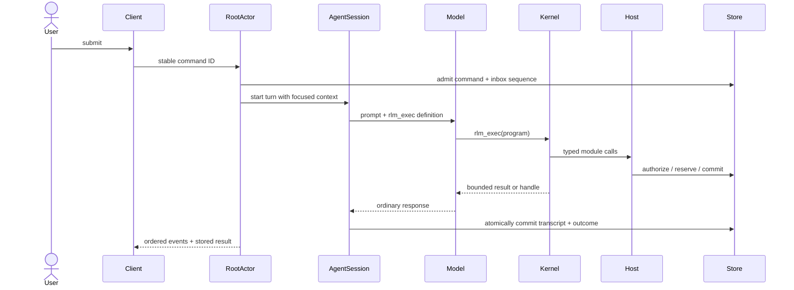

# Architecture

For the React application and component system, start with the canonical
[frontend architecture and design guide](frontend.md). It explains frontend
decisions, package boundaries, state ownership, and extension patterns.

The TypeScript SDK in `packages/sdk` is another thin protocol client. Browser and
Node WebSockets and Node Unix sockets feed one request/command engine; optional
framework-independent views reconstruct daemon state, and React subscribes to
those views. It never starts a daemon, runs an agent loop, owns provider keys, or
creates another history database. See [SDK usage](../packages/sdk/README.md) for
identity, cancellation, recovery, content and application ownership contracts.

Model-driven roots and children both use `AgentSession` for the provider/tool
loop. Each has its own identity and transcript; descendants inherit the root
session's execution engine. Starlark and QuickJS (JavaScript) run behind the
same model-facing tool, `rlm_exec`, with engine-specific containment and
checkpoint formats. Tool-host roots expose services without a provider loop.

```mermaid
flowchart TB
    subgraph clients["protocol clients"]
        TUI["TUI"]
        RUN["whipcode run"]
        ACP["ACP"]
        BRIDGE["whipcode mcp serve"]
        WEB["React web application + TypeScript SDK"]
    end

    GATEWAY["separate web gateway process"]
    RPC["trusted WHIP 6.9 daemon protocol"]

    subgraph daemon["whip _daemon"]
        ROOT["root actor"]
        TREE["recursive AgentSession tree"]
        POLICY["capability + budget + permission policy"]
        SERVICES["files / shell / browser / computer"]
        MCP["MCP client manager"]
        STORE["SQLite journal + content store"]
    end

    KERNELS["disposable whip _kernel workers"]
    MODELS["model providers"]

    TUI & RUN & ACP & BRIDGE <--> RPC
    WEB <-->|HTTP / WebSocket| GATEWAY
    GATEWAY <-->|Unix socket| RPC
    RPC <--> ROOT
    ROOT <--> STORE
    ROOT --> TREE
    TREE <--> MODELS
    TREE <--> KERNELS
    KERNELS -->|typed host calls| POLICY
    POLICY --> SERVICES
    KERNELS --> MCP
    POLICY <--> STORE
```

## Core invariants

1. **One model-facing interface.** Neither root nor child receives direct JSON
   file, shell, MCP, or child tools. Those capabilities are host modules
   behind `rlm_exec` in the selected execution engine.
2. **One recursive session type.** Children are not one-shot tasks. They are
   retained sessions that can take later turns and create their own children
   within the configured depth and budget limits.
3. **One authority path.** Built-in effects enter the capability dispatcher;
   state, messages, schedules, and lifecycle changes enter root-actor APIs.
4. **Durable admission precedes execution.** Client commands are journaled
   before a turn. Child admission durably records the child, initial prompt and
   delegated authority/budgets before publishing and waking it. Admitted children
   queue for the shared worker pool; admission does not reserve an idle worker.
5. **Communication is explicit.** An agent response is local to that agent.
   Parent and child exchange durable messages; notifications contain metadata,
   never message bodies.
6. **Large values are referenced.** SQLite holds metadata and small values.
   Large bodies live in the content store and cross boundaries as handles and
   bounded excerpts.
7. **Recovery does not guess.** Committed results survive. Uncertain external
   effects become interrupted and are not automatically replayed.

## A root turn

```mermaid
sequenceDiagram
    actor User
    participant Client
    participant RootActor
    participant Agent as AgentSession
    participant Model
    participant Kernel
    participant Host
    participant Store

    User->>Client: submit
    Client->>RootActor: stable command ID
    RootActor->>Store: admit command + inbox sequence
    RootActor->>Agent: start turn with focused context
    Agent->>Model: prompt + rlm_exec definition
    Model->>Kernel: rlm_exec(program)
    Kernel->>Host: typed module calls
    Host->>Store: authorize / reserve / commit
    Kernel-->>Model: bounded result or handle
    Model-->>Agent: ordinary response
    Agent->>Store: atomically commit transcript + outcome
    RootActor-->>Client: ordered events + stored result
```

Child turns use the same `AgentSession` model and tool path. The root actor and
child wake path retain distinct scheduling and commit adapters. Sharing a model
loop does not make those lifecycles identical. See [concurrency](concurrency.md)
for admission and worker ownership, and [execution language and checkpoints](rlm-runtime.md#execution-language-and-checkpoints)
for the engine-specific guarantees. The backend reorganization changes neither.

## Process and storage boundaries

- `whip _daemon` is the sole owner of the runtime database, live agents,
  integrations, permissions, and managed processes.
- The separate web gateway serves packaged assets and browser HTTP/WebSocket
  traffic, forwarding runtime operations over the daemon's Unix socket.
- `whip _kernel` evaluates the selected Starlark or QuickJS engine with its
  existing limits on execution, host calls, memory, output and frames. It has no
  ambient provider credentials or direct filesystem/network API. Checkpoint
  fidelity and containment remain engine-specific.
- Clients use one typed WHIP 6.9 contract in JSON-RPC 2.0 envelopes over Unix
  newline framing or WebSocket text messages. Transport adapters share validation
  and application handlers. No v1 codec or build-equality attachment check remains.
- Commands acknowledge committed acceptance; the daemon supervises execution.
  Status and structured outcomes survive reconnect/restart, with deduplication
  by client namespace and command ID. Queries and ephemeral secret/terminal
  operations never enter the command journal.
- Reconnect reads a bounded snapshot and event cursor consistently, then subscribes
  strictly after that cursor. Raw transcript pages carry history revisions;
  collection pages carry collection revisions. Clients discard replaced stream IDs.
- Every connected client is trusted to answer permission requests and change
  permission modes. There is no pairing, signing key or client authentication.
  Agent capabilities, budgets, content grants and delegated MCP authority remain
  daemon-enforced; browser Host/Origin validation remains gateway-owned.
- Provider onboarding, credentials, workspace completion and shared configuration
  are execution-host services. Only presentation preferences remain client-owned.
- SQLite WAL with synchronous=NORMAL retains daemon-crash durability. The current
  schema is **21**, identity `whip-recursive-runtime-v21`. Existing migrations
  upgrade recognized matching schemas 10 through 20; older, newer or unrecognized
  stores are rejected without deletion. These rules are unchanged.
- Runtime data lives under `~/.whipcode/runtime-v2/` (or
  `$WHIPCODE_HOME/runtime-v2/`). The historical [manual reset](team-reset.md)
  applies to unsupported pre-reset installations, not supported migration paths.
  This reorganization's binary rollback checks compare schema-21 builds; they
  do not promise downgrade across earlier one-way migrations.

## Package map

| Package | Responsibility |
| --- | --- |
| `internal/protocol`, `packages/protocol` | typed operation/event contract, generated Draft-07 schemas, TypeScript and Ajv |
| `internal/daemon` | shared handlers, Unix/WebSocket/HTTP adapters, root actors, recursive runtime, lifecycle |
| `internal/client` | native Go clients, command/event handling, reconnect and service methods using the existing protocol and framing; no dependency on daemon implementation |
| `internal/daemonconn` | shared runtime paths, validated local dialing, native launch primitives, initialization limits and event envelope; daemon retains ownership locks and lifecycle policy |
| `internal/commandpresentation` | shared formatting of stored command results for existing native text presenters |
| `internal/provider` | host provider configuration, discovery, catalogs and account login lifetimes; borrows existing config/auth storage and exposes operations to daemon without importing it |
| `internal/session` | durable commands, transcripts, agents, messages, budgets, recovery and the native session creation value; connection setup and store lifecycle are grouped in [store.go](../internal/session/store.go) |
| `internal/agentdef` | agent definitions and their registry: instructions and discovery toggles, selected modules and capabilities, model and compaction defaults, named children, and the capability-to-operation mapping; `Coding()` and `JuniorDeveloper()` are the first-party definitions |
| `internal/rlm` | Starlark and QuickJS kernel engines, host modules, runtime guide fragments, focused-context composer |
| `internal/capability` | identities, grants, path policy, operation admission |
| `internal/tools` | concrete built-in services reached through host modules |
| `internal/mcp` | external MCP connections and named tool calls |
| `internal/agent` | provider loop, streaming, compaction, usage accounting |
| `internal/tui`, `internal/acp` | presentation and protocol adapters only |
| `packages/sdk` | attach-only transports, commands, subscriptions, bounded reconstructed views and optional React hooks |
| `packages/ui` | Base UI components, extracted StyleX tokens/styles, shared generated themes, fonts and read-only syntax rendering; no SDK or host state |
| `packages/app` | React routes and workflows, SDK view leases, host query presentation, application drafts and preferences; no daemon/process ownership |
| `apps/web` | browser entry, storage/clipboard/download/link adapters, Vite build and browser acceptance |
| `internal/theme`, `cmd/themegen` | renderer-independent theme resolution and deterministic UI catalog generation |
| `internal/webgateway` | separate browser gateway, Host/Origin validation and forwarding to the existing daemon |
| `internal/webassets`, `cmd/whip/web.go` | packaged assets and explicit foreground/check/open gateway commands against an existing daemon |

Startup composes daemon orchestration, provider services and storage. Native Go
clients depend on the existing protocol/framing and neutral connection primitives,
without importing `daemon`; TUI and ACP production code imports the client.
Integration tests retain real daemon fixtures where needed. The protocol package
still imports canonical `session`, `config`, `llm`, `capability` and `mcp` values.
It is not a dependency-free leaf. Those representation dependencies avoid a new
model or translation layer. The native `CreateSession` value lives in `session`,
with identity-preserving aliases in daemon and client; stored-result presentation
has one unchanged decoder in `commandpresentation`.

Provider configuration retains its existing atomic host-configuration update and
provisioning lock, including fields outside provider setup. Host MCP import/icon
ownership lives in [mcp_import_service.go](../internal/daemon/mcp_import_service.go);
directory handlers are grouped in [host_directory.go](../internal/daemon/host_directory.go). Neither
requires a new protocol or independent copy of configuration.

## Construction and resource lifetimes

| Resource | Constructor and borrowers | Owner and cleanup |
| --- | --- | --- |
| Session store | Startup opens it after the cross-process owner lock. Runtime/domain operations borrow it. | The caller owns it if `daemon.New` fails; successful construction transfers ownership to the daemon. `Daemon.Close` closes it after borrowers and the process manager. |
| Shared process manager | Startup constructs one immediately after successful `session.Open`, preserving the environment snapshot point. Roots, children, tools and MCP borrow that exact pointer. | Caller-owned on failed `daemon.New`; daemon-owned on success. Root teardown still uses `StopRoot`. Global close joins manager and database errors in that order and caches the result. A new store lifetime receives a new manager. |
| Workspace coordinator | Startup constructs it immediately before `session.Open`; storage borrows it and keeps the existing `Workspaces()` accessor for authority checks and tool borrowers. | No close operation or fallback allocation. Existing root and delegation authorization order, including transactions, is unchanged. |
| Provider service | Startup constructs it; the server uses it and host MCP borrows its cancellation context. | `Server.Close` closes it before daemon shutdown. Startup's existing deferred close remains. |
| Kernel manager | Startup constructs it; the runtime factory and agent sessions borrow it. | Existing runtime releases and startup's deferred close retain worker lifetime and sharing. |

The existing factory and its helpers live in
[daemon_runtime.go](../cmd/whip/daemon_runtime.go). Configuration reload and kernel
command construction still run at the same invocation points. Within storage,
[store.go](../internal/session/store.go) groups connection setup, borrowed resource
references, the daemon ownership guard and database closure; domain models, SQL,
authority checks and transactions remain in their existing files.

These lifetimes are not a generic `CloseAll` sequence. `Server.Close` tears down
browser providers, listeners, connections and uploads before provider/daemon
shutdown; `Daemon.Close` waits for roots and accepted background work before
closing the process manager and database. Failed construction retains the
caller's resources and releases the in-process guard where it acquired it.
Actor scheduling and tracing bookkeeping stay beside their current locks,
causal contexts and commit boundaries. There is no equally clear, low-risk
extraction to justify moving them in this effort.

## Browser application ownership

`createWhipApplication(platform)` creates one application runtime, TanStack Query
client and router. The platform supplies storage, external links, clipboard and
downloads; the Electron shell supplies native effects while consuming the same
web renderer artifact and SDK contracts. The browser entry initializes appearance
before mounting React, connects explicitly, and disposes local resources on page
teardown.

The SDK remains authoritative for reconstructing session state from protocol
snapshots, history and events. TanStack Query handles bounded host reads and
revisioned settings, not a second conversation cache. The app keeps unsent drafts
separate from metadata-only command recovery records. Switching recipients,
routes, hosts or themes cannot move one recipient's late acceptance onto another
draft. Runtime identity mismatches surface instead of silently adopting a new host.

UI and app are private source packages compiled by the official StyleX plugin.
The web build owns route splitting and CSS/font assets. Production UI uses no
runtime style compiler; validated custom themes set only known CSS variables.
The shared Go resolver owns terminal ANSI/Chroma semantics, and the UI derives
readable browser foregrounds while retaining the exact source catalog. Theme
changes preserve route, draft, scroll and highlighted-code identities.

The separate gateway serves packaged assets and browser API traffic for an
existing daemon. `whipcode web` runs a foreground gateway, checks an existing
one, or opens an explicit URL; it never starts, restarts or reconfigures the
daemon. Opt-in managed startup supervises a gateway child. Browser clients are
trusted to make permission decisions, while internal capabilities and content
grants remain daemon-enforced. See
[web-app.md](web-app.md) for launch, development proxy and trusted-network setup.

Read [rlm-runtime.md](rlm-runtime.md) for the programming model and
[concurrency.md](concurrency.md) for ownership and ordering.

See [protocol-v2.md](protocol-v2.md) for the wire contract, generation workflow,
content grants, and opt-in local/trusted-network setup.

### Session tab ownership

The window owns one workspace across hosts, with up to 32 open views in four
panes. Each visible pane mounts its selected conversation; duplicate views share
SDK observation. The four-root retention budget is window-wide, with unused
views expiring after 30 seconds and actively leased roots never evicted. App
`SessionTabs` owns the split tree and pane selection, while TanStack Router owns
route and child/inspector search state. Browser sessionStorage holds bounded
layout metadata; desktop uses namespaced localStorage. The bounded
`sessions.summaries` query supplies advisory activity and human-input counts
without opening roots. Uploads and reading bookmarks belong to AppRuntime, so
navigation can release a view without losing unsent work or the reader's place.
Closing a conversation tab has no daemon execution meaning. See
[session tabs and split views](web-app.md#session-tabs-and-split-views) and the
[frontend ownership guide](frontend.md#split-workspace) for current limits and
behavior.

Model budget rows distinguish finite limits from explicit unlimited values.
Root cost/token/elapsed rows always exist for accounting, even when unlimited;
missing rows are not an unlimited fallback. Each transport attempt carries its
model's immutable prices, while the session store atomically enforces finite
ancestor allowances. Known usage, in-flight reservations, and uncertain exposure
are separate counters. Model settlement can record an estimate overage and
exhaust a finite allowance without losing the response or holding live capacity.
Resource limits retain their strict semantics. See [concurrency](concurrency.md)
and [frontend usage presentation](frontend.md#usage-and-execution-limits).
