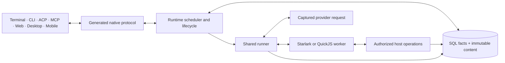

# Architecture

Whip's backend is Go. The native runtime owns durable sessions, accepted work
and host execution. Every supported client connects through the same generated
protocol: the terminal, headless CLI, ACP, MCP bridge, browser, desktop and mobile.
Roots and children use the same session records and execution path.

This describes the native redesign in this source tree. It does not say the
unmerged draft stack is deployed. See the [development record](backend-redesign-development.md)
for exact passing revisions, open acceptance and remaining retired-code removal.

## Ownership

The detailed backend contract is [backend-domain.md](backend-domain.md). The
[frontend guide](frontend.md) owns renderer architecture, and the
[SDK guide](../packages/sdk/README.md) owns public TypeScript APIs.

| Boundary | Owns |
| --- | --- |
| `internal/session` | Durable values, validation and identity; no runtime, SQL or provider clients |
| `internal/store` | Complete SQL transactions and the authoritative durable facts |
| `internal/runtime` | Scheduling, live session resources, cancellation and bounded observations |
| `internal/runner` | The shared provider/operation loop through injected boundaries |
| `internal/engine` | Isolated Starlark and QuickJS execution and settled checkpoints |
| `internal/hostcmd` | Native command lifetime, provider/account managers, socket and optional gateway |
| `internal/protocol` and `internal/rpc` | Explicit generated DTOs, validated methods and client transport boundaries |
| Go and TypeScript clients | Identity checks, admission/recovery and bounded observation; no second execution owner |

SQLite owns sessions, accepted inputs, receipts, turns, canonical messages,
attempts, permissions, grants, goals, schedules and coordination evidence.
Immutable bodies and checkpoint bytes live in content files with durable metadata.
Runtime memory owns workers, kernels, processes, previews and subscriptions.
Reading a retained session does not load a worker or start a model call.

```mermaid
flowchart LR
    Clients["Terminal · CLI · ACP · MCP · Web · Desktop · Mobile"]
    API["Generated native protocol"]
    Runtime["Runtime scheduler and lifecycle"]
    Store[("SQL facts + immutable content")]
    Runner["Shared runner"]
    Provider["Captured provider request"]
    Worker["Starlark or QuickJS worker"]
    Effects["Authorized host operations"]
    Clients <--> API
    API <--> Runtime
    Runtime <--> Store
    Runtime --> Runner
    Runner <--> Provider
    Runner <--> Worker
    Worker <--> Effects
    Runner --> Store
    Effects --> Store
```

## An ordinary turn

1. Admission verifies the owner and persists a stable request identity, digest,
   receipt and input in one transaction. An exact retry resolves the existing
   result; a changed payload under the same identity conflicts.
2. The scheduler claims work and creates a turn with captured configuration.
   A session has at most one active turn. Roots and children use this same path.
3. The runner makes accounted provider attempts and executes authorized calls.
   Provider I/O and host effects occur outside SQL transactions and scheduler locks.
4. Canonical messages, cells, operations and terminal settlement become durable.
   Provisional text/reasoning remains bounded live presentation, not an event store.
5. Clients reconcile stored evidence. Disconnecting or cancelling a local wait
   stops observation; cancelling accepted execution requires an explicit action.

A model sees the engine's `execute` tool, whose code calls the captured host
modules and custom tools. Definitions are immutable revisions. New sessions copy
resolved defaults; turns pin configuration revisions. Changing a host default or
model selection does not rewrite history, children, grants or settled execution.

## Recursion and recovery

A tree has one root; parent and tree identities never change. Children cannot
widen delegated authority or ancestor limits. Parent completion, cancellation,
child deletion and worker eviction have separate meanings. Mail inspection does
not acknowledge delivery; private state, shared state, VM globals and history
remain distinct authorities.

Accepted queued inputs survive restart. Completed partial history survives an
interrupted turn. Uncertain external effects are not automatically replayed, and
checkpoint restoration does not restore browser, terminal or executor authority.
Missing usage or cost remains unknown. A content digest identifies bytes; an
owner-scoped reference authorizes access to them.

## Process and client boundaries

The command starts one native host in a fresh `runtime-v4` directory beneath the
selected Whip home. Existing retired stores and configuration are not migrated
or opened. Runtime identity is durable; process epoch changes on restart. The
bundled `_kernel` entry runs isolated workers for both engines. Old `_daemon`
and `_web-gateway` entry points are rejected; the CLI removal and replacement
evidence are mapped in [native CLI disposition](backend-native-cli-disposition.md).

The native gateway serves the packed shared renderer, discovery, WebSocket and
scoped content routes. `whipcode web` owns a foreground gateway attached to an
existing native host; `WHIPCODE_NETWORK=1` instead opts runtime startup into an
in-process managed gateway. Each gateway stays pinned to its original runtime
identity and process epoch. Host/Origin checks are not authentication; network trust
must be explicit. Remote browser clients do not gain local terminal authority.
Desktop's native bridge and mobile's native renderer share the same backend and
SDK contracts. No frontend owns a provider loop, raw database or parallel copy
of durable lifecycle/history state.

Build and validation commands live in [Taskfile.yaml](../Taskfile.yaml). Final
cutover requires the retained feature/test disposition, complete client adoption,
performance acceptance and deletion checks in the [redesign plan](backend-redesign-plan.md).
A green unit suite alone does not establish signed packaging, real SSH, physical
mobile or live-provider acceptance.
