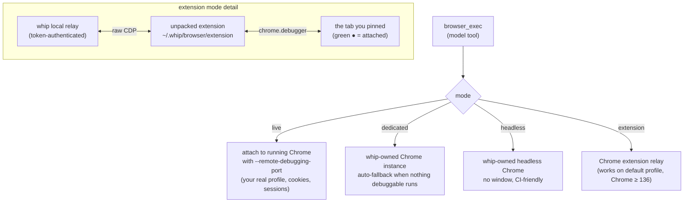
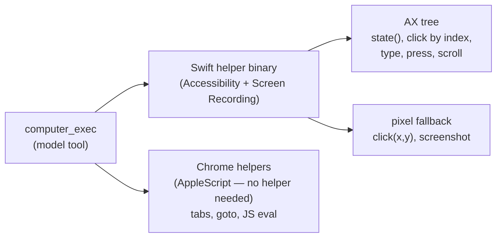

# Browser & computer use

whip can drive the user's existing Chrome and Mac desktop, or an explicitly
selected native Browser tab in the desktop workspace. Native tabs have isolated
profiles and scoped attachment authority; they do not borrow the user's external
Chrome profile. Legacy `browser_exec` and `computer_exec` behavior is unchanged.

## Legacy browser: four modes

`browser.mode` in `~/.whip/config.json` picks how whip talks to Chrome:

- **live** — whip scans well-known Chromium profile dirs for
  `DevToolsActivePort` and attaches. Zero setup if you launch Chrome with
  debugging on.
- **dedicated / headless** — whip launches its own Chrome; the automatic
  fallback when no debuggable Chrome is running.
- **extension** — the only mode that works on Chrome ≥ 136's **default
  profile**, where direct CDP is blocked. Chrome forbids programmatic
  extension install, so setup is `whip browser install` plus three clicks
  (Developer mode → Load unpacked → select the folder). Then click the
  extension icon on a tab to pin it; click again to detach. While pinned,
  Chrome shows a "whip is debugging this browser" bar — that bar *is* the
  mechanism.

## Desktop Browser tabs

This experimental path controls **the same embedded page the human sees**, using
the existing browser helper parser and Rod adapter over a scoped native CDP
transport. It does not launch a second automation browser, expose a production
debugging port, or fall back to any legacy browser mode. Desktop advertises inert
availability for an exact open conversation and native window even with zero
Browser tabs. An unambiguous destination can service an approved agent create;
multiple candidate windows require explicit selection. Existing human pages must
still be explicitly offered to a conversation before discovery or attachment.

The RLM browser module adds `list_tabs`, `open`, `attach`, `allow_preview_port` and `detach`;
`run` accepts an `attachment_id` as an alternative to its legacy session target.
The MCP tool host exposes corresponding `browser_list_tabs`, `browser_open`, `browser_attach`,
`browser_run`, `browser_allow_preview_port` and `browser_detach` tools. An unpaired
MCP client can discover these names but receives an unavailable/denied result,
not another browser. Do not combine legacy and attachment targets.

`browser.list_tabs()` requires Browser module authority, but not create/control
approval. It returns current, bounded metadata for explicitly root-offered tabs,
caller-created tabs and caller-owned attachments, not the window's private tab
inventory. Page titles and URLs are untrusted data. Discovery never creates a
page, acquires control, enables a preview route or injects inventories into prompts.
An available Desktop with no shared pages returns `availability: "available"`
and `tabs: []`; unavailable, ambiguous and older providers return structured
errors. A listed `tab_id` is only a candidate for permission-gated `attach`.

Open, attach and port expansion resolve exact provider/tab/profile/preview
identity **before** entering the existing durable permission dispatcher. Browser
resource requests remain Once-only in prompt mode; existing automatic permission
mode is respected. Availability and discovery do not bypass either policy.
Permission waiting does not consume the page execution
timeout; after approval, identity and authority are checked again. A run is
serialized for its entire batch, with bounded queuing, cancellation, document
revision checks and no replay of an uncertain delivered mutation. Screenshots
use authorized chunk RPCs on the selected holder connection, including for
WebSocket providers, scoped to the requesting root/agent. Agent filesystem upload/download helpers are
unsupported on this path; they cannot turn a renderer path into host access.

Attachment IDs alone convey no authority. Child use requires explicit
`browser_attachments` delegation during spawn, with fresh child-bound control and
ancestor revocation tracking; implicit inheritance is not allowed. Historical
roots without Browser module grants stay denied—start a fresh conversation.
Provider release, disconnect or revocation ends agent control without closing the
human's page. Reconnect can re-advertise availability, never restore control.
Existing explicit human-page offers require reselection; old roots are not
silently given new discovery grants.

For SSH previews, only approved literal remote loopback ports on the selected
saved SSH connection are reachable; there is no Mac-local fallback. Preview
network permission belongs to the tab environment, independently of the agent
attachment. See [desktop behavior](desktop.md#browser-tabs-experimental) and the
[frontend ownership boundary](frontend.md#native-browser-workspace-boundary).

Implementation: [`internal/tools/browser_desktop.go`](../internal/tools/browser_desktop.go),
[`internal/browser/desktop.go`](../internal/browser/desktop.go),
[`internal/daemon/browser_provider.go`](../internal/daemon/browser_provider.go),
[`SDK provider transport`](../packages/sdk/src/browser.ts), and
[`native control`](../apps/desktop/src/browser-control.ts).

## Computer use (macOS)

`computer_exec` drives the actual desktop: accessibility tree first, pixels
as fallback.

- **AX-first**: `state(app)` returns the app's indexed accessibility tree plus
  a screenshot; `click(app, index)` acts on elements, not coordinates.
  Element indexes are generation-guarded — if the UI changed since the read,
  the action fails instead of clicking the wrong thing.
- **Consent-gated**: the first drive of an app asks the user to approve.
  whip never guesses credentials and stops at login walls.
- **Chrome AppleScript path**: driving the user's open Chrome (tabs,
  navigation, `chrome_js`) works through Chrome's AppleScript dictionary with
  no helper at all — the flagship zero-setup path.

On macOS arm64 builds the Swift helper is embedded at build time via
`task driver`.

## Safety posture

Both tools act on the user's behalf with the user's sessions:

- browser relay requires a minted token; extension attach is explicit
  (user clicks the icon per tab).
- computer-use asks per-app consent and is confined to granted Accessibility
  / Screen Recording permissions.
- Screen content is treated as untrusted evidence, not instructions.

## Read next

- [features.md](features.md#browser-automation) — linked to code and tests
- [learnings/browser-use-integration.md](learnings/browser-use-integration.md) —
  the integration notes behind the design
- README §Browser — the user-facing setup walkthrough
