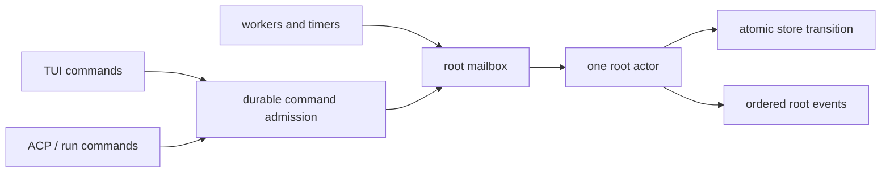

# Concurrency and ownership

whip deliberately separates serialization, concurrency, and process lifetime.
The daemon serializes decisions that must have one order, permits independent
work to fan out, and owns every goroutine or child process that may outlive a
client connection.

## Root actors: one durable order per session

Each open root has one actor mailbox. User turns, steers, child/state changes,
schedules, permission outcomes, control commands, and worker completions enter
that mailbox. The actor performs durable transitions in ingress order without
holding its queue while a model, tool, or database callback blocks.



This gives one root deterministic command and event sequences. Roots have
separate actors and can run concurrently. A panic or slow client for one root
does not hold the daemon registry or stop another root.

Callbacks follow one rule: copy state while holding a mutex, release the
mutex, then invoke user/provider/UI code. Blocking callbacks under an owner
lock caused a historical TUI ABBA deadlock and are prohibited by tests and
the custom `whipvet` analyzer.

## Stable commands and reconnecting clients

The protocol separates command identity from a socket connection. A client
creates one stable command ID and reuses it after reconnect. Durable admission
deduplicates the command and returns its recorded outcome; it does not execute
the operation again.

Client synchronization states are:

```text
disconnected -> reconnecting -> snapshotting -> live
```

Commands are disabled before `live`. A reconnect first asks for events after
the last per-root cursor. If retention has expired, the client replaces local
behavioral state with a complete snapshot. Event sequences are strictly
increasing, and stale or duplicate events are ignored. Outbound connections
have bounded envelope/byte queues; a slow reader loses its connection, not the
daemon or root actor.

The TUI and the generic `daemon.RootClient` implement the same state machine.
Headless, sessions, MCP, and ACP clients build on the generic client where
they need a root subscription.

## Tool fan-out and mutation ordering

Classic tool calls emitted in one model response run concurrently. Results are
collected in call order because the provider protocol associates each result
with its call ID.

RLM `models.batch` also fans stateless model calls out concurrently and returns
results in input order. Every call reserves and settles root token, cost,
elapsed, and active-operation budget independently. `agents.spawn` is not a
batch call: it creates a durable identity, capability grants, budgets, inbox,
transcript, and lifecycle record.

All file mutations—Classic or RLM—share daemon-wide workspace coordination:

- mutations to one canonical path serialize;
- independent path mutations may proceed concurrently;
- shell and unknown mutations take workspace-wide authority because their
  side effects cannot be safely attributed to a path;
- authorization and permission are revalidated immediately before execution.

The small channel idiom used for a per-path lock is a capacity-one semaphore:

```go
ch := make(chan struct{}, 1)
ch <- struct{}{}
defer func() { <-ch }()
```

## Background children and broadcasts

A background child owns a cancellation context and a `Done` channel. Closing
that channel exactly once broadcasts settlement to every waiter. The runtime
stores final state before the close, so an observer awakened by `Done` sees a
complete result.

Durable RLM children add daemon records around that primitive. Admission
checks ancestry, capabilities, depth, active-child, concurrent-turn, token,
cost, and elapsed limits. Messages are queued in per-agent inboxes; blackboard
subscriptions create durable wakeups; stopping a subtree terminalizes its
turns, operations, leases, permissions, and reservations exactly once.

## Kernel workers

One RLM kernel serializes its own cells because its Starlark globals persist
between cells. Different RLM roots can own different kernels up to the
daemon-wide `rlm.maxWorkers` semaphore. A cell has an independent cancellation
context and step, host-request, wall, memory, output, and frame limits.

Kernel and shell processes start in their own managed process groups. On
timeout, crash, root stop, or daemon shutdown, the owner cancels work, kills
the group, waits for it, and releases reservations. A deliberately daemonized
descendant that escapes its process group is outside the containment claim and
therefore requires explicit shell authority.

The kernel receives no ambient credentials or host access. Host calls are
bound to the current cell and cancellation context; a dead worker cannot keep
using the daemon after its cell is terminal.

## Other close-to-broadcast uses

- **MCP readiness:** one `ready` close marks the first connection attempt as
  settled. Reconnect watchers carry a generation so an old close cannot mark
  a replacement session failed. Calls to a server serialize through a
  capacity-one channel.
- **LSP diagnostics:** per-file wait channels close when matching published
  diagnostics arrive; timeout prevents an editor server from parking a tool.
- **Background tasks:** `Done` close wakes callers and views without a polling
  goroutine per observer.

## How this is verified

`go test -race` covers concurrent roots, command retry, slow outbound clients,
child settlement, messages, blackboard subscriptions, budget reservations,
kernel cells, and process cleanup. `task acceptance` adds real daemon/kernel
subprocesses and client cutover contracts. Hosted CI runs the Unix runtime
subset on Linux and macOS; see [rlm-runtime.md](rlm-runtime.md#verification-and-evaluation).
