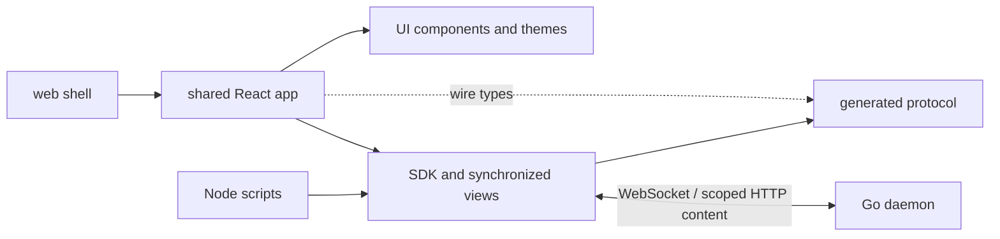

# Frontend architecture and design guide

This is the canonical starting point for coding agents working on WHIP's frontend.
It explains the current design, why it exists, and how to extend it. Updated on
2026-09-08 for the multi-host workspace and native companion.

This is a maintained engineering guide, not a delivery checklist. Historical
plans preserve research and past alternatives; they are not instructions to
reintroduce superseded decisions. In particular, session tabs now ship, and
permission approvals no longer use a signer or enrollment. Current user
instructions take precedence. When changing an architectural decision, update
this guide and the affected reference in the same change.

## Start here

Before implementation, identify the owner of the state you are changing and read
the nearest working example. These principles apply throughout:

1. **The daemon owns work.** Clients observe and direct it. A browser disconnect,
   component unmount, tab closure, or aborted local wait does not cancel execution.
2. **Each kind of state has one owner.** Do not replicate SDK session state in
   Query, React context, or a second event reducer.
3. **The UI stays thin, but complete.** Put shared protocol/recovery behavior in
   the SDK, generic interaction and visuals in UI, and product behavior in app.
4. **Preserve the person's work and place.** Drafts, recipient selection, reading
   anchors, and unresolved submissions must survive ordinary navigation.
5. **Bound what you retain.** Virtualizing DOM nodes does not bound cached data.
   Every new collection needs a count/byte limit and a visible overflow policy.
6. **Use the design system.** Base UI, semantic HTML, shared StyleX tokens, and the
   full TUI theme catalog are foundations, not optional per-screen preferences.
7. **Keep outcomes truthful.** Accepted, running, waiting, failed, interrupted,
   stale, unavailable, and delivery-uncertain describe different conditions.
8. **Prefer deletion, reuse, and direct composition.** Introduce abstractions or
   dependencies only when an actual workflow needs them. This follows the
   repository's [ponytail principles](../.agents/skills/ponytail/SKILL.md).

## Product intent and visual philosophy

WHIP is a workspace for directing recursive coding work: sessions, child agents,
mailboxes, Starlark execution, budgets, goals, schedules, and human decisions.
The person should be able to read calmly, understand what is happening, and
intervene precisely. Conversation is the main working surface; inspection reveals
the evidence and recursive structure behind it.

OpenCode informed the restrained color, component finish, conversation layout,
and interaction quality. We adopted those qualities within WHIP's own architecture.
Its framework choices, runtime migration layers, and IDE feature scope are not
our template. The [original research](../.ai-docs/plans/web-app/README.md) and
[session-tab design study](../.ai-docs/plans/session-tabs/design.html) record the
reference work.

Design from these principles:

- **Reading first.** Quiet chrome, comfortable conversation width, compact tool
  summaries, selectable code, and details on demand. Avoid a card around every
  message, a wall of tool JSON, or a dashboard of metrics above the conversation.
- **Color conveys meaning.** Neutral surfaces establish structure; status,
  attention, selection, and focus justify color. The selected theme supplies the
  palette. Do not assign random colors to agents or hardcode mockup swatches.
- **Subtle depth.** Use canvas/panel differences and fine borders for ordinary
  structure. Reserve shadows for floating overlays. Selected tabs sit on the
  canvas above a recessed navigation strip.
- **Identity stays visible.** Keep runtime, root, and selected child unambiguous
  across navigation, composer, requests, and inspectors. A child's transcript
  inspection does not admit that transcript into an agent's model context.
- **Behavior is part of the design.** Stable scroll, grouped streaming updates,
  focus restoration, retained drafts, and coherent reconnect states matter as
  much as an idle screenshot. Background updates must not steal the reading
  position or keyboard focus.
- **Progressive disclosure preserves control.** Put common actions near their
  subject; move secondary actions into menus and inspectors without making them
  hover-only or hiding pending human requests.

Current scope is a React web application with basic mobile support, designed to
share its renderer with the macOS Electron host in `apps/desktop`. File editing,
code review, interactive terminal UI, hosted authentication, and
custom-agent authoring are separate milestones. Read-only code/tool output is
in scope. The session REPL viewer and Executions inspector show retained and live
execution evidence; neither executes user-entered code or inspects raw VM globals.

## Packages and dependency direction

All JavaScript packages are private ESM npm workspaces with one root lockfile.
Use Node 24. Exact installed versions belong to the package manifests and
`package-lock.json`; do not copy a historical plan's version list into a new setup.

| Package | Responsibility | Internal dependencies and boundary |
| --- | --- | --- |
| `@whip/protocol` — `packages/protocol` | Generated wire types, operation metadata, schemas, standalone validators | Generated from the Go registry; no application behavior |
| `@whip/sdk` — `packages/sdk` | Attachment, transports, typed services, durable commands, recovery, subscriptions | Protocol; optional `/state`, `/react`, and `/node` entry points |
| `@whip/ui` — `packages/ui` | Tokens, themes, fonts, accessible controls, layout primitives, code highlighting, Storybook | No SDK, protocol, router, Query, host access, or product state |
| `@whip/app` — `packages/app` | Shared React application, routes, feature UI, application state/lifetimes | UI, SDK, protocol types, TanStack tools |
| `@whip/web` — `apps/web` | Browser bootstrap, platform adapters, Vite configuration, static release build | App and UI bootstrap exports |
| `@whip/desktop` — `apps/desktop` | Electron main/preload, packaged runtimes, SSH, native effects and distribution | Consumes the web renderer artifact; native SDK imports stay outside the renderer |
| `@whip/mobile` — `apps/mobile` | Expo/React Native companion, native UI, lifecycle and encrypted device storage | SDK; only `@whip/app/presentation` and `@whip/ui/theme-data` from web-facing packages |
| `examples/client` | Small SDK usage example | Independent of the product application |



UI and app distribute TypeScript source, compiled by the consuming Vite build.
SDK distributes built JavaScript; protocol distributes generated artifacts. Use
package exports, not cross-package imports into private `src` paths. React is a
peer dependency of reusable React packages. Heavy browser-only functionality
such as tab dragging has an explicit subpath (`@whip/ui/workspace-tabs`).

Generic controls belong in UI; domain components such as Composer, PendingRequests,
Timeline, and agent inspectors belong in app. A UI button receives props and a
callback; it does not know how to submit a daemon command. Avoid creating a
package for every feature or a parallel set of app-specific base controls.

Electron consumes the exact `apps/web` production build through `AppPlatform`.
There is one Vite build, StyleX extraction and route tree. The sorted renderer
manifest verifies the copied files in Go's embed input and Electron's staging
directory. Desktop packaging must preserve those bytes in ASAR.
Node APIs, Electron IPC, filesystem access, and `@whip/sdk/node` stay in
`apps/desktop`; the Vite import-graph guard rejects them in the renderer.
`@whip/app/desktop-bridge` exports only the serialized host contract. The desktop
adapter calls that versioned bridge without importing Electron. Ordinary DOM,
focus, layout, styling and file-input behavior remain shared.

## Stack decisions and reasons

| Tool | Use it for | Why this boundary exists |
| --- | --- | --- |
| React + TypeScript | Shared application and typed component composition | Web and desktop can share product behavior |
| Vite | Static SPA build, development server, code splitting | The Go daemon already serves assets; no Node backend, SSR, or TanStack Start is needed |
| TanStack Router | File routes, validated search parameters, browser navigation | Shareable location has one authority: the URL |
| TanStack Query | Bounded host/detail reads through SDK methods | Deduplicates reads and manages invalidation without replacing SDK session synchronization |
| TanStack Virtual | Long session lists and variable-height transcript rows | Keeps rendered DOM work bounded; app still owns reading anchors and data budgets |
| TanStack Form | Structured settings forms where field state/validation warrant it | A simple field or the draft composer does not need a second form store |
| TanStack Hotkeys | Scoped, configurable application shortcuts | Browser-owned shortcuts and normal text editing remain native |
| TanStack Markdown | App-owned Markdown presentation and streaming rendering | Parsing does not own message identity, event assembly, or conversation state |
| Base UI | Focus, ARIA, keyboard, portals, overlay behavior | Accessible interaction comes from maintained primitives |
| StyleX | Authored component/app styles, variants, responsive rules, tokens | One extracted styling system across packages and themes |
| Lucide, self-hosted Inter and JetBrains Mono | Icons, chrome/reading, code | Consistent vocabulary and geometry without remote font dependencies |
| Storybook, Vitest/Testing Library, Playwright | Components, app behavior, real browser integration | Each layer is tested at its actual boundary |

Do not add Redux/Zustand, TanStack DB, a second Query client per feature, another
CSS framework, or a frontend provider/agent execution loop without a concrete
architectural need. Existing tools are choices with defined jobs, not an excuse
to route every piece of state through a framework.

## Native mobile companion

[`apps/mobile`](../apps/mobile) is a separate Expo Router renderer for iOS and
Android. It shares daemon truth and portable presentation with the web app, while
native SwiftUI/Compose controls come from Expo UI. React Native StyleSheet supplies
layout; FlashList virtualizes conversation/catalog rows; Enriched Markdown renders
selectable text; keyboard controller and safe-area providers own native insets.
This is a development implementation; [mobile acceptance evidence](../.ai-docs/plans/mobile-app/EVIDENCE.md)
records the remaining native and release gates. Setup belongs in [mobile.md](mobile.md).

Native imports must use `@whip/app/presentation` (pure conversation rows,
submitted-input identity reconciliation and reading targets) and
`@whip/ui/theme-data` (resolved catalog and portable contrast helpers). Neither
entry point imports DOM controls, StyleX, web routing or browser providers.
`timeline.tsx` remains the web renderer of the same projection. Do not import the
web app/UI barrels into Metro or duplicate SDK stream reducers in mobile.

The native runtime owns one SDK client, one QueryClient, one catalog and the
selected root/child leases. A saved host pins its persistent runtime ID and stable
human client ID. Replacement aborts local observations, releases views and clears
host reads. Actual backgrounding pauses the SDK socket/heartbeat/reconnect and
command ticks; foreground resume reconciles durable identity before applicable
actions are enabled. Temporary `inactive` transitions do not detach. `close()` is
terminal and reserved for disposal/replacement. Work continues on the daemon.

The connection sheet owns its actionable errors so native modal presentation
cannot hide the root layout's error banner. Its explicit Test Connection uses
one temporary SDK client for HTTPS discovery, initialization/identity and a
one-item session read, without saving or replacing the runtime's client. Each
stage is limited to 15 seconds; discovery is streamed into an 8 KiB buffer through
Expo fetch. Completion, failure, leaving the sheet or backgrounding closes the
probe. Native close details are bounded in the shared SDK and remain ephemeral;
the diagnostic export continues to omit raw errors and addresses.

The native [AttentionProvider](../apps/mobile/src/features/attention.tsx), mounted
above route navigation inside the runtime QueryClient provider, owns the only
foreground attention query and 10-second poll. The Attention screen and tab badge
consume its context without separate query observers. Focus refresh joins an
in-flight request; runtime reconnect and completed decisions invalidate the same
query. Backgrounding cancels reads and disables polling; host replacement clears
the cache. Reads retain at most four 64-entry / 128 KiB pages. The badge counts
loaded sessions with human requests, qualifies incomplete indexes with `+`, and
announces stale/unavailable data without implying a current zero count.

Use the private SQLCipher database for four saved hosts, bounded preferences,
16 revisioned drafts (64 KiB per record, 512 KiB total), 64 reading bookmarks
(64 KiB total), and 64 recovery/permission records sharing a 64 KiB budget.
The SecureStore key uses device-only keychain accessibility; the database lives
in a native backup-excluded directory. Failure to open or write durable storage
must remain visible and must not silently switch to plaintext or allow an
unrecorded send. Snapshots, query caches, prompts in recovery records, provider
credentials and transcripts are not persisted. Draft text is a separate record.

Runtime command metadata and its recipient/request/draft revision are committed
atomically before sending. Permission decisions retain a separate typed record
and use `client.permissions.status`; they are not generic runtime commands.
A status failure is not evidence of non-admission. Retried runtime commands retain
original bytes/identity and require an explicit action after authoritative missing
status; restored records contain no payload and cannot replay automatically.
Creation journals retain the created root across effort/input partial failures.

Only an explicit full-message sheet fetches content, at most 256 KiB through SDK
scope/hash checks. Recycled transcript rows cannot initiate reads. Native text
pages contain at most 8,192 UTF-16 units, preserving surrogate pairs. Short messages
keep Markdown rendering; larger messages use selectable source pages. Collapsed
tool details use 512-unit previews, and explicit Copy retains the complete loaded
text. Paging resets on recycled message identity and preserves the selected page
during live appends. These bounds apply to combined tool arguments/output and
explicitly inspected bodies as well as ordinary conversation text. Markdown with
image syntax or raw HTML delimiters uses selectable source presentation so the
native renderer cannot fetch embedded images; link previews are disabled, and
links open only after a user tap through an external-scheme allowlist.
Uploads, QR pairing, application auth and push notifications are deferred.

## Runtime construction and lifetimes

[`apps/web/src/main.tsx`](../apps/web/src/main.tsx) selects the browser adapter or
the versioned desktop bridge adapter. The packaged `whip-app://bundle` origin
requires a compatible bridge; it cannot become a daemon endpoint by fallback.
[`bootstrap.tsx`](../apps/web/src/bootstrap.tsx) applies the saved theme before
first render and creates one `createWhipApplication` instance outside React.
That factory wires the router, runtime, ThemeProvider, UIProvider,
QueryClientProvider, and runtime context. Both hosts share bootstrap/disposal.

The adapters under `apps/web/src/platform` supply storage, Web Locks, clipboard,
external links and awaitable downloads. `AppStorage` remains synchronous, with
an optional `persistent` status; the visible memory fallback reports false after
a persistent operation fails. Desktop `windowStorage` uses a namespaced
localStorage record for relaunch restoration; browser window state uses
sessionStorage. Native save operations transfer bounded chunks after selection;
cancel returns a distinct outcome and does not claim that a file was saved.

Optional [`AppPlatform`](../packages/app/src/platform.ts) capabilities supply
typed native effects without exposing Electron objects or filesystem handles to
components. New session uses `pickDirectory` only for a selected local profile;
URL and SSH hosts retain the host-owned directory browser. The browser’s Local
can use the daemon picker RPC. Picker requests retire when their client or route
changes. Cancellation preserves the directory; unavailable native choosers fall
back to browsing directories on the original host.
Bootstrap calls `platform.dispose()` after the shared application unmounts.

Desktop's optional `localRuntime` capability provides `test`, `choose`, `install`
and `restart`. Electron main owns executable discovery, compatibility checks,
installation and process effects through [`LocalRuntime`](../apps/desktop/src/runtime.ts).
Its native `native-local-runtime.json` settings record contains the selected
absolute executable path; React does not store another copy or derive sockets.
The first connection discovers and validates `whipcode`, then persists the path
so Finder and terminal launches use the same installation. A missing saved path
does not fall back to another executable. Packaged backend bytes are an explicit
installation payload; ordinary connections use the selected installed executable.
Normal stable and beta desktop channels share the default `~/.whipcode` runtime
home. An explicit `WHIPCODE_HOME` can isolate a fixture; legacy `WHIP_HOME` never
redirects local work. The canonical installation on the development Mac is
`/usr/local/bin/whipcode`.

[`HostDialog`](../packages/app/src/host-dialog.tsx) exposes **This Mac** diagnostics
even before the first successful connection. Opening the dialog and changes to
the host's connection state refresh a read-only diagnostic snapshot; **Test
Connection** repeats that check without starting a daemon, installing a binary,
creating the runtime home or rewriting its configuration. Only the bounded
`LocalRuntimeStatus` crosses the bridge: state, selected executable, home, client
and daemon builds, an actionable message and installation availability. Paths
and builds live in expandable diagnostics; raw logs and environment values do
not enter the renderer. The panel owns its temporary busy/error/confirmation
state and retires late results on close; it is not another SDK connection owner.

**Choose executable** uses a native picker and validates the selected distribution.
**Install whipcode** requires an explicit action and installs verified packaged
bytes without overwriting a different existing installation. Neither action starts
work. The existing host **Connect** action attaches to a healthy daemon or starts
the selected installation when stopped, with bounded progress through the existing
connection resolver. **Restart daemon** explains the interruption to CLI, web and
desktop work and requires a separate explicit confirmation. SDK reconnect and
runtime-identity acceptance remain unchanged. Disconnecting, switching hosts and
quitting the GUI do not stop accepted work. Browser adapters omit `localRuntime`;
URL and SSH connections retain their existing transport paths.

[`HostPrompts`](../packages/app/src/host-prompts.tsx) uses the shared Application
child slot and its existing theme/UI/Query providers. Bootstrap observes prompts
before starting a connection, so SSH challenges cannot race the first render.
One dialog presents a bounded queue of four prompts; host-key fingerprints are
plain selectable text and require explicit confirmation. Answers are ephemeral:
clear inputs on submission, dismissal and unmount, and never put them in drafts,
preferences or logs. Queue identities reject stale answer completions, failures
remain visible, and final teardown declines outstanding challenges. Subscription
cleanup permits React StrictMode's immediate effect replay before disposal.

The desktop adapter owns one disposable update listener and a referentially
stable, immutable snapshot plus the installed GUI version. Device settings reads
the optional `updates` capability with `useSyncExternalStore`; mounting settings
does not trigger an update check. Checking and installation call the native host.
Only a downloaded update offers Restart to update, which still uses the normal
draft/attachment close handshake. Browser adapters omit this capability.

[`AppRuntime`](../packages/app/src/runtime.ts) owns one window's connections,
Query client, root-view leases, command observations, drafts, and tab/composition/
reading stores. [`HostConnections`](../packages/app/src/hosts.ts) owns an independent
SDK client and `SessionListView` for each attached daemon. Components subscribe
using `useSyncExternalStore` through app hooks or `@whip/sdk/react`. Store
snapshots remain immutable and referentially stable between changes.

Local is the daemon supplied by the browser launch endpoint, or the managed
This Mac runtime in Electron. Its configuration
owns the `remote_hosts` registry, shared by browsers using that local daemon:
profile ID, display name, normalized URL, verified runtime ID, and connect-on-launch
preference. These are attachment profiles, not copied sessions or credentials.
The existing revision-checked configuration update persists the whole registry.
Host management refreshes it on open, browser focus, and Local reconnect; conflicts
surface rather than overwriting another browser's changes. Legacy browser-only
addresses remain available for explicit import.

Desktop connection profiles represent URL, local or SSH targets. Each host record
owns asynchronous setup cancellation, progress, the resolved transport and its
cleanup. Local/SSH resolution yields a bounded IPC `TransportFactory`; URL
connections use ordinary SDK network transport. Selecting work never detaches
other hosts. Native profiles and their verified identities remain in device
storage (`whip.hosts.v2`); old desktop URL profiles remain available for explicit
verified import into Local’s registry before their device copy is removed.
The saved native selection reconnects on launch alongside This Mac. The focused
profile ID is stored separately in `whip.selectedHost.v3`, so selecting a shared
URL host does not create a second authoritative copy of its profile. A legacy URL
selection produces an import notice and preserves its original identity and tabs.
The native bridge admits at most 16 prepared connections and 32 transport handles,
including overlap during reconnect; existing per-transport byte bounds still apply.

Each client verifies its handshake runtime ID before exposing session reads or
views. Duplicate runtime aliases are rejected. Rebinding an address to a replacement
daemon requires explicit acceptance; existing tabs retain their original runtime
identity. SDK reconnect belongs to each connection. An explicit detach aborts
only that host's waits, disposes its observers/views, clears its Query data, and
invalidates its attachment references. Healthy hosts, their panes, drafts and
accepted work remain independent. Losing Local prevents registry edits while
already attached remote hosts remain usable. Late reads and configuration replies
must match their source connection and revision before changing current state.

`flushDrafts()` returns `{ saved, error? }`; memory fallback is not durability.
Bootstrap uses this result and in-memory attachment state for browser unload and
desktop close/reload/update replies. A storage failure must keep a visible loss
warning even for text-only drafts. Closing a native window can hide it while
preserving its renderer; full quit uses the close handshake.
Clearing a previously persisted draft remains unsaved if deleting its durable
record fails; an in-memory tombstone does not authorize a successful close.

Desktop Cmd-W invokes the existing focused-tab close action, preserving drafts
and daemon work. Closing the final session tab returns to New session; Cmd-W on
a page with no active session tab hides the window. It does not disconnect any
SDK client. Stable and beta hosts format `whip://` and `whip-beta://` links
respectively through the preload's channel capability; both use the same renderer.
Native session links use
[`createSessionNavigator`](../packages/app/src/session-tab-routing.ts) to select
an already saved, verified runtime identity. A link cannot create a connection
profile. Newer links, manual navigation, a changed host/profile, or disposal invalidate
pending navigation; attachment must still be connected to the expected runtime before
the shared router moves.

`runtime.acquireView(runtimeId, rootId)` returns `{ view, release }`; release
is idempotent and belongs in effect cleanup. Leases use both runtime and root
identity, so equal root IDs on different hosts never share data. StrictMode and
duplicate views of the same root share a lease. The four-root retention budget
is window-wide, not multiplied by the number of connected hosts. Do not instantiate
clients/views during render, open subscriptions on link hover, or hydrate tab
roots to obtain labels. Inspect child history through
`runtime.acquireAgent(view, agentId)` and release the consumer in cleanup; only
the final consumer closes shared child history. The daemon caps root subscriptions
at 16 per connection; do not open extra connections to bypass that limit.

## State ownership

| State | Owner | Persistence / lifetime |
| --- | --- | --- |
| Execution, commands, sessions, provider credentials, permissions, model context, scheduling | Daemon | Durable host truth; clients cannot replace it |
| Native local/SSH profiles | Device storage | Bounded v2 profiles; URL profiles move to the shared registry only after verified import |
| Canonical local executable selection | Electron main `LocalRuntime` | Native settings hold one absolute installed path; default home is `~/.whipcode` in both desktop channels |
| Local runtime diagnostics and repair UI | Native probe / host dialog | Bounded serialized diagnostic snapshot and transient busy/error/confirmation state; no daemon state duplication |
| Native notification deduplication | One app observer per attached runtime | Up to four pages / 256 roots, transient counts and question IDs; no transcript subscriptions |
| Desktop updates and authentication prompts | Platform adapter / bootstrap | Native update snapshot and bounded ephemeral prompt queue |
| Saved execution hosts | Local daemon configuration `remote_hosts` | Revision-checked file shared by browsers; remote daemon credentials stay remote |
| Connection, request correlation, replay, command delivery/status | One SDK `WhipClient` per host / `CommandHandle` | Independent connections and runtime/client/command-scoped recovery |
| Root snapshot, history, live presentation, agents, requests, history revision, root collections | SDK `SessionView` | Reconstructible bounded memory; app leases it |
| Ordinary lightweight session lists | One SDK `SessionListView` per host | Observed catalogs; do not add duplicate Query list pollers |
| Host catalogs/settings, search, attention, tab summaries, explicit detail reads | TanStack Query via SDK | Runtime-scoped keys; only the detached host’s data is cleared |
| Focused root, child and shareable inspector section | TanStack Router | Validated URL/search; history carries a local view-ID hint |
| Sidebar width, visibility and directory collapse | App shell | Window storage with memory fallback; host-scoped collapse |
| Split tree, pane focus/selection, open/closed view order and locations | App `SessionTabs` | One v3 workspace spanning hosts: browser sessionStorage or desktop namespaced localStorage; v1/v2 recovery and memory fallback |
| Draft text | App runtime | Device storage, keyed by runtime/root/recipient |
| Files, upload progress and submission locks | App `CompositionStore` | Window memory shared by runtime/root/recipient |
| Composer caret selection | App `CompositionStore` | Window memory scoped by runtime/view/agent |
| Reading anchors | App `ReadingPositions` | Bounded memory scoped by runtime/view/agent and history revision |
| Theme and keyboard preferences | UI theme provider / app preferences through platform storage | Viewing-device preferences; not daemon settings |
| Open popover, focused control, transient form edits | Local React/Base UI/Form state | Narrowest component lifetime that satisfies the workflow |

Do not save snapshots, event streams, or Query caches to browser storage. Command
recovery records contain identity metadata, not prompts, credentials, or file
bytes. Draft text is deliberately a separate, application-owned persistence path.
Storage denial/quota errors must visibly fall back to memory, not claim durability.

### Current retention budgets

These are implementation defaults, not new server guarantees. If changing them,
update their source, boundary tests, and this table together.

| Resource | Bound | Source |
| --- | --- | --- |
| SDK session view | 8 MiB retained payload; 512 history messages per opened agent | [state.ts](../packages/sdk/src/state.ts) |
| SDK execution evidence | 256 entries per root, 128 host calls per cell, 1 MiB within the session view budget | [executions.ts](../packages/sdk/src/executions.ts) |
| App root views | 4 retained roots across all hosts; unused views expire after 30 seconds; never evict an actively leased root | [runtime.ts](../packages/app/src/runtime.ts) |
| Tab layout | One workspace: 4 panes, 32 open views, 20 closed entries, 64 KiB metadata; unmigrated v1/v2 layouts remain in their original storage | [session-tabs.ts](../packages/app/src/session-tabs.ts) |
| Sidebar layout preferences | 4 hosts, 64 collapsed directories per host, 64 KiB metadata; this does not limit connected hosts | [sidebar-state.ts](../packages/app/src/sidebar-state.ts) |
| Draft text | 32 nonempty drafts, 256 KiB each, 1 MiB total | [runtime.ts](../packages/app/src/runtime.ts) |
| Submission previews | 32 entries, 1 MiB total; confirmed entries evicted first | [input-presentation.ts](../packages/app/src/input-presentation.ts) |
| Attachments | 16 files per recipient; 20 MiB across the window; serial uploads | [compositions.ts](../packages/app/src/compositions.ts) |
| Reading bookmarks | 128 entries, 64 KiB | [reading-positions.ts](../packages/app/src/reading-positions.ts) |
| Search | One 64-item / 256 KiB page per included host while open; recent results reuse each host’s catalog | [session-search-dialog.tsx](../packages/app/src/session-search-dialog.tsx) |
| Attention | One 64-item / 256 KiB advisory page per connected host | [attention.tsx](../packages/app/src/attention.tsx) |
| Agent mailbox pages | At most 4 bounded Query pages | [observation.tsx](../packages/app/src/details/observation.tsx) |
| Explicit content inspection | 1 MiB text read; 64 MiB download; rendering has its own smaller caps | [shared.tsx](../packages/app/src/details/shared.tsx) |

Payload limits do not equal total JavaScript heap limits. Preserve visible
truncated/unavailable states, lazy content reads, and server pagination bounds.
Draft admission also has cross-window limits: simultaneous additions can briefly
exceed the aggregate storage budget; subsequent writes require clearing drafts.

### Split workspace

`SessionTabs` owns one immutable binary tree across all hosts: split nodes carry
a direction and ratio; pane leaves carry ordered chat/REPL descriptors, a selected
view ID, and stable pane IDs. Every descriptor stores its runtime ID; the global
view ID identifies one presentation of that host’s session. Duplicates share
SDK data and recipient drafts/files/locks, but retain independent mode, agent, inspector,
scroll and caret state. When a chat view becomes active on desktop, its composer
receives focus without scrolling; compact layouts and open overlays retain their focus.
Only the focused view is reflected in the URL. Native
links carry a validated `whipViewId` history hint so Back/Forward can distinguish
two views with identical URLs. Sidebar/search reuse the selected matching view,
then one in its pane, then another existing view before adding a new tab. Matching
always includes runtime and root identity.

The v3 window record migrates the last-used v1/v2 host layout first. Other legacy
layouts remain recoverable under **Execution hosts → Restore previous host tabs**.
Restoring merges panes and closed-tab history after checking the window-wide
limits and remaps view/pane IDs to avoid collisions. If the complete layout cannot
fit, **Open individual previous tabs** recovers either open or closed descriptors
without consuming the original layout. Both initial migration and explicit restore
validate the expanded v3 metadata before marking a layout migrated. Original v1/v2
storage is retained, with restored/dismissed identities recorded in v3. Failed
writes visibly use memory, leaving original layouts recoverable on reload.

`SessionTabStrip` coordinates the workspace and renders one selected session view
per visible pane. `ConversationRoute` handles admission/host status only. The
workspace reconciler releases obsolete root leases **before** acquiring new roots;
it deduplicates selected `(runtimeId, rootId)` pairs and never mounts background
tabs for labels. A disconnected host shows an unavailable state in its own panes;
it does not replace the layout or release healthy hosts’ selected roots.
New-session and Settings routes retain the tree and release visible consumers.
`SessionContent` takes an explicit mode and view location; late actions verify the
originating location and host before updating their view.

`@whip/ui/workspace-layout` provides recursive geometry and one shared dnd-kit
provider. It accepts generic rendered content; chat/REPL and future terminal descriptors
and renderers belong in app. WHIP owns tree edits, persistence and product limits.
The only new dependency, `react-resizable-panels`, supplies keyboard/pointer
resizing. It has no vendor theme CSS. Selected content uses stable, sorted sibling
DOM nodes over measured pane slots, so moving a view across branches preserves
its mounted state. Geometry may use inline positioning; authored styles remain
extracted StyleX. The resize library's disabled cursor helper allocates an empty
adopted stylesheet; CSP tests require zero injected rules and no violations.

Split/move menus are alternatives to dragging. Edge previews respect the
four-pane cap and minimum dimensions (320 × 240 px, plus separators). If available
space cannot fit the tree, the focused pane fills the workspace; below 768 px the
existing mobile picker replaces its strip. This changes presentation only. Saved
ratios and the desktop tree return when space permits. Overflow within a very
short pane remains scrollable so its composer and controls stay reachable.
Committed resize operations persist; pointer movement does not write storage.
Both split directions use one-pixel quiet dividers with transparent drag targets
above the content layer. Pane focus does not add an accent border to the tab strip;
keyboard controls retain their focus-visible outlines.

### Session REPL viewer

A session tab's **Open REPL** menu action switches its existing descriptor to
`kind: 'repl'`; **Open chat** reverses it. The same actions are available in the
context menu and mobile picker. `sessionSearch` is the shared URL serializer:
REPL uses `?view=repl`, while chat omits `view`. Navigation, copied links,
close/reopen and window restoration preserve the mode. An explicit chat URL
opens chat. Each duplicate view has an independent mode and selected agent.

`SessionContent` owns connection feedback, agent leases, pending questions and
permissions, cancellation, and inspectors for both modes. A batched
`user.ask(questions=[...])` renders as a wizard card above the composer (same
width): one question per page, Back/Skip/Next with Send on the last page,
free text always allowed, and the agent's `recommended` option badged. Switching changes
only the reader/composer branch, without starting another root subscription.
Drafts and attachments remain recipient-scoped; REPL displays no composer.

`ReplView` consumes `executionRows(snapshot, agentId)` from SDK state. It shows
Starlark code, individual observed host calls, print output, return values,
errors, steps and restart markers. No app-owned event cache or raw subscription
is permitted. The SDK merges loaded history with bounded observed evidence,
replaces cumulative output, and keeps live keys through history commits. Revision
changes discard incompatible evidence. If a child was observed before its history
was opened, an ambiguous call cannot safely be joined to an older record; the SDK
retains it as separate observed evidence. Host traces and restart notices from
before observation can be absent; the toolbar's **About REPL history** tooltip
explains that limitation. Persistent notices are reserved for paused updates and
known truncation. Any displayed elapsed duration is explicitly client-observed,
never reconstructed historical timing.

`ReadingList` shares TanStack Virtual, selection pinning, follow/Latest behavior,
near-top scroll pagination and bounded anchor restoration between chat and REPL.
Both modes use SDK-owned history and loading state. Scrolling within 256 px of
the top requests one bounded older page when connected and history is ready;
pending reads and bookmark restoration suppress automatic paging. The explicit
older-history button also supports REPL pages with too few cells to scroll.
Its measured space remains after exhaustion so the final prepend does not move
the reader; the exhausted control is hidden, disabled, and excluded from accessibility.
Transcript pages can contain no execution cells, so cell count does not determine
exhaustion. The SDK keeps the older cursor and availability consistent with the
retained history across refreshes, revision changes and cache eviction.
REPL bookmarks use a mode suffix within the existing runtime/view/agent namespace;
closing the view forgets both modes. Output previews show six lines, following
the tail while running and the beginning after completion. Expanded output IDs
are retained only while mounted, bounded to 128 and pruned with retained cells.
RLM results contain one structured JSON payload with bounded output, return-value
previews, and scratch/restore notices. Failed cells retain that payload after the
tool error prefix; the SDK keeps their failed status and partial execution evidence
through live observation and history replay. Checkpoint notices do not change a
completed cell into a failed execution.

Code and scoped large-body reads use existing UI/SDK limits and copy controls.

## Data fetching and synchronization

First ask whether a value is already owned by a synchronized SDK view. If it is,
subscribe to that view. Otherwise, use a typed SDK query through TanStack Query.
[`useDetailQuery`](../packages/app/src/details/shared.tsx) is the existing pattern
for runtime-operation inspector reads; directory and completion pickers show
host RPC queries. SDK-owned collections use `view.loadCollection`.

For new Query reads:

- Include persistent runtime ID, root/agent scope, all filters/page parameters,
  and relevant revision in the key. Host-scoped values must not leak across hosts.
- Gate on connection and advertised operation/capability availability. Forward
  Query's `signal` to the SDK. An unavailable operation is not an empty result.
- Preserve the runtime defaults: `staleTime: 10_000`, `gcTime: 0`, `retry: false`,
  `networkMode: 'always'`, and disabled automatic focus/reconnect refetching.
  A local daemon can work without public internet; browser online heuristics
  must not pause a mutation and send it later.
- Refresh through relevant SDK events, successful actions, or bounded polling
  where required. A new connection invalidates that runtime’s reads; host detach clears
  only those keys. Overrides must have a workflow-specific reason and cleanup.
- Bound pages and bytes as well as cache lifetime. Do not persist the cache or
  create an independent interval in every component reading the same resource.

The sidebar queries summaries only for rendered rows (including overscan), in
batches of at most 32 roots. Those reads pause while the document is hidden and
never hydrate session views.

Tab summaries deliberately use one batched `sessions.summaries` query per host
for its open IDs, every two visible connected seconds, with coalesced lifecycle
invalidation.
They require `session_summaries` negotiation and do not open roots. Ordinary
session listing stays with `SessionListView`; filtered search and host attention
are separate reads. Do not confuse agent mailbox messages with queued execution
inputs in the root inbox.

The SDK owns snapshot/cursor consistency, replay, subscription IDs, duplicate/gap
checks, resynchronization, and history revisions. It processes every event in
order and batches notifications (normally 16 ms); it does not drop intermediate
deltas. While recovering, retain the last view as stale. Components must not add
their own reconnect loop or replace stale state with a misleading empty screen.

An ordinary snapshot refresh updates metadata while preserving already-observed
presentation for each agent still running the same turn, on the same connection
and history revision. A healthy refresh keeps the view live so controls retain
focus; a failed refresh or interrupted subscription becomes stale. Snapshots
contain a bounded event suffix, so absence from
that suffix cannot erase observed text or tool completion. Reconciliation filters
raw events by the previous root cursor before grouping them; cumulative tool
values replace earlier values and row identities remain stable. Partial snapshots
do not join text across unverified gaps, including the boundary back to live
delivery. Omission flags and the session view's memory budget still apply.
Initial attachment, reconnect, subscription failure/gaps, history revision changes,
and an agent's ended or replaced turn use snapshot replacement. This retains
received activity; it does not recover events absent from the bounded snapshot.

## Mutations, acceptance, and permissions

Use typed SDK commands for durable mutations and `runtime.run(handle, label, ...)`
for the application's command observation/recovery UI. The operation registry
distinguishes queries, durable commands, and ephemeral invocations. Do not route
everything through a generic mutation retry mechanism.

A command handle's `accepted()` means the daemon committed admission;
`result()` waits for its terminal outcome. A failed/cancelled/interrupted outcome
is distinct from a transport failure. `runtime.run` presents these outcomes and
refreshes Query reads after success. Use the composer as the reference for the
more involved draft/attachment acceptance callback.

Missing acknowledgement is uncertain delivery, not proof of failure. Preserve
the original runtime/client/command identity and frozen request. Query status;
only authoritative absence enables an explicit retry of that original request.
A failed lookup remains unresolved. Never allocate a fresh command ID as an
automatic recovery shortcut or resubmit a draft after reconnect.

Clear only the submitted recipient's matching text and attachment IDs after
acceptance; later edits must survive. Closing or switching a tab preserves drafts
and upload state. Host changes interrupt uploads and mark them unavailable;
reload requires reselecting files and warns while files remain in memory.
Explicit removal, accepted submission, or discard clears the corresponding data.

Keep these distinctions in labels and behavior:

- Close tab / disconnect / abort wait: stop local observation, not daemon work.
- Stop turn: explicit cancellation targeting the authoritative turn/command.
- Stop subtree: a different, explicitly scoped action.
- Command completed: that operation finished; descendants, mail, and schedules
  may still be active. A quiet root is not whole-tree completion.

Current clients operate locally or on a trusted network. Permission decisions
require **no signer, enrollment, pairing, or connection-authentication flow**.
The app identifies itself as a human client; client kind is not authenticated
identity. The daemon still enforces tool permissions, root/content scope, and
delegated MCP authority. Competing decisions resolve once. After an uncertain
decision acknowledgement, refresh pending state before another attempt.
Explicit permission retries retain the original decision `command_id`.

Provider onboarding, tokens, machine keys, and shared configuration writes remain
host-owned. API-key entry is an ephemeral UI input: never place it in drafts,
Query persistence, command-recovery storage, or logs. Configuration updates use
revision checks; display conflicts instead of overwriting newer settings.
Provider/runtime/recovery settings have an explicit execution-host selector,
initially the last session's host or Local. Saved-host management always writes to
Local. Appearance and keyboard preferences remain viewing-device settings.

## Conversation and navigation patterns

The composer is a compact, theme-derived surface with an automatically growing
textarea (40–220 px), accessible recipient label, attachment/context actions,
model/effort trigger, permission-mode toggle, and Send. It omits a visible
heading and shortcut hints. Toolbar controls wrap in narrow panes so Send/Pause
stays reachable. `model-selection.tsx` provides separate model and
reasoning popovers that apply the selected option immediately; the inspector
retains explicit Apply actions and exact model/provider entry. The controls
share the host-scoped provider-catalog query while connected. Root changes
require an idle session, including options in an already-open popover; child composers display their own
model without changing the root. `permission-mode.tsx` toggles the root
session's consent mode (`permission.mode` with `external_permissions`) from a
composer popover. The mode is runner state, not durable: the daemon reports it
on the root snapshot as `permission_mode` and publishes
`session.permission_mode.updated` when it changes; the SDK applies that event
to the root snapshot. The toggle is root-only and applies while idle, matching
the daemon's refusal to change mode during an active turn.
Drafts remain untouched by model selection, and host defaults are not changed.
Standard text inputs use a single neutral focus border. The composer keeps its
quiet outer border unchanged on focus and has no separate textarea outline.

User messages use right-aligned, theme-derived bubbles. Timestamps and existing
copy/history actions appear below the bubble on hover or keyboard focus; touch
keeps the controls available. Show recorded `sent_at` values when supplied, and
never invent timestamps for historical messages that lack them.
Agent responses omit a repeated author heading and put their copy control below
the response, aligned left, with the same hover/focus/touch visibility.

Committed history only includes a turn's messages after that turn finishes.
`input-presentation.ts` therefore owns window-local submission previews (at most
32 entries / 1 MiB, scoped to runtime/root/recipient), created before sending.
`AppRuntime.run` reconciles command receipts with the exact inbox sequence,
including explicit uncertainty checks/retries. The SDK's queued/running inbox
supplies accepted messages during execution and after reload. Do not deduplicate
by text: identical authored prompts are distinct submissions. A fresh existing
session view hands over to authoritative inbox/history; this opens no additional
root views. Confirmed previews are evicted first under the bound, and admission
fails visibly rather than evicting an unresolved preview. Host detach clears them.
Prompt bodies are not added to persistent command recovery records.

Keep Sending, Queued and Checking delivery distinct. Definitive rejection removes
the local preview and preserves an unaccepted draft; uncertain input remains
visible and follows the existing explicit retry flow. This presentation must not
change daemon history commits or duplicate command execution.

[`timeline.tsx`](../packages/app/src/timeline.tsx) projects SDK history and live
presentation into rows. Preserve stable message/tool identity. Text deltas append
within a row; cumulative tool-call payloads update that call rather than append
the whole payload again. A protocol event is not a new chat message. Keep live
presentation separate from persisted history so completion/reconnect cannot
duplicate streamed text. History rewind/clear invalidates old revision pages and
reading anchors; it does not undo filesystem effects.

TanStack Virtual bounds rendered rows. Follow its measurement/anchor integration
when changing variable-height Markdown, code, or tool output. Preserve the
reader's position while paging or streaming; show Jump to latest when away from
live output. A replaced/evicted anchor should degrade visibly to retained history,
not fetch unlimited history to recover an exact pixel. Code rendering is lazy,
bounded, copyable text; do not inject untrusted HTML or treat model output as UI
instructions. Keep URL/content checks in the existing rendering paths.

`ReadingList` includes its older-history control as a measured leading row,
kept mounted for keyboard access. When the final page removes the control,
TanStack compensates for its height change along with the prepended messages;
the control must not introduce an unmeasured offset outside the virtual list.

Browser reading-position checks must let scrolling and row measurement settle
before recording an anchor. Touch scrolling can defer a size correction beyond
two stationary frames; comparing that temporary position with a later snapshot
misattributes the correction to incoming output. The focused
[reading-position check](../apps/web/scripts/reading-position.mjs) exercises the
packaged app against an isolated daemon in Chromium and Firefox.

The URL is authoritative for `/h/$runtimeId/s/$rootId` and validated `agent` /
`panel` / `view=repl` search state. `session-tab-routing.ts` synchronizes tab metadata with it.
The sidebar is the saved-session catalog; tabs are the current window's working
set. Children remain within a root tab. Only the selected view in each visible pane mounts.
Tab creation, selection, reorder, close, and reopen are local navigation actions.

Desktop tabs keep readable widths in a horizontal scroller; the picker handles
overflow and secondary actions. On phones, use the current-session selector and
searchable sheet. Preserve browser Back/Forward, modified link clicks, keyboard
activation, and explicit touch/menu alternatives to dragging. Do not hijack the
browser's new-tab or close-tab shortcuts.

### Saved-session navigation

[`session-sidebar.tsx`](../packages/app/src/session-sidebar.tsx) projects the SDK's
bounded per-host catalogs into host sections, virtual directory headers and compact
session rows in one scroll area. Group within each host by exact `cwd`: worktrees remain separate, directories with matching names show
a distinguishing parent suffix, and full paths remain available in labels and
titles. Groups follow their first catalog occurrence; sessions retain server
pin/recency order. Only loaded pages are grouped; Load more retains the SDK's
existing page/cache limits. Sidebar labels never lease root views.

New session, Search sessions and Settings are the top destinations; execution-host
management stays in the footer. Host headings show connection status and collapse
independently. The tab strip sits directly above the conversation,
without a global toolbar or repeated session heading. Session details opens from
the tab menu or command palette; its Sheet contains the session management
actions. Connection and error notices remain visible when relevant.

Search opens a centered dialog with an automatically focused search field, host
labels/filter, and up to 64 recent catalog entries per host. Typing debounces
200 ms and uses an independent 64-item / 256 KiB Query page and cursor per host.
A failed or offline host shows its own status while healthy results remain usable.
Enter opens the highlighted result, arrow keys move the highlight, and Escape/close
restores focus. Highlight identity includes the runtime/root pair, so a later
response from another host cannot change which session Enter opens. On mobile,
opening search closes the navigation Sheet and returns focus to its toggle.
Search retains native modified links, remembered inspector locations and
background-tab actions. Its catalog/query observers only mount while open;
closing releases pending reads and cached search pages.

Attention aggregates one lightweight advisory page per connected host, polling
every three seconds without leasing roots. Its sheet labels hosts, supports a
host filter and independent pagination, and opens the owning session to answer
requests. The badge counts requests on loaded pages, not all host work; pagination,
truncation and unavailable hosts keep that incompleteness explicit. Unsupported
attention reads stop automatic polling until retry or reconnect.

Desktop row menus appear on hover/focus (and remain visible
while open); touch keeps them visible. Trailing directory carets appear while
that directory or its visible children are hovered, or its heading is focused.
The leading indicator shows live activity from a bounded
`sessions.summaries` query (same predicate helpers as the tab strip,
`session-status.ts`): a spinner while agents run or queue, a warning icon
when permissions or questions await input; pinned sessions keep the pin and
unsupported/stale summaries fall back to the plain dot.
Directory headings have no hover fill; session hover uses `colors.element` and
selection uses `colors.hover` for the reference design’s stronger selected fill.
Session links retain native modified clicks and saved
agent/inspector locations; sibling menus expose Open in background tab.

Directory + links carry validated `cwd` and `runtimeId` home-route search values.
New session first selects Local or Remote, then a saved host or Add remote host,
then the working directory and that host's model/default. A directory + link
preselects its source host and directory; changing host resets folder/model
choices. Only Local offers the native OS folder picker; Remote always browses the
daemon's directory API or accepts a typed path. Browsing a directory does not
submit the creation form. Submission pins the source client, and late completion
cannot redirect a different route or target another host. These links take
precedence over startup tab restoration.

The desktop sidebar defaults to 320 px, resizes between 256 and 420 px while
leaving 480 px for the main pane. Its collapse button sits beside the WHIP brand;
when hidden, the first visible tab strip holds the restore button. Focus follows
the toggle between those locations. The mobile session selector keeps its
navigation opener for the existing Sheet. The desktop keyboard separator
supports arrows, Home/End and Enter to hide; double-click
resets width. Width/visibility are window-local. Collapse preferences retain at
most four hosts and 64 directories per host within 64 KiB; oldest preferences
revert to expanded when evicted. Storage failure visibly falls back to memory.
Catalog refresh preserves the visible anchor; explicit session navigation
expands/reveals its loaded directory without polling undoing manual collapse.
Below 768 px the existing Sheet contains a bounded list and footer, uses >=44 px
targets, and has no resize handle. Colors remain theme-derived.

## Component and styling contract

Start with the [UI inventory](../packages/ui/README.md#component-inventory) and
its stories. Compose existing controls before adding a primitive. A reusable UI
component has controlled props, ordinary callbacks, native refs/ARIA/events, and
an optional typed `xstyle` extension where appropriate. Base UI `render` and
`mergeProps` preserve composition. Keep interactive siblings separate; a tab link
cannot contain its own close/menu button. App-specific data fetching belongs in
app controllers/hooks, not in UI controls.

Use `stylex.create` and `stylex.props` for authored visuals and import shared
variables from `@whip/ui/tokens.stylex`. The `.stylex` suffix is required for
cross-package static resolution. Do not add Tailwind, CSS-in-JS runtime injection,
an unlayered global reset, or ad hoc per-component palettes. `reset.css` is browser
normalization inside `@layer whip-reset`, not a second component stylesheet.
Configure StyleX with `useCSSLayers: {before: ['whip-reset']}` so that reset
defaults remain below component styles in both Vite development and production.
Import order alone does not establish that precedence in development. Text inputs
use a neutral focus border without an outline; other controls and the reset
fallback use a thin neutral keyboard-focus outline.
Declare border width, style, and color explicitly; shorthand borders were lost
by the current compilation path.

| Design role | Current source of truth |
| --- | --- |
| Palette | `colors`: background, foreground, panel, element, hover, borders, semantic statuses |
| Accessible secondary text | `surface.secondaryText`; terminal faint/muted colors are not automatically suitable for small browser text |
| Quiet separation / recessed navigation | `surface.quietBorder` / `surface.navigation` |
| Reading and code typography | `typography.sans` / `typography.mono` |
| Rhythm and geometry | `scale`: 4/8/12/16/20/24/32px spacing; 4/6/10/12px radii |
| Responsive and motion rules | `scale.phone`, `scale.touch`, `scale.reducedMotion`, 100/160ms motion tokens |
| Syntax and Markdown | `syntax`, `markdown`, resolved theme code tokens |

Typical chrome is 13px, conversation and desktop composer text 14px, and small supporting text 12px;
use existing roles before inventing another size. Desktop controls are compact;
coarse-pointer/mobile targets are at least 44px and mobile text inputs use 16px.
Every control needs default, hover, active, focus-visible, disabled, and pending
states. Color alone must not communicate status. Preserve browser zoom, semantic
labels, keyboard paths, reduced motion, selection, and focus return after overlays.

Runtime inline styles are reserved for measured geometry (virtual rows, overlay
positioning), not authored colors/spacing. Validated theme data updates a fixed
CSS-variable allowlist. UIProvider disables Base UI's injected style elements;
the tab drag implementation uses native Web Animations instead of injected drag
feedback CSS. Preserve the production CSP and existing geometry exceptions.

### Themes are foundational

The Go theme catalog and resolver feed `cmd/themegen`, which produces
`packages/ui/src/generated` data and static StyleX themes. Never hand-edit those
outputs or maintain a second browser palette catalog. All 66 currently shipped
themes, system appearance, and validated custom themes are supported.

The `claude-code` theme displays as **Claude Code** and uses the supplied Paper
desktop palette. A catalog spec may provide `displayName` and optional `web`
surface overrides (`navigation`, `quietBorder`, `codeBackground`,
`inlineCodeBackground`). These pass through the shared
Go resolver and generated catalog; the host wire uses snake_case keys, normalized
by `themeFromHost`. The browser validates hex colors and assigns only these fixed
roles. Missing overrides retain the existing derivation, and switching themes
always resets them. Do not special-case theme IDs in component styles.

`initializeTheme` applies appearance before first paint. `ThemeProvider` owns
selection/preview and applies the theme at the document root so portals, Markdown,
code, and controls agree. The selected theme's declared dark/light mode controls
derived surfaces; it must not be guessed from the OS when a named theme is active.

`adaptThemeForWeb` preserves the source palette while adjusting insufficient
foreground contrast for browser surfaces; the raw TUI palette and displayed
browser palette are intentionally distinguishable. Custom TUI JSON goes through
the host's shared resolver, then validation and the fixed variable allowlist.
No arbitrary CSS is accepted. Theme choice is a viewing-device preference and
does not write the TUI's chosen theme or host configuration.

## Usage and execution limits

New sessions have unlimited cumulative model cost, tokens, and elapsed usage.
Children inherit this policy unless an agent explicitly caps a subtree. The
existing concurrency, recursion, and storage limits remain enforced. Model output
ceilings and request deadlines are separate from cumulative budgets.

The inspector is read-only for budgets; do not add budget editing or unlimited
switches. `limit` and `remaining` are nullable decimal strings (`null` means
unlimited). Keep `used`, `reserved`, and `uncertain` separate and preserve exact
integer formatting. `incomplete` means some usage or pricing is unknown; an
estimate reserved for an interrupted call is not known spend. Ancestor totals
include descendants and must not be summed with them.

The Usage inspector shows the entire session tree's optional `accounting` summary:
provider-reported cost, catalog-estimated cost, unknown-cost calls, calls missing
token usage, and in-flight requests. A reported zero charge is known cost even
when token usage is missing. Missing accounting remains unavailable rather than
becoming a zero total; existing budgets still render. With accounting available,
token totals come from budget rows; legacy `meta.usage_*` counters are not shown
as tree totals. Selecting a child does not
turn this tree summary into the child's own usage or add either total twice.

The existing SDK `SessionView` replaces `root.accounting` from correctly scoped
`stream.accounting` summaries whose revision is not older. Ignored summaries
still advance the event cursor; accounting never enters chat/REPL presentation.
Model-call lifecycle events use the existing coalesced snapshot refresh for
budgets, and reconnect uses the authoritative snapshot. There is no new poll or
attempt-history cache. `session.agents.inspect(id)` exposes optional own-agent
accounting for explicit consumers; its totals are separate from tree totals.

## Protocol and build boundaries

The current wire protocol is JSON-RPC major **4**, minor **1**. It retains session
summaries and adds nullable model-budget limits and explicit usage uncertainty. The older filename [`protocol-v2.md`](protocol-v2.md) is retained for
the reference; it does not mean the app should speak v2. Capabilities and protocol
compatibility determine availability, not matching build strings. Do not restore
older-major fallbacks, signer code, or build-mismatch daemon restarts.

Use the generated Go-derived operation maps and SDK services. SDK method/options
names are camelCase; wire payloads stay snake_case. Decimal-string 64-bit counters
must not pass through JavaScript Number; use BigInt-aware helpers. Never invent
a parallel DTO/operation registry in the app. A new host capability starts in the
Go protocol/handler and SDK, then the UI consumes it.

Protocol validators are generated ahead of time; do not compile Ajv schemas at
runtime or require `unsafe-eval`. The SDK validates outgoing requests strictly,
accepts additive incoming fields, and surfaces unknown event kinds explicitly.
Malformed known messages are protocol errors. Feature components must not create
their own WebSocket clients or handwritten JSON-RPC envelopes.

The browser uses the daemon's WebSocket API and scoped HTTP content transfers.
Content references remain references until explicitly opened within limits.
The daemon validates root/agent/reference association; a browser URL must not
bypass that scope. Web serving has host/origin checks despite the absence of
connection authentication. SDK Node scripts may use Unix sockets with networking
disabled; the browser renderer cannot.

[`apps/web/vite.config.ts`](../apps/web/vite.config.ts) is the build contract:
TanStack route generation/splitting, the official StyleX plugin before React,
CSS layers and extraction with runtime injection disabled, and explicit
prebundling of Base UI/TanStack's CommonJS store shims. App/UI source must be
compiled even when installed from package archives. Do not rely only on workspace
symlinks to prove package correctness. Generated routes are not edited by hand.

Both `whip` and the `whipcode` branch distribution embed this same application.
`whipcode` owns `~/.whipcode` and uses `WHIPCODE_NETWORK`, `WHIPCODE_LISTEN`,
`WHIPCODE_ALLOWED_ORIGINS`, and `WHIPCODE_ALLOWED_HOSTS` for its daemon. Build
with `task build:whipcode`; launch with `whipcode web`. Package names and wire
identifiers stay shared. See [branch installation](../README.md#whipcode-branch-builds).

Release builds pack Vite assets for the Go daemon; there is no production Vite
server. The launch endpoint defines Local; saved profiles attach directly to
additional existing daemons over separate browser connections. The shell does not start,
restart, or reconfigure their listeners. Exact browser Origin configuration and
a stable local Origin remain separate work; this feature does not relax allowlists.
See [web setup](web-app.md#develop-against-an-existing-daemon) for exact origin and
listener setup; building frontend assets alone cannot upgrade a running daemon.

## Working on a change

1. Locate the relevant workflow in the [feature map](features.md) and identify its
   state owner above. Check host support before inventing a backend capability.
2. Read the nearest implementation and UI story. Reuse the actual pattern, not
   just its visual shape. Decide what survives navigation and what must clean up.
3. For a new read, use the SDK view or a scoped/cancellable Query. For a mutation,
   use the correct command or ephemeral operation and preserve acceptance rules.
4. Build app behavior from UI primitives. Promote generic controls to UI only
   when there is a concrete reusable responsibility; add the appropriate story.
5. Exercise loading, empty, error, stale, unavailable, long content, and concurrent
   changes. Check keyboard and narrow layouts, not only the happy-path screenshot.
6. Run the checks affected by the change. Update this guide if an ownership,
   package, style, or lifecycle decision changes. Update feature/reference docs
   when product behavior changes. Record evidence, not an unverified completion claim.

Useful starting files:

| Change | Read first |
| --- | --- |
| Application lifetime / host changes | [hosts.ts](../packages/app/src/hosts.ts), [host-dialog.tsx](../packages/app/src/host-dialog.tsx), [runtime.ts](../packages/app/src/runtime.ts), [context.tsx](../packages/app/src/context.tsx), [concurrency](concurrency.md#react-application-lifetimes) |
| Host/detail query | [details/shared.tsx](../packages/app/src/details/shared.tsx), [directory-picker.tsx](../packages/app/src/directory-picker.tsx) |
| Durable input and drafts | [composer.tsx](../packages/app/src/composer.tsx), [compositions.ts](../packages/app/src/compositions.ts) |
| Permissions and questions | [requests.tsx](../packages/app/src/requests.tsx), [attention.tsx](../packages/app/src/attention.tsx) |
| Transcript / scroll / execution | [timeline.tsx](../packages/app/src/timeline.tsx), [details/observation.tsx](../packages/app/src/details/observation.tsx), [SDK state](../packages/sdk/src/state.ts) |
| Tabs and routing | [session-tab-routing.ts](../packages/app/src/session-tab-routing.ts), [session-tab-strip.tsx](../packages/app/src/session-tab-strip.tsx), [UI workspace tabs](../packages/ui/src/workspace-tabs.tsx) |
| UI component and visual roles | [UI README](../packages/ui/README.md), [tokens.stylex.ts](../packages/ui/src/tokens.stylex.ts), [stories](../packages/ui/stories) |
| Theme behavior | [themes.tsx](../packages/ui/src/themes.tsx), [theme-contrast.ts](../packages/ui/src/theme-contrast.ts), [theme generator](../cmd/themegen) |
| New protocol/SDK capability | [SDK README](../packages/sdk/README.md), [protocol reference](protocol-v2.md), [registry.go](../internal/protocol/registry.go) |

## Development and validation

Run from the repository root with Node 24 and the Go toolchain in `go.mod`.

```sh
npm ci
npm run build                  # SDK artifacts used by the app
# Substitute the running daemon's reported network endpoint; allow the web origin.
WHIP_WEB_DAEMON=http://127.0.0.1:8080 npm run dev:web
```

The development app is on port 3000. Use [web-app.md](web-app.md) for daemon
setup, production assets, trusted-network access, and troubleshooting. A daemon
restart interrupts work; do not restart or reset a developer's runtime as a
casual frontend test fixture.

Choose meaningful checks for the changed layer:

| Change | Checks |
| --- | --- |
| App types, behavior, production compilation | `npm run check:web`, `npm run test:web` |
| UI controls / tokens | `npm run check -w @whip/ui`, `npm run test -w @whip/ui`, affected Storybook/browser/CSP checks |
| Split workspace | `npm run test:layout -w @whip/ui`; after packing assets, `node apps/web/scripts/workspace-layout.mjs` |
| Tab behavior / theming | `npm run test:tabs -w @whip/ui`; after packing assets, `node apps/web/scripts/session-tabs.mjs` |
| Visual changes | Inspect actual light/dark/narrow browser output; `npm run test:visual -w @whip/ui` for existing baselines; review diffs before updating them |
| Theme catalog changes | `npm run check:themes` and all-theme browser checks |
| Package/build boundaries | `npm run build:storybook`, `npm run test:packed -w @whip/ui` |
| SDK / contract changes | `npm run check`, `npm test`, generated-contract drift and SDK acceptance/package checks |
| Integrated release work | `task check`, affected Go race suites, `task acceptance`, product browser suites |

For production application browser tests, build and pack first:

```sh
npm run pack:web
node apps/web/scripts/browser.mjs
node apps/web/scripts/snapshot-refresh.mjs
node apps/web/scripts/session-tabs.mjs
node apps/web/scripts/workspace-layout.mjs
node apps/web/scripts/sidebar.mjs
node apps/web/scripts/session-search.mjs
node apps/web/scripts/performance.mjs
# Actual Safari on macOS, distinct from Playwright WebKit:
node apps/web/scripts/safari.mjs
```

The product fixtures use isolated fake-provider daemons. Cover disconnect and
restart, uncertain admission, multiple clients answering requests, history
revision changes, large outputs, slow consumers, and StrictMode cleanup when
touching those paths. Measure latency, retained data, subscriptions, and polling
volume before optimizing. Never weaken daemon durability to improve a UI number.

Automated viewport, Axe, and WebKit tests do not establish physical-mobile,
VoiceOver, or actual Safari coverage. State the exact coverage and remaining
checks. Documentation-only edits need link/consistency checks, not a fresh runtime
acceptance run.

## Maintaining one canonical resource

This file owns frontend philosophy, architectural decisions, and extension rules.
[UI README](../packages/ui/README.md) owns detailed component APIs;
[SDK README](../packages/sdk/README.md) owns client APIs;
[web-app.md](web-app.md) owns operational setup and dated validation evidence;
[protocol reference](protocol-v2.md) and [concurrency](concurrency.md) own wire and
runtime detail. Link to those references instead of copying their full inventories.

Historical [web](../.ai-docs/plans/web-app/README.md),
[SDK](../.ai-docs/plans/typescript-client/README.md), and
[tab](../.ai-docs/plans/session-tabs/README.md) plans retain rationale and acceptance
history. Do not implement an old proposal merely because its checkbox is open.
If source and this guide disagree, trace the behavior and resolve the discrepancy
explicitly; do not quietly create another implementation to satisfy both.
