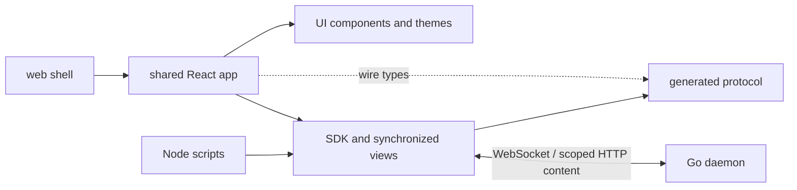

# Frontend architecture and design guide

This is the canonical starting point for coding agents working on WHIP's frontend.
It explains the current design, why it exists, and how to extend it. Updated on
2026-09-18 for bounded initial history warm-up and earlier chat scroll prefetch.

This is a maintained engineering guide, not a delivery checklist. Historical
plans preserve research and past alternatives; they are not instructions to
reintroduce superseded decisions. In particular, session tabs now ship, and
permission approvals no longer use a signer or enrollment. Current user
instructions take precedence. When changing an architectural decision, update
this guide and the affected reference in the same change.

## Start here

Before implementation, identify the owner of the state you are changing and read
the nearest working example. These principles apply throughout:

1. **The daemon owns work.** Clients observe and direct it. A browser disconnect,
   component unmount, tab closure, or aborted local wait does not cancel execution.
2. **Each kind of state has one owner.** Do not replicate SDK session state in
   Query, React context, or a second event reducer.
3. **The UI stays thin, but complete.** Put shared protocol/recovery behavior in
   the SDK, generic interaction and visuals in UI, and product behavior in app.
4. **Preserve the person's work and place.** Drafts, recipient selection, reading
   anchors, and unresolved submissions must survive ordinary navigation.
5. **Bound what you retain.** Virtualizing DOM nodes does not bound cached data.
   Every new collection needs a count/byte limit and a visible overflow policy.
6. **Use the design system.** Base UI, semantic HTML, shared StyleX tokens, and the
   full TUI theme catalog are foundations, not optional per-screen preferences.
7. **Keep outcomes truthful.** Accepted, running, waiting, failed, interrupted,
   stale, unavailable, and delivery-uncertain describe different conditions.
8. **Prefer deletion, reuse, and direct composition.** Introduce abstractions or
   dependencies only when an actual workflow needs them. This follows the
   repository's [ponytail principles](../.agents/skills/ponytail/SKILL.md).

## Product intent and visual philosophy

WHIP is a workspace for directing recursive coding work: sessions, child agents,
mailboxes, Starlark or JavaScript execution, budgets, goals, schedules, and human decisions.
The person should be able to read calmly, understand what is happening, and
intervene precisely. Conversation is the main working surface; inspection reveals
the evidence and recursive structure behind it.

OpenCode informed the restrained color, component finish, conversation layout,
and interaction quality. We adopted those qualities within WHIP's own architecture.
Its framework choices, runtime migration layers, and IDE feature scope are not
our template. The [original research](../.ai-docs/plans/web-app/README.md) and
[session-tab design study](../.ai-docs/plans/session-tabs/design.html) record the
reference work.

Design from these principles:

- **Reading first.** Quiet chrome, comfortable conversation width, compact tool
  summaries, selectable code, and details on demand. Avoid a card around every
  message, a wall of tool JSON, or a dashboard of metrics above the conversation.
- **Color conveys meaning.** Neutral surfaces establish structure; status,
  attention, selection, and focus justify color. The selected theme supplies the
  palette. Do not assign random colors to agents or hardcode mockup swatches.
- **Subtle depth.** Use canvas/panel differences and fine borders for ordinary
  structure. Reserve shadows for floating overlays. Selected tabs sit on the
  canvas above a recessed navigation strip.
- **Identity stays visible.** Keep runtime, root, and selected child unambiguous
  across navigation, composer, requests, and inspectors. A child's transcript
  inspection does not admit that transcript into an agent's model context.
- **Behavior is part of the design.** Stable scroll, grouped streaming updates,
  focus restoration, retained drafts, and coherent reconnect states matter as
  much as an idle screenshot. Background updates must not steal the reading
  position or keyboard focus.
- **Progressive disclosure preserves control.** Put common actions near their
  subject; move secondary actions into menus and inspectors without making them
  hover-only or hiding pending human requests.

Current scope is a React web application with basic mobile support, designed to
share its renderer with the macOS Electron host in `apps/desktop`. File editing,
code review, and hosted authentication are separate milestones. Terminal tabs
are in scope as a human-only shell beside the conversation. Data-only agent definitions (persona, rules, discovery, modules,
capabilities, surface flags) are authored in Settings and selected on the
welcome page; agents with custom tools or hooks are authored with the SDK,
because their handlers are code the renderer cannot host. Read-only code/tool
output is in scope. The session REPL viewer and Executions inspector show retained and live
execution evidence; neither executes user-entered code or inspects raw VM globals.

## Packages and dependency direction

All JavaScript packages are private ESM npm workspaces with one root lockfile.
Use Node 24. Exact installed versions belong to the package manifests and
`package-lock.json`; do not copy a historical plan's version list into a new setup.

| Package | Responsibility | Internal dependencies and boundary |
| --- | --- | --- |
| `@whip/protocol` — `packages/protocol` | Generated wire types, operation metadata, schemas, standalone validators | Generated from the Go registry; no application behavior |
| `@whip/sdk` — `packages/sdk` | Attachment, transports, typed services, durable commands, recovery, subscriptions | Protocol; optional `/state`, `/react`, and `/node` entry points |
| `@whip/ui` — `packages/ui` | Tokens, themes, fonts, accessible controls, layout primitives, code highlighting, Storybook | No SDK, protocol, router, Query, host access, or product state |
| `@whip/app` — `packages/app` | Shared React application, routes, feature UI, application state/lifetimes | UI, SDK, protocol types, TanStack tools |
| `@whip/web` — `apps/web` | Browser bootstrap, platform adapters, Vite configuration, static release build | App and UI bootstrap exports |
| `@whip/desktop` — `apps/desktop` | Electron main/preload, packaged runtimes, SSH, native effects and distribution | Consumes the web renderer artifact; native SDK imports stay outside the renderer |
| `@whip/mobile` — `apps/mobile` | Expo/React Native companion, native UI, lifecycle and encrypted device storage | SDK; only `@whip/app/presentation` and `@whip/ui/theme-data` from web-facing packages |
| `examples/client` | Small SDK usage example | Independent of the product application |



UI and app distribute TypeScript source, compiled by the consuming Vite build.
SDK distributes built JavaScript; protocol distributes generated artifacts. Use
package exports, not cross-package imports into private `src` paths. React is a
peer dependency of reusable React packages. Heavy browser-only functionality
such as tab dragging has an explicit subpath (`@whip/ui/workspace-tabs`).

Generic controls belong in UI; domain components such as Composer, PendingRequests,
Timeline, and agent inspectors belong in app. A UI button receives props and a
callback; it does not know how to submit a daemon command. Avoid creating a
package for every feature or a parallel set of app-specific base controls.

Electron consumes the exact `apps/web` production build through `AppPlatform`.
There is one Vite build, StyleX extraction and route tree. The sorted renderer
manifest verifies the copied files in Go's embed input and Electron's staging
directory. Desktop packaging must preserve those bytes in ASAR.
For UI development, `npm run dev:desktop -- --attach` uses the same Vite renderer
and the main installed daemon by default, without rebuilding or managing its
native runtime. Explicit home/executable flags can select an isolated daemon. This unpackaged mode has separate GUI settings and uses the native
Unix-socket bridge. See [desktop development](desktop.md#build-and-develop).
Node APIs, Electron IPC, filesystem access, and `@whip/sdk/node` stay in
`apps/desktop`; the Vite import-graph guard rejects them in the renderer.
`@whip/app/desktop-bridge` exports only the serialized host contract. The desktop
adapter calls that versioned bridge without importing Electron. Ordinary DOM,
focus, layout, styling and file-input behavior remain shared.

## Stack decisions and reasons

| Tool | Use it for | Why this boundary exists |
| --- | --- | --- |
| React + TypeScript | Shared application and typed component composition | Web and desktop can share product behavior |
| Vite | Static SPA build, development server, code splitting | The Go daemon already serves assets; no Node backend, SSR, or TanStack Start is needed |
| TanStack Router | File routes, validated search parameters, browser navigation | Shareable location has one authority: the URL |
| TanStack Query | Bounded host/detail reads through SDK methods | Deduplicates reads and manages invalidation without replacing SDK session synchronization |
| TanStack Virtual | Long session lists and variable-height transcript rows | Keeps rendered DOM work bounded; app still owns reading anchors and data budgets |
| TanStack Form | Structured settings forms where field state/validation warrant it | A simple field or the draft composer does not need a second form store |
| TanStack Hotkeys | Scoped, configurable application shortcuts | Browser-owned shortcuts and normal text editing remain native |
| TanStack Markdown | App-owned Markdown presentation and streaming rendering | Parsing does not own message identity, event assembly, or conversation state |
| Base UI | Focus, ARIA, keyboard, portals, overlay behavior | Accessible interaction comes from maintained primitives |
| StyleX | Authored component/app styles, variants, responsive rules, tokens | One extracted styling system across packages and themes |
| Lucide, self-hosted Inter and JetBrains Mono | Icons, chrome/reading, code | Consistent vocabulary and geometry without remote font dependencies |
| ghostty-web | Terminal tab rendering (Ghostty's VT parser in WASM, canvas renderer) | Draws a daemon-owned PTY without injecting styles, so the production CSP only gains `'wasm-unsafe-eval'`; xterm.js would need inline styles |
| Storybook, Vitest/Testing Library, Playwright | Components, app behavior, real browser integration | Each layer is tested at its actual boundary |

Do not add Redux/Zustand, TanStack DB, a second Query client per feature, another
CSS framework, or a frontend provider/agent execution loop without a concrete
architectural need. Existing tools are choices with defined jobs, not an excuse
to route every piece of state through a framework.

## Native Browser workspace boundary

Browser tabs are enabled by default in desktop builds; main honors
`WHIP_DESKTOP_BROWSER_TABS=0` as an explicit launch-time opt-out. Availability
does not grant agent control or preview-network authority.

Desktop Browser tabs use the same split-workspace descriptors and tab strip as
sessions, files and terminals. [`BrowserWorkspace`](../packages/app/src/browser-workspace.ts)
owns renderer observation/admission and pane routing; Electron
[`BrowserManager`](../apps/desktop/src/browser-manager.ts) owns the actual
`WebContentsView` pages, profile partitions and live inventory. A descriptor
stores only its ID, URL, title hint and optional inert preview-environment ID—not
a daemon, agent attachment or network grant. Missing native support preserves
these descriptors as unavailable rather than erasing them. New Browser tabs are
capped at eight (within 32 total workspace tabs), with four presented guests;
otherwise-valid over-cap restore metadata remains available for recovery.

[`BrowserPlatform`](../packages/app/src/browser-types.ts) is the optional,
versioned human-tab API. Mutations quote native epoch/tab/generation; presentation
is a full monotonic CSS-viewport geometry snapshot. Shared overlay owner tokens
must await native **hide acknowledgement before mounting interactive overlays**.
Restoring metadata does not navigate, and creating a page requires explicit
workspace admission before realization. Native snapshots are observations, never
instructions to admit an unknown page. Model-created tabs enter the captured
originating pane in the background.

On a full renderer navigation, native invalidates the old browser epoch without
broadcasting its replacement to the outgoing document. The incoming renderer
learns the new epoch through its initial snapshot. This prevents a final
visibility update from the old document consuming the new workspace's first
presentation revision and blocking dialogs with a stale-presentation error.

Agent control is deliberately separate:
[`BrowserAssociations`](../packages/app/src/browser-provider.ts) advertises inert
Browser v2 availability for an exact open conversation, verified execution host,
native window and captured pane, even when no Browser tabs exist. It also records
the user's explicit conversation/provider/tab/pane offers. Availability shares no
human pages, creates no tab and grants no preview-network or control authority.
The daemon promotes an unambiguous candidate only after create approval through
the existing permission policy. Multiple candidate windows require explicit
selection; connection order and focus never choose a destination.
`browser.list_tabs()` requests bounded current metadata on demand, limited to
root-offered pages, the caller's created pages and its live attachments. The
native main process verifies provider epochs and tab generations; the daemon
adds only the caller's attachment handles. Titles and URLs are untrusted data,
not instructions. Neither tab inventories nor attachment inventories are injected
into turn prompts.

[`client.browser`](../packages/sdk/src/browser.ts) owns selected-holder transport,
command IDs, cancellation, upload and teardown; the daemon owns durable scoped
permission decisions. [`BrowserAgentBridge`](../packages/app/src/browser-agent-types.ts)
is a trusted native adapter, not an arbitrary-CDP method on `BrowserPlatform`.
The controlled page is the human's page. Reconnect may re-advertise inert
availability, but never restores attachment grants or replays commands. Focus
changes, restored IDs and copied attachment IDs never grant authority. Releasing
an attachment does not close a human tab. Preview-network authority is separate
again, bound to the verified SSH connection and tab environment; URL connections
are not SSH preview providers. Standalone human preview admission uses a
parented native confirmation sheet in Electron main, not the SSH authentication
prompt flow; it cannot create agent authority. See [desktop Browser behavior](desktop.md#browser-tabs-experimental)
and [agent operations](browser-computer-use.md#desktop-browser-tabs).

### Browser Design Mode

Design Mode uses a separate trusted native sibling `WebContentsView` above the
selected guest. The isolated `apps/web/design.html` entry imports only
`@whip/app/browser-design`, UI/theme code, and its dedicated design-only preload;
it never initializes an app runtime or receives the normal desktop bridge.
Native [`BrowserDesignController`](../apps/desktop/src/browser-design.ts) owns
one exclusive human debugger lease, isolated-world DOM observations, selection
identities, overlay geometry, and capture. The overlay intercepts selection
clicks/keys; only bounded wheel input is forwarded to the guest. It yields to
existing native hide holds **before** acknowledgement; this does not weaken the
ordinary portal/modal boundary. Guest pages retain no app preload or authority.
Exact Cmd+Shift+D routes from guest/overlay native key handling and the browser
section's DOM handler through existing Browser shortcut events to the same app
DesignControl toggle. BrowserWorkspace rechecks the selected pane, current
epoch/generation, and native-surface holds; no global OS shortcut or guest bridge
is introduced. Repeats, composing input, extra modifiers, and stale/hidden
native surfaces do not toggle.

The app-side [controller](../packages/app/src/browser-design-controller.ts) owns
prompt/destination/capture state; [integration](../packages/app/src/browser-design.tsx)
projects connected, open conversation targets and defaults only an unambiguous
explicit page association. The isolated overlay receives bounded serializable
models and emits validated intents quoting a lease and document/selection revision.
It has no SDK, host connection, upload, or arbitrary CDP access. Theme backgrounds
must remain transparent on this native surface.

The hover outline alone transitions `left`, `top`, `width`, and `height` together
using StyleX `appearance.motionFast` (100ms), ease-out. One stable DOM outline
retargets from its current presentation without a JavaScript animation queue or
scale transform, preserving constant border thickness. First appearance snaps;
selected outlines, tooltip, composer, and click hit-testing never interpolate.
Native hover IDs identify consecutive observations of the same live backend node,
independently of selection IDs. Native `hoverGeometryRevision` invalidates motion
on scroll/resize/zoom/security hiding even if React batches away a cleared model;
missing revisions fail closed to snapping. Same-node geometry changes also snap.
The renderer compares lease, document/selection revision and viewport before
animating and removes invalid/nonactive hover immediately. Both app Reduce Motion
and OS `prefers-reduced-motion` disable interpolation, including an in-flight move.

Captured page text is an **untrusted text evidence attachment**, never concatenated
into authored instructions or passed through mention/skill expansion. A viewport
PNG is included by default and can be excluded. Existing
[`CompositionStore`](../packages/app/src/compositions.ts) surface-scoped keys retain
normal upload quotas and cancellation; [`submitChatInput`](../packages/app/src/chat-submission.ts)
is shared with normal chat. Design drafts do not overwrite the destination composer.
Confirmed admission clears the matching draft, evidence preview, and native selection,
closing the composer while leaving Design Mode active for another selection. The
reset is document/selection-revision scoped so late admission cannot erase newer picks.

Design submissions carry a bounded `design_context` presentation descriptor with exact
uploaded attachment identities. The daemon persists it in inbox previews and authored
message presentation, adding resolved content-part indices for history. The transcript
uses those indices—not filenames or text matching—to group the screenshot and selected
elements separately from authored prose. Full model evidence is unchanged. The shared
[attachment UI](../packages/app/src/browser-design-attachment.tsx) offers captured page
details and raw context on demand; pending/queued attachments load through the existing
scoped content reader. Older messages without this provenance keep their ordinary,
inspectable presentation. Page labels remain untrusted plain text and never retarget a
live page when opened from history.

Admission uncertainty uses existing command recovery, not a new command ID/retry.
Live nodes are transient; accepted text/image attachments use normal transcript
persistence. Navigation or stale nodes require reselection, never selector-based
silent retargeting. Inspecting/sending context grants no agent browser control.

## Native mobile companion

[`apps/mobile`](../apps/mobile) is a separate Expo Router renderer for iOS and
Android. It shares daemon truth and portable presentation with the web app, while
native contextual sheets come from Expo UI. The native component library in
`apps/mobile/src/ui` composes React Native text, input, press and switch primitives
with explicit Whip semantic colors; a Compose seed palette is not a replacement
for the selected Whip palette. React Native StyleSheet supplies
layout; FlashList virtualizes conversation/catalog rows; Enriched Markdown renders
selectable text; keyboard controller and safe-area providers own native insets.
This is a development implementation; [mobile acceptance evidence](../.ai-docs/plans/mobile-ui/EVIDENCE.md)
records the remaining native and release gates. Setup belongs in [mobile.md](mobile.md).

Native imports must use `@whip/app/presentation` (pure conversation rows,
submitted-input identity reconciliation and reading targets) and
`@whip/ui/theme-data` (resolved catalog and portable contrast helpers). Neither
entry point imports DOM controls, StyleX, web routing or browser providers.
`timeline.tsx` remains the web renderer of the same projection. Do not import the
web app/UI barrels into Metro or duplicate SDK stream reducers in mobile.

The device `MobileWorkspace` owns up to four independent host runtimes and the
shared encrypted storage connection. Each host runtime owns its SDK client,
QueryClient, commands and selected root/child leases. Session routes resolve a
verified host/runtime tuple through `RuntimeScope`; device Appearance stays with
the settings owner. Renaming a connected host updates its profile without
reconnecting. Removing or replacing one host leaves other hosts alone.
Saved profiles pin persistent runtime IDs and stable human client IDs. Startup
reconnects remembered profiles in pairs, prioritizing the last selected host.
Backgrounding pauses all SDK clients and cancels reads; foreground resume
reconciles durable identity before actions are enabled. Temporary `inactive`
transitions do not detach. Only the workspace closes shared storage. Work
continues on the daemon.

The connection sheet owns its actionable errors so native modal presentation
cannot hide the root layout's error banner. Its explicit Test Connection uses
one temporary SDK client for HTTPS discovery, initialization/identity and a
one-item session read, without saving or replacing the runtime's client. Each
stage is limited to 15 seconds; discovery is streamed into an 8 KiB buffer through
Expo fetch. Completion, failure, leaving the sheet or backgrounding closes the
probe. Native close details are bounded in the shared SDK and remain ephemeral;
the diagnostic export continues to omit raw errors and addresses.

[`WorkspaceAttentionProvider`](../apps/mobile/src/features/workspace-index.tsx)
above navigation owns one foreground query and 10-second poll. Home and Needs you
consume the same context. Session and attention indexes share a two-read device
lane. Each host retains one bounded page: 128 sessions / 256 KiB or 64 attention
entries / 128 KiB. Next replaces that host's page; old query windows have zero
cache lifetime. Thus each index has at most four retained host pages, not four
pages per host. Partial failures keep healthy hosts visible. Counts describe
loaded human requests and show `+` or `?` when incomplete or unavailable.
Completed commands invalidate these indexes. Lists never subscribe to root
transcripts. Session search is debounced, always includes active and archived
sessions, and supports a host filter. Device pins are explicitly local, bounded by the settings quota and
128 identities; host-provided pins remain visible.

Use the private SQLCipher database for four saved hosts, bounded preferences,
16 revisioned drafts (64 KiB per record, 512 KiB total), 64 reading bookmarks
(64 KiB total), and 64 recovery/permission records sharing a 64 KiB budget.
The SecureStore key uses device-only keychain accessibility; the database lives
in a native backup-excluded directory. Failure to open or write durable storage
must remain visible and must not silently switch to plaintext or allow an
unrecorded send. Snapshots, query caches, prompts in recovery records, provider
credentials and transcripts are not persisted. Draft text is a separate record.

Runtime command metadata and its recipient/request/draft revision are committed
atomically before sending. Permission decisions retain a separate typed record
and use `client.permissions.status`; they are not generic runtime commands.
A status failure is not evidence of non-admission. Retried runtime commands retain
original bytes/identity and require an explicit action after authoritative missing
status; restored records contain no payload and cannot replay automatically.
Creation journals retain the created root across effort/input partial failures.
They also retain the selected execution engine before creation. Native creation
offers the host's advertised languages, locks that choice for a created root,
and restores legacy workflows as Starlark without inheriting a newer default.

Only an explicit full-message sheet fetches content, at most 256 KiB through SDK
scope/hash checks. Recycled transcript rows cannot initiate reads. Native text
pages contain at most 8,192 UTF-16 units, preserving surrogate pairs. Short messages
keep Markdown rendering; larger messages use selectable source pages. Collapsed
tool details use 512-unit previews, and explicit Copy retains the complete loaded
text. Paging resets on recycled message identity and preserves the selected page
during live appends. These bounds apply to combined tool arguments/output and
explicitly inspected bodies as well as ordinary conversation text. Markdown with
image syntax or raw HTML delimiters uses selectable source presentation so the
native renderer cannot fetch embedded images; link previews are disabled, and
links open only after a user tap through an external-scheme allowlist.
Appearance has a dedicated native route with the generated theme catalog,
preview/cancel, paired light/dark preferences, native text/code preferences,
contrast and reduced motion. Custom JSON import uses the existing host resolver
and the portable `themeFromHost` presentation helper, then shared validation.
Resolved imports work offline. Schema v2 adds a separate 256 KiB `themes` bucket;
one atomic record owns preferences and at most 16 custom themes so removing a
selected import and repairing its selection cannot diverge. The v1 migration
preserves existing device data and legacy appearance choices. Other storage quotas
are unchanged. A development-only `/gallery` renders real controls for native
theme/keyboard checks. Uploads in conversations, QR pairing, application auth and
push notifications are deferred.

## Runtime construction and lifetimes

[`apps/web/src/main.tsx`](../apps/web/src/main.tsx) selects the browser adapter or
the versioned desktop bridge adapter. The packaged `whip-app://bundle` origin
requires a compatible bridge; it cannot become a daemon endpoint by fallback.
[`bootstrap.tsx`](../apps/web/src/bootstrap.tsx) applies the saved theme before
first render and creates one `createWhipApplication` instance outside React.
That factory wires the router, runtime, ThemeProvider, UIProvider,
QueryClientProvider, and runtime context. Both hosts share bootstrap/disposal.

The adapters under `apps/web/src/platform` supply storage, Web Locks, clipboard,
external links and awaitable downloads. `AppStorage` remains synchronous, with
an optional `persistent` status; the visible memory fallback reports false after
a persistent operation fails. Desktop `windowStorage` uses a namespaced
localStorage record for relaunch restoration; browser window state uses
sessionStorage. Native save operations transfer bounded chunks after selection;
cancel returns a distinct outcome and does not claim that a file was saved.

Optional [`AppPlatform`](../packages/app/src/platform.ts) capabilities supply
typed native effects without exposing Electron objects or filesystem handles to
components. New session uses `pickDirectory` only for a selected local profile;
URL and SSH hosts retain the host-owned directory browser. The browser’s Local
can use the daemon picker RPC. Picker requests retire when their client or route
changes. Cancellation preserves the directory; unavailable native choosers fall
back to browsing directories on the original host.
Bootstrap calls `platform.dispose()` after the shared application unmounts.

Browser and desktop bootstrap share a centered `WhipcodeWordmark` splash in
[`startup-screen.tsx`](../packages/app/src/startup-screen.tsx). It uses HALO's
logo rise, fade-out and content entrance with Whip theme colors. The mounted
router is inert while covered; the initial Local connection settling releases the
splash, with a three-second ceiling to expose recovery for slow/offline hosts.
Saved remote connections continue in the background and never gate the splash.
There is no minimum hold or replay on navigation/reconnection. System and saved
reduced-motion preferences skip animation. Startup acquires the shared native-surface
hold before showing the splash and retains it through content entrance: CSS visibility
and stacking cannot hide Electron browser views. The hold releases when fully visible
or unmounted. Native prompts remain outside the inert subtree, and desktop `ready()`
still signals the mounted shell.

The desktop window hides its native title bar on macOS (`titleBarStyle:
'hiddenInset'` in [`main.ts`](../apps/desktop/src/main.ts)) and the renderer
owns the top chrome. The bridge reports this as `chrome: 'inset'`
([`desktop-bridge.ts`](../packages/app/src/desktop-bridge.ts)), surfaced as
`AppPlatform.chrome`; the browser adapter leaves it undefined and is unaffected.
The sidebar's 48px brand row and the 48px tab strip double as the window drag
region via `-webkit-app-region` (the `windowDrag`/`windowNoDrag` entries in
[`styles.ts`](../packages/app/src/styles.ts) and
[`workspace-tabs.stylex.ts`](../packages/ui/src/workspace-tabs.stylex.ts));
interactive children opt out — while idle, the tab list stays draggable so the
strip's empty stretch moves the window. During a sidebar-session drag, only the
usable tab list temporarily opts out so its empty stretch can accept a new view;
the traffic-light inset remains excluded. Individual tabs and utility buttons
always opt out to protect reordering and clicks. The traffic lights are
vertically centered in
that strip (`trafficLightPosition: {x: 12, y: 18}`); the sidebar carries the
theme-colored `WhipcodeWordmark` (`@whip/ui`) in both shells — a home link in
the browser's brand row, an inert mark below the empty traffic-light strip
(aligned with the nav icons) when inset — and when the sidebar is hidden the
leftmost tab strip reserves the light zone instead (`trafficLightInset`). Only the leftmost pane's strip is a drag region.
Hiding the title bar removes the native double-click-to-zoom gesture.

Desktop's optional `localRuntime` capability provides `test`, `choose`, `install`
and `restart`. Electron main owns executable discovery, compatibility checks,
installation and process effects through [`LocalRuntime`](../apps/desktop/src/runtime.ts).
Its native `native-local-runtime.json` settings record contains the selected
absolute executable path, optional management hash/channel, and a release-specific
restart approval. React does not store another copy or derive sockets.
The first connection discovers and validates `whipcode`, then persists the path
so Finder and terminal launches use the same installation. A missing saved path
does not fall back to another executable. Packaged backend bytes are an explicit
installation/update payload; ordinary daemon execution uses the selected installed
executable. A main-process synchronization gate verifies managed installations
before local connection, coordinates restart with the Go maintenance lock, and
consumes the existing update approval after matching readiness. Any running daemon
requires explicit interruption approval; a UI status snapshot is not an idle fence.
An explicitly chosen external binary is never automatically adopted or replaced.
Local connection preparation owns startup synchronization; the window-ready
event does not launch a second check. Synchronization and attachment share one
shell environment and reuse a successful unchanged-runtime probe under the same
mutation lock. Starting a stopped daemon or replacing an executable triggers a
fresh readiness check. Results are discarded after the attempt; reconnect,
diagnostics and restart reread the environment. Restart also shares one
environment across its preflight, command and readiness checks.
Normal stable and beta desktop channels share the default `~/.whipcode` runtime
home. An explicit `WHIPCODE_HOME` can isolate a fixture; legacy `WHIP_HOME` never
redirects local work. The canonical installation on the development Mac is
`/usr/local/bin/whipcode`.

**Settings → Servers → This Mac → Local server settings** exposes diagnostics
even before the first successful connection. The focused dialog reuses
[`LocalRuntimePanel`](../packages/app/src/host-dialog.tsx). Opening it and changes to
the host's connection state refresh a read-only diagnostic snapshot; **Test
Connection** repeats that check without starting a daemon, installing a binary,
creating the runtime home or rewriting its configuration. Only the bounded
`LocalRuntimeStatus` crosses the bridge: state, selected executable, home, client
and daemon builds, an actionable message and installation availability. Paths
and builds live in expandable diagnostics; raw logs and environment values do
not enter the renderer. The panel owns its temporary busy/error/confirmation
state and retires late results on close; it is not another SDK connection owner.

**Choose executable** uses a native picker and validates the selected distribution.
The welcome screen's **Set up this Mac** uses the optional
`localRuntime.installDefault` capability, then connects through `HostConnections`.
The native runtime probes first: a compatible executable is reused, and only a
missing installation is filled with verified bundled bytes at the saved missing
path or `~/.local/bin/whipcode`. This shortcut does not create a second daemon or
connection owner. `LocalRuntimeSetup` owns cancellable UI observation; installation
and accepted daemon work retain their native owners. Incompatibility and install
failure stay visible with access to the existing diagnostics panel.

**Install whipcode** requires an explicit action and installs verified packaged
bytes without overwriting a different existing installation. Neither action starts
work. The existing host **Connect** action attaches to a healthy daemon or starts
the selected installation when stopped, with bounded progress through the existing
connection resolver. **Restart daemon** explains the interruption to CLI, web and
desktop work and requires a separate explicit confirmation. SDK reconnect and
runtime-identity acceptance remain unchanged. Disconnecting, switching hosts and
quitting the GUI do not stop accepted work. Browser adapters omit `localRuntime`;
URL and SSH connections retain their existing transport paths.

[`HostConnectionDialog`](../packages/app/src/host-connection-dialog.tsx) is the
shared SSH connection surface for Add server and the saved server's Connect action.
Configuration remains mounted but hidden while the same dialog presents progress,
host-key verification, authentication, or failure. Cancel stops the attempt and
returns a new connection to its preserved form; saved reconnects close. Error
recovery offers retry and editing. Success closes only after `HostConnections`
verifies the daemon and, for new profiles, saves it. The dialog observes that owner;
it does not create another transport or persist connection state.

The desktop adapter creates the bounded
[`host-prompt-controller`](../packages/app/src/host-prompt-controller.ts) before
startup, exposed through `AppPlatform.hostPrompts`. It registers each native attempt
ID against its profile ID before preparation and retires prompts when that attempt
is released. The foreground dialog claims its host's prompts; unrelated prompts
remain queued rather than stacking dialogs. [`HostPrompts`](../packages/app/src/host-prompts.tsx)
uses the Application child slot for background authentication, opening the same
connection surface only when input is needed. Ordinary background connection
progress does not open a dialog. Server rows retain status badges; detailed SSH
progress and errors stay in the active dialog, with host error notices available
after dismissal.

[`HostPromptForm`](../packages/app/src/host-prompt-form.tsx) renders selectable
host-key fingerprints with explicit confirmation and bounded authentication fields.
Answers are ephemeral: clear inputs on submission, dismissal and unmount, and never
put them in drafts, preferences or logs. The four-prompt queue identifies answers
by serial and connection attempt, rejects stale completions, and leaves failed
answers visible. Final teardown declines outstanding challenges. Subscription
cleanup permits React StrictMode's immediate effect replay before disposal.

The desktop adapter owns one disposable update listener and a referentially
stable, immutable snapshot plus the installed GUI version. Device settings reads
the optional `updates` capability with `useSyncExternalStore`; mounting settings
does not trigger an update check. Checking and installation call the native host.
Only a downloaded update offers Restart to update, which still uses the normal
draft/attachment close handshake. Browser adapters omit this capability.

[`AppRuntime`](../packages/app/src/runtime.ts) owns one window's connections,
Query client, root-view leases, command observations, drafts, and tab/composition/
reading stores. [`HostConnections`](../packages/app/src/hosts.ts) owns an independent
SDK client and `SessionListView` for each attached daemon. Components subscribe
using `useSyncExternalStore` through app hooks or `@whip/sdk/react`. Store
snapshots remain immutable and referentially stable between changes.

Local is the daemon supplied by the browser launch endpoint, or the managed
This Mac runtime in Electron. Its configuration
owns the `remote_hosts` registry, shared by browsers using that local daemon:
profile ID, display name, normalized URL, verified runtime ID, and connect-on-launch
preference. These are attachment profiles, not copied sessions or credentials.
The existing revision-checked configuration update persists the whole registry.
Host management refreshes it on open, browser focus, and Local reconnect; conflicts
surface rather than overwriting another browser's changes. Legacy browser-only
addresses remain available for explicit import.

**Settings → Servers** is the canonical management surface. Sidebar, command
palette, and disconnected-session actions navigate there through the existing
unsaved-edit guard; `section=connections` and `setting=hosts` remain compatible.
[`ServerManager`](../packages/app/src/host-dialog.tsx) renders ordered rows with
name, textual status, muted address, contextual errors/progress, and labeled
shared overflow menus. A single Servers heading and Add server action sit above
quiet bordered rows, using shared `SettingsRow` layout and theme tokens. There
is no separate connection-method group or inline add form. Local cannot be
removed. Removing another saved server
requires confirmation and does not remove daemon sessions, host-owned tabs, or
drafts. Diagnostics and legacy import/recovery tools are contextual, not an
always-visible second management form.

[`HostDialog`](../packages/app/src/host-dialog.tsx) is now only the reusable
Add/Edit form. Onboarding opens it directly and retains its selection callback.
URL is the default; the shared `Tabs` component exposes Server URL and SSH only
on platforms that support SSH. Fields, alerts, and advanced/recovery disclosures
use shared `@whip/ui` components. Blank names derive from the normalized URL
host (including a non-default port), while SSH names derive from the host/alias. URL
connect-on-launch and explicit replacement-identity acceptance remain collapsed
under Advanced. New SSH connections show a searchable single-selection profile list from the
viewing Mac’s configuration. `AppPlatform.listSSHProfiles` is an optional native
capability; older desktop bridges retain manual entry. Discovery runs only while
SSH setup is mounted, through one transient Query entry, never on app startup.
Refresh retains the previous rows and fixed list viewport; failures, empty config,
no matches, and truncated results remain distinct. Already verified SSH aliases
show Added. Advanced switches to the manual form, with both drafts owned by the
parent form so method/mode switches retain input. The shared RadioGroup card
variant owns accessible selection; no app-specific radio controls are introduced.
SSH overrides retain their existing meanings, with no auto-connect control. URL saves require Local's loaded shared registry; native
SSH saves do not. Pending native saves can be cancelled through their scoped
AbortSignal without detaching other hosts. Validation/save failures preserve the form. Native save verifies the connection before selecting the server and closing;
progress and failures stay in the dialog, and retry reuses the form’s target ID.
URL save selects and initiates connection before closing; subsequent connection
failure remains on its server row. Dialogs restore focus to the
originating Add button or row menu trigger. No additional controller or store
owns these effects.

Desktop connection profiles represent URL, local or SSH targets. Each host record
owns asynchronous setup cancellation, progress, the resolved transport and its
cleanup. Local/SSH resolution yields a bounded IPC `TransportFactory`; URL
connections use ordinary SDK network transport. Selecting work never detaches
other hosts. Native profiles and their verified identities remain in device
storage (`whip.hosts.v2`); old desktop URL profiles remain available for explicit
verified import into Local’s registry before their device copy is removed.
The saved native selection reconnects on launch alongside This Mac. The focused
profile ID is stored separately in `whip.selectedHost.v3`, so selecting a shared
URL host does not create a second authoritative copy of its profile. A legacy URL
selection produces an import notice and preserves its original identity and tabs.
The native bridge admits at most 16 prepared connections and 32 transport handles,
including overlap during reconnect; existing per-transport byte bounds still apply.

Each client verifies its handshake runtime ID before exposing session reads or
views. Duplicate runtime aliases are rejected. Rebinding an address to a replacement
daemon requires explicit acceptance; existing tabs retain their original runtime
identity. SDK reconnect belongs to each connection. An explicit detach aborts
only that host's waits, disposes its observers/views, clears its Query data, and
invalidates its attachment references. Healthy hosts, their panes, drafts and
accepted work remain independent. Losing Local prevents registry edits while
already attached remote hosts remain usable. Late reads and configuration replies
must match their source connection and revision before changing current state.

`flushDrafts()` returns `{ saved, error? }`; memory fallback is not durability.
Bootstrap uses this result and in-memory attachment state for browser unload and
desktop close/reload/update replies. A storage failure must keep a visible loss
warning even for text-only drafts. Closing a native window can hide it while
preserving its renderer; full quit uses the close handshake.
Clearing a previously persisted draft remains unsaved if deleting its durable
record fails; an in-memory tombstone does not authorize a successful close.

Desktop Cmd-W invokes the existing focused-tab close action, preserving drafts
and daemon work. Closing the final session or terminal tab opens a New Chat on that tab's host and
folder, so the workspace always offers a place to type; closing a New Chat as the
last tab empties the workspace, and Cmd-W with no active tab hides the window. It does not disconnect any
SDK client. Stable and beta hosts format `whip://` and `whip-beta://` links
respectively through the preload's channel capability; both use the same renderer.
Native session links use
[`createSessionNavigator`](../packages/app/src/session-tab-routing.ts) to select
an already saved, verified runtime identity. A link cannot create a connection
profile. Newer links, manual navigation, a changed host/profile, or disposal invalidate
pending navigation; attachment must still be connected to the expected runtime before
the shared router moves.

`runtime.acquireView(runtimeId, rootId)` returns `{ view, release }`; release
is idempotent and belongs in effect cleanup. Leases use both runtime and root
identity, so equal root IDs on different hosts never share data. StrictMode and
duplicate views of the same root share a lease. The four-root retention budget
is window-wide, not multiplied by the number of connected hosts. Do not instantiate
clients/views during render, open subscriptions on link hover, or hydrate tab
roots to obtain labels. Inspect child history through
`runtime.acquireAgent(view, agentId)` and release the consumer in cleanup; only
the final consumer closes shared child history. The daemon caps root subscriptions
at 16 per connection; do not open extra connections to bypass that limit.

## State ownership

| State | Owner | Persistence / lifetime |
| --- | --- | --- |
| Execution, commands, sessions, provider credentials, permissions, model context, scheduling | Daemon | Durable host truth; clients cannot replace it |
| Native local/SSH profiles | Device storage | Bounded v2 profiles; URL profiles move to the shared registry only after verified import |
| Canonical local executable selection | Electron main `LocalRuntime` | Native settings hold one absolute installed path; default home is `~/.whipcode` in both desktop channels |
| Local runtime diagnostics and repair UI | Native probe / host dialog | Bounded serialized diagnostic snapshot and transient busy/error/confirmation state; no daemon state duplication |
| Native notification deduplication | One app observer per attached runtime | Up to four pages / 256 roots, transient counts and question IDs; no transcript subscriptions |
| Desktop updates and authentication prompts | Platform adapter / bootstrap | Native update snapshot and bounded ephemeral prompt queue |
| Saved execution hosts | Local daemon configuration `remote_hosts` | Revision-checked file shared by browsers; remote daemon credentials stay remote |
| Connection, request correlation, replay, command delivery/status | One SDK `WhipClient` per host / `CommandHandle` | Independent connections and runtime/client/command-scoped recovery |
| Root snapshot, history, live presentation, agents, requests, history revision, root collections | SDK `SessionView` | Reconstructible bounded memory; app leases it |
| Ordinary lightweight session lists | One SDK `SessionListView` per host | Observed catalogs; do not add duplicate Query list pollers |
| Host catalogs/settings, search, attention, tab summaries, explicit detail reads | TanStack Query via SDK | Runtime-scoped keys; only the detached host’s data is cleared |
| Focused root, child and shareable inspector section | TanStack Router | Validated URL/search; history carries a local view-ID hint |
| Sidebar width, visibility and directory collapse | App shell | Window storage with memory fallback; host-scoped collapse |
| Split tree, pane focus/selection, open/closed view order and locations | App `SessionTabs` | One v3 workspace spanning hosts: browser sessionStorage or desktop namespaced localStorage; v1/v2 recovery and memory fallback |
| Terminal shells, replay ring, live attachment | Daemon `internal/terminal` | Host truth; the view keeps only its next expected cursor and reattaches after reload or reconnect |
| Draft text | App runtime | Device storage, keyed by runtime/root/recipient |
| Files, upload progress and submission locks | App `CompositionStore` | Window memory shared by runtime/root/recipient |
| Composer caret selection | App `CompositionStore` | Window memory scoped by runtime/view/agent |
| Reading anchors | App `ReadingPositions` | Bounded memory scoped by runtime/view/agent and history revision |
| Theme, typography, wrapping, contrast and motion | UI theme provider through platform storage | Validated viewing-device preferences, applied at the document root before paint |
| Keyboard preferences and tool density | AppRuntime preferences through platform storage | Viewing-device behavior; density never reads additional transcript/content data |
| Settings return location | AppRuntime and window storage | One bounded return record with runtime/root/view/search/focus; cleared on exit |
| Open popover, focused control, transient form edits | Local React/Base UI/Form state | Narrowest component lifetime that satisfies the workflow |

Do not save snapshots, event streams, or Query caches to browser storage. Command
recovery records contain identity metadata, not prompts, credentials, or file
bytes. Draft text is deliberately a separate, application-owned persistence path.
Storage denial/quota errors must visibly fall back to memory, not claim durability.

### Current retention budgets

These are implementation defaults, not new server guarantees. If changing them,
update their source, boundary tests, and this table together.

| Resource | Bound | Source |
| --- | --- | --- |
| SDK session view | 8 MiB retained payload; 512 history messages per opened agent | [state.ts](../packages/sdk/src/state.ts) |
| Durable presentation | 64 KiB per transcript record, 128 ordered parts, 128 host operations per execution; inline content-handle summaries at most 8 KiB within page bounds | [presentation.go](../internal/llm/presentation.go) |
| Markdown display cache | 512 documents / 2 MiB source, coalesced to 30 live parses/second; per-block fade chunks capped at 32 | [streaming-markdown.tsx](../packages/app/src/streaming-markdown.tsx) |
| Transcript disclosures | 128 explicit choices, 512 member aliases per activity group | [timeline.tsx](../packages/app/src/timeline.tsx), [chat-activity-rows.ts](../packages/app/src/chat-activity-rows.ts) |
| SDK execution evidence | 256 entries per root, 128 host calls per cell, 1 MiB within the session view budget | [executions.ts](../packages/sdk/src/executions.ts) |
| SDK trace evidence | 4,096 spans and 2 MiB per root; the oldest traces are evicted whole and the view says so | [trace.ts](../packages/sdk/src/trace.ts) |
| App root views | 4 retained roots across all hosts; unused views expire after 30 seconds; never evict an actively leased root | [runtime.ts](../packages/app/src/runtime.ts) |
| Tab layout | One workspace: 4 panes, 32 open views, 20 closed entries, 64 KiB metadata; unmigrated v1/v2 layouts remain in their original storage | [session-tabs.ts](../packages/app/src/session-tabs.ts) |
| Terminals | 16 live or retained-exited shells per daemon, 1 MiB replay ring each, 16 KiB per write, 32 KiB per output chunk; the view keeps 10,000 scrollback lines | [terminal.go](../internal/terminal/terminal.go), [terminal-view.tsx](../packages/app/src/terminal-view.tsx) |
| Sidebar layout preferences | 4 hosts, 64 collapsed directories per host, 64 KiB metadata; this does not limit connected hosts | [sidebar-state.ts](../packages/app/src/sidebar-state.ts) |
| Draft text | 32 nonempty drafts, 256 KiB each, 1 MiB total | [runtime.ts](../packages/app/src/runtime.ts) |
| Submission previews | 32 entries, 1 MiB total; confirmed entries evicted first | [input-presentation.ts](../packages/app/src/input-presentation.ts) |
| Attachments | 16 files per recipient; 20 MiB across the window; serial uploads | [compositions.ts](../packages/app/src/compositions.ts) |
| Reading bookmarks | 128 entries, 64 KiB | [reading-positions.ts](../packages/app/src/reading-positions.ts) |
| Search | One 64-item / 256 KiB all-status page per included host while open, plus each host’s initial page cached for five minutes; catalog revisions invalidate results | [session-search-dialog.tsx](../packages/app/src/session-search-dialog.tsx) |
| Attention | One 64-item / 256 KiB advisory page per connected host | [attention.tsx](../packages/app/src/attention.tsx) |
| Agent mailbox pages | At most 4 bounded Query pages | [observation.tsx](../packages/app/src/details/observation.tsx) |
| Visible stored chat messages | Automatic scoped reads up to 64 MiB per body; Query deduplication, cancellation and zero inactive cache lifetime; retained response-copy prose at most 256 Ki characters / 512 entries per timeline | [timeline.tsx](../packages/app/src/timeline.tsx) |
| Explicit content inspection | 1 MiB text read; 64 MiB download; rendering has its own smaller caps | [shared.tsx](../packages/app/src/details/shared.tsx) |

Payload limits do not equal total JavaScript heap limits. Preserve visible
truncated/unavailable states, lazy content reads, and server pagination bounds.
Draft admission also has cross-window limits: simultaneous additions can briefly
exceed the aggregate storage budget; subsequent writes require clearing drafts.

### Split workspace

`SessionTabs` owns one immutable binary tree across all hosts: split nodes carry
a direction and ratio; pane leaves carry ordered chat/REPL/New Chat/terminal descriptors, a selected
view ID, and stable pane IDs. Terminal descriptors store runtime identity, the daemon's
terminal ID and cwd; they move between panes but never duplicate, never enter Reopen
history (their shell ended with the tab), and route to `/h/$runtimeId/t/$terminalId`, which
selects an open tab and otherwise shows a missing state without starting a shell.
`terminal-view.tsx` mounts ghostty-web once per shell identity, attaches from cursor 0 on
mount and from its last cursor on reconnect, redraws on a cursor gap, forwards the command,
composer and terminal shortcuts to the app, and offers Restart (a new shell behind the same
tab) or Reattach when the daemon reports exit or a takeover. Session-backed descriptors store runtime/root identity;
New Chat descriptors store an independent draft ID, optional host profile/runtime,
working directory, permission mode and optional execution engine, agent definition,
model/provider pair and reasoning effort selections. Prompt text and recovery payloads never enter
the v3 layout. Draft tabs consume the same 32-view capacity but no root observation
leases, summaries or session actions. Splitting a draft moves it rather than duplicating it.
The global session view ID identifies one presentation of that host’s session. Duplicates share
SDK data and recipient drafts/files/locks, but retain independent mode, agent, inspector,
scroll and caret state. When a chat view becomes active on desktop, its composer
receives focus without scrolling; compact layouts and open overlays retain their focus.
Only the focused view is reflected in the URL. Native
links carry a validated `whipViewId` history hint so Back/Forward can distinguish
two views with identical URLs. Sidebar/search reuse the selected matching view,
then one in its pane, then another existing view before adding a new tab. Matching
always includes runtime and root identity.

Dragging a saved sidebar session into a tab strip or onto a pane's left/right/top/bottom
split edge, or choosing **Open in new tab**,
always opens a fresh root chat view, even when that conversation is already open.
It does not create or fork a daemon session. Existing views retain their reading,
agent and inspector state; ordinary sidebar clicks still reuse matching views.
`SessionTabs.openChatView` validates identity, target pane and the unconditional
32-view limit (and four-pane limit for an edge), inserts/selects/focuses and persists
the fresh view and optional split in one immutable update. Sidebar sources reuse
the attached-tab edge hit testing and split preview, including compact/minimum-size
restrictions; pane centers never accept sidebar drops. Preview and release both
recheck capacity and target validity. Cancellation leaves the layout untouched. A
new item uses its insertion index directly (unlike transfer, there is no removed
source index to adjust). The menu inserts after the focused pane's selected tab.
Both paths use `openChatView` in routing and `tabDestination`'s exact `whipViewId`;
routing failure is reported without retrying creation. Known offline hosts can
open unavailable views locally; a removed host cannot.

The v3 window record migrates the last-used v1/v2 host layout first. Other legacy
layouts remain recoverable under **Settings → Servers → Restore previous host tabs**.
Restoring merges panes and closed-tab history after checking the window-wide
limits and remaps view/pane IDs to avoid collisions. If the complete layout cannot
fit, **Open individual previous tabs** recovers either open or closed descriptors
without consuming the original layout. Both initial migration and explicit restore
validate the expanded v3 metadata before marking a layout migrated. Original v1/v2
storage is retained, with restored/dismissed identities recorded in v3. Failed
writes visibly use memory, leaving original layouts recoverable on reload.

Each desktop tab strip has one plus-button menu, with **New session** first,
followed by the available terminal, Browser, and pane actions. The compact mobile
bar retains its direct New session button.

`SessionTabStrip` coordinates the workspace and renders one selected session view
per visible pane. `ConversationRoute` handles admission/host status only. The
workspace reconciler releases obsolete root leases **before** acquiring new roots;
it deduplicates selected `(runtimeId, rootId)` pairs and never mounts background
tabs for labels. A disconnected host shows an unavailable state in its own panes;
it does not replace the layout or release healthy hosts’ selected roots.
New Chat routes (`/new/$draftId`) select the saved draft and render Welcome in its
pane. Every explicit New session action allocates a fresh draft in the focused pane;
modified links use `/?new=1` so only the destination window allocates. Ordinary `/`
is a home/empty destination, not creation intent. Missing draft links never allocate
a replacement. Settings retains the tree and releases visible consumers.
`SessionContent` takes an explicit mode and view location; late actions verify the
originating location and host before updating their view.

`@whip/ui/workspace-layout` provides recursive geometry and one shared dnd-kit
provider. `WorkspaceDragScope` (exported through `@whip/ui/workspace-tabs`)
wraps the shell's sidebar and workspace; standalone layouts retain a local scope.
The layout registers its current target resolver with that scope; a standalone
strip on an unmatched/home route registers its own resolver instead. Existing view
sources keep content-edge split/transfer targets; `WorkspaceExternalSource` uses
opaque app-owned payloads and accepts usable tab strips and all four content split
edges, excluding utility controls, traffic lights and content centers. It keeps the original row in place
and reuses the contoured tab face, insertion gaps, cancellation, reduced-motion,
click suppression and native Browser-surface occlusion path. Auto-scroll is
horizontal only, avoiding sidebar/page vertical scrolling. The app validates
capacity and destination again at release and returns the created view ID for
preview settlement. No navigation, storage write or session work happens on hover
or cancellation. Touch/compact navigation retains ordinary link/menu behavior.
It accepts generic rendered content; chat/REPL and future terminal descriptors
and renderers belong in app. WHIP owns tree edits, persistence and product limits.
The only new dependency, `react-resizable-panels`, supplies keyboard/pointer
resizing. It has no vendor theme CSS. Selected content uses stable, sorted sibling
DOM nodes over measured pane slots, so moving a view across branches preserves
its mounted state. Geometry may use inline positioning; authored styles remain
extracted StyleX. The resize library's disabled cursor helper allocates an empty
adopted stylesheet; CSP tests require zero injected rules and no violations.

Split/move menus are alternatives to dragging. Edge previews respect the
four-pane cap and minimum dimensions (320 × 240 px, plus separators). If available
space cannot fit the tree, the focused pane fills the workspace; below 768 px the
existing mobile picker replaces its strip. This changes presentation only. Saved
ratios and the desktop tree return when space permits. Overflow within a very
short pane remains scrollable so its composer and controls stay reachable.
Committed resize operations persist; pointer movement does not write storage.
Both split directions use one-pixel quiet dividers with transparent drag targets
above the content layer. Pane focus does not add an accent border to the tab strip;
keyboard controls retain their focus-visible outlines.

### Error ownership and canonical displays

[ErrorNotice](../packages/app/src/error-feedback.tsx) supplies the shared visual
contract; existing state owners retain and clear their own errors. Classify by
what failed, not its technical cause. A timeout can belong to any of these owners.

| Type | Owner and canonical location |
| --- | --- |
| Application | Application-wide startup, rendering or persistence failure; app error area or blocking recovery screen |
| Host | One server connection; named host notice in app chrome |
| Session | Session snapshot or transcript synchronization; top of that session pane |
| Turn | Agent turn outcome; conversation outcome notice or matching REPL outcome |
| Execution | One execution cell or host invocation; inside its recorded result |
| Submission | User input admission or uncertain delivery; adjacent to its composer |
| Resource | Read of a list, catalog, stored body or attachment; inside its owning component |
| Action | Explicit mutation, recovery, copy or download; beside its control or inside its dialog |
| Validation | Invalid input; at the field or immediately above form submission controls |

In forms and action dialogs, place action errors after the fields and immediately
above the submission controls, matching form-level validation errors.

Show one primary error, with recovery controls and expandable technical details.
Dependent surfaces show availability status instead of repeating a host failure.
Do not send local failures to a global banner or a second toast. `runtime.run`
records command outcomes but its caller owns presentation. Durable command
acceptance does not prove that a child submission was enqueued or a turn started.
Keep failure, cancellation, interruption, reconnecting and uncertain acceptance
distinct; never retry uncertain input automatically.

Clear current errors after successful recovery, and guard asynchronous responses
against changes of host, session, action or navigation. Recorded execution failures
remain with their records. The current `last_turn` contract exposes only the latest
agent outcome: a new turn hides it and a successful turn replaces it. Complete
historical turn errors at exact transcript positions are not supported by this
contract; event replay has no authoritative transcript-position linkage. Do not
invent historical placement or claim complete turn-error history.

### Session REPL viewer

Each agent's optional `last_turn` is a bounded daemon-owned projection, separate
from agent lifecycle: an idle agent can have a failed last turn. Lifecycle events
use the SDK's existing coalesced snapshot refresh; app does not synthesize an
execution or assistant message when a request fails before producing output.
`agent-turn-notice.tsx` shares the named-agent outcome notice between chat and REPL,
and the agent inspector displays a distinct last-turn failure badge. Starting a
new turn hides the old notice; success replaces the failed outcome. Long errors
have a 4 KiB preview and an explicitly opened scoped content reference. A selected
agent outside the SDK's bounded agent page uses a cancellable detail read,
invalidated with lifecycle snapshots rather than individual streaming deltas.
Older compatible snapshots may omit the summary; absence means unknown.

New root/session, fork, and child IDs are opaque 20-character lowercase base32
identifiers. Existing IDs remain valid. Use `root_id`/`parent_id` for hierarchy;
never parse an ID prefix or rely on a fixed legacy hex length.

**Open REPL** creates a fresh view immediately to the right of its source in the
same pane, preserving runtime, root and selected agent. The information bar,
tab/context menus, mobile picker and conversation evidence use the same
`openSessionView` helper and `SessionTabs.openRelated` operation. Repeated explicit
opens create distinct views; ordinary tab selection returns to an existing view.
**Open chat** selects the nearest same-agent chat in that pane (left wins ties),
or creates one to the right. Neither action converts its source. The 32-view cap
applies even when the root is already open; failure leaves the source intact.

`sessionSearch` serializes REPL as `?view=repl`, while chat omits `view`.
`whipViewId` in browser history selects the exact descriptor. Back/Forward,
close/reopen and window restoration preserve each view's mode; expired history
identities recreate a bounded view instead of converting another open chat.
Copied links retain mode and agent. Each duplicate has its own reading bookmark.

`SessionContent` owns connection feedback, agent leases, pending questions and
permissions, cancellation, and inspectors for both modes. A batched
`user.ask(questions=[...])` renders as a wizard card above the composer (same
width): one question per page, Back/Skip/Next with Send on the last page,
free text always allowed, and the agent's `recommended` option badged. Opening another view shares the existing root subscription.
Drafts and attachments remain recipient-scoped; REPL displays no composer.

`ReplView` consumes `executionRows(snapshot, agentId)` from SDK state. It shows
code in the session's execution language, individual observed host calls, print output,
return values, errors, engine-specific metrics and restart markers. The SDK reads
legacy Starlark results and result format 2: `has_value` distinguishes an explicit
null result from no result, and QuickJS completion never requires Starlark steps.
Starlark steps and QuickJS jobs are distinct diagnostics. Root metadata supplies
the language for unfinished cells and every descendant; recorded results retain
their engine identity. No app-owned event cache or raw subscription
is permitted. The SDK merges loaded history with bounded observed evidence,
replaces cumulative output, and keeps live keys through history commits. Revision
changes discard incompatible evidence. If a child was observed before its history
was opened, an ambiguous call cannot safely be joined to an older record; the SDK
retains it as separate observed evidence. Host traces and restart notices from
before observation can be absent. Execution content starts directly below the shared
session bar, without a separate language/count toolbar. Persistent notices are
reserved for paused updates and known truncation. Any displayed elapsed duration is explicitly client-observed,
never reconstructed historical timing.

`ReadingList` shares TanStack Virtual, selection pinning, follow/Latest behavior,
near-top scroll pagination and bounded anchor restoration between chat and REPL.
Both modes use SDK-owned history and loading state. Chat prefetches on upward
user input within two viewport heights of the top (clamped to 800–2,400 px),
including upward input at the top when the offset cannot change. Nested scroll
surfaces retain ownership until their input can chain to the transcript; zoom,
pinch and already-prevented input do not authorize paging. After a page
and its anchor restoration settle, that user-authorized episode may continue
while the reader remains inside the buffer, up to three pages total. Raw history
cursor progress, not rendered row count, determines progress. Requests remain
shared per agent; changed reading intent, errors, exhaustion and lifecycle
invalidation stop continuation. Programmatic compensation can finish an existing
episode but never initiates a new one. REPL retains its 256 px, one-page-per-scroll
policy. Pending reads and bookmark restoration suppress new automatic paging. The
explicit older-history button remains available, including pages too short to scroll.
Its measured space remains after exhaustion so the final prepend does not move
the reader; the exhausted control is hidden, disabled, and excluded from accessibility.
Transcript pages can contain no execution cells, so cell count does not determine
exhaustion. The SDK keeps the older cursor and availability consistent with the
retained history across refreshes, revision changes and cache eviction.

Desktop/web `AppRuntime` enables `SessionViewOptions.initialHistoryWarmup` for
shared root views. Once live and after recent-history/gap recovery, a fresh view
may warm one older page without delaying snapshot interactivity. A user root
older-read consumes the same opportunity. With a full snapshot this retains up
to 192 initial raw records (64 plus a 128-record page), subject to existing byte
limits; these are not visible message or turn counts. The opportunity is shared
across mounted consumers and is not renewed by ordinary refreshes or remounts.
Unresolved recovery suppresses speculation. Unopened children are not warmed;
SDK defaults, native mobile and daemon snapshot limits are unchanged. Each page
remains capped at 128 records / 256 KiB, within the existing 512-message-per-agent
and 8 MiB-per-view retention limits. No viewport-fill or background retry loop
is permitted.

`SessionView` also tracks interior gaps in raw transcript sequence coverage.
A snapshot boundary is not proof that every record before it is loaded. After
resuming event consumption, the SDK automatically repairs pending gaps for the
root and opened children through revision-pinned `history.page` requests. Reads
are shared per agent; each automatic pass is capped at four sequential pages of
128 records / 256 KiB. Requests are cancelled on refresh, disconnect, child closure
and disposal. Errors stay local to the gap; exhausted passes expose an explicit
one-page continuation. Ordinary refreshes do not restart failed/paused gaps;
reconnection allows another bounded attempt. Gap descriptors (at most 511 per
agent, with 512-character errors) count against the existing 8 MiB view budget.

Chat, REPL and native mobile expose the same loading/retry boundary. It splits
activity groups and marks available response copies incomplete; a body handle
alone is not a gap. Recovered records reconcile existing execution identities
and appear without arrival motion. The shared reading list preserves a surviving
visible row when a gap control disappears, using its existing virtualizer and
bounded restoration loop. Keyboard focus moves to recovered content only if the
focused control disappears; selection and manual disclosures remain intact.
Programmatic compensation never triggers history paging. Explicit gap navigation
can evict a newer suffix; `latestMissing` keeps Latest available, and `loadLatest`
reloads a recent window before scrolling. User scrolling cancels a pending jump.
Memory pressure may evict an entire retained edge; ordinary older paging and
Latest keep those edges reachable without an automatic refetch loop.

REPL bookmarks use a mode suffix within the existing runtime/view/agent namespace;
closing the view forgets both modes. Output previews show six lines, following
the tail while running and the beginning after completion. Expanded output IDs
are retained only while mounted, bounded to 128 and pruned with retained cells.
RLM results contain one structured JSON payload with bounded output, return-value
previews, and scratch/restore notices. Failed cells retain that payload after the
tool error prefix; the SDK keeps their failed status and partial execution evidence
through live observation and history replay. Checkpoint notices do not change a
completed cell into a failed execution.

Code and scoped large-body reads use existing UI/SDK limits and copy controls.

### Session trace viewer

The third session view kind, `trace` (`?view=trace`), shows one trace as an
execution tree beside a waterfall, with a detail pane for the selected span. A
trace is one root turn and everything it caused, including child turns, or one
user command that called the model outside a turn (`/compact`, goal from
context), named `compact` or `goal`; the toolbar's picker lists the session's
traces newest first and offers the whole session. **Open trace** sits beside **Open REPL** in the info bar, tab context
menu and picker, and uses the same `openSessionView` helper.

The SDK owns the data. `SessionView.loadTrace()` pages the daemon's durable
spans (`trace.page`) into bounded `state.trace` evidence, including inactive
persisted sessions. Reads survive ordinary root snapshot refreshes, coalesce
concurrent callers, and cancel on disconnect/disposal/runtime replacement. The
view catches up from its durable page cursor on reconnect; failures expose Retry.
Each load reads at most eight pages; `hasMore` exposes Load more spans rather than
leaving the loading indicator running. The daemon bounds each page by span count
and 512 KiB of serialized span data, leaving room under the shared connection’s
1 MiB frame limit. A single oversized span returns a trace read error directing
the caller to export, rather than disconnecting every view on that host. An empty
completed read means no recorded spans, not a pending fetch: sessions predating tracing are not backfilled with
invented timings. Live `span.started` / `span.ended` events upsert by id, so the
root span appears the moment a turn is admitted and no snapshot refresh is
needed per span. `traceSpans(state, traceId)`
and `traceRoots(state)` are the only reads; the app adds selection, expansion,
zoom and a requestAnimationFrame clock capped at about 30 fps while connected
with open spans. Hidden documents, idle/disconnected views and OS/app reduced
motion suspend animation; incoming span evidence still updates the view. Only
selected views in visible workspace panes are mounted. Token/cost totals and
descendant roll-ups are memoized independently of the animation clock. Timing is
server-measured (nanosecond stamps taken on the daemon goroutine that saw the
boundary) and open spans grow against the daemon's clock through the page's `server_time_ns`, so
the view shows real historical durations, unlike the REPL's client-observed
timer. Pure layout and roll-up math lives in `trace-math.ts`, ported from the
HALO viewer: tree building, depth-first rows, domain and view clamping, ticks,
roll-ups over descendants, display names. Header totals are sums over the
loaded spans and are flagged when the evidence is truncated; cost only counts
spans whose price Whip knew.

The tree and waterfall are two columns of one virtualized row list at 28 px, so
they never scroll apart. Full-height dividers resize the tree/timeline split and
the details pane with pointer drag or arrow keys; double-click restores the
default width. The timeline fills the remaining space. Widths stay local to the
mounted view, survive pane toggles, and clamp to the available workspace. The detail pane shows Overview (duration, start and end
offsets, cost rolled up for agent spans, tokens, model, children, agent, status)
and Raw (the span JSON), with the bounded input/output/error excerpts the daemon
kept in span attrs, and a Read action for the bodies it interned instead of
excerpting: the system prompt and ephemeral notice each model call sent and the
summary a compaction produced. Full bodies are in the export. Export from the CLI:
`whip sessions export <root> [-o file] [-push URL]`.

## Data fetching and synchronization

First ask whether a value is already owned by a synchronized SDK view. If it is,
subscribe to that view. Otherwise, use a typed SDK query through TanStack Query.
[`useDetailQuery`](../packages/app/src/details/shared.tsx) is the existing pattern
for runtime-operation inspector reads; directory and completion pickers show
host RPC queries. SDK-owned collections use `view.loadCollection`.

For new Query reads:

- Include persistent runtime ID, root/agent scope, all filters/page parameters,
  and relevant revision in the key. Host-scoped values must not leak across hosts.
- Gate on connection and advertised operation/capability availability. Forward
  Query's `signal` to the SDK. An unavailable operation is not an empty result.
- Preserve the runtime defaults: `staleTime: 10_000`, `gcTime: 0`, `retry: false`,
  `networkMode: 'always'`, and disabled automatic focus/reconnect refetching.
  A local daemon can work without public internet; browser online heuristics
  must not pause a mutation and send it later.
- Refresh through relevant SDK events, successful actions, or bounded polling
  where required. A new connection invalidates that runtime’s reads; host detach clears
  only those keys. Overrides must have a workflow-specific reason and cleanup.
- Bound pages and bytes as well as cache lifetime. Do not persist the cache or
  create an independent interval in every component reading the same resource.

The sidebar queries summaries only for rendered rows (including overscan), in
batches of at most 32 roots. Those reads pause while the document is hidden and
never hydrate session views.

Tab summaries deliberately use one batched `sessions.summaries` query per host
for its open IDs, every two visible connected seconds, with coalesced lifecycle
invalidation.
They require `session_summaries` negotiation and do not open roots. Ordinary
session listing stays with `SessionListView`; filtered search and host attention
are separate reads. Do not confuse agent mailbox messages with queued execution
inputs in the root inbox.

The SDK owns snapshot/cursor consistency, replay, subscription IDs, duplicate/gap
checks, resynchronization, and history revisions. It processes every event in
order and batches notifications (normally 16 ms); it does not drop intermediate
deltas. While recovering, retain the last view as stale. Components must not add
their own reconnect loop or replace stale state with a misleading empty screen.

An ordinary snapshot refresh updates metadata while preserving already-observed
presentation for each agent still running the same turn, on the same connection
and history revision. A healthy refresh keeps the view live so controls retain
focus; a failed refresh or interrupted subscription becomes stale. Snapshots
contain a bounded event suffix, so absence from
that suffix cannot erase observed text or tool completion. Reconciliation filters
raw events by the previous root cursor before grouping them; cumulative tool
values replace earlier values and row identities remain stable. Partial snapshots
do not join text across unverified gaps, including the boundary back to live
delivery. Omission flags and the session view's memory budget still apply.
Usage and host-operation updates do not split a continuous, identified text or
reasoning part. Gaps and standalone notices still separate fragments; the chat
projection gives each retained fragment a unique row key while keeping its
durable part identity as a reading alias. React, Markdown caches and virtualizer
measurements must never share a key between separate fragments.
On reconnect or subscription failure/gaps, a retained view attempts one replay
page (at most 1,000 events) from its last observed cursor when an agent is still
running the same turn and history revision. Only a complete, contiguous,
untruncated replay through the new snapshot cursor can preserve that agent's
observed prefix. Replayed discard events invalidate failed output normally;
inbox delivery boundaries and unverified presentation gaps never join text.
An unchanged cursor needs no replay. Expired, incomplete, unavailable or oversized
replay ranges fall back to snapshot replacement, with the existing omission
indicators. Initial attachment, history revision changes, and an agent's ended
or replaced turn also use snapshot replacement. This recovery cannot restore
activity evicted from the view or missing from both its cache and the snapshot;
completed turns recover through durable history instead.

## Mutations, acceptance, and permissions

Use typed SDK commands for durable mutations and `runtime.run(handle, label, ...)`
for the application's command observation/recovery UI. The operation registry
distinguishes queries, durable commands, and ephemeral invocations. Do not route
everything through a generic mutation retry mechanism.

A command handle's `accepted()` means the daemon committed admission;
`result()` waits for its terminal outcome. A failed/cancelled/interrupted outcome
is distinct from a transport failure. `runtime.run` presents these outcomes and
refreshes Query reads after success. Use the composer as the reference for the
more involved draft/attachment acceptance callback.

Missing acknowledgement is uncertain delivery, not proof of failure. Preserve
the original runtime/client/command identity and frozen request. Query status;
only authoritative absence enables an explicit retry of that original request.
A failed lookup remains unresolved. Never allocate a fresh command ID as an
automatic recovery shortcut or resubmit a draft after reconnect.

Clear only the submitted recipient's matching text and attachment IDs after
acceptance; later edits must survive. Closing or switching a tab preserves drafts
and upload state. Host changes interrupt uploads and mark them unavailable;
reload requires reselecting files and warns while files remain in memory.
Explicit removal, accepted submission, or discard clears the corresponding data.

Keep these distinctions in labels and behavior:

- Close tab / disconnect / abort wait: stop local observation, not daemon work.
- Stop turn: explicit cancellation targeting the authoritative turn/command.
- Stop subtree: a different, explicitly scoped action.
- Command completed: that operation finished; descendants, mail, and schedules
  may still be active. A quiet root is not whole-tree completion.

Current clients operate locally or on a trusted network. Permission decisions
require **no signer, enrollment, pairing, or connection-authentication flow**.
The app identifies itself as a human client; client kind is not authenticated
identity. The daemon still enforces tool permissions, root/content scope, and
delegated MCP authority. Competing decisions resolve once. After an uncertain
decision acknowledgement, refresh pending state before another attempt.
Explicit permission retries retain the original decision `command_id`.

Within each session pane, permission approvals appear one at a time above the
composer, matching its constrained width and 20px corners. The theme's warning tint
marks the card; transparent, lightly outlined decision buttons and the scope
dropdown sit together in a wrapping action row. Agent names come from the
existing root snapshot, with readable root/unnamed fallbacks. A waiting count
describes the loaded pending requests and qualifies omitted results. The first
pending request stays visible until authoritative
state resolves it, including decisions made by another client. Advancing resets
the scope choice to this request only; uncertain decisions keep their refresh
flow. The daemon/SDK remain the queue owner.

Provider onboarding, tokens, machine keys, and shared configuration writes remain
host-owned. API-key entry is an ephemeral UI input: never place it in drafts,
Query persistence, command-recovery storage, or logs. Configuration updates use
revision checks; display conflicts instead of overwriting newer settings.
`settings/provider-connections.tsx` reads the inexpensive `provider.list`
inventory, scoped to the execution host, independently of model discovery.
Opening setup and explicit Settings Refresh use the ephemeral `provider.discover`
operation, which persists missing named-key references on that host and returns
inventory. The shared action checks the host's capability and falls back to a
read-only list on older hosts. It aborts on host changes and invalidates only that
host's provider/default/model queries. Ordinary query polling never writes config.
Optional `discovery_error` is shown in Settings; a failed save does not hide
available effective routes.
Rows and model controls share `ProviderLogo`, backed by bundled SVGs under
`src/assets/` with source attribution. Unknown providers use the sparkle fallback.
Color variants retain their source brand fills. OpenRouter uses its official
purple or lime SVG according to the resolved Whip theme; OpenAI and xAI retain
their monochrome primary marks. SVG viewBoxes are fitted to the artwork for
consistent visible sizing, and provider connection rows use 20px icons.
Connected Settings rows show credential-source badges; unconnected rows omit them
because a configured environment variable does not mean a key is present.
Rows use shared Dialog primitives. `ProviderConnectionList` owns the same compact
connection-choice list for Settings and onboarding: Inference.net, OpenRouter,
OpenAI, and ChatGPT subscription by default, with Show all/fewer providers.
Settings keeps connected, disabled, and attention groups visible independently
of this expansion; onboarding also keeps custom and attention/disabled choices
accessible. A configured environment reference alone does not expand the list.
API-key entry and replacement show the input first, followed by shared guidance
for saving a key on the host or supplying its environment variable. The account
status block is hidden during key entry; connected-account management retains
source details and controls. Connected-account dialogs lead with connection status
and a compact list of account details. A shared Connection options menu holds
sign-in replacement, key replacement, rotation, enable/disable, and disconnect
actions according to the credential source; Done is the only primary action.
Inference.net account sign-in persists the selected team name with its ID, and
provider status exposes the optional `team_name` for a Team row below Email.
Older saved accounts without a name omit the row until the next sign-in;
rendering account details does not make a network lookup or guess the name.
First-time sign-in shows the browser/API-key choices without credential-source
status controls. An empty environment definition belongs in Connect a provider,
not Needs attention. Disabled providers have their own Settings group and an
Enable on this host action. Enable/disable updates only the selected provider in
the revision-checked disabled list; credentials, account details, and model defaults
remain intact. Enabling reuses the existing connection without key entry or sign-in.
Provider marks align with the title line; the Inference.net mark retains its
monorepo brand colors, with the neutral bar following the active theme.
The daemon owns readiness, default-provider resolution, environment discovery,
and `disabledProviders` opt-outs. The renderer never probes environment
variables or infers connection state from the existence of a config entry.
Connect/disconnect and enable/disable invalidate that host's inventory, defaults and model queries.
`provider.disconnect` requires the inventory's configuration revision. It clears
Whip-owned credentials and legacy disable flags, restoring built-in environment
references without changing custom endpoints or model defaults. The dialog
reports when host-managed credentials still make a provider available. External
credentials are removed at their source; opening the dialog never modifies them.
The shared host API also exposes `provider.get/create/update/remove` for custom
connection configuration. `get` returns editable endpoint metadata, credential
source summaries and removal blockers without reading back secrets or executing
credential commands. Create/update patch the same host configuration file with
revision checks; they are sensitive ephemeral operations, never durable session
commands. A lost reply requires rereading the stable provider ID before an
explicit retry. The TUI currently supplies the custom form; web/desktop use the
saved inventory without a second file editor or a database-backed provider store.
The screen requires `provider.list`; it has no alternate editor for older hosts.
The connection dialogs use `provider-login.tsx` for account login flows. Method
choice, API-key entry, active browser sign-in, and connected-account management
are mutually exclusive screens. API-key drafts survive rejected validation and
temporary host disconnects; Back and Close ask before discarding a nonempty key.
Closing a login dialog aborts only renderer requests, not the host-owned login.
Explicit Cancel returns to method choice only when the host reports `cancelled`;
interrupted provisioning retains recovery guidance because its outcome can be
uncertain. Retry reconciles active host flows before beginning a replacement.
Login mutation responses update the host-scoped `provider-login-flows` Query
entry; polling remains the authority for asynchronous progress. Workspace and
project choices stay local until Continue/Connect. Workspace changes are allowed
from `choose_project`, clearing the old project inventory before discovery;
loading and provisioning cannot accept a concurrent workspace change. Project
creation validation errors retain the entered name, while terminal host failures
require a new sign-in. Loading, provisioning, expiry, and host unavailability
have separate presentations; no API-key form is shown beside an active login.
Dialog bodies reserve progress/footer space and bound long choice lists using
shared ScrollArea and RadioGroup components. Successful observed flows refresh
that host's inventory before returning to setup; authentication never changes
the user's default model.
Unavailable provider descriptors are filtered from model choices while aliases
and saved defaults remain intact; an unavailable default offers explicit repair.
Provider defaults use the composer’s `CatalogModelPicker`: one choice sets both
model and provider, including when the same model has multiple routes. The picker
is bounded to a 420px content width and shrinks on narrow screens. Model names
truncate while a separate provider column stays aligned at the right; the selected
control shows the routing provider’s logo. Search and accessible names retain the
full model/provider pair. The
shared effort helper offers catalog-supported levels or the model default when
capabilities are unknown. Selecting a different route resets an unsupported
effort; background catalog refreshes never change saved defaults or dirty drafts.

Welcome and Settings share `ProviderConnectionRow`, `SettingsGroup` and the existing
connection/login dialogs. `provider-setup.tsx` owns onboarding and explicit default
model confirmation. `provider.list` accepts optional model/provider inputs and returns an
optional `selection` (resolved pair, local readiness and reason); provider entries
carry `recommended`, `suggested_model`, `category`, `family` and `key_url`.
These optional non-secret fields describe preset presentation; `family` never
replaces a real execution provider ID. `key_source: "env_file"` and `"key_file"`
identify named file sources. `environment_variable` and `credential_path` contain
only the reference name and configured path; these are host metadata, never
inputs to client-side file reads. Whip no longer imports OpenCode credentials. Optional
`RuntimeConfiguration.discovery` distinguishes authenticated discovery from
public/bundled model lists after key setup; clients must not call the latter a
validated key. The host computes inventory from effective
configuration and account-scoped cached catalogs. Inventory never runs credential
commands or performs upstream calls. Readiness means a route can be attempted,
not that a paid request has succeeded. `provider.catalogs` can target one provider
when the user selects it, avoiding unrelated credential-command execution.
An older compatible host that omits readiness metadata receives an explicit
update-host message; clients do not invent routing policy or repeat setup writes.

Clients retain host inventory order within available/setup groups. Inference.net
comes first among comparable choices and has one subdued Recommended label in
setup; disabled, configuration-error and custom-endpoint variants omit the label.
Saved valid routes stay selected. Model confirmation explicitly updates the pair
with the inventory revision; authentication by itself never changes defaults.
Settings offers **Use for new sessions** after connecting. The daemon advances
singleton team/project login choices under the existing flow owner; clients only
observe states and present actual choices. Browser/device-code actions and keys
remain ephemeral and host-pinned.

`welcome.tsx` is a pre-session composer. Its ready state follows Paper EA1-0:
a centered 620px column with a heading, composer, and compact host/folder buttons.
The composer retains chat's control order: attachment/context on the left and
permission, model, effort and send on the right, wrapping on narrow panes. It uses
the shared Whip controls and theme tokens. Attachment and context controls remain
disabled until a session exists; their backend operations require a root identity.
The folder button opens the native system picker directly for the local machine
and the host directory browser for remote hosts. If a local host has no native
picker available, the existing host-browser fallback remains available.

`remote-directory-dialog.tsx` implements the remote picker from Paper FYQ-1,
G8C-1 and GHR-1 using shared Dialog, Input, Checkbox, Menu and Button components.
It shows the selected host, breadcrumbs, an editable absolute or home-relative
path, Home/File system locations and up to five distinct recent directories from
that host's loaded session catalog. Recent folders are not separately persisted.
Single-click selects; double-click, Enter or the trailing chevron opens a folder.
Arrow keys move selection, Cmd/Ctrl+Shift+G edits the path and Cmd/Ctrl+Enter
confirms. Escape first leaves path editing, then closes the dialog. Confirmation
updates only the draft folder; it never sends the first message.

Listings use `client.host.directories` with a 64-entry page, a debounced filename
prefix and hidden folders off by default. Next/First controls expose pagination;
counts describe the displayed page and host truncation remains visible. Navigation
history is capped at 32 entries. `directory-queries.ts` shares listing reads across
browsing, selection validation and prefetching, with abort signals and runtime,
path, prefix, hidden-folder and page scope. Unlike ordinary detail queries, these
reads stay fresh for 10 seconds and inactive results remain for up to 60 seconds
to support Back and reopening. Inactive results share a 32-page / 2 MiB serialized
UTF-16 data budget across hosts; eviction also removes saved scroll positions.
Active listings remain bounded by the 64-entry API page. Nothing is persisted.
The remote trigger warms its initial path on hover/focus. While open, the picker
warms Home, parent, recent locations and the next page, plus hovered/focused rows.
The shared prefetch queue holds at most eight destinations and runs at most two
requests, yielding to observed reads. Navigation cancels unrelated speculative
reads; closing or changing the host cancels pending unused reads.
A selected child's own listing establishes readability and serves a subsequent
open. Confirmation revalidates expired results. Loading, path editing, unreadable
selections and disconnections disable confirmation; a late validation result
cannot confirm a changed choice. Reconnect revalidates the listing and selection;
changing client/runtime retires the picker.
Rows and their breadcrumbs remain together during pending navigation, with
interaction disabled until the destination is ready. Refreshes preserve rows,
uncached initial reads use row-sized placeholders, and a delayed indicator avoids
flashing on fast reads. Section borders use the theme's border color. The footer
reserves a scrollable validation area so pending/error messages do not move its
actions; long host labels truncate and Recent avoids repeating the host name.
On phones, Locations moves into a menu and the selected path stacks above actions.
The behavior is covered by `remote-directory-dialog.test.tsx`,
`directory-queries.test.ts`, `directory-picker.test.tsx` and the welcome flow tests.

The host menu shows names, endpoints and connection status,
plus **Manage servers**. Switching hosts preserves the prompt and clears the
host-specific folder, model/provider and effort choices. A folder, explicit send and a
usable route are required before execution. The shared permission control starts
at Ask; `session.create.permission_mode` saves that mode atomically with creation
and command acceptance. Retrying creation never resets a later session choice.
Model and effort choices belong to the draft and never write host defaults.
An unavailable saved effort remains visible and requires an explicit replacement.
When no ready route exists, provider setup replaces the composer with the Paper
ELF-0 layout in the same centered column: the 24px heading, 16px heading gap,
12px panel inset, rows at least 64px tall, 8px row/footer gaps and shared buttons.
The initial list shows common providers (including OpenRouter) plus configured connections needing
attention, preserving host inventory order. **Show all providers** reveals the
remaining inventory and Refresh. **Connect Remote** opens the shared Add server
dialog for local setup; remote setup retains its execution-host selector.
Provider rows grow for wrapped labels and mobile touch targets. Connection and
model confirmation reuse the existing flows; completing setup restores the draft
composer without sending it.

Sending the first message is three commands through the runtime's command
runner: `sessions.create`, an optional `session.effort` with `persist_default:
false` when the draft chose an effort, then `submit`. Acceptance of the submit
promotes the New Chat tab in place into the session's tab (`SessionTabs.promoteNew`);
the router follows only when that draft route is still focused, so a background
pane never steals focus. The draft is cleared only if its text is still what was
sent; a failure before acceptance keeps the text and shows the error under the
composer. An uncertain or absent delivery shows the command runner's notice with
Check status and Send again, the same handling ordinary messages get. There is no
separate first-message journal: a reload during the few seconds of a first send
can leave a created session in the sidebar beside the retained draft, an accepted
trade for the recovery layer and its UI that used to cover it. Storage from that
layer (`whip.web.welcome*` records and frozen `:submission` draft copies) is
removed at startup.

Welcome offers **Session options** in the model picker's footer for the agent
definition and **Execution language**, keeping them out of the initial composer.
Execution language is available only before session creation, using the
host's advertised `execution_engines`. Starlark is the initial default; JavaScript
(QuickJS) is opt-in. The selected value survives draft navigation and is sent as
an explicit `execution_engine` with the create command.
The host owns the immutable session selection, inherited by all descendants.
Execution settings change `default_execution_engine` for future sessions only,
through the existing revisioned configuration query and editor. Missing discovery
disables creation instead of assuming a language is supported. Neither reconnect,
host switching nor auth completion silently submits the draft.

Provider and runtime settings share `HostSelector`:
the dropdown shows the host name and connection dot, followed by a status badge.
The initial selection follows the last session's host or Local. Pin the resolved host for the Settings visit: disappearance or
identity replacement preserves the old form disabled, rather than silently
retargeting it. Wait for saved profile discovery before falling back to Local.
Appearance and keyboard preferences remain viewing-device settings.

### Dedicated Settings workspace

`/settings` takes over the app window with its own category navigation and
independently scrolling content. It hides conversation navigation and the tab
strip; it never inserts a Settings tab or rebuilds the saved split tree. Runtime,
connection management, notifications and global dialogs remain
mounted above the route. Visible session consumers release their leases while
Settings is open; daemon work continues.

`settings/navigation.ts` owns the seven-category registry, bounded local search
index and validated `section`, `host`, and `setting` search parameters. Search
navigates to and focuses the actual control, opening any enclosing disclosure.
Native-only controls are absent from browser search. Below 768px, navigation uses
a Sheet; desktop retains its inset traffic-light and draggable regions.

On entry, `bindSettingsNavigation` records the exact runtime, root, duplicate view,
child/inspector/REPL location and focus target in window storage. Category changes
replace the route without overwriting that record. Back and native Cmd-W return to
that view; a missing view falls back to the selected workspace or Home. A successful
exit clears the record. Composer drafts, attachments, split layout and reading
positions retain their existing owners.

The category modules live under `settings/`: General, Appearance, Providers &
models, Agents & execution, Servers, and About & updates. Agents &
execution also hosts the agent editor (`settings/agents.tsx`): it lists the
host's definitions from `definitions.list`, derives the module and capability
catalog from the built-in coding definition, builds the canonical document with
the SDK's `defineAgent`, and registers it; registering an existing id adds a
revision and never changes running sessions. The welcome page's Agent picker
reads the same query (`definitions.ts`) and sends `definition` with
`session.create`; hosts that do not advertise the registry hide the picker. Every category
uses the Settings heading and shared groups; no category shows the Attention
button. Dialog and AlertDialog bodies use the configurable size13 typography
token, with size17 titles and size12 supporting text.

Server renaming changes only the display label and never reconnects a client.
Disconnect appears last in each connected server’s menu and requires confirmation
through the shared AlertDialog; cancelling leaves the connection intact.
Remote URL names live in Local’s revision-checked server configuration; native
Local and SSH names use the existing device profiles. Browser Local’s name is a
viewing-device preference (`whip.localHostName`). Host forms
submit category-scoped revision-checked patches. `SettingsEditsProvider` guards
category/host/Back navigation with Save, Discard, or Stay; secret inputs allow only
Discard or Stay and never enter persisted recovery. Reverting fields to their
original values makes the form clean. Provider polling exists only during an
active login flow and is aborted on cleanup.

Subscription login uses the same host-scoped daemon flow as API-provider
onboarding: the optional `provider` selects `openai-codex`, with omission retaining
Inference.net behavior. Settings renders safe `auth_state`, account and plan
metadata, never access or refresh tokens. A subscription route can be configured
while signed out; only connected auth state is shown as connected. Successful
login invalidates configuration, status and catalog queries for that host.

## Conversation and navigation patterns

Desktop and web chat use the richer `conversationRows(..., true)` display projection;
native mobile retains the portable default. The daemon's turn journal captures
version-1 presentation metadata even without a connected client. Ordered parts
reference canonical prose and tool bodies; exposed reasoning and typed host
operation fields are retained separately. Metadata is committed on success,
failure and cancellation, preserved by raw-history paging/fork/rewind/compaction,
and excluded from provider requests, continuation data and token accounting.
An interrupted attempt's pending evidence follows its last journal record.
Records cap metadata at 64 KiB, 128 parts and 128 operations per execution.
Oversized message handles retain a compact identity/outcome summary inline;
full details require the existing scoped content read. Omission is visible as
**Partial activity**, never a complete count. Old transcripts use generic execution
rows; no source-code parsing invents operations.

`conversationActivityRows` is one chronological pass over those parts and the
SDK's execution projection. Reasoning and ordinary operations form quiet trees.
Prose, images, authored input, notices, mailbox delivery boundaries, scratch
restarts, different known turns and agent launches end the group. Failed host
operations stay in place, even if their enclosing execution catches the error.
Summary counts count invocations and deduplicate edits only by exact typed file
target. The enclosing execution is not counted again. SDK reconciliation scopes
identities to root, agent, revision, turn, part, tool and invocation; the UI does
not replay events or fetch traces. Executions without a matching transcript row
may appear at the chat tail only while their known turn is active. Older unplaced
evidence remains available in the REPL; it must not drift under later responses
or move their copy footers. Matched activity stays at its recorded position.

Group headers, operation steps, expanded details and top-level Markdown blocks
are individual rows in the existing virtual list. There is no six-cell or
three-operation display cap; DOM virtualization is separate from data retention.
Only the streaming tail automatically opens. Compact and Comfortable settle
closed (Comfortable retains its small loaded preview); Detailed remains open.
Manual disclosure choices take precedence, are capped at 128 and survive ordinary
virtual remounts and live/history reconciliation. Stable member aliases are capped
at 512 per group. Automatic folding waits for entrance motion and for selection
or focus to leave the group. Live reasoning shows its last 24 lines; settled
reasoning begins at the start. Available larger reasoning, execution code/output,
and raw mailbox messages remain behind explicit disclosures and content reads.
**Open in REPL** shares the existing execution evidence and opens an adjacent tab.

Typed `agents.spawn` child IDs produce compact chronological launch records,
not duplicate live roster cards. Launch outcome stays distinct from subsequent
child turns; failed/cancelled launches and expandable execution evidence remain
available even without a child ID. Names may use existing snapshot metadata.

`AgentDock` occupies the composer's agents slot, immediately above the message
queue (when present) and input surface, outside the transcript scroller. Pending
human requests and submission notices sit above this stack, never between its
overlapping surfaces. Composer alone owns the responsive horizontal gutters. The
dock projects direct children of this pane's selected agent from the existing
snapshot. It starts collapsed as a single-line disclosure with
working, queued, not-started, attention-needed and finished counts. The heading
uses the plain transcript disclosure treatment: no filled hover/pressed surface,
with the shared keyboard-only focus indicator. Expanding it
reveals one row per available child in a height-bounded scroller: waiting/failed
work first, then active/queued and not-started work, then settled children. Opening a child only
highlights its row; it never promotes it out of its lifecycle group or expands
the disclosure. Rows reuse the sidebar spinner for live running/queued work and
quiet selected rows. Agent and queue panels share an inset, rounded-top bordered
surface, each tucking 12px of empty bottom padding behind the next surface. Queue
recovery actions and errors remain inside its surface, above that padding. Agent
and queue scrollers are capped at 20dvh/200px and 16dvh/144px respectively, bounding
the combined stack on narrow/short screens. Like transcript activity rows,
each unboxed row aligns the agent name on the left, state in the middle, and
latest-turn model-call count and duration on the right (when known, including
zero). Narrow panes place status/calls on a second line within the same agent row.
Durations use recorded latest-turn start/end timestamps, never mount time or
agent lifetime. Active turns tick while expanded, connected and document-visible;
completed durations stay fixed. Missing/invalid timing, mismatched active turn
IDs and queued work never borrow an earlier turn's duration. Unknown duration is
a quiet dash; disconnected live timing is unavailable rather than still ticking.
Tooltips and accessible names distinguish model calls from tools; compaction counts stay
in details. The heading summarizes counts only when connected with complete
roster metadata. There are no trailing split icons or top-right All agents button.
The single roster disclosure replaces the earlier More/Finished footer; the
full-directory action appears only for partial metadata. Finished requires a
recorded settled outcome, not merely an idle agent. Child-scoped queued inbox work takes precedence over a previous
turn's outcome; new idle/ready children with no recorded turn show Not started
and remain outside the finished count. Unknown states also remain outside that
count. Finished rows retain their explicit outcome and known call counts. Status
updates defer regrouping while a row is focused or hovered to preserve its target.
The roster and disclosure are height-bounded. Stopped children retain truthful
status; deleted children lose their actions. Offline updates are labeled
paused and omitted metadata never produces a false complete count. The inspector
remains the paged full agent directory. No roster-only child history subscriptions,
polling, parallel SDK collections or duplicate approval controls are added.

Root chats show upcoming scheduled wake-ups as a quiet, collapsed disclosure
inside that same composer-width region, before the agent and queue panels. The
heading gives the next wake time in the viewer's local timezone (with a date when
needed); expansion reveals plain, wrapping prompt text in a height-bounded area.
Multiple schedules share one disclosure. Recurring schedules display their next
unclaimed occurrence; fired one-shots disappear even while their admitted input
is queued or running. Schedule inbox entries never use the generic accepted-input
panel. Child chats, REPL and trace panes do not display the root's wake notice.

The host supplies the optional bounded `upcoming_schedules` snapshot projection
and exact `upcoming_schedule_count`, independently of historical schedule paging.
The scheduler and projection share the same anchored occurrence calculation.
The SDK reconciles `schedule.fired` by schedule identity and occurrence slot, then
uses its existing snapshot refresh to obtain the next occurrence. Local time never
claims or advances work. Overdue unclaimed slots are labeled as due; stale or
disconnected state does not present a confident upcoming-wake claim. Older hosts
without the projection simply omit this notice. If all occurrence details are
omitted but the host confirms a positive pending count, a count-only disclosure
links to schedule inspection without inventing a wake time. Empty, unknown-count
state after a fire remains hidden until refreshed. Prompt previews and omitted rows
are explicit: the existing Schedules inspector provides paged collection/content
reads for full inspection and management, without a second schedule cache or
subscription.

Both dock and inline child links use `openChildChat`: focus an already-visible
matching child chat, reuse this source's still-valid right-hand companion view,
or atomically create a child chat in a right split. A view-local ownership receipt
prevents replacing unrelated, moved or repurposed views. Root transcript, composer
recipient, drafts, attachments and reading position stay untouched. Child drafts
remain recipient-scoped and reading/caret state view/agent-scoped. Geometry guards
and the four-pane/32-tab limits apply before allocation, not before valid reuse.
When a split cannot be created, an action-local notice offers explicit Open in tab;
there is no silent root replacement or hidden split on narrow screens.
`CurrentActivity` remains the single polite live status in the information bar;
no per-row or per-token announcements are added.

`TranscriptWorking` renders a quiet activity line below the transcript, inside
the same reading scroller. It immediately bridges local submission previews as
**Sending…**, then uses the existing SDK turn/operation status. Queued and
uncertain delivery stay explicit; permission/question waits and disconnected
views stop the animation. Completed, failed and cancelled turns remove the
trailer, leaving existing outcome notices responsible for errors. Empty active
conversations also render the trailer before their first response event.

The generic UI `ActivityIndicator` matrix variant uses a theme-colored 3×3 dot
wave with a 750ms opacity cycle and no entrance delay. Its existing compact dots
remain unchanged in the information bar. Generic working/thinking captions rotate
every 7 seconds; known tool and response phases retain their specific labels.
The elapsed clock starts with the current turn, using its recorded start when
available and otherwise the client observation time. Sending has no clock;
an older turn's timestamp is never reused. Only the trailer's local clock updates
once per second, and hidden/waiting/settled views leave no ticking interval.
Shared reduced-motion settings stop the wave and caption rotation. The trailer
adds no live region, requests, retained history, or SDK event reconciliation.

`streaming-markdown.tsx` retains TanStack Markdown and safe app renderers. Live
changes are coalesced to at most 30 parses/second, with stable unchanged block
ASTs and a 512-document / 2 MiB source cache. This is not an incremental parser.
Conservative trailing inline delimiter completion affects display only. One
response-copy footer uses original retained assistant prose before display splits;
reasoning, tool output and mailbox deliveries are excluded. Partial history reads
say **Copy visible response**, with the existing 256K-character bound. Selected
Markdown blocks preserve their DOM until selection ends, then display the latest
source; other blocks continue streaming. Code decoration receives original token
offsets and never changes its source or copy semantics.

`transcript-motion.tsx` adapts Zeron's MIT-licensed motion with native Web Animations
and static StyleX styles. Text fades are opacity-only, use the 160ms gap seed,
70/30 moving average and 120–400ms clamp, with acceleration for concurrent chunks.
Rows reveal over 360ms, connectors over 480ms, first rows wait 90ms and simultaneous
rows stagger by 65ms. Activity content fades with a 4px lift; folds and chevrons use
140ms ease-out. Active summaries sweep muted-to-normal text over 3.4 seconds.
Entrance reveals clip the measured row while reserving its layout space; delayed
zero-height rows would defeat virtualization by mounting every waiting operation.
Initial history, reattachment and virtual remounts do not replay entrance motion.
Hidden documents and reduced motion stop animations and use final states.

Chat enables `ReadingList.chatFollow`; REPL keeps its existing following behavior.
Following is explicit user intent, independent of distance after a layout change.
TanStack owns end anchoring and ordinary resize/prepend compensation. An exact
end correction on append, layout and container/viewport resize accounts for
surrounding padding, turn feedback and composer height. Indexed `followOnAppend`
is disabled: its pending target can keep reconciling after a user interruption.
There is no streaming scroll animation loop. CSS `overflow-anchor: none` keeps
browser anchoring from competing with virtual measurements.

Chat's scrolling viewport has a static alpha mask: a short 20px fade at the top
and a softer 40px fade toward the composer. The theme shows through without a
colored overlay or pointer interception. Bottom content padding keeps the newest
message and activity footer clear of the fade when pinned; scroll padding keeps
keyboard-revealed content inside the readable area. Composer and Latest controls
sit outside the mask. REPL uses the same 20px top fade without a bottom fade;
trace is unaffected. Forced-colors and print turn the masks off; the fades add
no animation or scroll listeners.

Upward wheel, touch movement, scrollbar drag, scroll-navigation keys or text
selection detach immediately, even within the old 70px proximity threshold.
Ordinary row clicks, Tab and Enter do not detach. A downward user scroll reaching
the actual bottom (2px rounding tolerance), **Latest**, or an accepted composer
send resumes following. Composer admission (including queued and child messages)
jumps immediately to latest in the sending view only, via a view-local
`ReadingList` action. It reuses Latest's missing-suffix recovery and cancellation;
upward input during recovery cancels the pending jump. Rejected or delivery-uncertain
sends do not move the reading position; admission need not wait for turn completion.
Unmounted composers cannot scroll another recipient. Background activity, content
growth and incidental programmatic scrolls never resume following or load history.
Only **Latest** uses native smooth scrolling, which new scroll input cancels;
reduced motion uses an immediate jump. TanStack's default resize predicate keeps
a growing block spanning the viewport stationary while reading it. Existing
bookmark, attachment, permission, question and authored-input ownership remains.
Pointer presses pause automatic movement until the click completes so a growing
transcript cannot move an action away from the pointer between down and up.

The composer is a compact, theme-derived surface with an automatically growing
textarea (40–220 px), accessible recipient label, attachment/context actions,
model/effort trigger, permission-mode toggle, and Send. It omits a visible
heading and shortcut hints. Autosizing reserves the composer's current height
while measuring the collapsed textarea, then releases it after applying the new
height. The measurement must not temporarily enlarge the transcript viewport and
clamp its scroll position on each keystroke. Toolbar controls wrap in narrow panes so Send/Pause
stays reachable. `model-selection.tsx` provides separate model and
reasoning popovers that apply the selected option immediately; the inspector
retains explicit Apply actions and exact model/provider entry. The controls
share the host-scoped provider-catalog query while connected. New-session and
conversation model menus union configured and discovered models using
`model-options.ts`; each option identifies a model/provider pair, preserving
configured aliases and making billing-route selection explicit. Effort choices
use the selected provider's list when multiple routes advertise the same
model ID. Root changes
require an idle session, including options in an already-open popover; child composers display their own
model without changing the root. `permission-mode.tsx` toggles the root
session's access mode (`permission.mode` with `external_permissions`) from a
composer popover. The mode belongs to the root session and is saved in SQLite;
new sessions default to Ask for approval and upgrades preserve saved choices.
Full Access allows paths outside the project on the execution host and approves
actions automatically. Explicit delegated path/operation limits remain enforced.
Ask keeps the original project file boundary; it does not sandbox shell commands.
The current directory and project-instruction roots are separate from filesystem
authority. The daemon commits the
choice and `session.permission_mode.updated` event together, reports it on the
root snapshot as `permission_mode`, and restores it before resumed work or child
agents start. The SDK applies the event to the root snapshot. Reconnects and
switching clients preserve the saved choice. The toggle is root-only and applies
while idle, matching the daemon's refusal to change mode during an active turn.
Downgrading with an external cwd preserves the visible directory but denies new
out-of-scope operations; navigation back into the project remains available.
Drafts remain untouched by model selection, and host defaults are not changed.
Standard text inputs use a single neutral focus border. The composer keeps its
quiet outer border unchanged on focus and has no separate textarea outline.

Composer image attachments use local object URLs owned by `CompositionStore`.
The original file's bytes remain counted in the 20 MiB window attachment budget
until the draft releases it; previews do not add base64 copies or content reads.
URLs survive view unmounts and upload settlement, and are revoked on removal,
accepted submission (only its captured attachment IDs), root deletion, host
invalidation, and store disposal. Failed or uncertain submissions keep their
previews. These window-local URLs never enter submitted payloads or persistence.
`composer-attachments.tsx` renders 120 px square, cropped image tiles above the
textarea, wrapping in selection order within a bounded scroll area. Each tile
reserves its size while decoding, shows a small decode/upload spinner, exposes
removal independently of previewing, and opens the original in the shared Dialog.
Upload and decode failures remain distinct; ordinary files keep filename rows.
Picker, paste, and drop share the same attachment path. Image loading must not
resize the composer or disturb transcript reading anchors.

`chat-file-drop.tsx` widens file dropping to each visible chat body, including
transcript, blank space, queue and composer. The composer supplies its existing
attachment callback and availability; New Chat supplies local staging. Native
listeners bind to that pane's DOM container, so portaled dialogs and other panes
cannot accidentally route files to it. File objects are captured synchronously
on drop and admitted once. Hover never changes focus, recipient or scroll state.
The theme-derived overlay is positioned outside layout, ignores pointer events,
and updates only on entry/exit. Nested drag boundaries do not flicker; a short
one-shot expiry handles OS cancellation that emits no final page event. Listeners
and the expiry are removed when the recipient/view disappears. A renderer-level
file-only guard prevents unhandled shell drops from navigating away, without
attaching them or intercepting text/link/tab drags or native Browser uploads.
Unavailable targets explain why a drop cannot be accepted; existing attachment
bounds, upload ownership and errors stay in the composition path.

New Chat uses the same previews and attachment budgets. `CompositionStore.stage`
retains local files under the stable welcome draft key without creating a session,
reading file bodies, or uploading. Switching hosts is safe before Send because no
content references exist yet. Once Send creates the root, `adopt` transfers the
files and preview identities into that root's composer, and uploads through the
normal scoped SDK path. The tab promotes at creation for an attached first message;
upload or effort failures leave its draft in that session, so correcting them does
not create another root. The shared admission path clears only accepted attachment
IDs and matching text. Image-only first messages are supported. Closed/reopened
draft tabs retain their files in window memory; dropping them from closed-tab
history releases the files. Reload still requires reselecting local attachments.

User messages use right-aligned, theme-derived bubbles. Timestamps and existing
copy/history actions appear below the bubble on hover or keyboard focus; touch
keeps the controls available. Show recorded `sent_at` values when supplied, and
never invent timestamps for historical messages that lack them.
Agent responses omit a repeated author heading and show one left-aligned copy
control in the completed response footer, with no per-paragraph copy control.

A large image attachment must not replace its message with a “Read stored message”
button. Mounted user/assistant rows automatically fetch referenced transcript
bodies through the existing SDK content API and render their text and embedded
images inline. Reads are keyed by runtime/root/agent, history revision and immutable
content identity, cancelled on unmount, and released from Query when no row uses
them. They do not expand the SDK history window or subscribe to additional agents.
A failed transfer exposes an in-place Retry; a disconnected host shows a reconnect
status. User image attachments sit above the text bubble in a right-aligned,
wrapping strip of 80 px square thumbnails. Each reserves its space during native
lazy loading/decoding and shows its own small spinner until ready, or an inline
failure if decoding fails. Clicking a thumbnail opens the original in the shared
accessible dialog; image-only messages have no empty text bubble. Assistant/tool
images retain their larger inline presentation. External image URLs retain the
existing explicit-link behavior. Full tool outputs still require disclosure.

The desktop/web projection distinguishes the provider's `user` role from actual
authored input using `authored` on the message or its bounded history entry.
Unauthored deliveries, including browser/computer screenshots and MCP images,
stay in collapsed **Activity details**, never user bubbles or attachment strips.
They do not split response-copy boundaries. Referenced internal bodies use the
same scoped content reader only while their details are explicitly open; closing
the disclosure cancels the read and releases its inactive cache. The portable
mobile projection is unchanged. Do not identify internal images by caption text
or associate them with a particular tool invocation without a recorded identity.

Committed history only includes a turn's messages after that turn finishes.
`input-presentation.ts` therefore owns window-local submission previews (at most
32 entries / 1 MiB, scoped to runtime/root/recipient), created before sending.
`AppRuntime.run` reconciles command receipts with the exact inbox sequence,
including explicit uncertainty checks/retries. The SDK's queued/running inbox
supplies accepted messages during execution and after reload. Do not deduplicate
by text: identical authored prompts are distinct submissions. A fresh existing
session view hands over to authoritative inbox/history; this opens no additional
root views. Confirmed previews are evicted first under the bound, and admission
fails visibly rather than evicting an unresolved preview. Host detach clears them.
Prompt bodies are not added to persistent command recovery records.

Supported desktop/web composers show waiting client inputs once, in the queue
strip above the draft, instead of pending transcript bubbles. Send/Enter during
an active turn enqueues normally. The composer has one primary action: Send when
there is text or an attachment, otherwise Stop while a turn is active. Steer promotes that
exact inbox entry into the current turn's next safe model-loop boundary. Remove
only cancels waiting input. It cannot stop a claimed turn. Both controls use
`runtime.run` and the original control command's recovery identity. The draft
and its newer attachments are independent of these controls. Older daemons
without both `inbox.steer` and `inbox.remove` keep the delivery dropdown and
legacy pending bubbles. Native mobile keeps its existing presentation.

The daemon records client origin, originating command identity, a pending
steer's target turn and the delivery event position on the existing inbox.
Completion, failure, cancellation and recovery clear obsolete steering intent;
unclaimed input remains in ordinary FIFO order. A claimed steer's `inbox.running`
event separates live prose fragments, and `delivery_seq` places its authored
input between them until committed history takes over. Internal agent inputs
and legacy entries with unproven provenance never acquire queue controls.

`inboxItems` in the SDK merges snapshot and paged evidence by agent/sequence.
Collection revision and event cursor determine freshness. Partial snapshots
retain at most 128 previously observed waiting inputs as unverified evidence;
their controls stay disabled until a fresh snapshot/page or lifecycle event
resolves them. Pages and this evidence count against the existing 8 MiB session
budget. The UI exposes incomplete coverage through Load more and never treats
absence from a partial snapshot as delivery. Queue controls add no subscriptions.

Stored previews contain at most 2 KiB of UTF-8 text and 16 attachment descriptors
within 16 KiB total; counts and truncation remain explicit. Full bodies stay in
existing scoped content storage. The strip shows roughly three rows and
virtualizes queues over 16 entries. Mounted image previews use scoped content
reads, reserve their geometry and release object URLs/cache on unmount. Full
message/file inspection uses the shared dialog, retaining all available attachment
references. Claimed input keeps its attachment thumbnails in the transcript.

Keep Sending, Queued and Checking delivery distinct. Definitive rejection removes
the local preview and preserves an unaccepted draft; uncertain input remains
visible and follows the existing explicit retry flow. This presentation must not
change daemon history commits or duplicate command execution.

[`timeline.tsx`](../packages/app/src/timeline.tsx) projects SDK history and live
presentation into rows. Preserve stable message/tool identity. Text deltas append
within a row; cumulative tool-call payloads update that call rather than append
the whole payload again. A protocol event is not a new chat message. Keep live
presentation separate from persisted history so completion/reconnect cannot
duplicate streamed text. History rewind/clear invalidates old revision pages and
reading anchors; it does not undo filesystem effects.

TanStack Virtual bounds rendered rows. Follow its measurement/anchor integration
when changing variable-height Markdown, code, or tool output. Preserve the
reader's position while paging or streaming; show Jump to latest when away from
live output. A replaced/evicted anchor should degrade visibly to retained history,
not fetch unlimited history to recover an exact pixel. Code rendering is lazy,
bounded, copyable text; do not inject untrusted HTML or treat model output as UI
instructions. Keep URL/content checks in the existing rendering paths.

`ReadingList` includes its older-history control as a measured leading row,
kept mounted for keyboard access. When the final page removes the control,
TanStack compensates for its height change along with the prepended messages;
the control must not introduce an unmeasured offset outside the virtual list.
In chat, a visible selected/focused row becomes the resize anchor: delayed
message/image growth before it is compensated through the same virtualizer,
including a loading row that spans the viewport edge. REPL keeps its default
measurement behavior.

Browser reading-position checks must let scrolling and row measurement settle
before recording an anchor. Touch scrolling can defer a size correction beyond
two stationary frames; comparing that temporary position with a later snapshot
misattributes the correction to incoming output. The focused
[reading-position check](../apps/web/scripts/reading-position.mjs) exercises the
packaged app against an isolated daemon in Chromium and Firefox.

The URL is authoritative for `/h/$runtimeId/s/$rootId` and validated `agent` /
`panel` / `view=repl` search state. `session-tab-routing.ts` synchronizes tab metadata with it.
The sidebar is the saved-session catalog; tabs are the current window's working
set. Children remain within a root tab. Only the selected view in each visible pane mounts.
Tab creation, selection, reorder, close, and reopen are local navigation actions.

Desktop tabs retain their original rounded upper corners and curved lower
shoulders in the 48px strip; selected tabs join the content canvas. Theme tokens
also style the matching contoured drag preview. Tabs keep readable widths in a horizontal scroller; the picker handles
overflow and secondary actions. On phones, use the current-session selector and
searchable sheet. Preserve browser Back/Forward, modified link clicks, keyboard
activation, and explicit touch/menu alternatives to dragging. Do not hijack the
browser's new-tab or close-tab shortcuts.

### Saved-session navigation

[`session-sidebar.tsx`](../packages/app/src/session-sidebar.tsx) projects the SDK's
bounded per-host catalogs into host sections, virtual directory headers and compact
session rows in one scroll area. Group within each host by exact `cwd`: worktrees remain separate, directories with matching names show
a distinguishing parent suffix, and full paths remain available in labels and
titles. Groups follow their first catalog occurrence; sessions retain server
pin/recency order. Only loaded pages are grouped; Load more retains the SDK's
existing page/cache limits. Each directory initially shows at most seven sessions;
More reveals seven additional loaded sessions per click. Only once all loaded
sessions in the directory are visible does Less replace More; Less resets to seven.
Expansion is local to the mounted host list (up to 64 directory preferences);
route navigation reveals an older selected session by expanding its directory.
Sidebar labels never lease root views.

New session, Search sessions and Settings are the top destinations; execution-host
management stays at the end of the scrollable content. The brand/window controls
and New session remain pinned; Search, Settings, host sections, and Servers share
one scroll area. A theme-derived hairline and 12 px soft fade appear below the
pinned header only after scrolling, with a reduced-motion-aware opacity transition.
Host headings show connection status and collapse independently. Each pane's tab strip sits above the shared [`SessionTopBar`](../packages/app/src/session-top-bar.tsx): host/project, selected
agent, current activity and scoped actions. Chat, REPL and trace/span views use
this same component, including loading and unavailable states. It owns the
fixed-position Chat / REPL / Trace single-selection view controls and a separate
Details toggle. Session view choices and the span viewer's Panes and Overview/Raw
controls share the UI `ToggleGroup`: compact 2px spacing, a quiet secondary fill
for selected choices, and transparent ghost buttons when inactive. Panes enables
multiple selection; session views and detail mode retain exactly one selection.
The compact shared `ToggleGroup` uses arrow-key focus and
Enter/Space activation; selecting the current view cannot deselect it. Top-bar
navigation switches the current tab's view in place, preserving its ID, pane,
selected agent and inspector state; it never opens or selects another tab.
The route binding commits the mode after navigation and restores it on Back/Forward.
Explicit tab-menu opening still creates a fresh REPL/Trace. View identity, reading positions and inspector state
remain owned by the workspace. Details reflects the inspector's open state,
independently of the selected view. The overflow menu uses the same callbacks;
callers provide identity, activity and callbacks
rather than assembling their own top bars. Full host/path identity is available
on focus through a tooltip. Agent selection opens the existing paginated inspector;
child views can return to Root. REPL keeps only language, loaded-cell count and
history help in its local toolbar. New Chat shows its chosen host/project and
**Not started**, without session actions. Loading or unavailable views retain
identity chrome; detailed errors remain in their existing notices.

Narrow panes shorten the identity trail, keep an accessible activity indicator,
and move Details into the menu while retaining the three view controls. The bar shares existing session action
and inspector owners; it adds no subscriptions, context audits or polling. Models
and permissions stay beside the composer, along with child activity and requests.
Session details also opens from the tab menu or command palette.

Search opens a centered dialog with an automatically focused search field, host
labels/filter, and active and archived sessions together, with no status selector.
Empty and typed searches use an independent 64-item / 256 KiB Query page and
cursor per host. Typing debounces 200 ms.
A failed or offline host shows its own status while healthy results remain usable.
Enter opens the highlighted result, arrow keys move the highlight, and Escape/close
restores focus. Highlight identity includes the runtime/root pair, so a later
response from another host cannot change which session Enter opens. On mobile,
opening search closes the navigation Sheet and returns focus to its toggle.
Search retains native modified links, remembered inspector locations and
background-tab actions. Its catalog/query observers only mount while open;
closing releases pending reads and typed-search/cursor pages. Each host's initial
all-status page remains cached for five minutes after its last observer unmounts,
so reopening shows cached results immediately and refreshes them in the background
on every mount. Host connection/reconnection prefetches this same initial page
into the dialog's Query cache, including active and archived sessions, without
waiting for the dialog to open. The prefetch uses the verified connection client
directly, before the host snapshot is published. A cold open before prefetch
finishes (or after cache expiry) still loads normally; there is no background poller.

Attention aggregates one lightweight advisory page per connected host, polling
every three seconds without leasing roots. Its sheet labels hosts, supports a
host filter and independent pagination, and opens the owning session to answer
requests. The badge counts requests on loaded pages, not all host work; pagination,
truncation and unavailable hosts keep that incompleteness explicit. Unsupported
attention reads stop automatic polling until retry or reconnect.

Desktop row menus appear on hover/focus (and remain visible
while open); touch keeps them visible. Trailing directory carets appear while
that directory or its visible children are hovered, or its heading is focused.
The leading indicator shows live activity from a bounded
`sessions.summaries` query (same predicate helpers as the tab strip,
`session-status.ts`): a spinner while agents run or queue, a warning icon
when permissions or questions await input; pinned sessions keep the pin and
unsupported/stale summaries fall back to the plain dot.
Directory headings have no hover fill; session hover uses `colors.element` and
selection uses `colors.hover` for the reference design’s stronger selected fill.
Session links retain native modified clicks and saved
agent/inspector locations; sibling menus use the shared conversation actions.

Directory + links carry validated `cwd` and `runtimeId` home-route search values.
New session first selects Local or Remote, then a saved host or Add remote host,
then the working directory and that host's model/default. A directory + link
preselects its source host and directory; changing host resets folder/model
choices. Only Local offers the native OS folder picker; Remote always browses the
daemon's directory API or accepts a typed path. Browsing a directory does not
submit the creation form. Submission pins the source client, and late completion
cannot redirect a different route or target another host. These links take
precedence over startup tab restoration.

The desktop sidebar defaults to 320 px, resizes between 256 and 420 px while
leaving 480 px for the main pane. Its collapse button sits beside the WHIP brand;
when hidden, the first visible tab strip holds the restore button. Focus follows
the toggle between those locations. The mobile session selector keeps its
navigation opener for the existing Sheet. The desktop keyboard separator
supports arrows, Home/End and Enter to hide; double-click
resets width. Width/visibility are window-local. Collapse preferences retain at
most four hosts and 64 directories per host within 64 KiB; oldest preferences
revert to expanded when evicted. Storage failure visibly falls back to memory.
Catalog refresh preserves the visible anchor; explicit session navigation
expands/reveals its loaded directory without polling undoing manual collapse.
Below 768 px the existing Sheet uses the same pinned header and bounded scroll area, uses >=44 px
targets, and has no resize handle. Colors remain theme-derived.

### Conversation row actions

[`session-actions.tsx`](../packages/app/src/session-actions.tsx) owns the shared
Open in, Rename, Fork, Archive/Restore, and Delete flows used by sidebar rows,
search results, and Session details. Its provider lives in `AppShell`, above
virtualized rows, so dialogs retain the clicked runtime/root and client identity
when a row moves or disappears. Opening a menu never creates a SessionView.
Exact titles, directories, archive state, and history revisions come from the
bounded `sessions.get` query; catalog abbreviations are presentation only.

All mutations use existing SDK command handles and `AppRuntime.run`. Fork copies
committed root history in the same directory using the freshly read history
revision; late completion does not steal navigation. Delete confirms first,
then `AppRuntime.forgetSession` purges the root's views, closed-tab history,
drafts, uploads, and local previews without touching other hosts. It navigates
only when the current route displays the deleted root.

Archive is durable metadata, independent of execution and recency. Active SDK
catalogs exclude archived roots; explicit root reads and Attention include them.
Archiving never closes tabs, clears drafts, or stops work. Archived sessions are
always included in Search sessions; there is no separate archived-only sidebar
entry. Undo issues a restore command. Search observes the existing catalogs'
revision changes to refresh affected hosts and invalidate old page cursors,
including changes from another client; it adds no background catalog poller.

Desktop exposes the optional typed `AppPlatform.projectEditors` capability.
Electron discovers a fixed set of installed applications and validates the
connected runtime before launching a full directory with argument arrays.
URL/Tailscale hosts require an explicit, device-local runtime-to-SSH-alias
preference; native SSH hosts can reuse a simple alias. Finder is local-only.
The browser offers Copy directory. Shared UI never imports Electron or launches
arbitrary commands, and generic `openExternal` remains restricted to web/mail URLs.

## Component and styling contract

Start with the [UI inventory](../packages/ui/README.md#component-inventory) and
its stories. Compose existing controls before adding a primitive. A reusable UI
component has controlled props, ordinary callbacks, native refs/ARIA/events, and
an optional typed `xstyle` extension where appropriate. Base UI `render` and
`mergeProps` preserve composition. Keep interactive siblings separate; a tab link
cannot contain its own close/menu button. App-specific data fetching belongs in
app controllers/hooks, not in UI controls.

Use `stylex.create` and `stylex.props` for authored visuals and import shared
variables from `@whip/ui/tokens.stylex`. The `.stylex` suffix is required for
cross-package static resolution. Do not add Tailwind, CSS-in-JS runtime injection,
an unlayered global reset, or ad hoc per-component palettes. `reset.css` is browser
normalization inside `@layer whip-reset`, not a second component stylesheet.
Configure StyleX with `useCSSLayers: {before: ['whip-reset']}` so that reset
defaults remain below component styles in both Vite development and production.
Import order alone does not establish that precedence in development. Text inputs
use a neutral focus border without an outline; other controls and the reset
fallback use a thin neutral keyboard-focus outline.
Declare border width, style, and color explicitly; shorthand borders were lost
by the current compilation path.

| Design role | Current source of truth |
| --- | --- |
| Palette | `colors`: background, foreground, panel, element, hover, borders, semantic statuses |
| Accessible secondary text | `surface.secondaryText`; terminal faint/muted colors are not automatically suitable for small browser text |
| Quiet separation / recessed navigation | `surface.quietBorder` / `surface.navigation` |
| Reading and code typography | `typography.sans` / `typography.mono`, scalable `size10`…`size28`, and `codeSize` |
| Rhythm and geometry | `scale`: 4/8/12/16/20/24/32px spacing; 4/6/10/12px radii |
| Responsive and motion rules | `scale.phone`, `scale.touch`, `scale.reducedMotion`, `appearance.motionFast`/`motionNormal`, and `prefersReducedMotion()` for imperative animation |
| Syntax and Markdown | `syntax`, `markdown`, resolved theme code tokens |

Typical chrome is 13px, conversation and desktop composer text 14px, and small supporting text 12px;
use existing roles before inventing another size. Desktop controls are compact;
coarse-pointer/mobile targets are at least 44px and mobile text inputs use 16px.
Every control needs default, hover, active, focus-visible, disabled, and pending
states. Color alone must not communicate status. Preserve browser zoom, semantic
labels, keyboard paths, reduced motion, selection, and focus return after overlays.

Runtime inline styles are reserved for measured geometry (virtual rows, overlay
positioning), not authored colors/spacing. Validated theme data updates a fixed
CSS-variable allowlist. UIProvider disables Base UI's injected style elements;
the tab drag implementation uses native Web Animations instead of injected drag
feedback CSS. A shared, inert tab preview follows the pointer outside the
scroller; temporary sibling transforms reveal the insertion gap without changing
the saved order or remounting content. Headers use this gap without a separate
insertion marker; content-area move and split targets retain their drop previews.
Tabs use a shared contour with 12px upper
corners and outward-curving lower shoulders. The active tab's quiet border follows
the top and sides, leaving its bottom open into the content surface and covering
the strip baseline. The drag preview keeps that contour without a drop shadow.
Preserve the production CSP and existing geometry exceptions. The only script-source
relaxation is `'wasm-unsafe-eval'` for ghostty-web's terminal parser; no style-source
relaxation is acceptable, which is why xterm.js was not adopted.

### Empty workspace

The empty workspace (`empty-workspace.tsx`) is the front door: first run, storage
loss, and URLs whose tab is not open here. It reuses the New Chat heading, lists
the shell's actions as rows with the live keycaps from Settings (`formatForDisplay`
from the hotkeys package). One vocabulary across the sidebar, palette and this page:
New session · Search sessions · New terminal · Commands · Reopen closed tab.
Empty states everywhere ask "What do you want to work on?"; failure copy is
reserved for stale URLs and real errors.

### Loading states and placeholders

Keep the interface still while a host answers. Four rules, in priority order
(background and measurements: `.ai-docs/plans/loading-states/`):

1. Never show a wrong state as a placeholder. "Unavailable", "Connect a
   provider", "not available" describe outcomes; while a read is still pending
   the copy is neutral ("Loading session…") or absent. Derive failure copy from
   an error or a terminal status, never from "no data yet".
2. Reserve the footprint instead of swapping components. Header, composer and
   toolbar exist from the first paint at their final height and their contents
   fill in; a disabled real control or an empty fixed-height slot usually
   suffices. `SessionContent` and `WelcomeComposer` do this with an `opening` /
   `isPending` flag rather than a separate loading view.
3. Use a skeleton only where a blank slot would read as incomplete: the
   composer's mode/model/effort pills (`PickerSkeletons`) and short lists that
   fill a dialog (SSH profiles, folder rows). No skeleton for one-line status
   text, sidebar sessions, or settings sections.
4. Put status text where the content will appear, inside the slot it describes,
   so removing it does not shift what follows.

Spinners may be delayed to avoid flashing on fast reads (the directory dialog
waits 180 ms); footprint reservation is never delayed, because a slot that
appears late is itself a flash. When two layouts are mutually exclusive and the
choice needs a host round trip (New Chat's composer versus provider setup), the
answer is fetched ahead of time: `AppRuntime.primeProviders` warms the provider
inventory when a host connects (the splash waits for Local's), and the last
answer is remembered per host in device storage (`provider-readiness.ts`) so the
first paint after a reload is already right. Route bodies for tabs the workspace already
owns render nothing, so a route commit never paints their "missing" copy.

### Themes are foundational

The Go theme catalog and resolver feed `cmd/themegen`, which produces
`packages/ui/src/generated` data and static StyleX themes. Never hand-edit those
outputs or maintain a second browser palette catalog. All 66 currently shipped
themes, system appearance, and validated custom themes are supported.

The `claude-code` theme displays as **Claude Code** and uses the supplied Paper
desktop palette. A catalog spec may provide `displayName` and optional `web`
surface overrides (`navigation`, `quietBorder`, `codeBackground`,
`inlineCodeBackground`). These pass through the shared
Go resolver and generated catalog; the host wire uses snake_case keys, normalized
by `themeFromHost`. The browser validates hex colors and assigns only these fixed
roles. Missing overrides retain the existing derivation, and switching themes
always resets them. Do not special-case theme IDs in component styles.

`initializeTheme` applies appearance before first paint. `ThemeProvider` owns
selection/preview and applies the theme at the document root so portals, Markdown,
code, and controls agree. The selected theme's declared dark/light mode controls
derived surfaces; it must not be guessed from the OS when a named theme is active.

`adaptThemeForWeb` preserves the source palette while adjusting insufficient
foreground contrast for browser surfaces; the raw TUI palette and displayed
browser palette are intentionally distinguishable. Custom TUI JSON goes through
the home connection's shared resolver, then validation and the fixed variable allowlist.
No arbitrary CSS is accepted. Theme choice is a viewing-device preference and
does not write the TUI's chosen theme or host configuration.
Custom theme import lives beside the color theme control at the top of Appearance.
It uses the home connection only, with no execution-host selector or remote theme
configuration. A shared dialog and file button import bounded JSON (64 KiB), show
validation errors inline, and cancel pending imports when dismissed. Existing
imports stay available offline.

`appearance-data.ts` validates a bounded device display record: UI size 12–20,
code size 10–24, Inter or system UI font, JetBrains Mono or system monospace,
code wrapping, contrast (system/standard/increased), and motion (system/reduce).
Typography roles scale from the 13px UI default; code uses its independent 12px
default. Use these roles instead of new fixed font sizes. Code wrapping changes
presentation across Markdown, tool bodies and REPL without modifying copied text.
The compact theme picker reuses the full catalog and preview/cancel behavior in
one Base UI combobox popup. Its empty search query is separate from the selected
theme; selection stays in the trigger and checked row. The row places its type
(Light/Dark) before a swatch on the right. Swatches are miniature workspaces:
canvas, navigation, conversation and composer use the applied theme's surface
roles, with a small primary accent and its actual foreground. `browserSurfaces`
shares derived roles between document application and swatches, including custom
navigation overrides and the resolved increased-contrast preference. Syntax colors
do not stand in for the application's palette. Search uses the neutral inset input
treatment, with a complete focus border rather than an accent underline.
Appearance includes a bounded preview composed from real MessageRow and CodeBlock
components; it owns no SDK data or simulated client.

Tool density belongs to AppRuntime: Compact shows summaries, Comfortable adds at
most three lines/512 characters of already-loaded content, and Detailed initially
opens available tool details. Manual disclosure state wins for the mounted row.
Density does not auto-open reasoning or mailbox details and never dereferences a
tool/reasoning body handle; full tool content still requires an explicit user action.
Ordinary user/assistant message bodies load automatically when their virtual rows mount.

Increased contrast adapts semantic foregrounds and control/focus boundaries while
preserving the chosen palette. System contrast uses the browser media query, with
Electron's validated `nativeTheme.shouldUseHighContrastColors` snapshot/events
through desktop bridge v2. The asynchronous native snapshot cannot overwrite a
newer event. Reduced motion controls CSS durations and imperative tab movement;
system mode continues to follow the OS. Appearance reset restores display/theme
and density defaults but keeps imported themes. Persistence failures remain visible.

## Usage and execution limits

New sessions have unlimited cumulative model cost, tokens, and elapsed usage.
Children inherit this policy unless an agent explicitly caps a subtree. The
existing concurrency, recursion, and storage limits remain enforced. Model output
ceilings and request deadlines are separate from cumulative budgets.

The inspector is read-only for budgets; do not add budget editing or unlimited
switches. `limit` and `remaining` are nullable decimal strings (`null` means
unlimited). Keep `used`, `reserved`, and `uncertain` separate and preserve exact
integer formatting. `incomplete` means some usage or pricing is unknown; an
estimate reserved for an interrupted call is not known spend. Ancestor totals
include descendants and must not be summed with them.

The Usage inspector shows the entire session tree's optional `accounting` summary:
provider-reported cost, catalog-estimated cost, unknown-cost calls, calls missing
token usage, and in-flight requests. A reported zero charge is known cost even
when token usage is missing. Missing accounting remains unavailable rather than
becoming a zero total; existing budgets still render. With accounting available,
token totals come from budget rows; legacy `meta.usage_*` counters are not shown
as tree totals. Selecting a child does not
turn this tree summary into the child's own usage or add either total twice.

The existing SDK `SessionView` replaces `root.accounting` from correctly scoped
`stream.accounting` summaries whose revision is not older. Ignored summaries
still advance the event cursor; accounting never enters chat/REPL presentation.
Model-call lifecycle events use the existing coalesced snapshot refresh for
budgets, and reconnect uses the authoritative snapshot. There is no new poll or
attempt-history cache. `session.agents.inspect(id)` exposes optional own-agent
accounting for explicit consumers; its totals are separate from tree totals.

## Protocol and build boundaries

The current wire protocol is JSON-RPC major **6**, minor **0**. The major upgrade
adds session execution-engine identity, discovery and engine-neutral result format 2;
older clients are rejected during initialization. Legacy persisted Starlark result
bodies remain readable by the SDK.
The older filename [`protocol-v2.md`](protocol-v2.md) is retained for
the reference; it does not mean the app should speak v2. Capabilities and protocol
compatibility determine availability, not matching build strings. Do not restore
older-major fallbacks, signer code, or build-mismatch daemon restarts.

Use the generated Go-derived operation maps and SDK services. SDK method/options
names are camelCase; wire payloads stay snake_case. Decimal-string 64-bit counters
must not pass through JavaScript Number; use BigInt-aware helpers. Never invent
a parallel DTO/operation registry in the app. A new host capability starts in the
Go protocol/handler and SDK, then the UI consumes it.

Protocol validators are generated ahead of time; do not compile Ajv schemas at
runtime or require `unsafe-eval`. The SDK validates outgoing requests strictly,
accepts additive incoming fields, and surfaces unknown event kinds explicitly.
Malformed known messages are protocol errors. Feature components must not create
their own WebSocket clients or handwritten JSON-RPC envelopes.

The browser uses the daemon's WebSocket API and scoped HTTP content transfers.
Content references remain references until a bounded consumer reads them. Visible
user/assistant chat rows automatically read their stored message bodies through
the SDK; tool output, reasoning and inspector content still require disclosure.
The daemon validates root/agent/reference association; a browser URL must not
bypass that scope. Web serving has host/origin checks despite the absence of
connection authentication. SDK Node scripts may use Unix sockets with networking
disabled; the browser renderer cannot.

[`apps/web/vite.config.ts`](../apps/web/vite.config.ts) is the build contract:
TanStack route generation/splitting, the official StyleX plugin before React,
CSS layers and extraction with runtime injection disabled, and explicit
prebundling of Base UI/TanStack's CommonJS store shims. App/UI source must be
compiled even when installed from package archives. Do not rely only on workspace
symlinks to prove package correctness. Generated routes are not edited by hand.
In development, a pre-middleware transforms `packages/ui/src/tokens.stylex.ts`
before serving StyleX's virtual CSS. This ensures `defineConsts` values (including
media queries) are available even when the browser requests CSS before importing
the token module. Use Vite's transform cache so token edits still invalidate normally.
`apps/web/scripts/stylex-dev.test.mjs` reproduces that cold partial-module graph and
runs in `task web`; production extraction remains unchanged.

Both `whip` and the `whipcode` branch distribution embed this same application.
`whipcode` owns `~/.whipcode` and uses `WHIPCODE_NETWORK`, `WHIPCODE_LISTEN`,
`WHIPCODE_ALLOWED_ORIGINS`, and `WHIPCODE_ALLOWED_HOSTS` for its daemon. Build
with `task build:whipcode`; launch with `whipcode web`. Package names and wire
identifiers stay shared. See [branch installation](../README.md#whipcode-branch-builds).

Release builds pack Vite assets for the Go daemon; there is no production Vite
server. The launch endpoint defines Local; saved profiles attach directly to
additional existing daemons over separate browser connections. The shell does not start,
restart, or reconfigure their listeners. Exact browser Origin configuration and
a stable local Origin remain separate work; this feature does not relax allowlists.
The local Vite development proxy validates loopback clients and exact dev
Host/Origin before forwarding Local's HTTP/WebSocket API requests with the daemon
origin. This is confined to development tooling; production and direct remote
connections retain the daemon's normal checks. `apps/web/dev-proxy.ts` owns that
boundary, with HTTP and upgrade regression coverage in `dev-proxy.test.mjs`.
See [web setup](web-app.md#develop-against-an-existing-daemon) for exact origin and
listener setup; building frontend assets alone cannot upgrade a running daemon.

## Working on a change

1. Locate the relevant workflow in the [feature map](features.md) and identify its
   state owner above. Check host support before inventing a backend capability.
2. Read the nearest implementation and UI story. Reuse the actual pattern, not
   just its visual shape. Decide what survives navigation and what must clean up.
3. For a new read, use the SDK view or a scoped/cancellable Query. For a mutation,
   use the correct command or ephemeral operation and preserve acceptance rules.
4. Build app behavior from UI primitives. Promote generic controls to UI only
   when there is a concrete reusable responsibility; add the appropriate story.
5. Exercise loading, empty, error, stale, unavailable, long content, and concurrent
   changes. Check keyboard and narrow layouts, not only the happy-path screenshot.
6. Run the checks affected by the change. Update this guide if an ownership,
   package, style, or lifecycle decision changes. Update feature/reference docs
   when product behavior changes. Record evidence, not an unverified completion claim.

Useful starting files:

| Change | Read first |
| --- | --- |
| Application lifetime / host changes | [hosts.ts](../packages/app/src/hosts.ts), [host-dialog.tsx](../packages/app/src/host-dialog.tsx), [runtime.ts](../packages/app/src/runtime.ts), [context.tsx](../packages/app/src/context.tsx), [concurrency](concurrency.md#react-application-lifetimes) |
| Host/detail query | [details/shared.tsx](../packages/app/src/details/shared.tsx), [directory-picker.tsx](../packages/app/src/directory-picker.tsx) |
| Durable input and drafts | [composer.tsx](../packages/app/src/composer.tsx), [compositions.ts](../packages/app/src/compositions.ts) |
| Permissions and questions | [requests.tsx](../packages/app/src/requests.tsx), [attention.tsx](../packages/app/src/attention.tsx) |
| Transcript / scroll / execution | [timeline.tsx](../packages/app/src/timeline.tsx), [details/observation.tsx](../packages/app/src/details/observation.tsx), [SDK state](../packages/sdk/src/state.ts) |
| Tabs and routing | [session-tab-routing.ts](../packages/app/src/session-tab-routing.ts), [session-tab-strip.tsx](../packages/app/src/session-tab-strip.tsx), [UI workspace tabs](../packages/ui/src/workspace-tabs.tsx) |
| UI component and visual roles | [UI README](../packages/ui/README.md), [tokens.stylex.ts](../packages/ui/src/tokens.stylex.ts), [stories](../packages/ui/stories) |
| Theme behavior | [themes.tsx](../packages/ui/src/themes.tsx), [theme-contrast.ts](../packages/ui/src/theme-contrast.ts), [theme generator](../cmd/themegen) |
| New protocol/SDK capability | [SDK README](../packages/sdk/README.md), [protocol reference](protocol-v2.md), [registry.go](../internal/protocol/registry.go) |

## Development and validation

Run from the repository root with Node 24 and the Go toolchain in `go.mod`.

```sh
npm ci
npm run build                  # SDK artifacts used by the app
# Attaches through the local dev proxy; no daemon allowlist change or restart.
npm run dev:web
```

The development app is on port 3000; Vite forwards `/api` HTTP and WebSocket
requests to `http://127.0.0.1:8080` by default. Set `WHIP_WEB_DAEMON` when the
daemon reports a different endpoint. Production keeps same-origin attachment.
The proxy accepts only local requests from the exact dev origin, then rewrites
the upstream origin for HTTP content and WebSockets. It does not start or
reconfigure the daemon. Shared app/UI source edits use React Fast Refresh;
SDK source edits still require `npm run build`.
Use [web-app.md](web-app.md) for daemon
setup, production assets, trusted-network access, and troubleshooting. A daemon
restart interrupts work; do not restart or reset a developer's runtime as a
casual frontend test fixture.

Choose meaningful checks for the changed layer:

| Change | Checks |
| --- | --- |
| App types, behavior, production compilation | `npm run check:web`, `npm run test:web` |
| UI controls / tokens | `npm run check -w @whip/ui`, `npm run test -w @whip/ui`, affected Storybook/browser/CSP checks |
| Split workspace | `npm run test:layout -w @whip/ui`; after packing assets, `node apps/web/scripts/workspace-layout.mjs` |
| Tab behavior / theming | `npm run test:tabs -w @whip/ui`; after packing assets, `node apps/web/scripts/session-tabs.mjs` |
| Visual changes | Inspect actual light/dark/narrow browser output; `npm run test:visual -w @whip/ui` for existing baselines; review diffs before updating them |
| Theme catalog changes | `npm run check:themes` and all-theme browser checks |
| Package/build boundaries | `npm run build:storybook`, `npm run test:packed -w @whip/ui` |
| SDK / contract changes | `npm run check`, `npm test`, generated-contract drift and SDK acceptance/package checks |
| Integrated release work | `task check`, affected Go race suites, `task acceptance`, product browser suites |

For production application browser tests, build and pack first:

```sh
npm run pack:web
node apps/web/scripts/browser.mjs
node apps/web/scripts/snapshot-refresh.mjs
node apps/web/scripts/session-tabs.mjs
node apps/web/scripts/workspace-layout.mjs
node apps/web/scripts/sidebar.mjs
node apps/web/scripts/session-search.mjs
node apps/web/scripts/performance.mjs
# Actual Safari on macOS, distinct from Playwright WebKit:
node apps/web/scripts/safari.mjs
```

The product fixtures use isolated fake-provider daemons. Cover disconnect and
restart, uncertain admission, multiple clients answering requests, history
revision changes, large outputs, slow consumers, and StrictMode cleanup when
touching those paths. Measure latency, retained data, subscriptions, and polling
volume before optimizing. Never weaken daemon durability to improve a UI number.

`WHIP_CHAT_MESSAGES_ONLY=1 node apps/web/scripts/chat-activity.mjs` checks real
image uploads, referenced history, automatic inline rendering, failed transfers,
reopening, long-history paging, narrow panes and delayed-image selection anchors
in Chromium and Firefox. After `npm run build:desktop`, include Electron with
`WHIP_WEB_BROWSERS=chromium,firefox,electron`. These fixtures use isolated runtimes.

`WHIP_CHAT_COMPOSER_ONLY=1 node apps/web/scripts/chat-activity.mjs` isolates the
composer image-preview checks (also included in the messages-only run): local
loading, real uploads/admission, multiple and mixed files, removal and URL cleanup,
preview keyboard focus, failure states, paste/drop, bounded 16-file layout,
light/dark/narrow/large-text output, reduced motion, and composer reading-position
regressions. It accepts the same browser selection and results-directory options.

Automated viewport, Axe, and WebKit tests do not establish physical-mobile,
VoiceOver, or actual Safari coverage. State the exact coverage and remaining
checks. Documentation-only edits need link/consistency checks, not a fresh runtime
acceptance run.

`node apps/web/scripts/permission-requests.mjs` builds an isolated fixture with
the shared permission card and composer. It checks the request queue, scope reset,
keyboard controls and light/dark/narrow geometry in Chromium and Firefox without
starting a daemon or executing the displayed commands.

## Maintaining one canonical resource

This file owns frontend philosophy, architectural decisions, and extension rules.
[UI README](../packages/ui/README.md) owns detailed component APIs;
[SDK README](../packages/sdk/README.md) owns client APIs;
[web-app.md](web-app.md) owns operational setup and dated validation evidence;
[protocol reference](protocol-v2.md) and [concurrency](concurrency.md) own wire and
runtime detail. Link to those references instead of copying their full inventories.

Historical [web](../.ai-docs/plans/web-app/README.md),
[SDK](../.ai-docs/plans/typescript-client/README.md), and
[tab](../.ai-docs/plans/session-tabs/README.md) plans retain rationale and acceptance
history. Do not implement an old proposal merely because its checkbox is open.
If source and this guide disagree, trace the behavior and resolve the discrepancy
explicitly; do not quietly create another implementation to satisfy both.
