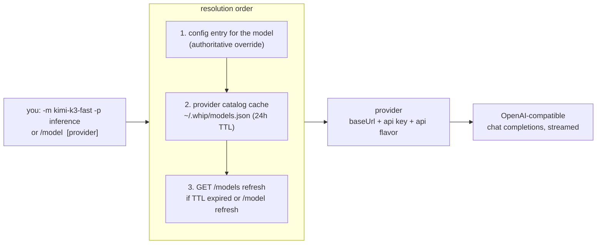
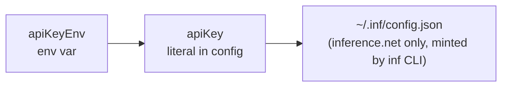

# Models & providers

whip is provider-agnostic by construction: any OpenAI-compatible endpoint is
a provider, models route to providers, and the model catalog is discovered
live — there is no registry to update when a new model ships.

## Routing model



- A model lists the providers that serve it (`"models": {"kimi-k3-fast":
  {"providers": ["inference"]}}`), so switching providers doesn't touch the
  model name.
- **Catalog models need no config entry.** Any model advertised by a
  provider's `GET /models` is usable directly; config entries are overrides
  when present.
- If several providers advertise the same id, pass a provider
  (`-p` / `/model <name> <provider>`) to disambiguate.
- Newly announced models appear in the `/model` picker dimmed, marked
  `(new)`, after `/model refresh` or the next TTL cycle.

## Key resolution

Per provider, in order:



First hit wins. No key material ever lives in the session store.

## OpenRouter: one key, every model

[OpenRouter](https://openrouter.ai) is an OpenAI-compatible gateway: a
single key reaches its whole catalog (OpenAI, Anthropic, Google, Meta,
DeepSeek, …) through `https://openrouter.ai/api/v1`. whip's catalog-model
resolution means none of those models need a config entry — register the
provider once and `/model` lists everything, with context windows, vision
flags, and per-token pricing carried from OpenRouter's `GET /models`.

The one-command setup (also available in-session as `/auth openrouter`):

```sh
whip auth openrouter            # masked prompt for the key
whip auth openrouter sk-or-…    # key as an argument
whip auth openrouter --env      # store apiKeyEnv: OPENROUTER_API_KEY instead
```

What it does, in order:

1. **Validates the key** against the live OpenRouter API. A rejected key
   writes nothing — no provider entry, no catalog.
2. **Upserts the `openrouter` provider** into `~/.whip/config.json` (atomic,
   clobber-guarded `config.Save`; every other provider and model route is
   untouched). By default the key is stored as a literal `apiKey` (config is
   `0600`); `--env` records `apiKeyEnv: OPENROUTER_API_KEY` instead and
   offers to append the export to your shell rc.
3. **Pre-fetches the catalog** into `~/.whip/models.json`, so the very next
   `/model` picker lists the full OpenRouter catalog without waiting for the
   24h TTL refresh.

Then use any model by its OpenRouter id:

```
/model openai/gpt-5                 # picker: type to filter; (new) = newly announced
/model anthropic/claude-sonnet-4.5  # direct switch, provider inferred from the catalog
whip -m deepseek/deepseek-v4        # same from the CLI
```

Inside a running session, `/auth openrouter` (bare) opens a masked key
prompt — the key never echoes, never enters input history, and never lands
in the transcript. Re-running `/auth` or `whip auth` with a fresh key
re-keys in place, including the live session's routing when it's already on
the openrouter provider.

Per-model overrides still compose: add an entry under `"models"` in
config.json (with `"providers": ["openrouter"]`) to pin context, maxOut, or
vision for a specific id.

## Codex subscription: account-scoped models

`whip auth codex` signs in through Codex's device-code flow, then fetches
`GET /codex/models` with the resulting ChatGPT credentials.
The response is cached in `~/.whip/models.json`, so `/model` immediately lists
every model the signed-in account may use. As with OpenRouter, catalog entries
need no individual config entry: select one from `/model`, or use
`/model <id> codex` directly.

The Codex backend is the source of truth for subscription availability. That
means a model appears only when the account is entitled to it, and changes in
plan or rollout state arrive on the next 24-hour refresh (or `/model refresh`).
Whip keeps `gpt-5.4 @ codex` as a fallback route so a temporary catalog fetch
failure never makes a completed login unusable.

Codex subscription requests intentionally omit `max_output_tokens`: despite
the public Responses API accepting that field, the ChatGPT subscription
endpoint rejects it. The backend enforces the output limit for the selected
subscription model.

## Token bookkeeping

Three numbers with distinct meanings:

| Field | Meaning | Drives |
|---|---|---|
| `context` | model's **input** window | header % full, proactive compaction threshold |
| `maxOut` | optional **output** cap | request `max_completion_tokens` (non-Codex providers) |
| provider `context_length` | advertised limit | overrides `context` when present |

The old `maxTokens` field still parses (it always meant the context window)
but is superseded by `context`.

## Cost tracking

When the provider advertises `pricing` in `GET /models`, the status line
shows session spend: `llm.Usage` (prompt/completion/cached) comes off each
streamed response, cached input is billed at the cache-read rate, and totals
accumulate per session. Hidden entirely when pricing isn't advertised.

## Compaction model

Compaction summarizes with a separate, cheaper model:
`compactModel`/`compactProvider` in config, defaulting to
`deepseek-v4-flash-0731` (`config.DefaultCompactModel`), falling back to the
conversation's own model. When `compactProvider` is omitted, Whip uses the
compaction model's configured route rather than the session's `defaultProvider`;
the built-in DeepSeek summarizer therefore uses `inference-net`, even in a Codex
session. `/compact <model> [provider]` picks the summarizer by hand. Mechanics:
[agent-loop.md](agent-loop.md#compaction).

## Read next

- [features.md](features.md#models--providers) — linked to code and tests
- README §Config — the full `~/.whip/config.json` reference
