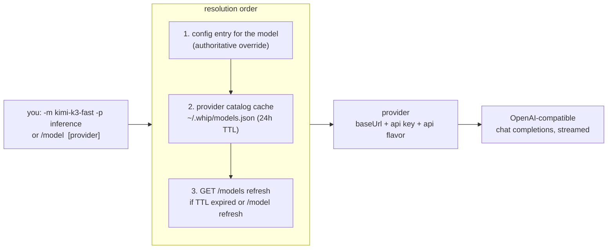
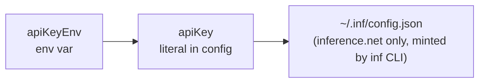

# Models & providers

whip is provider-agnostic by construction: any OpenAI-compatible endpoint is
a provider, models route to providers, and the model catalog is discovered
live — there is no registry to update when a new model ships.

## Routing model



- A model lists the providers that serve it (`"models": {"kimi-k3-fast":
  {"providers": ["inference"]}}`), so switching providers doesn't touch the
  model name.
- **Catalog models need no config entry.** Any model advertised by a
  provider's `GET /models` is usable directly; config entries are overrides
  when present.
- If several providers advertise the same id, pass a provider
  (`-p` / `/model <name> <provider>`) to disambiguate.
- Newly announced models appear in the `/model` picker dimmed, marked
  `(new)`, after `/model refresh` or the next TTL cycle.
- **Retry-on-miss at startup.** If launch-time resolution reports an unknown
  model — the default model has no config entry and the cached catalog is
  missing or stale (deleted `~/.whip/models.json`, or a model announced after
  the last fetch) — whip synchronously force-refreshes the configured
  providers' catalogs and retries resolution once before failing. The happy
  path never pays for this: a successful first resolve performs no fetch, so
  normal and offline starts are unaffected. Applies to every entrypoint
  (`whip`, `whip run`, `whip acp`); a genuinely unknown model still errors,
  after exactly one refresh attempt.
- `/model` persists the switch as the saved default. `/model-for-session`
  switches the active model identically but leaves the saved default
  untouched, so the next launch still opens on the configured model.

## Key resolution

Per provider, in order:



First hit wins. No key material ever lives in the session store.

## OpenRouter: one key, every model

[OpenRouter](https://openrouter.ai) is an OpenAI-compatible gateway: a
single key reaches its whole catalog (OpenAI, Anthropic, Google, Meta,
DeepSeek, …) through `https://openrouter.ai/api/v1`. whip's catalog-model
resolution means none of those models need a config entry — register the
provider once and `/model` lists everything, with context windows, vision
flags, and per-token pricing carried from OpenRouter's `GET /models`.

The one-command setup (also available in-session as `/auth openrouter`):

```sh
whip auth openrouter            # masked prompt for the key
whip auth openrouter sk-or-…    # key as an argument
whip auth openrouter --env      # store apiKeyEnv: OPENROUTER_API_KEY instead
```

What it does, in order:

1. **Validates the key** against the live OpenRouter API. A rejected key
   writes nothing — no provider entry, no catalog.
2. **Upserts the `openrouter` provider** into `~/.whip/config.json` (atomic,
   clobber-guarded `config.Save`; every other provider and model route is
   untouched). By default the key is stored as a literal `apiKey` (config is
   `0600`); `--env` records `apiKeyEnv: OPENROUTER_API_KEY` instead and
   offers to append the export to your shell rc.
3. **Pre-fetches the catalog** into `~/.whip/models.json`, so the very next
   `/model` picker lists the full OpenRouter catalog without waiting for the
   24h TTL refresh.

Then use any model by its OpenRouter id:

```
/model openai/gpt-5                 # picker: type to filter; (new) = newly announced
/model anthropic/claude-sonnet-4.5  # direct switch, provider inferred from the catalog
whip -m deepseek/deepseek-v4        # same from the CLI
```

Inside a running session, `/auth openrouter` (bare) opens a masked key
prompt — the key never echoes, never enters input history, and never lands
in the transcript. Re-running `/auth` or `whip auth` with a fresh key
re-keys in place, including the live session's routing when it's already on
the openrouter provider.

Per-model overrides still compose: add an entry under `"models"` in
config.json (with `"providers": ["openrouter"]`) to pin context, maxOut,
vision, or sampling params for a specific id.

## Token bookkeeping

Three numbers with distinct meanings:

| Field | Meaning | Drives |
|---|---|---|
| `context` | model's **input** window | header % full, proactive compaction threshold |
| `maxOut` | optional **output** cap | request `max_completion_tokens` |
| `samplingParams` | optional `{temperature, top_p}` knobs | sent on outbound requests for this model; omitted when unset |
| provider `context_length` | advertised limit | overrides `context` when present |

The old `maxTokens` field still parses (it always meant the context window)
but is superseded by `context`. A model whose config entry sets
`"samplingParams": {"temperature": 0.2}` sends those params on every request
to that model; unset params are omitted so the provider applies its defaults.

## Cost tracking

Each model attempt records its provider-reported `usage.cost` charge first,
including an explicit zero. When that field is absent, WHIP estimates cost
from that call's reported input, output, and cached tokens using the saved
`GET /models` prices for its exact route. Missing prices remain unknown;
explicitly free input, output, and cache rates remain free. Prices are
snapshotted per call, so model changes and catalog refreshes cannot reprice
past work.

Clients show provider-reported charges, estimated charges, and unknown or
pending calls separately for the entire agent tree. Model cost, tokens, and
cumulative request time are unlimited by default. Unpriced models are allowed
with unknown cost only when no finite monetary cap applies. A finite cap
requires usable pricing before dispatch; reported charges may still exceed
the reservation, in which case the response is retained and further work stops.
Known charges use integer millionths of a dollar, rounding each call upward to
that unit. Missing token usage remains unconfirmed even when a provider reports
a charge or the route is known to be free.

## Compaction model

Compaction summarizes with a separate, cheaper model:
`compactModel`/`compactProvider` in config, defaulting to
`deepseek-v4-flash-0731` (`config.DefaultCompactModel`), falling back to the
conversation's own model. `/compact <model> [provider]` picks the summarizer
by hand. Mechanics: [agent-loop.md](agent-loop.md#compaction).

## Read next

- [features.md](features.md#models--providers) — linked to code and tests
- README §Config — the full `~/.whip/config.json` reference
