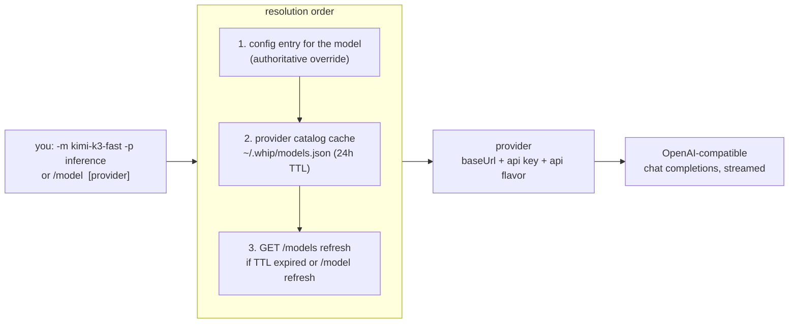
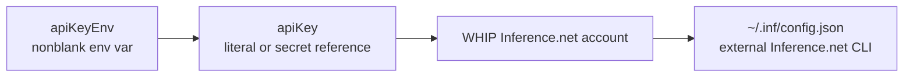

# Models & providers

whip routes models to OpenAI-compatible API-key endpoints or its built-in
ChatGPT subscription profile. Catalogs are discovered live; the subscription
profile also requires verified model output limits for budget admission.

## Provider connections in Settings

**Providers & models** groups connected providers, connections needing attention,
and providers available to connect. Bundled logos identify Inference.net,
OpenRouter, and OpenAI (ChatGPT subscription); existing custom endpoints get a
generic icon. Each row opens its own connect/manage dialog. Inference.net account
login and ChatGPT device login retain their existing host-owned flows.

The execution host discovers `INFERENCE_API_KEY` and `OPENROUTER_API_KEY` when
their built-in provider entry is absent. Discovery also recognizes an existing
Inference.net account. These effective routes are computed in memory: discovery
does not write provider entries or resolved keys into configuration. Saved routes
take precedence as a whole, including custom endpoints and key references.
Settings shows the credential source actually selected by runtime resolution.
An Environment label means a key is present; it does not certify billing access
or that every advertised model can run. Credential commands are shown as
unchecked and are never executed by the provider inventory.

**Disable on this host** records the provider ID in `disabledProviders`, leaving
its environment, external CLI credentials, saved key, and model aliases intact.
**Disconnect provider** removes the selected WHIP-owned key/account and disables
the route so a fallback key cannot immediately reconnect it. Custom endpoint
keys can be removed without signing out an unrelated Inference.net account.
API-key removal is local; account logout retains its existing best-effort remote
cleanup. Connecting or disconnecting never chooses a different default model.
An unavailable default has explicit manage/change actions.

Disabling takes effect at the next model-request admission, including retries,
subagents, helpers, and compaction. An admitted request may finish; subsequent
requests fail with repair guidance and are not automatically retried. Enabling
restores the route. Existing session clients otherwise retain their credential
and endpoint snapshot until explicit session reload/model change or session
reconstruction; reload an existing session after replacing or rotating its API key.

Catalog reads exclude disabled, removed, invalid, or endpoint-mismatched routes.
Ordinary reads reuse the existing 24-hour cache; `/model refresh` or SDK
`providers.catalogs({ refresh: true })` forces discovery. Fetches are bounded and
retain the last usable catalog on transient failure. Pending responses are
discarded if the route or resolved account key changed during discovery.

This release covers the existing Inference.net/OpenRouter APIs, ChatGPT
subscriptions, and management of already configured custom endpoints. New
OpenAI API/Cerebras presets and custom endpoint creation remain separate work;
native Anthropic/Google protocols are not added by environment detection.

## Routing model



- A model lists the providers that serve it (`"models": {"kimi-k3-fast":
  {"providers": ["inference"]}}`), so switching providers doesn't touch the
  model name.
- **Catalog models need no config entry.** Any model advertised by a
  provider's `GET /models` is usable directly; config entries are overrides
  when present.
- If several providers advertise the same id, pass a provider
  (`-p` / `/model <name> <provider>`) to disambiguate.
- Newly announced models appear in the `/model` picker dimmed, marked
  `(new)`, after `/model refresh` or the next TTL cycle.
- **Retry-on-miss at startup.** If launch-time resolution reports an unknown
  model — the default model has no config entry and the cached catalog is
  missing or stale (deleted `~/.whip/models.json`, or a model announced after
  the last fetch) — whip synchronously force-refreshes the configured
  providers' catalogs and retries resolution once before failing. The happy
  path never pays for this: a successful first resolve performs no fetch, so
  normal and offline starts are unaffected. Applies to every entrypoint
  (`whip`, `whip run`, `whip acp`); a genuinely unknown model still errors,
  after exactly one refresh attempt.
- `/model` persists the switch as the saved default. `/model-for-session`
  switches the active model identically but leaves the saved default
  untouched, so the next launch still opens on the configured model.

## Key resolution

For API-key providers, in order:



First hit wins. No key material ever lives in the session store.
Account fallbacks apply only to the canonical Inference.net endpoint.

## OpenAI: ChatGPT subscription

The `openai-codex` provider uses a ChatGPT account with Codex access. It is
separate from API billing and never falls back to an API key when subscription
access fails. This is a maintained WHIP integration, not an OpenAI endorsement
or a promise that the subscription endpoints are a stable public API.

In Settings → Providers & models on the execution host, choose
**Sign in with OpenAI (ChatGPT subscription)**.
The same flow is available from the terminal:

```sh
whip auth openai-codex
whip auth openai-codex status
whip auth openai-codex logout
```

In the TUI, use `/auth openai-codex`. Open the displayed verification link and
enter the temporary code. ChatGPT Security settings must allow **device code
authorization for Codex**. The daemon owns polling, so closing a tab does not
cancel sign-in; another attached client can recover it. Cancel explicitly to
stop it. One account is connected per execution host, including remote hosts.

Credentials are stored only on that host in `openai-codex.json` under the
configured WHIP home, with owner-only permissions and atomic token rotation.
WHIP and whipcode keep separate homes. Tokens are never sent to the renderer,
session history or event log, and no other application's credentials are imported.
Logout removes the login and its account-scoped model catalog, preserving model
configuration. A configured route alone does not mean an account is connected.

Sign-in preserves current model defaults. Select an advertised subscription
model explicitly, for example `/model gpt-5.5 openai-codex`. The new-session
and conversation model menus include discovered models and identify the provider
for each choice, including when API and subscription routes share a model name. To use the
subscription for titles and compaction as well, select it under Settings →
Agents & execution → Context compaction. Existing compaction settings still
apply independently to every conversation.

The adapter uses streamed Responses with `store:false`. Text, images on
advertised vision models, reasoning summaries, and `rlm_exec` tool round trips
use the existing recursive runtime. Opaque response items are retained privately
with the assistant message for restart, fork and rewind; account/model switches
do not replay incompatible items. They are excluded from public history and
downloadable message bodies.

Subscription token usage is recorded, including cached input and reasoning
output. Monetary cost remains **unknown**, not zero. A finite monetary budget
therefore prevents dispatch. The endpoint does not offer an enforceable smaller
output cap: each call reserves the model's verified natural output limit, and a
smaller explicit `maxOut` or `models.call(max_tokens=...)` is refused. Internal
title/summary defaults use the same natural reservation. Models without verified
limits are omitted. Input estimates include opaque continuation size and remain
estimates. `temperature` and `top_p` overrides are rejected on this route.

Rejected access is refreshed once before any output; every HTTP attempt is
accounted separately. Within a model request, retries stop once output begins.
The shared runtime may queue a new turn attempt after a transient failure,
retaining its partial history. Incomplete or failed responses cannot execute
tool calls. Subscription quota exhaustion stops both retry layers and asks the
user to wait or change the selected route explicitly.

Implementation and validation status, upstream references, and live acceptance
evidence are recorded in the
[subscription plan](../.ai-docs/plans/openai-subscriptions/README.md).

## OpenRouter: one key, every model

[OpenRouter](https://openrouter.ai) is an OpenAI-compatible gateway: a
single key reaches its whole catalog (OpenAI, Anthropic, Google, Meta,
DeepSeek, …) through `https://openrouter.ai/api/v1`. whip's catalog-model
resolution means none of those models need a config entry — register the
provider once and `/model` lists everything, with context windows, vision
flags, and per-token pricing carried from OpenRouter's `GET /models`.

The one-command setup (also available in-session as `/auth openrouter`):

```sh
whip auth openrouter            # masked prompt for the key
whip auth openrouter sk-or-…    # key as an argument
whip auth openrouter --env      # store apiKeyEnv: OPENROUTER_API_KEY instead
```

What it does, in order:

1. **Validates the key** against the live OpenRouter API. A rejected key
   writes nothing — no provider entry, no catalog.
2. **Upserts the `openrouter` provider** into `~/.whip/config.json` (atomic,
   clobber-guarded `config.Save`; every other provider and model route is
   untouched). By default the key is stored as a literal `apiKey` (config is
   `0600`); `--env` records `apiKeyEnv: OPENROUTER_API_KEY` instead and
   offers to append the export to your shell rc.
3. **Pre-fetches the catalog** into `~/.whip/models.json`, so the very next
   `/model` picker lists the full OpenRouter catalog without waiting for the
   24h TTL refresh.

Then use any model by its OpenRouter id:

```
/model openai/gpt-5                 # picker: type to filter; (new) = newly announced
/model anthropic/claude-sonnet-4.5  # direct switch, provider inferred from the catalog
whip -m deepseek/deepseek-v4        # same from the CLI
```

Inside a running session, `/auth openrouter` (bare) opens a masked key
prompt — the key never echoes, never enters input history, and never lands
in the transcript. Re-running `/auth` or `whip auth` with a fresh key
re-keys in place, including the live session's routing when it's already on
the openrouter provider.

Per-model overrides still compose: add an entry under `"models"` in
config.json (with `"providers": ["openrouter"]`) to pin context, maxOut,
vision, or sampling params for a specific id.

## Token bookkeeping

Three numbers with distinct meanings:

| Field | Meaning | Drives |
|---|---|---|
| `context` | model's **input** window | header % full, proactive compaction threshold |
| `maxOut` | optional **output** cap | request `max_completion_tokens` |
| `samplingParams` | optional `{temperature, top_p}` knobs | sent on outbound requests for this model; omitted when unset |
| provider `context_length` | advertised limit | overrides `context` when present |

The old `maxTokens` field still parses (it always meant the context window)
but is superseded by `context`. A model whose config entry sets
`"samplingParams": {"temperature": 0.2}` sends those params on every request
to that model; unset params are omitted so the provider applies its defaults.

## Cost tracking

Each model attempt records its provider-reported `usage.cost` charge first,
including an explicit zero. When that field is absent, WHIP estimates cost
from that call's reported input, output, and cached tokens using the saved
`GET /models` prices for its exact route. Missing prices remain unknown;
explicitly free input, output, and cache rates remain free. Prices are
snapshotted per call, so model changes and catalog refreshes cannot reprice
past work.

Clients show provider-reported charges, estimated charges, and unknown or
pending calls separately for the entire agent tree. Model cost, tokens, and
cumulative request time are unlimited by default. Unpriced models are allowed
with unknown cost only when no finite monetary cap applies. A finite cap
requires usable pricing before dispatch; reported charges may still exceed
the reservation, in which case the response is retained and further work stops.
Known charges use integer millionths of a dollar, rounding each call upward to
that unit. Missing token usage remains unconfirmed even when a provider reports
a charge or the route is known to be free.

## Compaction model

Compaction summarizes with a separate, cheaper model:
`compactModel`/`compactProvider` in config, defaulting to
`deepseek-v4-flash-0731` (`config.DefaultCompactModel`), falling back to the
conversation's own model. `/compact <model> [provider]` picks the summarizer
by hand. Mechanics: [agent-loop.md](agent-loop.md#compaction).

## Read next

- [features.md](features.md#models--providers) — linked to code and tests
- README §Config — the full `~/.whip/config.json` reference
