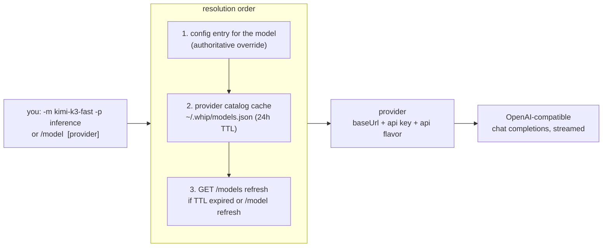
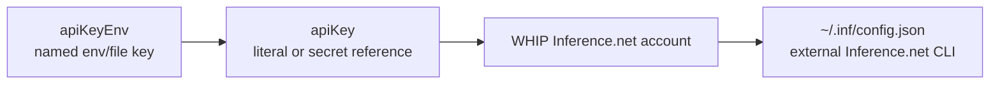

# Models & providers

whip routes models to OpenAI-compatible API-key endpoints or its built-in
ChatGPT subscription profile. Catalogs are discovered live; the subscription
profile also requires verified model output limits for budget admission.

## Provider connections in Settings

**Providers & models** groups connected providers, connections needing attention,
and providers available to connect. Bundled logos identify Inference.net,
OpenRouter, and OpenAI (ChatGPT subscription); existing custom endpoints get a
generic icon. Each row opens its own connect/manage dialog. Inference.net account
login and ChatGPT device login retain their existing host-owned flows.

The execution host discovers supported named API keys and existing
Inference.net/ChatGPT accounts. Daemon startup, opening connection setup and
Settings **Refresh** save missing provider entries with `apiKeyEnv` references.
Normal `provider.list` reads stay read-only. Discovery is idempotent: unchanged
results do not write the file or change its revision. Saved routes take precedence
as a whole, including custom endpoints and key references; disabled providers
stay disabled. Discovery never changes a saved default or session model.

Settings shows the credential source actually selected by runtime resolution:
**Environment**, **Environment file**, **Key file**, or the existing account/key
source. Names and configured paths can be shown; values are never returned.
Availability means a key is present, not that billing or inference has succeeded.
Credential commands remain unchecked and are never executed by inventory.
Discovery failures remain visible in Settings without hiding usable providers.

**Disable on this host** records the provider ID in `disabledProviders`, leaving
its environment, external CLI credentials, saved key, and model aliases intact.
**Disconnect provider** removes the selected WHIP-owned key/account and disables
the route so a fallback key cannot immediately reconnect it. Custom endpoint
keys can be removed without signing out an unrelated Inference.net account.
API-key removal is local; account logout retains its existing best-effort remote
cleanup. Connecting or disconnecting never chooses a different default model.
An unavailable default has explicit manage/change actions.

Disabling takes effect at the next model-request admission, including retries,
subagents, helpers, and compaction. An admitted request may finish; subsequent
requests fail with repair guidance and are not automatically retried. Enabling
restores the route. Existing session clients otherwise retain their credential
and endpoint snapshot until explicit session reload/model change or session
reconstruction; reload an existing session after replacing or rotating its API key.

Catalog reads exclude disabled, removed, invalid, or endpoint-mismatched routes.
Submitting or replacing an API key fetches `GET <API root>/models` immediately.
For OpenRouter's canonical endpoint, discovery first authenticates the key with
[`GET /key`](https://openrouter.ai/docs/api/api-reference/api-keys/get-current-api-key),
because its model list is public. A rejected key stays in the API-key dialog and
does not overwrite the saved connection. Neither request generates model output.
Ordinary catalog reads reuse the existing 24-hour cache; `/model refresh` or SDK
`providers.catalogs({ refresh: true })` forces discovery. Fetches are bounded and
retain the last usable catalog on transient failure. Pending responses are
discarded if the route or resolved account key changed during discovery. Caches
from the older model-allowlist implementation refresh on their next host catalog
request, even if their 24-hour TTL has not expired.

Settings uses the shared preset inventory and manages configured custom endpoints.
Create custom endpoints in the TUI. Native Anthropic/Google protocols are not
added by environment detection.

## Supported provider types and custom endpoints

The TUI groups known connections under **Popular** and **Providers**. Inference.net
is first with a quiet recommendation. Typing searches provider names, IDs, aliases
and categories; there is no shell-style `>` prefix. Arrows select, Enter connects,
and **ctrl+e** opens Manage. A green **✓** indicates available credentials; **!**
marks a configured connection needing attention. Discovery does not move rows or
change your selected provider. A ready saved model/provider pair still skips setup.

Known API-key providers have bundled URLs, so their connection prompt asks only
for the key in a simple dialog; press **Enter** to submit. OpenAI appears once, with
separate **API key** (`openai`) and **ChatGPT subscription** (`openai-codex`) routes.
If exactly one is connected, Enter uses it; Manage exposes both. Inference.net
supports browser sign-in and API keys; ChatGPT uses device login.

Selecting or connecting these popular providers picks a model automatically and
returns to the composer: Inference.net uses `kimi-k3-fast` with high thinking,
OpenAI uses `gpt-6-astra` with medium thinking, and OpenRouter uses `z-ai/glm-5.3`
with its default max thinking. Fresh onboarding saves the route and thinking
level for new sessions. A missing model leaves the picker open; existing saved
startup choices stay unchanged. Other providers open the model picker; Enter on
a model applies the selection and closes setup without another confirmation.
First-time onboarding also saves that selection for new sessions; existing
session changes keep their current scope. Your draft still requires Enter to send.

| Provider | API root | Environment key |
| --- | --- | --- |
| Inference.net | `https://api.inference.net/v1` | `INFERENCE_API_KEY` |
| OpenRouter | `https://openrouter.ai/api/v1` | `OPENROUTER_API_KEY` |
| OpenAI API | `https://api.openai.com/v1` | `OPENAI_API_KEY` |
| Cerebras | `https://api.cerebras.ai/v1` | `CEREBRAS_API_KEY` |
| DeepInfra | `https://api.deepinfra.com/v1/openai` | `DEEPINFRA_API_KEY`, then `DEEPINFRA_TOKEN` |
| DeepSeek | `https://api.deepseek.com` | `DEEPSEEK_API_KEY` |
| Fireworks AI | `https://api.fireworks.ai/inference/v1` | `FIREWORKS_API_KEY` |
| Groq | `https://api.groq.com/openai/v1` | `GROQ_API_KEY` |
| Together AI | `https://api.together.ai/v1` | `TOGETHER_API_KEY` |
| xAI | `https://api.x.ai/v1` | `XAI_API_KEY` |

Live model lists determine the choices for every known API-key provider. New IDs
remain visible even when the provider supplies only sparse metadata. Whip filters
explicit non-chat types, non-text output, lack of tool support, and known native
API incompatibilities. DeepInfra's category tags distinguish chat models from
embedding, image, video and speech APIs. Missing capability metadata means unknown,
not verified support.

The bundled subset supplies missing metadata for exact model IDs and offline
fallback choices; it does not restrict successful live results or insert absent
models. An empty successful catalog reports that no compatible models were found.
A successful empty list replaces the previous membership. A transient failure
preserves the last cached list without renewing its age. Astra uses Responses on
the canonical OpenAI API endpoint; other compatible API-key routes use Chat
Completions. Explicit configured aliases remain available. OpenRouter discovery
checks authentication separately from its public catalog. DeepInfra's public
catalog and bundled fallbacks do not validate an API key; discovery details remain available in management, while
provider/model pickers omit informational notices. Observed authentication
failures still reject the submitted key. DeepSeek V4 uses non-thinking mode until
reasoning-content replay is supported. See the
[compatibility scope and evidence](../.ai-docs/plans/tui-provider-configuration/CATALOG-COMPATIBILITY.md).

`OPENAI_BASE_URL` or `OPENAI_API_BASE` pointing elsewhere prevents automatic use
of `OPENAI_API_KEY` at OpenAI's canonical endpoint. Configure that custom endpoint
through **Custom endpoint** instead. Saved endpoint overrides retain their URL, credentials,
models and custom management behavior even if their ID matches a new preset.

Whip does not read OpenCode credential/configuration files or its database.
If OpenCode was your only key source, export the named key, configure a file
source below, or paste the key in Whip. Existing Whip keys and account files are
preserved. Docker continues to isolate your host credentials unless you explicitly
seed a test source inside the container.

The runtime supports two API flavors: `openai-completions` for OpenAI-compatible
Chat Completions, and `openai-codex` for the fixed ChatGPT subscription endpoint.
There is no native Anthropic Messages, Google Gemini, or configurable generic
Responses API adapter. Models served through a compatible gateway still work.

In the TUI, open `/connect` and choose **Custom endpoint**. Compact prompts ask for a name,
the API root URL (for example `https://api.example.com/v1`), and choose API key,
environment variable, or explicit **No authentication**. The URL must not
include `/chat/completions`, embedded credentials, a query, or a fragment.
Environment references resolve on the execution host; changing its environment
requires restarting that daemon. Keys are masked and never read back into forms.

**Save and choose model** loads the provider's model list. If listing is unsupported
or unavailable, select **Enter a model manually**, enter its exact API model ID,
and explicitly select **Save without verification**. Optional advanced fields set
the model alias, context and output limits. A successful listing is not an
inference test, and Whip sends no automatic completion. Authentication failures
require correction; missing environment credentials may be saved with a manual
model for later and remain unavailable. Confirmation selects the exact
model/provider pair; **ctrl+d** toggles whether it is also the default for new sessions.

Use Tab/Shift+Tab to move through fields, arrows to change authentication, and
Enter to activate the focused action. Escape returns to the previous screen;
closing the dialog preserves the chat draft. **ctrl+e** on a provider opens Manage.
Names and credentials can be edited; provider IDs are stable after creation.
Changing a custom URL requires an explicit credential choice. Built-in browser
endpoints stay fixed; use a separate custom connection for a different URL.

Saving an endpoint/key edit offers **Reload current session** when needed.
Other open sessions use updated connections when reloaded or reopened. Disable
preserves credentials, aliases and defaults; disconnect removes Whip-owned
credentials. Remove applies only to unused custom definitions: references from
aliases/defaults/compaction must be resolved first. The last provider cannot be
removed when no model aliases remain; disable it instead. Historical sessions
retain their provider IDs and offer route repair if a connection is unavailable.

The daemon writes `providers` and manually declared `models` together through
revision-checked, atomic updates to the same configuration file. A conflicting
edit requires refresh and review before resubmission. If a save reply is lost,
refresh the provider ID to inspect what was saved; credentials are not replayed.
Web/desktop consume the resulting connections, but do not yet provide this custom
creation form. Browser credentials remain in their existing account files; no
provider configuration table is added to SQLite.

Advanced users can also edit the file directly. For an endpoint requiring no
authentication, set `"auth": "none"` and omit key/reference fields; Whip then
omits the Authorization header. Without this explicit option, existing key and
secret-reference behavior is unchanged.

Merge entries like these into `~/.whip/config.json` (or
`~/.whipcode/config.json` for the Whipcode desktop/runtime installation):

```json
{
  "providers": {
    "my-endpoint": {
      "name": "My endpoint",
      "api": "openai-completions",
      "baseUrl": "https://your-provider.example/v1"
    }
  },
  "models": {
    "my-model": {
      "id": "model-id-from-your-provider",
      "providers": ["my-endpoint"],
      "context": 32768,
      "maxOut": 4096
    }
  }
}
```

Use the provider's actual model ID and limits. Then open `/connect my-endpoint`
in the TUI to enter the API key in the masked field and choose the model.
`ctrl+r` refreshes an already-open provider list after editing configuration.
Once configured, `/model my-model my-endpoint` selects that route and saves it
for new sessions. A manual model entry is optional when `/models` advertises the
model and its metadata. Key validation in the connection dialog calls `/models`;
execution uses `/chat/completions` with streaming and tool calls.

For credentials managed outside the dialog, set `apiKeyEnv` to a named
key resolved from the daemon environment or the configured file sources below or `apiKey` to a literal, `$VARIABLE`, `${VARIABLE}`, or `!command`
reference. Environment variables must be available to the execution daemon;
changing a terminal's environment does not change an already-running daemon.
For endpoints without authentication, use `"auth": "none"` and omit `apiKey`
and `apiKeyEnv`. Whip then omits the Authorization header during discovery and
inference. An empty key by itself does not enable unauthenticated access.

Inside the disposable onboarding container the file is
`/home/whip/.whip/config.json`. Host credentials/environment variables are not
inherited, and the container's configuration is removed when that test run exits.

## Local key discovery

File sources are optional and explicit. Add `providerKeySources` to the existing
host configuration; each field can be used independently:

```json
{
  "providerKeySources": {
    "envFiles": ["~/.secrets/providers.env"],
    "keyFiles": {"CEREBRAS_API_KEY": "~/.secrets/cerebras.key"},
    "keyDirectories": ["~/.secrets/provider-keys"]
  }
}
```

An env file uses `NAME=value` lines, optional `export`, single/double quotes and
comments. It is parsed as data: shell commands, interpolation and substitutions
are not executed. A mapped key file contains one raw key. In `keyDirectories`,
Whip checks exact variable filenames such as `GROQ_API_KEY`; it does not recurse
or scan unrelated files. Paths are absolute or start with `~/`, resolved on the
execution host. Env files are capped at 1 MiB; raw keys at 16 KiB; source lists at
32 each and explicit file mappings at 128. Files must be regular files.

For each named key, precedence is the nonblank daemon environment, explicit
`keyFiles` mapping, first matching `envFiles` entry, then exact filenames in
ordered `keyDirectories`. An invalid, missing or empty explicitly selected source
stays unavailable instead of silently choosing a lower-priority key. Invalid or
unreadable files include a source error. Environment values still win over broken files. OpenAI's endpoint guard also inspects routing
variables in the same source so a key intended for another endpoint does not
create a canonical OpenAI connection.

For example, discovering `CEREBRAS_API_KEY` creates a missing `cerebras` provider
with its known URL and `"apiKeyEnv": "CEREBRAS_API_KEY"`. Whip leaves the key in
its original file. The same references work for explicitly configured custom
providers. Discovery never overwrites existing definitions or re-enables opt-outs.
If saving fails, available in-memory routes remain visible with a discovery error.

Opening `/connect` or refreshing Settings rereads files. Newly constructed model
clients also reread them; existing session clients need a reload/model change
after rotation. If a key disappears, its saved provider remains configured but
unavailable, with source details in Manage. Exporting a variable in a different
terminal requires restarting the execution daemon. Remote hosts read their own
files; the browser/desktop client never uploads local secrets to them.

## Bundled Models.dev metadata

The reviewed subset in `internal/config/modelsdev/` supplies provider key names,
model capabilities, context/output limits and prices. Whip retains its supported
provider list, endpoints, auth behavior, recommendation order and model/effort
defaults. Models.dev's `inference` ID maps to Whip's `inference-net`; Whip retains
`https://api.inference.net/v1` and its explicit Kimi defaults. A Models.dev entry
alone does not enable an unsupported protocol.

Live `/models` results determine membership. Bundled metadata only fills missing
fields for exact provider/model IDs; live false/zero/empty capability values and
explicit configuration remain authoritative. Unknown prices remain unknown;
zero means free. Prices are normalized to the existing per-token catalog unit.
The bundle can provide offline candidates when discovery fails without implying
credential validation. Metadata enrichment does not renew catalog timestamps.

Maintainers update the bundle with `task models:update`. For a pinned local
Models.dev API response, use `task models:update -- -input /path/api.json`.
`task models:check` validates the bundle and generated desktop environment names
offline and runs as part of `task check`. The importer validates before replacing
outputs and records the source URL, upstream content SHA-256, generation date,
schema version and MIT license attribution. Runtime startup never fetches
Models.dev; deployments use the checked-in snapshot.

## Routing model



- A model lists the providers that serve it (`"models": {"kimi-k3-fast":
  {"providers": ["inference"]}}`), so switching providers doesn't touch the
  model name.
- **Catalog models need no config entry.** Any model advertised by a
  provider's `GET /models` is usable directly; config entries are overrides
  when present.
- If several providers advertise the same id, pass a provider
  (`-p` / `/model <name> <provider>`) to disambiguate.
- Newly announced models appear in the `/model` picker dimmed, marked
  `(new)`, after `/model refresh` or the next TTL cycle.
- **Retry-on-miss at startup.** If launch-time resolution reports an unknown
  model — the default model has no config entry and the cached catalog is
  missing or stale (deleted `~/.whip/models.json`, or a model announced after
  the last fetch) — whip synchronously force-refreshes the configured
  providers' catalogs and retries resolution once before failing. The happy
  path never pays for this: a successful first resolve performs no fetch, so
  normal and offline starts are unaffected. Applies to every entrypoint
  (`whip`, `whip run`, `whip acp`); a genuinely unknown model still errors,
  after exactly one refresh attempt.
- `/model` persists the switch as the saved default. `/model-for-session`
  switches the active model identically but leaves the saved default
  untouched, so the next launch still opens on the configured model.

## Key resolution

For API-key providers, in order:



First hit wins. No key material ever lives in the session store.
Account fallbacks apply only to the canonical Inference.net endpoint.

## OpenAI: ChatGPT subscription

The `openai-codex` provider uses a ChatGPT account with Codex access. It is
separate from API billing and never falls back to an API key when subscription
access fails. This is a maintained WHIP integration, not an OpenAI endorsement
or a promise that the subscription endpoints are a stable public API.

In Settings → Providers & models on the execution host, choose
**Sign in with OpenAI (ChatGPT subscription)**.
The same flow is available from the terminal:

```sh
whip auth openai-codex
whip auth openai-codex status
whip auth openai-codex logout
```

In the TUI, use `/auth openai-codex`. Open the displayed verification link and
enter the temporary code. ChatGPT Security settings must allow **device code
authorization for Codex**. The daemon owns polling, so closing a tab does not
cancel sign-in; another attached client can recover it. Cancel explicitly to
stop it. One account is connected per execution host, including remote hosts.

Credentials are stored only on that host in `openai-codex.json` under the
configured WHIP home, with owner-only permissions and atomic token rotation.
WHIP and whipcode keep separate homes. Tokens are never sent to the renderer,
session history or event log, and no other application's credentials are imported.
Logout removes the login and its account-scoped model catalog, preserving model
configuration. A configured route alone does not mean an account is connected.

Sign-in preserves current model defaults. Select an advertised subscription
model explicitly, for example `/model gpt-5.5 openai-codex`. The new-session
and conversation model menus include discovered models and identify the provider
for each choice, including when API and subscription routes share a model name. To use the
subscription for titles and compaction as well, select it under Settings →
Agents & execution → Context compaction. Existing compaction settings still
apply independently to every conversation.

The adapter uses streamed Responses with `store:false`. Text, images on
advertised vision models, reasoning summaries, and `rlm_exec` tool round trips
use the existing recursive runtime. Opaque response items are retained privately
with the assistant message for restart, fork and rewind; account/model switches
do not replay incompatible items. They are excluded from public history and
downloadable message bodies.

Subscription token usage is recorded, including cached input and reasoning
output. Monetary cost remains **unknown**, not zero. A finite monetary budget
therefore prevents dispatch. The endpoint does not offer an enforceable smaller
output cap: each call reserves the model's verified natural output limit, and a
smaller explicit `maxOut` or `models.call(max_tokens=...)` is refused. Internal
title/summary defaults use the same natural reservation. Models without verified
limits are omitted. Input estimates include opaque continuation size and remain
estimates. `temperature` and `top_p` overrides are rejected on this route.

Rejected access is refreshed once before any output; every HTTP attempt is
accounted separately. Within a model request, retries stop once output begins.
The shared runtime may queue a new turn attempt after a transient failure,
retaining its partial history. Incomplete or failed responses cannot execute
tool calls. Subscription quota exhaustion stops both retry layers and asks the
user to wait or change the selected route explicitly.

Implementation and validation status, upstream references, and live acceptance
evidence are recorded in the
[subscription plan](../.ai-docs/plans/openai-subscriptions/README.md).

## OpenRouter: one key, every model

[OpenRouter](https://openrouter.ai) is an OpenAI-compatible gateway: a
single key reaches its whole catalog (OpenAI, Anthropic, Google, Meta,
DeepSeek, …) through `https://openrouter.ai/api/v1`. whip's catalog-model
resolution means none of those models need a config entry — register the
provider once and `/model` lists everything, with context windows, vision
flags, and per-token pricing carried from OpenRouter's `GET /models`.

The one-command setup (also available in-session as `/auth openrouter`):

```sh
whip auth openrouter            # masked prompt for the key
whip auth openrouter sk-or-…    # key as an argument
whip auth openrouter --env      # store apiKeyEnv: OPENROUTER_API_KEY instead
```

What it does, in order:

1. **Checks the key and loads compatible models** from OpenRouter. `GET /key`
   authenticates the credential before `GET /models` loads its public catalog.
   Authentication failures reject the write and appear in the API-key dialog.
   Model availability and billing are still subject to the first inference request;
   setup does not generate model output. Transient discovery failures can use the
   bundled fallback, marked unverified in management.
2. **Upserts the `openrouter` provider** into `~/.whip/config.json` (atomic,
   clobber-guarded `config.Save`; every other provider and model route is
   untouched). By default the key is stored as a literal `apiKey` (config is
   `0600`); `--env` records `apiKeyEnv: OPENROUTER_API_KEY` instead and
   offers to append the export to your shell rc.
3. **Pre-fetches the catalog** into `~/.whip/models.json`, so the very next
   `/model` picker lists compatible text/tool models without waiting for the
   24h TTL refresh.

Then use any model by its OpenRouter id:

```
/model openai/gpt-5                 # picker: type to filter; (new) = newly announced
/model anthropic/claude-sonnet-4.5  # direct switch, provider inferred from the catalog
whip -m deepseek/deepseek-v4        # same from the CLI
```

Inside a running session, `/auth openrouter` (bare) opens a masked key
prompt — the key never echoes, never enters input history, and never lands
in the transcript. Re-running `/auth` or `whip auth` with a fresh key
re-keys in place, including the live session's routing when it's already on
the openrouter provider.

Per-model overrides still compose: add an entry under `"models"` in
config.json (with `"providers": ["openrouter"]`) to pin context, maxOut,
vision, or sampling params for a specific id.

## Token bookkeeping

Three numbers with distinct meanings:

| Field | Meaning | Drives |
|---|---|---|
| `context` | model's **input** window | header % full, proactive compaction threshold |
| `maxOut` | optional **output** cap | request `max_completion_tokens` |
| `samplingParams` | optional `{temperature, top_p}` knobs | sent on outbound requests for this model; omitted when unset |
| provider `context_length` | advertised limit | overrides `context` when present |

The old `maxTokens` field still parses (it always meant the context window)
but is superseded by `context`. A model whose config entry sets
`"samplingParams": {"temperature": 0.2}` sends those params on every request
to that model; unset params are omitted so the provider applies its defaults.

## Cost tracking

Each model attempt records its provider-reported `usage.cost` charge first,
including an explicit zero. When that field is absent, WHIP estimates cost
from that call's reported input, output, and cached tokens using the saved
`GET /models` prices for its exact route. Missing prices remain unknown;
explicitly free input, output, and cache rates remain free. Prices are
snapshotted per call, so model changes and catalog refreshes cannot reprice
past work.

Clients show provider-reported charges, estimated charges, and unknown or
pending calls separately for the entire agent tree. Model cost, tokens, and
cumulative request time are unlimited by default. Unpriced models are allowed
with unknown cost only when no finite monetary cap applies. A finite cap
requires usable pricing before dispatch; reported charges may still exceed
the reservation, in which case the response is retained and further work stops.
Known charges use integer millionths of a dollar, rounding each call upward to
that unit. Missing token usage remains unconfirmed even when a provider reports
a charge or the route is known to be free.

## Compaction model

Compaction summarizes with a separate, cheaper model:
`compactModel`/`compactProvider` in config, defaulting to
`deepseek-v4-flash-0731` (`config.DefaultCompactModel`), falling back to the
conversation's own model. `/compact <model> [provider]` picks the summarizer
by hand. Mechanics: [agent-loop.md](agent-loop.md#compaction).

## Read next

- [features.md](features.md#models--providers) — linked to code and tests
- README §Config — the full `~/.whip/config.json` reference
