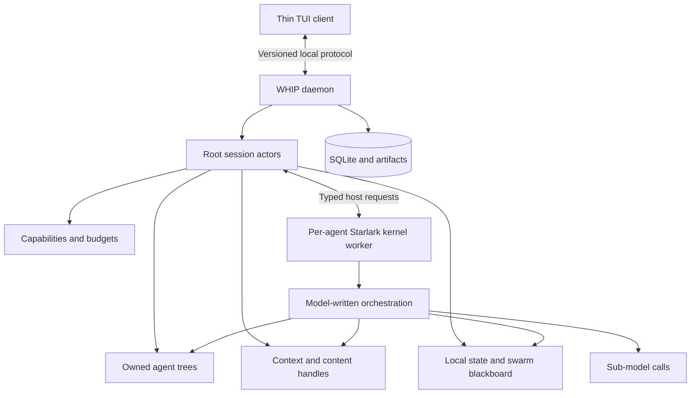
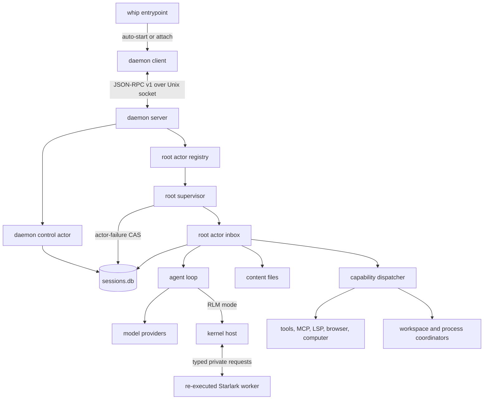
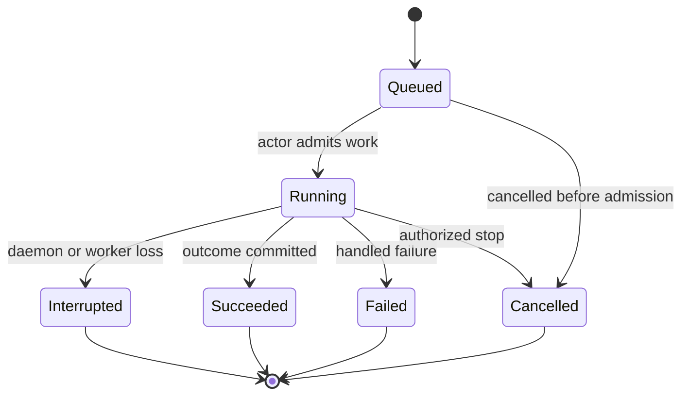
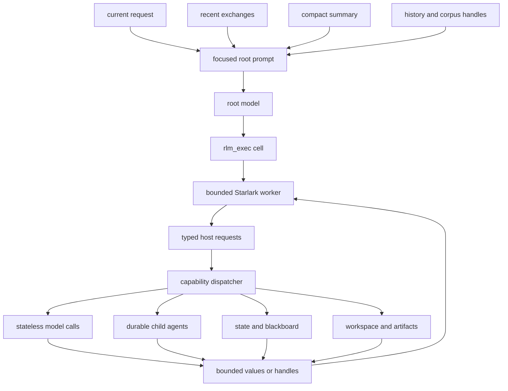
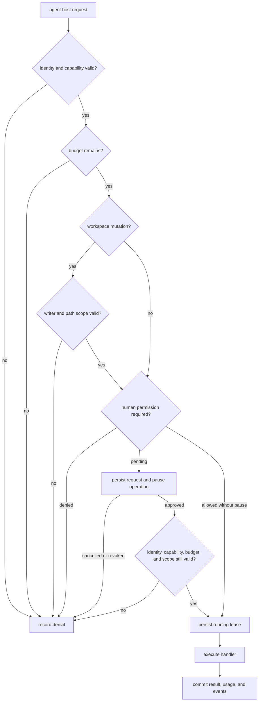
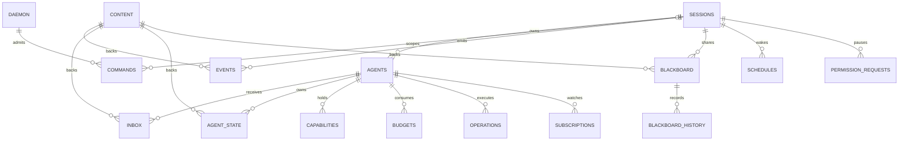
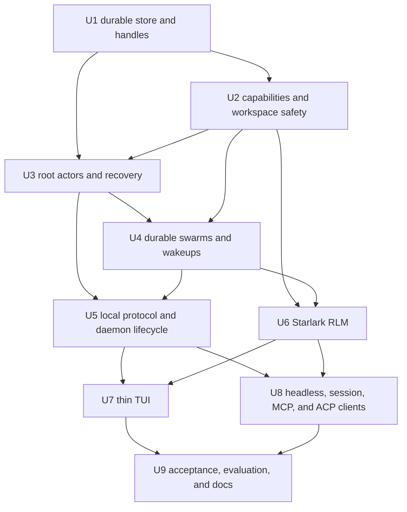

# RLM Swarm Runtime - Plan

## Goal Capsule

- **Objective:** Turn WHIP into a single-binary, daemon-owned agent runtime whose default RLM mode can reason over large contexts and coordinate durable agent swarms through programmable Go-hosted primitives.
- **Product authority:** This contract governs the daemon/client boundary, RLM programming model, swarm behavior, state ownership, permissions, recovery, and end-to-end acceptance experience.
- **Open blockers:** None; numeric budgets, protocol field shapes, and module APIs are resolved in the Planning Contract.
- **Execution profile:** Deep, dependency-ordered runtime migration with deterministic process, persistence, protocol, and policy tests before client cutover.
- **Stop conditions:** Stop implementation if the existing session database cannot be migrated transactionally, a supported platform cannot enforce worker termination, or a client path still needs direct behavioral ownership.
- **Tail ownership:** The final implementation unit owns full CI parity, live RLM-versus-Classic evaluation evidence, documentation, and removal of abandoned transition code.

---

## Product Contract

### Summary

WHIP will ship as one binary with daemon, thin TUI, headless, ACP, and hidden kernel entrypoints; every client entrypoint auto-starts or attaches to the local daemon.
The daemon will own durable agent execution, while RLM-default sessions use a constrained Starlark environment to compose Go-hosted capabilities, sub-model calls, and collaborating WHIP agents.

### Problem Frame

WHIP already supports isolated subagent contexts, background work, steering, model overrides, persistence, goals, schedules, permissions, and concurrent tools.
These capabilities remain attached to an interactive process and are exposed as separate JSON tools, so they do not form a durable programmable runtime.

The RLM research reframes long context as an external object that a model examines and decomposes programmatically.
This lets a root model keep a focused context while code performs search, partitioning, semantic map/reduce work, and recursive model calls over information that would otherwise overflow or degrade the model context.

Adding only a REPL tool would leave lifecycle, communication, state, safety, and recovery fragmented.
The runtime must instead make agents durable and addressable, centralize authority in the daemon, and expose one capability system through both the RLM and compatibility surfaces.

### Key Decisions

- **Daemon-owned product shape** (session-settled: user-directed — chosen over an embedded interactive harness: agents and swarms must continue independently of the TUI). Governs R1-R7.
- **One daemon process for agent sessions** (session-settled: user-directed — chosen over a process per root tree: simpler packaging and coordination are preferred despite the shared failure domain). Governs R5, R27.
- **Local same-user communication** (session-settled: user-directed — chosen over network-reachable clients: remote identity and transport security are outside this product shape). Governs R3-R4.
- **Go-owned durable state with Starlark orchestration** (session-settled: user-directed — chosen over a managed Python heap: single-binary packaging and explicit recovery matter more than Python compatibility). Governs R8-R15, R24.
- **RLM as the default agent mode** (session-settled: user-directed — chosen over separate Classic and RLM products: WHIP should present one primary programmable model while retaining a disable path). Governs R8-R13.
- **Focused root context** (session-settled: user-directed — chosen over passing the normal transcript until overflow: long context must remain symbolically addressable from the start). Governs R9, R14.
- **Owned swarm tree with peer communication** (session-settled: user-directed — chosen over a strict tree or global graph: lifecycle needs hierarchy without preventing sibling collaboration). Governs R16-R21.
- **Private state plus explicit blackboard** (session-settled: user-directed — chosen over one shared namespace: collaboration must be auditable and race-aware). Governs R18-R19.
- **Explicit writer capabilities** (session-settled: user-directed — chosen over unrestricted shared writes or mandatory worktrees: most agents should remain read-only while selected agents modify the shared workspace). Governs R22-R23.
- **Trusted workspace, unsafe model threat model** (session-settled: user-directed — chosen over adversarial repository or multi-tenant isolation: operational containment is required, but the runtime is not a security sandbox). Governs R10, R22-R23.
- **Checkpoint recovery without side-effect replay** (session-settled: user-directed — chosen over exact workflow recovery: committed state must survive, while uncertain work becomes visibly interrupted). Governs R25-R26.

### Runtime Shape



The daemon is the only authority for agent identity, execution, durable state, permissions, budgets, and external side effects.
The client and kernel are replaceable views over that authority: the client renders it, while the kernel programs it.

### Actors

- A1. **Developer:** Starts WHIP, submits work, grants authority, detaches, reconnects, and reviews the resulting changes and evidence.
- A2. **TUI client:** Maintains presentation state and sends commands while treating daemon snapshots and events as authoritative.
- A3. **Daemon:** Owns sessions, agent trees, messages, state, schedules, capabilities, budgets, persistence, and recovery.
- A4. **Root agent:** Receives the user objective and compact working context, then orchestrates model calls and child agents.
- A5. **Child agent:** Runs as an independently addressable durable agent within one root session, with inherited limits and explicit communication paths.
- A6. **Kernel worker:** Evaluates bounded Starlark cells and forwards typed capability requests without owning credentials or durable state.

### Requirements

**Daemon and client**

- R1. The same WHIP binary must provide the daemon, TUI, headless, ACP, and hidden kernel entrypoints.
- R2. Starting the TUI without a running daemon must launch the daemon, wait for readiness, and attach automatically.
- R3. Client and daemon communication must use a full-duplex, versioned local protocol over an owner-only Unix socket.
- R4. The protocol must support capability negotiation, stable client and command identities, sequenced events, reconnect cursors, bounded backpressure, and chunked snapshots.
- R5. The daemon must run each root session as a serialized actor with supervised descendants inside one Go process.
- R6. Detaching or terminating every client must not pause or cancel daemon-owned work.
- R7. The TUI must own only presentation concerns; all state that can change agent behavior must remain daemon-owned.

**RLM programming model**

- R8. New sessions must use RLM mode by default, while configuration must be able to disable RLM and retain Classic compatibility without starting a kernel.
- R9. An RLM root call must receive the current request, recent exchanges, and a compact working summary while full history and large inputs remain accessible through handles.
- R10. Each RLM-capable agent must evaluate Starlark in a killable worker created by re-executing the WHIP binary, with step, time, memory, and output limits.
- R11. The Starlark environment must have no ambient filesystem, process, network, provider credential, or daemon-state access.
- R12. RLM mode must expose one model-facing Starlark execution tool whose modules provide daemon-hosted context, file, shell, model, agent, message, state, artifact, schedule, permission, and answer capabilities.
- R13. Go capabilities must be reusable through Starlark, Classic JSON tools, ACP, and other clients without duplicating policy or execution logic.
- R14. Large values must remain in the daemon content store and cross model or kernel boundaries through bounded slices or stable content handles.
- R15. The RLM must support cheap single and batched sub-model calls separately from full stateful child agents.

**Swarm ownership and communication**

- R16. Every child agent must belong to one root-owned tree that determines lifecycle, cancellation, budget inheritance, and cleanup.
- R17. Authorized agents must be able to discover and message parents, children, and siblings within their swarm without gaining global agent visibility.
- R18. Every agent must have private durable state, and each swarm must have an explicit tree-scoped blackboard for shared structured values.
- R19. Blackboard operations must support authorship, append, compare-and-swap, durable inbox subscriptions, and an audit history while storing large payloads by content handle.
- R20. The daemon must assign sender identity and support immediate steering, next-turn delivery, and queued delivery without permitting spoofed senders.
- R21. Parent budgets must constrain descendant model spend, elapsed time, active children, recursion depth, and concurrency, with child usage attributable to the root.

**Capabilities and workspace safety**

- R22. Capabilities must be daemon-issued, scoped, auditable, non-transferable, and limited to a subset of the parent's authority.
- R23. Workspace mutation must require an explicit writer capability and path scope in addition to WHIP's existing file serialization and permission checks.
- R24. Permission requests must remain daemon-owned and durable, pausing only the blocked operation when no authorized client is attached.

**Persistence and recovery**

- R25. SQLite must remain the authoritative durable store for sessions, hierarchy, inboxes, local state, blackboard entries, budgets, schedules, command outcomes, and observable state transitions.
- R26. Restart must restore committed state and mark every uncertain running turn, child task, lease, and side effect as interrupted without automatic replay.
- R27. A panic in one root session actor must fail that session visibly without terminating the daemon; unrecoverable process failure follows R26.
- R28. Kernel restart must preserve explicit Go-owned state, handles, child registries, and messages without attempting to serialize an arbitrary Starlark heap.

**Observability and control**

- R29. Attached clients must be able to inspect the swarm tree, agent status, messages, capabilities, budgets, blackboard changes, and pending permissions.
- R30. Each Starlark cell, host capability call, child spawn, message, state mutation, and usage charge must produce correlated trace data.
- R31. The daemon must retain goals, schedules, heartbeats, and blackboard subscriptions across client detachment and deliver every wakeup through the same serialized session inbox.
- R32. Users must be able to stop a root or descendant, revoke capabilities, cap further spend, and delete retained agents without deleting historical transcripts or artifacts.

### Key Flows

- F1. **Start and attach**
  - **Trigger:** A1 starts WHIP with no running daemon.
  - **Actors:** A1, A2, A3
  - **Steps:** A2 launches A3, negotiates the protocol, requests a session snapshot, and renders the authoritative state.
  - **Outcome:** The user sees a live session without choosing or managing a separate runtime mode.
  - **Covers:** R1-R4, R7
- F2. **RLM turn**
  - **Trigger:** A1 submits a request to an RLM session.
  - **Actors:** A2, A3, A4, A6
  - **Steps:** A3 builds the focused root context, A4 emits Starlark, A6 evaluates it, and every host request returns through A3 under policy and budget control.
  - **Outcome:** A4 can search and transform large context, call models, spawn agents, and submit an answer without loading all source material into its model context.
  - **Covers:** R8-R15, R21-R24, R30
- F3. **Swarm collaboration**
  - **Trigger:** A4 delegates independent or specialist work.
  - **Actors:** A3, A4, A5
  - **Steps:** A3 admits children under the owned tree, routes peer messages, applies blackboard mutations, and enforces inherited budgets and capabilities.
  - **Outcome:** Agents collaborate laterally while A4 remains accountable for lifecycle, authority, and aggregate cost.
  - **Covers:** R16-R23, R29-R32
- F4. **Detach and reconnect**
  - **Trigger:** A2 disconnects while work remains active and later reconnects.
  - **Actors:** A2, A3
  - **Steps:** A3 continues work, retains bounded events, and on reconnect either replays from the supplied cursor or sends a coherent snapshot.
  - **Outcome:** The UI resumes without duplicated commands, missing durable state, or ownership transfer.
  - **Covers:** R4, R6-R7, R29-R31
- F5. **Crash and restore**
  - **Trigger:** A3 or A6 terminates unexpectedly.
  - **Actors:** A3, A4, A5, A6
  - **Steps:** Kernel failure restarts only A6; daemon restart reloads committed state and changes uncertain running records to interrupted.
  - **Outcome:** Recovery is explicit and non-destructive, with no guessed replay of external effects.
  - **Covers:** R10, R25-R28

### Acceptance Examples

- AE1. **Automatic daemon ownership**
  - **Covers R1-R3, R7.**
  - **Given:** No daemon is running.
  - **When:** The developer runs `whip`.
  - **Then:** The daemon starts, the TUI attaches, and all subsequent behavioral state is stored by the daemon.
- AE2. **Detached completion**
  - **Covers R4, R6, R29.**
  - **Given:** A swarm is running and the TUI has received an event cursor.
  - **When:** The TUI exits and reconnects after child work completes.
  - **Then:** The work continues while detached and the client reconstructs the final state without repeating a command or event.
- AE3. **Long-context RLM processing**
  - **Covers R9, R12, R14-R15.**
  - **Given:** A repository corpus exceeds the root model's context window.
  - **When:** The root analyzes it through content operations and batched sub-model calls.
  - **Then:** The final answer cites relevant source material while the full corpus never enters the root model context.
- AE4. **Peer coordination**
  - **Covers R16-R21.**
  - **Given:** Research, implementation, testing, and review agents belong to one root swarm.
  - **When:** The tester records a failure and messages the implementation agent.
  - **Then:** The implementation agent receives the message under its own identity and can act using the shared evidence without global agent access.
- AE5. **Writer denial**
  - **Covers R22-R24.**
  - **Given:** A research agent has read and message capabilities but no writer capability.
  - **When:** Its Starlark code attempts to patch a project file.
  - **Then:** The daemon rejects the request, records the denial, and leaves the workspace unchanged.
- AE6. **Bounded recursion**
  - **Covers R16, R21.**
  - **Given:** A child has exhausted its inherited spawn or spend budget.
  - **When:** It requests another child or model call.
  - **Then:** The daemon rejects admission without affecting completed siblings or exceeding the root budget.
- AE7. **Interrupted recovery**
  - **Covers R25-R28.**
  - **Given:** The daemon exits while a command may have produced an external side effect.
  - **When:** The daemon restarts.
  - **Then:** Committed state is restored, uncertain work is marked interrupted, and the command is not replayed.
- AE8. **RLM disabled**
  - **Covers R8.**
  - **Given:** RLM is disabled in configuration.
  - **When:** A new session starts.
  - **Then:** WHIP uses Classic mode and does not create a Starlark kernel worker.

### Success Criteria

- The durable repository migration swarm completes a cross-cutting change in a repository larger than the root model's usable context, passes the repository verification command, and produces cited evidence of completeness.
- The acceptance run includes batched sub-model work, multiple stateful child agents, peer messaging, blackboard coordination, a denied unauthorized write, and a successful authorized write.
- Closing the TUI during the acceptance run does not stop work, and reconnecting neither loses durable state nor repeats a mutating command.
- Killing the daemon during a controlled recovery run restores committed state and marks in-flight work interrupted without replaying uncertain actions.
- RLM mode completes at least one long-context evaluation that Classic mode cannot complete within the same root context limit, while staying inside its configured cost and concurrency budgets.
- Evaluation reports correctness, cost, latency, model-call fan-out, and context consumption for RLM and Classic runs so release decisions are evidence-based.

### Scope Boundaries

**Included**

- One local daemon and thin TUI client shipped in the existing WHIP binary.
- RLM-default sessions, RLM disablement with Classic fallback, Starlark orchestration, Go-hosted capabilities, durable agent swarms, and the migration-swarm acceptance harness.
- Same-user agent collaboration, explicit capabilities, operational containment, schedules, goals, observability, and checkpoint recovery.

**Outside this product's identity**

- Network-reachable daemon clients, browser clients, team accounts, remote control planes, and multi-tenant operation.
- A security boundary for malicious repositories, hostile prompts, or adversarial user code.
- Automatic replay of uncertain external side effects or a general durable workflow engine.
- A globally discoverable agent mesh with cross-swarm messaging.

### Dependencies and Assumptions

- WHIP continues to target trusted local development environments where the daemon and client run as the same operating-system user.
- Existing `internal/agent`, `internal/session`, `internal/tools`, `internal/schedule`, ACP, MCP, and TUI behavior remain reusable foundations rather than parallel implementations.
- The selected Starlark implementation must support incremental REPL execution, Go-defined values and builtins, cancellation, and execution-step limits.
- Human-client key storage uses the operating-system credential service through `github.com/zalando/go-keyring`; macOS Keychain is expected, while Linux privileged decisions require an available Secret Service session and otherwise fail closed.
- Model quality in Starlark orchestration is an empirical dependency; prompts, examples, and evaluation trajectories are part of the product, not incidental documentation.

### Planning Questions

**Resolved in the Planning Contract**

- Numeric runtime and kernel defaults are owned by KTD6.
- Protocol envelopes, limits, retention, and socket location are owned by KTD2.
- The Starlark tool, module surface, and content-handle boundary are owned by KTD5 and KTD8.
- SQLite normalization and content-addressed artifact placement are owned by KTD1.

### Sources and Research

- `docs/architecture.md` documents WHIP's current in-process TUI-to-agent ownership and SQLite-backed package boundaries.
- `docs/agent-loop.md`, `docs/concurrency.md`, and `docs/features.md` document the current tool loop, path locks, background subagents, steering, persistence, and compaction behavior.
- `internal/agent/subagent.go` confirms that current subagents receive fresh contexts and intentionally exclude recursive task spawning.
- `internal/tools/permission.go` defines the current permission gate as a consent seam rather than a sandbox.
- [Recursive Language Models](https://arxiv.org/abs/2512.24601) establishes external symbolic context, persistent code execution, and programmatic sub-model calls as the defining RLM mechanism.
- [Prime Agent RLM Programming Model](https://github.com/PrimeIntellect-ai/prime-agent/blob/main/packages/coding-agent/docs/rlm.md) and [RLM Runtime Architecture](https://github.com/PrimeIntellect-ai/prime-agent/blob/main/packages/coding-agent/docs/rlm-runtime.md) demonstrate a host-owned lifecycle with a model-facing persistent kernel and typed host requests.
- [Prime Agent Daemon Architecture](https://github.com/PrimeIntellect-ai/prime-agent/blob/main/packages/coding-agent/docs/daemon.md) provides a reference for local event cursors, reconnect snapshots, command idempotency, backpressure, and daemon-owned workers.
- [Starlark in Go](https://pkg.go.dev/go.starlark.net/starlark) provides incremental REPL evaluation, Go-defined values, cancellation, and maximum execution-step controls compatible with the selected kernel model.
- [go-keyring](https://github.com/zalando/go-keyring) provides a statically linkable adapter for macOS Keychain and Linux Secret Service without a plaintext credential fallback.

---

## Planning Contract

**Product Contract preservation:** restructured, no scope change: the four deferred planning questions now cite their owning KTDs; R1 clarifies same-binary entrypoints; and A5/R15 clarify that child agents are durable members of a root session rather than separate session stores. All R/A/F/AE IDs remain unchanged.

### Key Technical Decisions

- KTD1. **Use one versioned SQLite store plus immutable content files.** (session-settled: user-approved — chosen over a second daemon database: one authoritative transaction boundary preserves existing sessions and simplifies recovery.) The singleton daemon lock is acquired before database inspection. Replace the current duplicate-column-tolerant startup changes with ordered `PRAGMA user_version` migrations that recognize existing version-zero databases, checkpoint WAL, create and sync a transactionally consistent SQLite backup, run under `BEGIN IMMEDIATE`, and fail before serving clients. Persist session mode; migrated sessions start in Classic, while only new sessions use the configured default. Keep relational identity, lifecycle, cursors, commands, permissions, budgets, schedules, content grants, and references in `sessions.db`. Store values larger than 8 KiB under `<WHIP_HOME>/artifacts/sha256/`; publish each body by write, file sync, atomic rename, and directory sync before committing its database reference. A digest identifies bytes but grants no access: every reference is bound to a root and optional agent or subtree. Reads return at most 64 KiB. Startup records unreferenced files for diagnosis but does not delete content in this release. Governs R14, R18-R19, R25-R28, R31-R32.
- KTD2. **Use bidirectional JSON-RPC 2.0 over newline-delimited JSON on one owner-only Unix socket.** (session-settled: user-directed — chosen over network-reachable clients: the product is a same-user local runtime.) Protocol major version 1 uses capability negotiation for additive changes. Use `<WHIP_HOME>/daemon.sock` when it fits the platform path limit and otherwise an owner-only short runtime directory keyed by the canonical `WHIP_HOME`; `<WHIP_HOME>` and the runtime directory are mode `0700`, and the socket is mode `0600`. Initialization carries build identity, client kind, stable client ID, supported version, capabilities, and optional per-session cursors. Command identity is `(client ID, command ID)` and persists an explicit daemon-or-root scope plus a canonical request digest. The server performs bounded decoding and authentication, then routes root commands to that root actor and session creation, first-human pairing, checkpoint restart, and other daemon-scoped mutations to one serialized daemon-control actor. The target actor's transaction compares the digest, inserts `queued` plus its ingress sequence for a new command, or attaches a matching retry to the persisted outcome. Conflicting reuse is rejected, and only a newly inserted command executes. Events use a monotonic sequence per root session. Retain the latest 10,000 event envelopes per root; an older cursor receives a fresh snapshot. Snapshot and content-upload chunks are at most 256 KiB, and finalized uploads enter KTD1 by verified digest before commands reference them. Frames are at most 1 MiB before JSON decoding, initialization must finish within five seconds, the daemon accepts at most 64 connections, and each connection may hold 32 in-flight requests. Each connection has a 1,024-envelope or 8 MiB outbound limit; exceeding any limit closes that connection at a known cursor instead of blocking an actor. Governs R1-R4, R6-R7, R29-R32.
- KTD3. **Serialize each root tree through one actor inbox and supervise concurrent work outside the actor.** (session-settled: user-directed — chosen over one process per root tree: one daemon process is the selected coordination boundary.) The actor goroutine owns normal mutable tree state and commits every admitted command, model completion, child completion, schedule fire, wait result, subscription wakeup, and permission result through the same durable inbox. A registry-owned supervisor sits above each actor and provides the only launcher for model streams, capability handlers, kernels, child turns, MCP lifecycle work, waits, and every other root-owned goroutine. It recovers panics and reports immutable failures to a live actor; if the actor itself panics, the supervisor cancels and awaits descendants, then one compare-and-swap transaction marks the root failed, changes its nonterminal commands, turns, children, operations, and leases to `interrupted`, appends terminal outcomes and events, and settles attached waiters. That transaction is the sole exception to actor-only writes. No normal state becomes observable until the actor commits its transition. Governs R5-R7, R16-R21, R25-R32.
- KTD4. **Route every side effect through a session-bound capability dispatcher.** (session-settled: user-approved — chosen over retaining package-global behavior hooks: concurrent daemon sessions need independently attributable policy and output.) Persist a canonical workspace root per session and include it, daemon-derived agent identity, capability ID, operation, arguments, command and trace identity, and budget context in every request. Capabilities are server-side grants bound to issuer, root, session, agent, allowed operations, canonical scopes, budget ceiling, revocation generation, and expiry; their IDs are references, not bearer authority. Classic JSON tools and RLM host requests are adapters over the same dispatcher. Replace behavior-affecting globals such as permission gates, interactive bash, LSP diagnostics, suggestions, and screenshot sinks with session or request dependencies. Launch every child process with an explicit working directory, allowlisted environment, and closed unintended descriptors so daemon credentials never enter kernels, shells, MCP, LSP, browser, or computer helpers. Keep process-wide helpers only where they are concurrency-safe services. Path mutations share a daemon-wide workspace read side and serialize per canonical path; shell and unknown mutations take the workspace write side. Path-scoped writer agents cannot receive shell authority; shell requires a separate capability, workspace-root writer authority, and exact permission because it is not path-contained under this threat model. Track command process groups by root; detached descendants that deliberately escape the group are not claimed to be contained and remain a documented shell-authority limitation. Governs R7, R13, R22-R24, R27, R29-R30, R32.
- KTD5. **Run one persistent, bounded Starlark worker per RLM-capable agent and expose only `rlm_exec` to the model.** (session-settled: user-directed — chosen over a managed Python heap: Go remains the state and authority owner.) Start the worker lazily by re-executing `whip kernel`; Classic sessions never start it. Reserve process stdout for length-bounded typed control frames of at most 1 MiB and intercept Starlark printing into the cell's bounded output buffer. The global environment contains only deterministic language builtins and the modules below, with no `load`, filesystem, environment, process, socket, provider, or database primitive. Bind every host request to a cell identity and cancellation context. On worker loss, cancel and await nonterminal handlers, keep committed outcomes, mark uncertain external outcomes interrupted, and never replay them automatically. Worker globals may persist between cells, but only values written through Go-hosted state survive restart. Governs R8-R15, R21-R24, R28, R30.
- KTD6. **Apply one configurable budget and quota ledger with conservative reservations at root admission.** Default root ceilings are 1,000,000 tokens, USD 25 in model cost, four hours elapsed time, 1 GiB persisted content, 100,000 event/inbox/state-history records, 1,000 schedules plus subscriptions, and 64 active operations. Before every model call, atomically reserve estimated input, configured maximum output, and provider-priced cost; reconcile against reported usage, but retain the reservation when usage is missing. A route without configured pricing is denied while a monetary ceiling is active. Default tree limits are eight active children, four concurrent child turns, and depth four. Child admission receives the lesser of requested limits and the parent's remaining allowance; usage always rolls up to the root. Each Starlark cell defaults to 1,000,000 execution steps, 1,024 host requests, 30 seconds wall time, 256 MiB resident memory, and 64 KiB output. The daemon admits at most four live worker processes and 1 GiB of reserved worker memory by default across all roots; additional agents wait without a worker, and idle workers may be recreated because only Go-owned state is durable. Reserve durable and execution quota before work so one detached root cannot starve another. Every limit is configurable, but lowering a parent limit never grants a descendant more authority. Governs R10, R14-R15, R21, R29-R30, R32.
- KTD7. **Persist intent before work and finalize outcome after work.** (session-settled: user-directed — chosen over exact workflow recovery: uncertain side effects must never replay automatically.) Commands and capability operations move through durable `queued`, `running`, and terminal states. A running side-effect lease identifies the agent, capability, trace, and command but never claims whether an interrupted external effect happened. Daemon startup transactionally changes every nonterminal turn, child, lease, and command to `interrupted`, repairs dangling model tool results with the existing interruption pattern, and resumes only schedules or subscriptions whose prior delivery was committed. Governs R25-R28, R30-R31.
- KTD8. **Build focused RLM prompts from summaries and handles, not an expanding transcript.** Each root request includes the current request, at most four recent user/assistant exchanges, an 8 KiB compact working summary, and metadata for history and supplied-content handles. Search results and model-call inputs cross boundaries as bounded excerpts or handles. Every cited slice retains a human-resolvable source identifier and line or byte span so clients can render evidence rather than an opaque digest. Batched stateless model calls share admission and accounting but do not create agent identities. Durable children always receive identities, inboxes, state, budgets, and lifecycle records. Governs R9, R14-R16, R21, R30.
- KTD9. **Separate agent permission requests from human approval commands.** Agents can create durable permission requests only through the dispatcher. Human-capable clients authenticate privileged commands by signing a daemon nonce with a per-client key held through a `github.com/zalando/go-keyring` adapter to macOS Keychain or Linux Secret Service; the daemon binds the public key to client ID and kind, and no plaintext-file fallback is allowed. Automation startup never consumes enrollment. When no human principal exists, an explicit TTY-confirmed local pairing admits exactly one first human key; later clients pair through an already-authenticated human client. Concurrent first-pair attempts serialize, and unavailable credential storage disables privileged decisions rather than weakening authentication. Automation clients consume outcomes but cannot answer requests. Each request persists canonical operation arguments, request digest, capability generation, budget reservation, and provenance. Stopping its root, turn, operation, or capability cancels it. Approval atomically reruns identity, capability, budget, path, and policy checks before creating a lease; stale decisions return the authoritative terminal outcome. The approval operation is absent from agent capability registries, and private keys and connection secrets stay outside daemon-launched environments, prompts, logs, and payloads. This is operational containment, not protection from an independently hostile same-user process. Governs R22-R24, R29, R32.
- KTD10. **Cut every frontend over to daemon commands and events without maintaining a second runtime path.** (session-settled: user-directed — chosen over an embedded interactive harness: work must outlive every client.) The TUI retains terminal rendering, input, local theme, and consent presentation. `whip run` retains its text and JSON output formats, `whip sessions` retains its listing contract, `whip mcp serve` retains its stdio MCP contract, and ACP retains its standard wire contract. Session creation and listing, workspace selection, model routing, MCP/LSP ownership, turns, schedules, goals, concrete tool execution, persistence, permissions, and cancellation move behind daemon clients. Initialization compares daemon and client build identities. An explicit checkpoint-and-restart command stops new admissions, commits terminal state, marks remaining work interrupted per KTD7, replaces the responsive old daemon after binary updates, and waits for the new handshake. Governs R1-R8, R13, R24, R29-R32.
- KTD11. **Use the durable event stream as both reconnect source and trace index.** Each cell, model call, capability call, child transition, message, state mutation, permission, budget charge, and schedule wakeup carries root session, agent, command, operation, and trace IDs. Event serializers allowlist metadata, store compact payloads inline and large payloads by authorized KTD1 handle, and redact every configured resolved secret from arguments, results, errors, snapshots, and diagnostic logs before persistence or transmission. Human views reconstruct status from snapshots plus ordered events; diagnostic logs remain secondary and may not be required for correctness. Governs R4, R19-R21, R25, R29-R31.

### Starlark Module Contract

`rlm_exec` accepts one Starlark cell and returns bounded stdout, the final expression representation when present, created handles, and correlated errors. Host modules are Starlark structs whose methods issue KTD4 requests:

| Module | Operations | Boundary |
|---|---|---|
| `context` | inspect handle metadata, search, and read bounded slices | Full history and supplied corpora stay handle-backed per KTD8. |
| `files` | list, search, read, write, and patch workspace paths | Mutation requires KTD4 workspace admission and a writer capability. |
| `shell` | run bounded commands and retrieve spilled output by handle | No direct process primitive exists in the worker. |
| `models` | call one stateless model or batch independent calls | Calls use KTD6 admission and return bounded values or handles. |
| `agents` | spawn with requested capability and budget subsets; inspect effective lifecycle, blocking, scope, and used/reserved/remaining budget; list relatives, steer, stop, and await children | The daemon returns admitted authority and limits; visibility remains inside the owned tree. |
| `messages` | send and receive authenticated parent, child, and sibling messages | The daemon assigns sender identity and delivery mode. |
| `state` | get, set, append, compare-and-swap, subscribe, list subscriptions, and cancel subscriptions for private or blackboard values | Shared writes retain version, author, history, and durable wakeup cursors. |
| `artifacts` | put immutable content, inspect metadata, and read bounded slices | Values use KTD1 digest handles. |
| `schedules` | create, list, and cancel durable `@every` or `@at` wakeups | Fires enter KTD3's inbox and preserve grid anchoring. |
| `permissions` | request authority and inspect request status | This module cannot approve, reject, grant, or revoke. |
| `answer` | submit the root or child result with cited handles | Submission is durable and ends only the submitting turn. |

### High-Level Technical Design

#### Component Topology



#### Attach, Command, and Reconnect Sequence

```mermaid
sequenceDiagram
    participant C as Client
    participant D as Daemon
    participant A as Target actor: root or daemon control
    participant S as SQLite
    C->>D: initialize(version, client ID, capabilities, cursors)
    D-->>C: negotiated version and daemon capabilities
    C->>D: command(command ID, daemon-or-root scope, payload)
    D->>A: request admission after decode and authentication
    A->>S: compare digest; insert queued command and ingress sequence
    S-->>A: newly admitted, matching existing, or conflict
    A-->>D: committed admission or persisted outcome
    A->>S: commit transitions and events
    A-->>D: sequenced events
    D-->>C: events and terminal command outcome
    C-xD: disconnect
    A->>S: continue and commit while detached
    C->>D: initialize(previous cursors)
    alt cursor retained
        D-->>C: replay later events
    else cursor expired
        D-->>C: chunked authoritative snapshot
    end
```

#### Durable Lifecycle



An explicit retry creates a new command ID in `Queued`; the original interrupted command remains terminal and auditable.

#### RLM Data Flow



#### Runtime Modes and Frontends

| Surface | RLM mode | Classic mode | Behavioral owner |
|---|---|---|---|
| TUI | Streams daemon events and renders `rlm_exec`, agents, state, budgets, and permissions. | Streams the same event model with Classic tool calls. | Daemon |
| `whip run` | Submits one daemon-owned RLM turn and preserves text or JSON output. | Submits one daemon-owned Classic turn without a kernel. | Daemon |
| ACP | Translates ACP methods, updates, and permission responses to daemon protocol. | Uses the same adapter and daemon session mode. | Daemon |
| `whip sessions` | Lists daemon-owned session metadata without opening SQLite. | Same behavior. | Daemon |
| `whip mcp serve` | Exposes stdio MCP schemas and forwards calls through an automation client with configured grants. | Same behavior. | Daemon dispatcher |

#### Client State Contract

- Session mode is persisted at creation, appears in snapshots and events, and becomes immutable when the first turn starts. Configuration changes affect only later sessions; migrated sessions remain Classic. ACP's existing permission mode remains a separate field.
- Every client follows `disconnected -> reconnecting -> snapshotting -> live`. Checkpoint replacement adds `live -> restarting -> reconnecting -> snapshotting -> live`: the notice carries daemon generation and final cursor, clients freeze behavioral commands, retain client and command IDs plus cursors, and resolve each in-flight command from persisted terminal or `interrupted` state after reconnect. While snapshotting, behavioral commands and permission decisions are unavailable; post-snapshot-cursor events buffer until atomic snapshot application. Failure returns to reconnecting without discarding TUI drafts or duplicating streamed output.
- Startup reports distinct launch, migration, socket ownership, protocol incompatibility, readiness-timeout, and live outcomes. The TUI renders a recoverable error; headless returns a stable nonzero result; ACP returns its standard error shape.
- `interrupted` is a distinct terminal outcome carrying operation IDs and known-versus-uncertain effect metadata. Retry always submits a new command ID. TUI, text/JSON, and ACP adapters preserve that distinction.
- Agent status consists of durable lifecycle phase, optional blocking reason, terminal cause, and allowed human controls. Blocking reasons include permission, message or child wait, budget denial, and resource admission.
- Permission decisions remain pending until daemon acknowledgement. A stale action renders the daemon's authoritative terminal decision and provenance without sending another decision.
- `whip run` reconnects with its stable command ID and cursor until its configured timeout, suppresses replayed output, and retrieves the persisted outcome. A required permission emits a dedicated text/JSON pending record; timeout cancels the turn and exits nonzero. ACP completes replay or snapshot replacement before accepting another prompt.
- Stop, cap-further-spend, revoke-capability, and delete-retained-agent are explicit protocol commands. Deleting an agent first stops and tombstones its descendant subtree, releases tracked live resources, and retains transcript, artifact, and lineage records.

#### Capability Admission Flow



#### Durable Data Relationships



Commands carry an explicit daemon or root scope; daemon-scoped rows have no session owner and are admitted only by the daemon-control actor. Content is append-only in this release. Root and daemon quotas bound growth; reclamation waits for a separately approved retention policy so deleting an agent cannot accidentally delete historical evidence.

### Output Structure

```text
internal/
  capability/   session-bound dispatcher, policy, workspace, and process coordination
  content/      immutable digest handles and bounded reads
  daemon/       actor registry, runtime services, protocol server/client, recovery
  rlm/          kernel host, worker mode, Starlark modules, prompt construction, limits
evals/
  rlm/          opt-in live RLM-versus-Classic migration evaluation
```

The existing `internal/agent`, `internal/session`, `internal/tools`, `internal/acp`, and `internal/tui` packages remain and are narrowed to their final responsibilities.

### Sequencing and Dependencies



The final tree has one runtime path. Temporary adapters may keep tests compiling between units, but no direct TUI, `whip run`, or ACP ownership of `agent.Agent`, session persistence, permission policy, or schedules remains after U8.

### System-Wide Impact

- **Persistence:** Existing `sessions.db` files migrate in place. Startup is unavailable until migration succeeds, and a failed migration leaves the prior schema readable.
- **Concurrency:** The actor inbox becomes the ordering boundary. Existing direct callbacks must post immutable events after releasing their own locks.
- **Permissions:** Approval provenance moves from package globals and UI-local rules to durable daemon records. Denials remain model-visible tool outcomes.
- **Processes:** Kernel, shell, MCP, LSP, browser, and computer subprocesses are daemon-owned. Root-scoped cancellation replaces client-exit cleanup for tracked process groups; shell commands that deliberately daemonize outside their process group remain visible as a documented full-shell-authority limitation.
- **Configuration:** Model routing, RLM enablement, budgets, MCP, LSP, browser, and computer policy are daemon-owned. Theme, terminal input, and rendering remain client-owned.
- **Compatibility:** Existing sessions, Classic prompts, `whip run` output, ACP behavior, MCP tools, schedules, browser/computer tools, and session resume remain supported through the new authority boundary.
- **Authority:** Only the daemon opens the production session store or invokes concrete side-effect handlers. TUI, `whip run`, `whip sessions`, `whip mcp serve`, and ACP are protocol adapters with client-kind-specific grants.
- **Performance:** Actor commands must not wait on client output. Content handles and bounded event queues prevent large model or tool payloads from becoming daemon-wide memory pressure.

### Alternatives Considered

- **A second runtime database:** Rejected because command outcomes, agent state, transcripts, and recovery would need cross-database coordination.
- **Keep ACP and `whip run` embedded:** Rejected because client exit would retain a second lifecycle model and violate one daemon authority.
- **Run Starlark in the daemon process:** Rejected because memory and non-cooperative execution cannot be terminated without risking the daemon.
- **Expose every host operation as a model JSON tool:** Rejected because it duplicates policy paths and spends model context on a large static schema.
- **Serialize all workspace mutations globally:** Rejected because safe writes to distinct paths should still run concurrently; the KTD4 barrier provides the required shell exclusion.

### Risks and Mitigations

| Risk | Impact | Mitigation |
|---|---|---|
| Version-zero databases vary because prior columns were added opportunistically. | Startup could corrupt or reject valid user history. | Hold the singleton daemon lock, checkpoint WAL, create and sync a consistent SQLite backup, migrate under `BEGIN IMMEDIATE`, and test every known historical shape including uncheckpointed committed WAL data. |
| Package globals leak callbacks or policy between concurrent sessions. | Wrong-session approvals, screenshots, diagnostics, or suggestions. | Make behavior dependencies request- or session-bound and run multi-session race tests. |
| The shared daemon process widens the failure domain. | One root panic could terminate unrelated work or leave its commands and descendants nonterminal. | Route every root-owned goroutine through the registry supervisor; after actor panic it cancels descendants and transactionally terminalizes that root and all nonterminal work. Run concurrent-root actor, handler, stream, background, wait, MCP, and process-helper panic tests. |
| Automation starts the daemon before any human client enrolls. | Later permission decisions could be impossible or silently weakened. | Leave enrollment empty during automation startup, serialize explicit TTY-confirmed first-human pairing, and fail closed when the platform credential store is unavailable. |
| Platform resource accounting differs between Linux and macOS. | A runaway worker may exceed memory before termination. | Combine Starlark step cancellation, deadlines, process groups, platform limits, and RSS supervision; test hard kill behavior on both release operating systems. |
| RLM orchestration quality may not beat Classic for every task. | Default mode could add cost or latency without benefit. | Keep RLM disablement with Classic fallback, publish comparison reports, and gate release on the long-context success criteria rather than one prompt trajectory. |
| Reconnect consumers fall behind event retention. | A client cannot replay incrementally. | Return an authoritative chunked snapshot and resume from its final cursor. |
| An unsafe model exhausts shared durable or worker resources. | One root can deny service to unrelated roots. | Reserve KTD6 root and daemon quotas before work and run multi-root saturation tests. |
| A shell command escapes its tracked process group. | Root cancellation cannot guarantee cleanup of deliberately daemonized descendants. | Treat shell as full same-user authority, require explicit approval, expose tracked process status, and avoid claiming process-group cleanup is a sandbox. |
| The migration temporarily spans old and new ownership seams. | Duplicate work or cancellation behavior may appear during development. | Land units in dependency order and remove each temporary adapter when its final client path is cut over. |
| New code lowers the repository's portable coverage below 90%. | CI blocks merge late. | Add focused tests with each feature-bearing unit and run the portable race/coverage gate before U9. |

### Deferred to Implementation

- Exact Go type, helper, and SQL names may change while preserving the KTD-owned boundaries and schema relationships.
- Platform-specific memory enforcement may use the smallest reliable combination of process limits and RSS polling on each supported operating system.
- Snapshot compression is optional if 256 KiB uncompressed chunks satisfy measured reconnect latency and memory limits.

### Deferred to Follow-Up Work

- Network transports, browser clients, remote identity, team accounts, and multi-tenant authorization remain outside this product's identity.
- Cross-swarm discovery and messaging remain excluded.
- A general cron grammar, durable workflow language, automatic uncertain-effect replay, and arbitrary Starlark heap serialization remain excluded.
- Broad cleanup of process-wide browser or computer helpers remains excluded unless a concrete session-isolation test requires it.
- Automatic content garbage collection remains excluded until a retention policy and measured disk-growth need justify it.

---

## Implementation Units

### U1. Versioned Runtime Store and Content Handles

- **Goal:** Make the existing session database and artifact directory a transactional durable foundation for daemon state and large values.
- **Requirements:** R8, R14, R18-R19, R25-R28, R31-R32; F5; AE7-AE8; KTD1, KTD7.
- **Dependencies:** None.
- **Files:** Modify `internal/session/session.go`, `internal/session/session_test.go`, and `internal/session/failure_test.go`; create `internal/session/migrations.go`, `internal/session/migrations_test.go`, `internal/session/runtime.go`, `internal/session/runtime_test.go`, `internal/content/store.go`, and `internal/content/store_test.go`.
- **Approach:** Introduce ordered database migrations, preserve a recoverable pre-migration database backup, add normalized runtime tables from the durable data diagram including daemon- and root-scoped command rows, persist session mode and content grants, and keep existing transcript APIs compatible. Implement immutable digest handles with KTD1 crash-consistent publication, bounded authorized slicing, and reference metadata. Keep multi-row command and transition writes in explicit transactions; record but do not automatically delete orphan content.
- **Execution note:** Add historical-schema characterization fixtures before replacing the current startup migration behavior.
- **Patterns to follow:** `internal/session/session.go` for WAL, busy timeout, and append-only compaction records; `internal/session/failure_test.go` for fault injection through the real database connection; `internal/tools/bashrun.Spill` for preserving large output, without retaining its temporary-file lifetime.
- **Test scenarios:**
  1. Open a fresh database and verify every migration applies once and records the current version.
  2. Open each known version-zero schema shape, preserve messages, tasks, schedules, goals, usage, forks, and compactions, then reopen without further changes.
  3. Commit data that remains in WAL, then inject a failure midway through migration under exclusive test ownership; verify checkpoint, synced consistent backup, and `BEGIN IMMEDIATE` migration restore every committed row while the store never opens partially.
  4. Commit a command, inbox item, state update, event, and usage charge in one transaction and verify readers never observe a partial transition.
  5. Store equal large values twice and verify one digest body backs both references.
  6. Read valid, empty, end-of-content, and out-of-range slices and enforce the 64 KiB response cap.
  7. Covers AE7. Mark nonterminal turns, child executions, capability operations, leases, and commands interrupted on recovery without changing terminal records.
  8. Migrate every existing session to Classic, create a new session in the configured default mode, and preserve both choices across reopen and later configuration changes.
  9. Crash before file sync, after rename, before database commit, and after commit; verify every committed reference resolves, and every unreferenced body is diagnosed without deletion.
  10. Reuse a known digest from another root or a revoked agent and verify authorization fails despite byte-level deduplication.
- **Verification:** Historical stores reopen with identical user-visible history, runtime records are transactionally consistent, and large payloads never enter SQLite rows above the KTD1 inline limit.

### U2. Capability Dispatcher and Workspace Authority

- **Goal:** Establish one policy and execution path for Classic tools, RLM host requests, workspace mutation, permission requests, and child processes.
- **Requirements:** R7, R11-R13, R21-R24, R27, R29-R30, R32; F2-F3; AE5-AE6; KTD4, KTD6, KTD9.
- **Dependencies:** U1.
- **Files:** Create `internal/capability/dispatcher.go`, `internal/capability/dispatcher_test.go`, `internal/capability/workspace.go`, `internal/capability/workspace_test.go`, `internal/capability/process.go`, and `internal/capability/process_test.go`; modify `internal/tools/tools.go`, `internal/tools/permission.go`, `internal/tools/browser.go`, `internal/tools/computer.go`, `internal/tools/bashrun/bashrun.go`, `internal/agent/agent.go`, `internal/agent/filelocks.go`, `internal/agent/parallel_test.go`, `internal/mcp/manager.go`, `internal/mcp/manager_test.go`, `internal/lsp/manager.go`, `internal/lsp/manager_test.go`, `internal/browser/browser.go`, `internal/browser/chromedp_backend.go`, `internal/browser/browser_test.go`, `internal/computer/helper.go`, `internal/computer/helper_test.go`, and focused tool tests.
- **Approach:** Add typed request context and ordered admission for identity, subject-bound capability, budget, canonical workspace and writer scope, permission, operation lease, handler execution, and result commit. Generate Classic tool adapters from dispatcher registrations. Replace package-global behavior hooks with injected services, pass allowlisted child environments, and move file coordination and tracked process groups out of individual agents into workspace- and root-scoped daemon services.
- **Execution note:** Preserve existing tool outputs with characterization tests before changing construction and execution seams.
- **Patterns to follow:** `tools.Tool` for model schemas, `agent.runTools` for ordered fan-out results, `internal/acp/permission.go` for fail-closed cancellation, and the existing channel-after-unlock rule in `docs/concurrency.md`.
- **Test scenarios:**
  1. Send the same operation through a Classic adapter and a direct dispatcher request and verify identical handler, policy, output, usage, and trace records.
  2. Covers AE5. Attempt write and shell mutations without a writer capability and verify denial, audit event, and unchanged workspace.
  3. Permit writes inside one path prefix, deny a sibling path and traversal spelling, and verify canonical resolution occurs before admission.
  4. Run mutations to two files concurrently, serialize two mutations to one canonical file, and block every path mutation while an unknown shell mutation holds the workspace barrier.
  5. Persist a permission request with no responder, decide it through an authorized principal adapter, and verify only the blocked operation resumes after full admission revalidation.
  6. Reuse parent, sibling, cross-root, expired, revoked, and spoofed-agent capability references and verify every attempt fails closed.
  7. Deny shell to path-scoped writers; require separate shell plus workspace-root writer authority and exact permission before taking the workspace barrier.
  8. Start child process groups for two roots, stop one root, and verify the other root's tracked processes remain alive until daemon shutdown.
  9. Place canary credentials in the daemon environment and verify shell, MCP, LSP, browser, and computer child environments and inherited descriptors cannot observe them.
  10. Run two sessions with different workspace roots concurrently under the race detector and verify cwd, file access, screenshots, diagnostics, suggestions, permission prompts, and interactive output stay attributed to their source session.
- **Verification:** No production execution path depends on a mutable package-global policy or callback, and every mutation is attributable to a daemon-issued identity and capability.

### U3. Root Session Actors, Inbox, and Recovery

- **Goal:** Move conversation execution, persistence, goals, schedules, waits, and recovery into supervised daemon-owned root actors.
- **Requirements:** R5-R7, R20, R24-R32; F4-F5; AE2, AE7; KTD3, KTD7, KTD11.
- **Dependencies:** U1, U2.
- **Files:** Create `internal/daemon/daemon.go`, `internal/daemon/session.go`, `internal/daemon/session_test.go`, `internal/daemon/inbox.go`, `internal/daemon/inbox_test.go`, `internal/daemon/recovery.go`, `internal/daemon/recovery_test.go`, `internal/daemon/scheduler.go`, and `internal/daemon/scheduler_test.go`; modify `internal/agent/agent.go`, `internal/agent/background.go`, `internal/agent/wait.go`, `internal/schedule/schedule.go`, `internal/mcp/manager.go`, and related tests.
- **Approach:** Build a root registry whose supervisor owns one serialized inbox loop per active root and provides the only launcher for root-owned goroutines. Normal immutable stream, panic, and terminal events re-enter the actor; actor panic instead cancels and awaits descendants before the supervisor transaction terminalizes the root and all nonterminal work and settles attached waiters. Move task persistence callbacks, orphaned steering, waits, goals, and schedule ticks out of the TUI. Convert every uncertain record with U1 recovery transactions.
- **Patterns to follow:** `Agent.Steer` loop-boundary delivery, `waitRegistry.deliver` record-before-notify ordering, `taskRegistry.settle` callback-after-unlock behavior, and `session.TestLoadSynthesizesDanglingToolResults` interruption repair.
- **Test scenarios:**
  1. Submit concurrent client commands to one root and verify one deterministic inbox order and monotonic event sequence.
  2. Run two roots concurrently; inject panics into an actor, capability handler, model stream, background task, wait poller, MCP lifecycle, child turn, and process helper in separate cases; verify the supervisor cancels and awaits only the affected root, terminalizes its commands, turns, children, operations, and leases even when the actor died, settles matching retries and reconnect waiters without daemon restart, and lets the other root complete.
  3. Detach all clients during a turn, child completion, wait, and schedule fire; verify each transition commits and no producer blocks on client output.
  4. Restart with queued, running, and terminal records and verify only uncertain work becomes interrupted.
  5. Deliver immediate steering, next-turn steering, queued messages, wait results, and schedule fires through the same inbox without duplicate authored messages.
  6. Preserve schedule grid anchoring and one-shot completion after moving the ticker out of the TUI.
  7. Covers AE2. Reattach after detached completion and reconstruct the same final actor state from durable records.
  8. Covers AE7. Interrupt a leased shell operation, restart, and verify no capability handler runs automatically.
- **Verification:** Closing every client leaves actor-owned work running, actor failures are root-local, and restart produces an explicit, replay-free state.

### U4. Durable Swarm, State, Budgets, and Messaging

- **Goal:** Replace process-local background subagents with durable addressable descendants, private state, blackboard collaboration, and inherited authority.
- **Requirements:** R15-R23, R25-R32; F3; AE4-AE6; KTD3-KTD4, KTD6-KTD7, KTD11.
- **Dependencies:** U2, U3.
- **Files:** Create `internal/daemon/swarm.go`, `internal/daemon/swarm_test.go`, `internal/daemon/message.go`, `internal/daemon/message_test.go`, `internal/daemon/state.go`, `internal/daemon/state_test.go`, `internal/daemon/budget.go`, `internal/daemon/budget_test.go`, `internal/daemon/permission.go`, and `internal/daemon/permission_test.go`; modify `internal/agent/subagent.go`, `internal/agent/background.go`, and their tests.
- **Approach:** Give each child a durable agent row, parent/root identity, actor-routed inbox, private namespace, capability subset, reserved budget and quota allocation, and supervised turn. Implement relative tree discovery only. Persist daemon-assigned sender identity and delivery mode. Back blackboard writes with versions, authorship, history, CAS, authorized handle promotion, and durable subscription cursors. Implement spend caps, capability revocation, and subtree tombstoning as actor commands.
- **Patterns to follow:** Current subagent fresh-context construction and model routing, `BackgroundTask.Done` broadcast semantics, session-attributed subagent transcripts, and existing usage roll-up in `agent.parallel_test.go`.
- **Test scenarios:**
  1. Spawn parent, child, and grandchild records and verify ownership, depth, cancellation propagation, and cleanup remain inside one root tree.
  2. Covers AE4. Let a tester child message an implementation sibling and verify sender identity, recipient visibility, queued delivery, and shared evidence handle.
  3. Reject discovery or messaging outside the root tree and reject caller-supplied sender identities.
  4. Keep equal private-state keys isolated between siblings while allowing both to read the tree blackboard.
  5. Race two CAS updates, accept one version, reject the stale writer, and retain both audit attempts with authorship.
  6. Subscribe a detached child to a blackboard key, mutate it, restart the daemon, and deliver one wakeup from the retained cursor.
  7. Covers AE6. Exhaust token, monetary cost, elapsed, active-child, depth, concurrency, durable-byte, record-count, schedule/subscription, and active-operation limits independently and verify completed siblings and root accounting remain correct.
  8. Revoke a writer capability during child work and verify later operations fail without changing historical grants or transcripts.
  9. Stop or delete a retained child, tombstone its descendant subtree, release tracked live resources, and preserve transcripts, artifacts, content grants, and lineage.
  10. Cap further spend and revoke a capability through explicit actor commands, then verify later admissions fail while historical usage and grants remain inspectable.
- **Verification:** Durable children survive client detachment, every collaboration primitive is root-scoped and attributable, and parent limits bound all descendant work.

### U5. Local Protocol and Daemon Lifecycle

- **Goal:** Ship the daemon and client connection in the existing binary with auto-start, idempotent commands, replay, snapshots, and bounded backpressure.
- **Requirements:** R1-R7, R22-R32; F1, F4; AE1-AE2, AE5; KTD2-KTD3, KTD7, KTD9-KTD11.
- **Dependencies:** U3, U4.
- **Files:** Create `internal/daemon/protocol.go`, `internal/daemon/protocol_test.go`, `internal/daemon/server.go`, `internal/daemon/server_test.go`, `internal/daemon/client.go`, `internal/daemon/client_test.go`, `internal/daemon/control.go`, `internal/daemon/control_test.go`, `internal/daemon/autostart.go`, `internal/daemon/autostart_test.go`, `internal/daemon/socket_unix.go`, `internal/daemon/identity.go`, `internal/daemon/identity_test.go`, `internal/daemon/keystore.go`, `internal/daemon/keystore_test.go`, `internal/daemon/restart.go`, `internal/daemon/restart_test.go`, `internal/daemon/upload.go`, and `internal/daemon/upload_test.go`; create `cmd/whip/daemon.go`; modify `cmd/whip/main.go`, `cmd/whip/main_test.go`, `cmd/whip/update.go`, `cmd/whip/update_test.go`, `go.mod`, and `go.sum`.
- **Approach:** Add hidden daemon dispatch before ordinary client startup, enforce socket ownership and one-daemon locking, and reuse ACP's compact JSON-RPC framing conventions without reusing ACP method schemas. Keep reading and writing independent so server-initiated events and permission requests can arrive during client commands. Implement one daemon-control actor for session creation, first-human enrollment, and checkpoint restart; route root commands to root actors, with both paths using KTD2 admission and retries. Add KTD9 keyring-backed signatures, pre-decode bounds and chunked uploads, build identity, and checkpoint-and-restart. Produce snapshots from one actor-consistent read transaction and resume events after the snapshot cursor.
- **Patterns to follow:** `.ai-docs/plans/acp/protocol-notes.md` for JSON-RPC framing and capability negotiation, Prime daemon documentation for cursor/snapshot semantics, and `WHIP_HOME` test isolation in `cmd/whip` tests.
- **Test scenarios:**
  1. Covers AE1. Start `whip` with no socket, launch one daemon, complete readiness negotiation, and attach the client.
  2. Race multiple clients against missing and stale socket state with a legacy database containing committed WAL data; verify exactly one healthy daemon acquires the singleton lock, migrates and publishes readiness, while every loser attaches without inspecting the database.
  3. Reject wrong major versions, malformed or unterminated frames, unsupported commands, non-owner socket state, duplicate live client IDs, oversized frames, initialization timeout, connection excess, and in-flight request excess before unbounded allocation.
  4. Submit concurrent copies of the same `(client ID, command ID)` and payload; crash before admission commit, after commit-before-reply, and before handler launch; verify one actor-assigned ingress sequence, at most one execution, and the same persisted outcome after reconnect, then reuse the ID with a different digest and verify rejection.
  5. Covers AE2. Reconnect from a retained cursor and receive each later event once in sequence.
  6. Reconnect from an expired cursor and verify chunk order, chunk limits, snapshot consistency, and continuation from the snapshot cursor.
  7. Fill a slow client's queue past count and byte limits; verify only that connection closes and the actor continues.
  8. Remove a stale socket or dead daemon record safely, but refuse to replace a responsive daemon.
  9. Upload empty and multi-chunk content, reject interrupted and digest-mismatched uploads, and preserve large `whip run`, paste, and ACP image inputs through handles.
  10. Start the daemon from automation without consuming enrollment, enroll one later TTY-confirmed human client, serialize concurrent first-pair attempts, pair another client through it, reload keys, and fail closed for unavailable or corrupt credential storage; reject unsigned, automation, wrong-session, expired, and model-spawned approval attempts.
  11. Cancel pending permission requests on root or capability stop and return authoritative outcomes for stale decisions after full admission revalidation.
  12. Detect an installed build change, send generation and final cursor, checkpoint and restart the responsive daemon, reject incompatible kernel/client attachment during handoff, reconnect with retained identities, and resolve completed versus interrupted in-flight commands without duplicate execution or output.
  13. Retry session creation and checkpoint restart concurrently across crashes before admission commit, after commit-before-reply, and before execution; verify the daemon-control actor produces one durable outcome and rejects conflicting command reuse.
  14. Derive the ordinary and long-path fallback socket locations identically on Linux and macOS.
- **Verification:** The binary can independently run daemon and client modes, command execution is idempotent across reconnect and restart, and no actor can block on a slow client.

### U6. Bounded Starlark RLM Runtime

- **Goal:** Make RLM the default agent mode through one model-facing Starlark tool backed by daemon capabilities and focused content handles.
- **Requirements:** R8-R15, R21-R24, R28-R30; F2; AE3, AE5-AE6, AE8; KTD4-KTD6, KTD8-KTD9, KTD11.
- **Dependencies:** U2, U4.
- **Files:** Create `internal/rlm/kernel.go`, `internal/rlm/kernel_test.go`, `internal/rlm/worker.go`, `internal/rlm/worker_test.go`, `internal/rlm/protocol.go`, `internal/rlm/modules.go`, `internal/rlm/modules_test.go`, `internal/rlm/context.go`, `internal/rlm/context_test.go`, `internal/rlm/limits_unix.go`, `internal/rlm/limits_test.go`, `internal/rlm/prompt.go`, `evals/rlm/eval_test.go`, `evals/rlm/fixtures/smoke/`, and `cmd/whip/kernel.go`; modify `internal/agent/agent.go`, `internal/config/config.go`, `internal/config/config_test.go`, `cmd/whip/main.go`, `go.mod`, and `go.sum`.
- **Approach:** Add explicit RLM and Classic session modes, lazy worker startup, the KTD5 module registry, KTD8 prompt assembly, and separate stateless model versus durable-agent operations. Supervise the re-executed worker with process groups, deadlines, Starlark execution cancellation, platform limits, RSS observation, output caps, and protocol frame caps. Restart a failed worker with empty interpreter globals while retaining Go-owned handles, state, messages, and child identities.
- **Execution note:** Prove each worker limit with subprocess tests before integrating the root model prompt. Before U7 or U8 starts, run an opt-in live smoke evaluation that demonstrates one repeatable oversized-context success through the selected module surface; U9 owns the final comparative report.
- **Patterns to follow:** Existing `agent.Turn` tool loop, `tools.Truncate` bounded output, `bashrun` process-group cleanup, the Swift helper's token/version handshake, and Starlark's `Thread.SetMaxExecutionSteps` plus Go-defined values.
- **Test scenarios:**
  1. Start an RLM session and verify the model receives only `rlm_exec`; start Classic mode and verify existing JSON tools remain and no worker process starts.
  2. Evaluate consecutive cells and preserve ordinary Starlark globals until worker restart.
  3. Deny imports and every ambient filesystem, environment, process, network, credential, and daemon-state access attempt; place canary credentials in the daemon environment and verify the worker cannot observe them.
  4. Kill infinite loops at the step and wall limits, kill excessive allocation at the memory limit, enforce the daemon-wide worker reservation, cap output and host-request counts, reap the process group, and keep unrelated roots responsive.
  5. Exercise every module through the real dispatcher and verify identity, capability, budget, permission, trace, and handle behavior matches its Classic adapter.
  6. Run single and batched stateless model calls and verify order, partial failure reporting, bounded outputs, and root usage roll-up without agent rows.
  7. Spawn a durable child from Starlark with requested capability and budget subsets; return the effective admitted values, reject escalation, and inspect its lifecycle, blocking reason, scopes, and used/reserved/remaining budget.
  8. Print valid-looking and malformed control messages from Starlark and verify they remain bounded cell output while stdout carries only valid host frames.
  9. Kill a worker with host operations in each lifecycle state; cancel and await handlers, preserve committed outcomes, mark uncertain effects interrupted, and return correlated operation IDs without replay.
  10. Restart the worker after a crash and verify explicit state and handles remain while arbitrary interpreter globals reset.
  11. Covers AE3. Build a focused prompt from an oversized corpus, retrieve only bounded excerpts, and produce an answer whose cited handles resolve to source identifiers and spans without placing the corpus in root context.
  12. Covers AE8. Disable RLM in configuration and complete a Classic turn with zero kernel launches.
  13. Run the live smoke fixture with fixed context and budget and record the module, prompt, correctness, cost, and context evidence required before client cutover.
  14. Create, list, and cancel a Starlark blackboard subscription; detach and restart around a matching mutation and verify exactly one durable wakeup from its retained cursor.
- **Verification:** RLM and Classic share one policy path, all worker limits terminate reliably, and large-context work remains handle-backed from the first root request.

### U7. Thin TUI Client

- **Goal:** Preserve the terminal experience while removing agent, persistence, schedule, provider, and permission authority from the TUI process.
- **Requirements:** R1-R8, R24, R29-R32; F1, F4; AE1-AE2, AE8; KTD2, KTD9-KTD11.
- **Dependencies:** U5, U6.
- **Files:** Create `internal/tui/client.go` and `internal/tui/client_test.go`; modify `internal/tui/tui.go`, `internal/tui/schedule_cmd.go`, `internal/tui/permission.go`, `internal/tui/interactive.go`, `internal/tui/tasks.go`, `internal/tui/fork.go`, `internal/tui/mcp.go`, `internal/tui/shell.go`, `internal/tui/workspace.go`, `internal/tui/rewind.go`, `internal/tui/browser.go`, `internal/tui/computer_use.go`, `internal/tui/lsp.go`, `internal/tui/modelpicker.go`, `internal/tui/palette.go`, `internal/tui/goal.go`, `internal/tui/context_doctor.go`, and their focused tests including `schedule_cmd_test.go`, `permission_test.go`, `tasks_test.go`, `queue_test.go`, `interrupted_test.go`, `mcp_test.go`, `workspace_test.go`, `rewind_test.go`, `browser_test.go`, `computer_use_test.go`, `lsp_test.go`, `modelpicker_test.go`, `palette_test.go`, `goal_test.go`, `context_doctor_test.go`, and `main_test.go`.
- **Approach:** Replace the in-process `agent.Agent` with a daemon client model fed by snapshots and events. Translate input, steering, queueing, cancellation, goals, schedules, task controls, history rewind, provider selection, MCP/LSP/browser/computer policy, context inspection, permission decisions, workspace changes, shell execution, spend caps, capability revocation, agent deletion, and interactive terminal bytes into stable commands. Implement the shared Client State Contract and daemon-owned agent status vocabulary. Retain local Bubble Tea draft, rendering, theme, selection, viewport, and terminal ownership. Remove direct message/store mutation, process-global policy changes, runtime-manager reads, and shutdown calls that kill daemon-owned processes.
- **Patterns to follow:** Existing typed Bubble Tea messages, nonblocking `prog.Send` callbacks, ACP's stream-to-update translation, and current TUI rendering tests.
- **Test scenarios:**
  1. Render an initial snapshot, apply ordered text, reasoning, tool, task, message, blackboard, budget, schedule, and permission events, and verify existing rows and controls update.
  2. Queue, steer, cancel, stop-child, cap spend, revoke capability, delete retained agent, schedule, goal, fork, workspace, shell, and permission actions and verify stable command IDs and one daemon command per user action.
  3. Disconnect while busy, keep the local UI responsive, reconnect from the cursor, and avoid duplicate transcript or tool rows.
  4. Receive a snapshot fallback and replace behavioral view state atomically while preserving local draft, viewport, selection, and theme.
  5. Close the TUI and verify daemon turns, children, waits, schedules, MCP, LSP, and shell processes remain owned by the daemon.
  6. Prompt for a pending permission, wait for acknowledgement, and render the authoritative provenance for stale or already-decided actions without sending a duplicate decision.
  7. Exercise disconnected, reconnecting, snapshotting, and live states; disable behavioral actions until atomic synchronization completes while preserving local-only view state.
  8. Render lifecycle phase, blocking reason, terminal cause, and allowed controls consistently for permission, peer, child, budget, cancellation, failure, and interruption states.
  9. Switch between persisted RLM and Classic sessions and render mode-specific tool rows without changing either session mode.
- **Verification:** Production TUI code no longer constructs an agent or opens the session store, and existing interaction/rendering behavior passes against a fake daemon client.

### U8. Headless, Session, MCP, and ACP Client Cutover

- **Goal:** Route every non-TUI script, listing, MCP, and editor surface through the daemon while preserving public output and protocol contracts.
- **Requirements:** R1-R8, R13, R24-R32; F1, F4; AE1-AE2, AE8; KTD2, KTD9-KTD11.
- **Dependencies:** U5, U6.
- **Files:** Modify `cmd/whip/run.go`, `cmd/whip/run_test.go`, `cmd/whip/sessions.go`, `cmd/whip/sessions_test.go`, `cmd/whip/mcp.go`, `cmd/whip/mcp_cli_test.go`, `cmd/whip/acp.go`, `cmd/whip/acp_test.go`, `internal/mcp/serve.go`, `internal/mcp/serve_test.go`, `internal/acp/bridge.go`, `internal/acp/bridge_test.go`, `internal/acp/bridge_lifecycle_test.go`, `internal/acp/load_test.go`, `internal/acp/permission.go`, and `internal/acp/permission_test.go`.
- **Approach:** Make `whip run` an automation client that creates or resumes a daemon session with an owner-configured initial capability template, submits one turn, reconnects by stable command and cursor until timeout, maps authoritative events to existing text or JSON output, and requests ephemeral cleanup for `-no-session`. Its default trusted template preserves current behavior with canonical-workspace writer and separately approved shell authority but cannot grant itself more authority later. Route `whip sessions` through a daemon query and make `whip mcp serve` a stdio automation adapter that forwards schemas and calls to the dispatcher under configured grants without approval authority. Make ACP a protocol adapter that completes replay or snapshot synchronization before prompts and maps ACP methods and updates to daemon commands and events; remove its direct agent factory, store, global gate, LSP, and process cleanup. ACP permission responses, allow-always, and `session/set_mode(auto)` require a KTD9-paired human key bound to the originating session; unpaired or automation peers remain in ask mode and can only consume outcomes.
- **Patterns to follow:** Existing `run.go` output event mapping, `internal/acp/translate.go`, ACP in-memory pipe tests, and ACP version/capability negotiation.
- **Test scenarios:**
  1. Run text and JSON formats against a fake daemon and preserve streamed deltas, tool notices, final output, errors, quiet mode, timeout, and exit status.
  2. Create, resume, and `-no-session` headless runs and verify durable versus ephemeral retention semantics.
  3. Disconnect the headless client after submission, reconnect without duplicate output, and retrieve the persisted outcome until explicit timeout/cancel policy applies.
  4. Map ACP initialize, new, load, list, prompt, cancel, close, mode, MCP definitions, images, tool cards, plan, usage, and title updates through the daemon without direct agent construction.
  5. Preserve ACP full-history replay ordering before load response and avoid duplicate replay after reconnect.
  6. Round-trip an ACP permission prompt, reject cancelled, stale, failed, forged, and unpaired client responses or auto-mode changes, keep allow-always rules scoped to the daemon session, and let one paired human response resume exactly one revalidated operation.
  7. Run concurrent ACP sessions under the race detector and verify independent permissions, models, MCP tools, and cancellation.
  8. Start Classic mode through both clients and verify no RLM worker starts.
  9. Require human approval during `whip run`, emit a dedicated pending text/JSON record, accept an authorized external decision, and return a dedicated nonzero timeout result that cannot be revived late.
  10. Refuse new ACP prompts until cursor replay or snapshot replacement reaches `live`, while preserving the public permission-mode field separately from session RLM/Classic mode.
  11. List sessions through the daemon with the existing output contract and verify the client neither opens nor migrates SQLite.
  12. Invoke read and side-effect tools through `whip mcp serve`, verify dispatcher policy and attribution, and prove the stdio process neither invokes a concrete handler directly nor answers a permission request.
- **Verification:** `cmd/whip/run.go`, `cmd/whip/sessions.go`, `internal/mcp/serve.go`, and `internal/acp` contain no runtime ownership path, while their existing external contracts remain test-compatible.

### U9. Acceptance Harness, Evaluation, and Documentation

- **Goal:** Prove the full product contract, compare RLM and Classic on long-context work, and document the new operational model.
- **Requirements:** R1-R32; F1-F5; AE1-AE8; all KTDs and Success Criteria.
- **Dependencies:** U7, U8.
- **Files:** Create `internal/daemon/acceptance_test.go` and `docs/rlm-runtime.md`; extend `evals/rlm/eval_test.go` and `evals/rlm/fixtures/`; modify `Taskfile.yaml`, `.github/workflows/ci.yml`, `docs/architecture.md`, `docs/agent-loop.md`, `docs/concurrency.md`, `docs/features.md`, `docs/tools.md`, `docs/README.md`, `docs/roadmap.md`, and `CONTRIBUTING.md` if contributor commands change.
- **Approach:** Build a hermetic acceptance harness that launches the real daemon and kernel worker under isolated `WHIP_HOME`, uses scripted providers, and drives every public client through the Unix protocol. Add an opt-in live evaluation that runs the same repository migration task in RLM and Classic modes with fixed root context and configured budget, then emits machine-readable correctness, cost, latency, fan-out, and context metrics. Add release-blocking macOS runtime tests for socket ownership, process-group termination, worker deadlines, and worker memory enforcement, and include those tests plus the Swift driver in the aggregate required gate. Update documentation only after final ownership and commands are stable.
- **Execution note:** Establish the deterministic acceptance test before the live comparison so provider variance cannot mask runtime defects.
- **Patterns to follow:** ACP end-to-end in-memory client tests, `cmd/whip` `WHIP_HOME` isolation, CI's portable race and coverage job, and `Taskfile.yaml` as the contributor command source of truth.
- **Test scenarios:**
  1. Covers AE1-AE2. Auto-start the daemon, attach, start a migration swarm, close the TUI client, reconnect, and verify one final state with no repeated command or event.
  2. Covers AE3-AE4. Process a corpus larger than the scripted root limit with batched sub-model calls, durable specialist children, peer messages, blackboard evidence, and cited handles.
  3. Covers AE5. Deny a research child's write, verify no filesystem change, grant a scoped implementation writer, and verify one allowed change.
  4. Covers AE6. Exhaust a descendant limit and verify admission denial, root accounting, and unaffected siblings.
  5. Covers AE7. Kill the daemon around committed and uncommitted operation boundaries, restart, and verify explicit interruption without replay.
  6. Covers AE8. Run the acceptance task in Classic mode and verify no kernel process or RLM tool appears.
  7. Saturate a client queue, crash a kernel, panic one root actor, and fail one content read while another root completes.
  8. Run the live migration evaluation with equal root-context and budget limits, require RLM repository verification success and Classic non-completion under those same limits, and record correctness, cost, latency, model fan-out, and context consumption for both modes.
  9. Put canary secrets through configuration, subprocesses, errors, tools, and providers and verify none appears in prompts, worker output, protocol payloads, SQLite, snapshots, content, or logs.
  10. Saturate root durable quotas and daemon-wide worker admission from one root and verify another root remains responsive.
  11. Checkpoint and replace the daemon while TUI, headless, and ACP clients observe a completed mutation, active turn, and pending permission; verify generation-aware reconnect, no duplicate execution or output, authoritative completed/interrupted outcomes, and rejection of old-generation approval.
- **Verification:** Deterministic acceptance passes under the race detector and normal CI; the live report demonstrates the long-context success criterion inside configured limits; architecture, tools, configuration, lifecycle, recovery, and troubleshooting docs match the shipped runtime.

---

## Verification Contract

| Gate | Applies to | Required outcome |
|---|---|---|
| Focused package tests | U1-U8 | Each unit's named package tests pass before dependent work starts. |
| Incremental race tests | U1-U5 | Each unit runs `go test -race` only for packages that exist and changed at that point; no dependent unit starts on a race failure. |
| `go test -race ./internal/session ./internal/content ./internal/capability ./internal/daemon ./internal/rlm ./internal/agent ./internal/tools/... ./internal/acp ./cmd/whip` | U6-U9 | No data race, leaked goroutine, duplicate close, cross-session callback, or process leak appears in the aggregate runtime and concurrent client packages. |
| `go test ./internal/tui ./internal/acp ./cmd/whip` | U7-U8 | Existing TUI, headless, and ACP contracts pass against daemon-backed seams. |
| `task check` | Every unit | Formatting, `go vet`, `whipvet`, and all local tests pass. |
| `task ci` | U9 | Local format, vet, tests, lint, and vulnerability gates pass where the required tools are installed. |
| Pull-request CI | U9 | Portable race tests retain at least 90% statement coverage, `go mod tidy` is clean, all four release targets cross-compile, macOS runtime-limit tests pass, and both macOS runtime and Swift driver jobs feed the required aggregate gate. |
| Deterministic acceptance | U9 | All acceptance examples pass with real daemon/kernel processes and scripted providers under isolated storage. |
| Live RLM evaluation | U9 release evidence | Under equal root-context and budget limits, RLM completes and verifies the oversized migration while Classic does not complete; metrics for both modes are recorded. This is not a per-commit CI gate. |

Verification must include Linux and macOS evidence for socket ownership, process-group termination, worker deadline, and worker memory enforcement. Any unavailable platform-specific check remains a release blocker rather than being silently skipped.

---

## Definition of Done

### Global Completion

- Every R/F/AE is covered by an implementation unit and a deterministic or explicitly live verification path.
- The Product Contract retains its scope and stable IDs, with only the meaning-preserving clarifications recorded in the preservation note.
- `whip`, `whip run`, `whip sessions`, `whip mcp serve`, and `whip acp` use daemon commands and events; production client code does not construct `agent.Agent`, open `sessions.db`, invoke concrete side-effect handlers, own schedules, or install mutable tool-policy globals.
- RLM is the default for new sessions, RLM disablement falls back to Classic without creating a kernel, and both modes use the same dispatcher and durable state model.
- Closing every client does not stop work; reconnect, daemon restart, actor panic, and kernel restart produce the specified durable outcomes without automatic side-effect replay.
- Writer scope, descendant budgets, sender identity, human approval provenance, and cross-root isolation are enforced and auditable.
- Normal CI, race tests, coverage, cross-compilation, deterministic acceptance, and the required live evaluation evidence pass.
- Documentation names the daemon, protocol, storage, RLM modules, budgets, permissions, recovery limits, client behavior, and troubleshooting steps accurately.
- Abandoned adapters, duplicate runtime paths, temporary schema code, dead flags, debug logs, and experimental files are removed from the final diff.

### Unit Completion

| Unit | Done signal |
|---|---|
| U1 | Historical databases migrate transactionally and every large runtime value is bounded or handle-backed. |
| U2 | Classic and host requests share one dispatcher; workspace, permissions, callbacks, and processes remain session- or root-scoped. |
| U3 | Root actors continue detached, serialize all wakeups, and have registry-supervised panic isolation and replay-free recovery. |
| U4 | Durable children, messages, state, blackboard, capabilities, and budgets remain tree-scoped and attributable. |
| U5 | One binary auto-starts and attaches to an owner-only daemon with actor-admitted idempotent commands, bounded clients, fail-closed human enrollment, and generation-aware restart. |
| U6 | `rlm_exec` and every host module operate through bounded killable workers; Classic starts none. |
| U7 | The TUI is presentation-only and preserves existing terminal behavior across reconnect and snapshots. |
| U8 | Headless, session-listing, stdio MCP, and ACP surfaces preserve their public contracts without direct runtime ownership. |
| U9 | Deterministic acceptance, live comparison evidence, Linux/macOS CI parity, and documentation close every success criterion. |

---

## Learnings from U1-U4

This section records the implementation state at the U4 handoff on 2026-09-01. It is an implementation aid for U5-U9, not a replacement for the Product Contract or the unit acceptance criteria above. Paths refer to the current tree at `818d0a6`.

### Handoff Summary

- U1-U4 established the durable schema, content store, capability dispatcher, workspace and process authority, root actor model, recovery transactions, and durable swarm primitives needed by later units.
- They did not complete the product cutover. The Unix protocol, daemon auto-start, cross-process singleton lock, Starlark kernel, production client migration, acceptance harness, and live comparison do not exist yet.
- Production session creation still defaults to Classic through `session.Open`, and the TUI, headless runner, session listing, MCP CLI, and ACP paths still own stores or agents directly.
- Several U1-U4 done signals are therefore foundation-complete rather than product-complete. U5-U9 must close the residual items called out below instead of assuming they were already satisfied.
- The implementation consolidated several planned files and landed most U1-U4 work in one commit. Review the current package boundaries and invariants rather than using commit boundaries or proposed filenames as the source of truth.

### U1. Durable Store and Content

#### What Landed

- `internal/session/migrations.go` now owns ordered schema migration. The first runtime schema normalizes commands, events, inbox entries, agents, content references and grants, state, operations, permissions, budgets, subscriptions, and recovery records.
- Historical migration checkpoints WAL, creates and syncs a backup, and migrates under `BEGIN IMMEDIATE`. Failure tests exercise historical schema shapes and recovery boundaries.
- `internal/content/store.go` publishes immutable SHA-256 bodies with file sync, rename, and directory sync. Equal values deduplicate by digest, authorized reads are sliced, and one response is capped at 64 KiB.
- `internal/session/runtime.go` stores runtime payloads above 8 KiB as content references and persists root, agent, or subtree grants separately from digest identity.
- Recovery transaction support marks uncertain commands, turns, children, operations, leases, permissions, and tasks interrupted without replaying side effects.

#### What We Learned

- Database ownership must be acquired before migration or inspection. `Store.AcquireDaemon` in `internal/session/session.go` is deliberately only an in-process atomic lease; U5 must replace it with the real socket/file lock before any losing process opens SQLite.
- Content publication and database publication are different crash boundaries. Publishing the immutable file first can leave an unreferenced body if the SQLite transaction fails. That orphan is diagnostic, not corruption, and automatic deletion remains deferred.
- Digest equality proves byte identity, not authority. Every read must continue to revalidate the persisted root, agent, or subtree grant.
- The 8 KiB runtime-value rule is not yet universal. Classic transcript messages are still marshaled directly into `messages.content` in `internal/session/runtime.go`, and compaction summaries can also exceed the intended inline ceiling. U6 prompt construction and U9 acceptance must not treat the large-value boundary as complete until these paths are handle-backed or explicitly bounded.
- `commands.ingress_seq` exists in the schema, but current command insertion does not assign it. U5 needs one actor transaction that compares the request digest, assigns the sequence, inserts command state, and admits the inbox item.
- Events are durable, but there is no exported retention, replay, cursor-expiry, or actor-consistent snapshot API. Those are U5 responsibilities, not properties of the U1 store today.

### U2. Capability, Workspace, and Process Authority

#### What Landed

- `internal/capability/dispatcher.go` is the shared admission path for canonical request digesting, workspace resolution, identity and capability checks, budget reservation, permission revalidation, mutation ordering, handler execution, and durable completion.
- Classic tool construction in `internal/tools/tools.go` fails closed until bound to dispatcher services and carries root, agent, capability, command, operation, and trace identities after binding.
- `internal/capability/workspace.go` centralizes canonical workspace and writer coordination instead of leaving file locks on individual agents.
- `internal/capability/process.go` owns root-scoped process groups, explicit working directories, allowlisted environments, cancellation, and cleanup. MCP, LSP, browser, computer, and shell paths can use this authority through injected services.
- Session-specific behavior moved away from mutable package-global callbacks toward bound services, which made concurrent-root attribution testable.

#### What We Learned

- The permission gate is consent UX, not the sandbox. A nil gate can intentionally allow, while dispatcher identity, capability, path, budget, and digest checks remain mandatory enforcement.
- Permission approval is not final admission. Any operation blocked on a human decision must revalidate all authority and resource conditions immediately before execution.
- Workspace mutation ordering belongs to shared workspace authority. Known canonical paths can lock narrowly; shell and other unknown mutations require the workspace barrier.
- Child processes need explicit root ownership, cwd, environment, and cleanup registration. Daemon environment inheritance is not an acceptable default because it exposes credentials and cross-root state.
- Process groups bound cleanup but do not sandbox a deliberately daemonized shell descendant. Shell remains full same-user authority and must continue to require separate shell, writer, and exact permission admission.
- MCP and LSP managers retain unmanaged fallback construction, chromedp still uses its own allocator, and computer automation still exposes a process-global helper. Do not broaden cleanup speculatively, but U5-U9 isolation tests must fail if a production daemon path silently falls back to unmanaged ownership.
- U6 should reuse the dispatcher directly for every host module. Adding an RLM-specific policy or handler path would recreate the split U2 removed.

### U3. Root Actors, Inbox, and Recovery

#### What Landed

- `internal/daemon/daemon.go` owns a registry with one live actor per opened root and runs recovery before opening roots.
- `internal/daemon/session.go` persists inbox admission and registers a receipt before notifying the actor. The actor is not the durability boundary; committed store state is.
- Root-owned goroutines are supervised, panic-reported, cancelled, awaited, and isolated from unrelated roots.
- Classic turn completion atomically persists transcript changes, inbox acknowledgement, compactions, goal continuation, and terminal events before settling receipts.
- Startup recovery interrupts uncertain records without invoking capability handlers or replaying external effects.
- Wait completion publication and cleanup ordering were hardened after shuffled race CI exposed a lost-publication window. The regression lives in `internal/agent/wait_test.go`.

#### What We Learned

- Persist intent before launching work, and persist outcome before notifying receipts, waiters, streams, or clients. Notification-before-commit creates unrecoverable false observations.
- The actor is the normal serialization point for root mutations. The registry supervisor is the narrow exception when an actor has died and its root still requires terminalization.
- Client contexts cannot own daemon work. Detaching a caller may stop its wait, but must not cancel admitted root work or block a producer on output delivery.
- Panic isolation is a root property, not a goroutine property. Every root-owned worker must be launched through the registry supervisor so failure can cancel and await the whole affected tree while other roots continue.
- Recovery must classify uncertain effects as interrupted and never automatically retry them. Idempotent client command admission in U5 does not make an external side effect safe to replay.
- The daemon package is not yet used by production clients. The TUI still owns a duplicate scheduler, and roots with dormant schedules or subscriptions are not discovered automatically at daemon startup.
- `routeControl` provides in-memory actor serialization but does not durably admit an idempotent protocol command. U5 must not expose it directly as the command-admission contract.

### U4. Durable Swarm, State, Budgets, and Messaging

#### What Landed

- `internal/session/swarm.go` transactionally admits durable children with root and parent lineage, depth and active-child limits, delegated capability subsets, and reserved budget subsets.
- Relative discovery and authenticated direct-relative messaging persist daemon-assigned sender identity and support queued, next-turn, and immediate delivery.
- Private agent state, blackboard history, CAS updates, authorship, authorized evidence promotion, subscriptions, durable wakes, capability revocation, and subtree tombstoning are represented durably.
- All planned budget kinds exist in the storage model, and completed usage and reservations remain inspectable.
- `internal/daemon/swarm.go` routes live child admission, model work, state, message, budget, revocation, and stop controls through the root actor.

#### What We Learned

- Durable representation is not the same as live consumption. The current root actor scans its Classic root inbox; queued child peer messages and subscription wakes do not yet have a live durable-child consumer.
- Nested Classic background agents created by `internal/agent/subagent.go` inherit launcher and services but not the durable `SubagentRuntime`. Durability currently covers direct daemon-admitted children, not every nested subagent path.
- Model budgeting is currently attached only to direct daemon subagents and reconciles tokens. Root calls, monetary cost, elapsed time, durable bytes, records, schedules, subscriptions, and active operations still need reservation and reconciliation at their actual mutation boundaries.
- Tree identity must remain daemon-assigned. Callers may select a relative recipient but may not supply sender, root, parent, or lineage identity.
- Stopping or deleting a child should tombstone its live subtree and release live resources without erasing transcripts, content grants, artifacts, usage, or lineage.
- Subscription wakes must use retained cursors and survive restart exactly once. U5 startup discovery and U6 live child execution must connect the durable records to consumers without introducing a second scheduler.

### Cross-Cutting Invariants Proven by U1-U4

1. Commit intent before work starts; commit outcome before observers are notified.
2. Route normal root mutation through one actor and keep supervisor terminalization limited to actor-death recovery.
3. Keep daemon work independent from client connection and cancellation lifetimes.
4. Treat identifiers and digests as lookup keys, never as proof of authority.
5. Revalidate identity, capability, path, budget, permission, operation state, and digest at the execution boundary.
6. Keep workspace mutation ordering and process ownership shared per workspace or root, not embedded in individual agents.
7. Interrupt uncertain external effects on recovery and never infer replay safety from command retry safety.
8. Publish only committed immutable events to clients; actors must never write directly to a connection.
9. Preserve root-local failure isolation by supervising every root-owned goroutine and process.
10. Use race tests with shuffled execution for publication, receipt, cleanup, cancellation, and actor lifecycle code. Ordinary deterministic package tests did not expose the wait ordering defect.

### Residual Risks Entering U5

| Risk | Current Evidence | Required Closure |
|---|---|---|
| Two processes can open or migrate the same database. | `Store.AcquireDaemon` is process-local. | U5 cross-process lock acquired before SQLite inspection, migration, or daemon readiness. |
| Protocol retries could execute a command twice or accept conflicting payloads. | Command rows exist, but admission does not populate `ingress_seq` atomically with inbox state. | One KTD2 actor transaction for identity, digest comparison, sequence assignment, command insert, and inbox admission. |
| Reconnect cannot yet reconstruct authoritative state. | Events persist, but replay, retention, cursor expiry, and snapshot APIs are absent. | U5 bounded replay plus actor-consistent chunked snapshot and continuation cursor. |
| Durable child work can become unread. | Peer and subscription messages persist, but live child consumers are incomplete. | Connect child actors and startup discovery before claiming U4's durable-detach done signal. |
| Quotas can be bypassed by uninstrumented paths. | Direct child model calls reserve token budget only. | Reserve and reconcile every budget kind at model, durable mutation, process, schedule, subscription, and worker admission boundaries. |
| Production still has multiple runtime owners. | TUI, run, sessions, MCP, and ACP bypass the daemon. | U7-U8 cutover followed by deletion of each transitional owner and duplicate scheduler. |
| Process isolation can silently weaken. | Some integrations retain unmanaged fallbacks. | Bind production daemon construction to managed services and prove canary isolation in U9. |
| Classic history can violate inline limits. | Messages and compaction summaries remain inline. | Bound or handle-back them before asserting the global KTD1 completion signal. |

### Guardrails for U5-U9

#### U5. Protocol and Daemon Lifecycle

- Acquire the owner-only socket/file lock before any client or daemon opens, inspects, checkpoints, backs up, or migrates SQLite. Losers attach to the winner without touching the database.
- Add one durable command-admission operation that atomically validates `(client ID, command ID, request digest)`, rejects conflicting reuse, assigns the actor ingress sequence, inserts queued state, and admits the inbox item.
- Keep socket readers, writers, actors, and handlers independent. Actors publish committed immutable events; per-client bounded queues own framing and close only the slow connection on overflow.
- Implement pre-decode frame limits, initialization deadlines, connection and in-flight limits, 256 KiB snapshot chunks, 10,000-envelope retention, cursor expiry, and snapshot continuation from its committed final cursor.
- Discover roots with active schedules or subscriptions on startup. Do not retain the TUI scheduler or add another protocol-local scheduler.
- Make first-human enrollment explicitly TTY-confirmed, keyring-backed, serialized, and fail-closed. Automation may start the daemon but may neither consume enrollment nor approve permissions.
- Keep generation-aware restart separate from ordinary root commands and make completed versus interrupted outcomes authoritative across handoff.
- Test crashes before admission commit, after commit before reply, and before handler launch. The same command must produce one durable outcome without replaying an uncertain effect.

#### U6. Bounded Starlark Runtime

- Build and prove the re-executed worker limits before integrating the root prompt. Infinite steps, wall timeout, allocation pressure, output overflow, frame overflow, and daemon-wide worker saturation must all terminate without affecting another root.
- Expose only `rlm_exec` to RLM sessions and give the worker no ambient filesystem, environment, process, network, credential, provider, database, or daemon authority.
- Route every host module through daemon APIs and the U2 dispatcher. Do not let the worker call concrete tools, stores, providers, or handlers directly.
- Extend budget reservation and reconciliation to root and stateless model calls, priced monetary cost, elapsed time, durable bytes and records, schedules and subscriptions, active operations, and daemon worker slots.
- Keep full history and oversized corpora handle-backed from the first request. Preserve source identifiers and spans so cited handles remain resolvable after worker restart.
- Treat worker interpreter globals as disposable. Durable state, handles, messages, child identities, and committed operation outcomes remain Go-owned.
- Run the opt-in oversized-context smoke with fixed prompt and budget before starting U7 or U8. Do not make RLM the production default until the smoke and Classic-zero-kernel subprocess test pass.

#### U7. Thin TUI Client

- Cut over only after U5 replay/snapshot and U6 mode behavior are stable. The TUI should retain draft, viewport, selection, theme, rendering, and terminal bytes only.
- Implement the explicit `disconnected -> reconnecting -> snapshotting -> live` state machine and disable behavioral commands until synchronization completes atomically.
- Assign one stable command ID per user action and render authoritative daemon outcomes, especially stale, cancelled, or already-decided permissions.
- Remove direct store, agent, provider, scheduler, permission, workspace, and process ownership. Closing the TUI must not kill daemon turns, children, waits, MCP, LSP, browser, or shell work.
- Delete the duplicate five-second TUI scheduler when daemon startup discovery is proven; do not preserve it as a compatibility fallback.

#### U8. Headless, Sessions, MCP, and ACP Cutover

- Preserve public text, JSON, timeout, exit-status, replay-order, and protocol contracts while replacing direct runtime ownership.
- Make `whip sessions` query the daemon without opening or migrating SQLite.
- Keep stdio MCP unprivileged: it forwards schemas and dispatcher requests under configured grants, but cannot invoke concrete handlers or answer permission prompts.
- Complete ACP replay or snapshot replacement before accepting prompts. Keep ACP permission mode distinct from persisted RLM or Classic session mode.
- Require paired human provenance for ACP approvals, allow-always, and automatic permission mode; automation peers may consume outcomes but may not approve.
- Remove each direct agent, store, gate, LSP, scheduler, and cleanup path as its client cuts over. Do not retain two production runtime paths for rollback convenience.

#### U9. Acceptance, Evaluation, and Documentation

- Establish deterministic real-daemon and real-kernel acceptance under isolated `WHIP_HOME` before running the live model comparison.
- Cover detach and reconnect, duplicate commands, actor panic, kernel crash, failed content reads, every quota family, stale permissions, daemon restart, worker restart, and secret canaries.
- Produce Linux and macOS runtime evidence for socket ownership, process-group termination, worker deadlines, and memory enforcement. Platform checks are release blockers, not optional skips.
- Add the macOS runtime job and Swift driver to the required aggregate gate; the current aggregate Go gate does not prove either.
- Compare RLM and Classic with equal root context and budget and record correctness, cost, latency, fan-out, and context use. Provider variance must not substitute for deterministic runtime acceptance.
- Update operational documentation only after final ownership, command, protocol, and configuration behavior stabilizes, then remove transitional adapters, dead flags, debug paths, and duplicate ownership.
