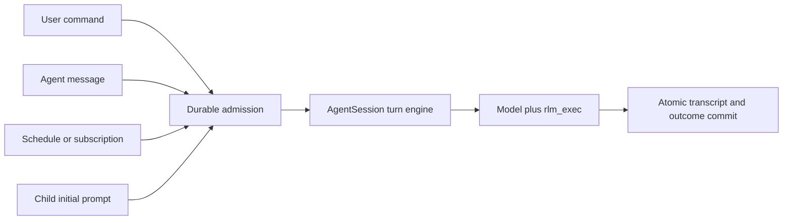

# WHIP single recursive agent runtime consolidation plan

**Date:** 2026-09-02  
**Status:** proposed consolidation plan; the first vertical slice is present in
the working tree  
**Scope:** replace the former direct-tool and RLM split with one recursive
agent architecture, then delete the compatibility structure that no longer
serves a production path

## Executive summary

WHIP should have one kind of model-driven session.

A root and every descendant should be instances of the same `AgentSession`
abstraction. Each session owns an independent model conversation, a bounded
Starlark kernel, a durable transcript, a route and reasoning effort, an
identity, capabilities, budgets, and a place in an agent tree. Each model sees
exactly one built-in tool, `rlm_exec`. File operations, shell commands, model
subcalls, child creation, messages, MCP, state, artifacts, schedules, browser,
computer, and permissions are host modules reached from Starlark.

The daemon owns provider calls, durable state, capabilities, budgets,
permissions, integrations, and process lifetime. The Starlark worker is a
disposable program execution environment, not an authority boundary and not a
second agent implementation. Clients render state and submit commands; they do
not own agent loops.

The current working tree already proves most of this model end to end. It has
one model-facing tool, retained recursive children, explicit durable messages,
MCP host calls, capability and budget delegation, bounded workers, daemon-only
execution, restart reconstruction, and a clean `runtime-v2` storage boundary.
The remaining architectural work is important: root and child turns must share
one turn engine, and the unreachable embedded-agent/TUI/task implementation and
its storage schema must be deleted. Until those deletions land, WHIP has one
production execution mode but still carries the shape of two historical
implementations.

## Why this change is worthwhile

Removing the former direct-tool agent is more than a product simplification.
It removes several classes of permanent tax:

- every capability is implemented and secured once, behind a typed host call;
- root and child behavior cannot drift because they use the same session and
  turn machinery;
- MCP does not need separate root-tool, child-tool, and bridge integration
  paths;
- one persistence model covers user turns, messages, scheduled wakes, and
  child follow-ups;
- tests can assert universal invariants instead of maintaining mode matrices;
- prompts and evaluations describe one product rather than teaching models to
  choose between two execution styles;
- the TUI, headless runner, ACP adapter, and MCP bridge remain protocol clients
  or tool hosts rather than alternate runtime owners.

The simplification is especially useful for recursive work. A child should not
be a special task object whose output is injected into a parent. It should be a
normal retained session with narrower authority. Once that is true, follow-up
turns, grandchildren, restart, scheduling, messaging, MCP, accounting, and
inspection all reuse existing session behavior.

## Research basis

### Prime Agent lessons to retain

Prime Agent's current RLM design provides the most relevant comparison:

1. Its default built-in model surface is one persistent IPython tool.
   Programmatic capabilities are composed inside that environment rather than
   represented as a wide list of native model tools.
2. A recursive call admits a normal child `AgentSession` and immediately
   returns a handle. It does not block waiting for the child and does not return
   the child's answer.
3. Children are retained and discoverable. Parent-to-child follow-ups and
   child-to-parent reports use explicit agent messages or files.
4. The host owns child lifecycle, provider calls, persistence, routing, and
   accounting. The Python `rlm` package is a thin bridge, not another agent
   runtime.
5. The kernel reaches host-owned behavior through typed requests. Prime's MCP
   integration combines kernel-side composition with host-owned configuration
   and authentication behavior.

Relevant upstream references:

- `packages/coding-agent/docs/rlm.md`
- `packages/coding-agent/docs/rlm-runtime.md`
- `packages/coding-agent/src/core/agent-session.ts`
- `packages/coding-agent/src/core/agent-messages.ts`
- `packages/coding-agent/src/core/kernel/repl-manager.ts`
- `prime-agent-runtime/src/rlm/__init__.py`
- `prime-agent-runtime/src/rlm/mcp.py`

### What WHIP should deliberately do differently

WHIP should copy Prime's recursive session semantics, not its implementation:

- WHIP uses bounded Starlark rather than an ambient Python control process.
- Kernel workers receive no direct filesystem, network, provider, credential,
  database, or daemon authority.
- All privileged calls remain in the Go host and pass through the capability,
  budget, permission, and root-actor boundaries.
- MCP connections remain host-owned; Starlark receives only bounded list/call
  operations and results.
- Large values remain content-addressed handles rather than accumulating in
  interpreter globals or model context.
- A default recursion depth of two edges permits root, child, and grandchild
  while placing a conservative bound on accidental fan-out.

This gives WHIP a smaller and more enforceable trust boundary than Prime's
general-purpose Python kernel while preserving the architectural advantage of
native recursive sessions.

## Product goals

At a high level, this project is trying to make a model effective on work that
is larger than one context window and richer than a linear tool loop.

The runtime should let an agent:

- keep its model context focused while inspecting large corpora through
  durable handles and bounded slices;
- compose several tool operations as a small program instead of spending a
  model round trip on each operation;
- delegate focused work to independent retained agents with their own context;
- coordinate through explicit, durable, attributable messages and shared
  state;
- survive client disconnects, daemon restarts, and disposable worker failures;
- bound cost, concurrency, depth, host calls, output, time, and authority;
- expose the same behavior through TUI, headless, ACP, scheduling, and future
  clients.

The goal is not merely “add subagents.” It is to make an agent tree the normal
execution model while keeping context admission and external authority
explicit.

## Architectural contract

### One session type

`AgentSession` is the only model-driven execution unit.

```text
AgentSession
├── identity: root id, agent id, parent id, name, depth
├── route: provider, model, reasoning effort, sampling
├── conversation: focused messages + durable full transcript handle
├── kernel: one disposable bounded Starlark worker
├── host: typed module dispatcher bound to this identity
├── authority: capability references + permission policy
├── budgets: inherited effective limits + usage reservations
└── lifecycle: idle, running, stopped, deleted
```

Root and child differences are data, not implementation modes:

- a root has no parent and receives user/protocol commands;
- a child has a parent and receives its initial prompt, explicit messages, or
  scheduled wakes;
- a child may have narrower capabilities and budgets;
- both otherwise execute the same turn engine, use the same model tool,
  persist the same transcript shape, and may create descendants when depth and
  resources permit.

There must be no `mode` field, `classic` constructor, child-only model loop,
or direct-tool fallback.

### One model-facing tool

Every provider request for a model-driven WHIP session advertises exactly:

```text
rlm_exec(code: string)
```

The Starlark environment exposes these host modules:

| Module | Responsibility |
| --- | --- |
| `context` | inspect, search, and read durable large-context handles |
| `files` | list, search, read, write, and patch workspace files |
| `shell` | run managed commands and read bounded output handles |
| `browser`, `computer` | invoke interactive host integrations |
| `models` | bounded stateless model calls and batches |
| `agents` | spawn, list, inspect, stop, and delete retained descendants |
| `messages` | send, list, read, and acknowledge explicit family messages |
| `mcp` | list configured servers/tools and call one named MCP tool |
| `state` | private state, blackboard state, CAS, and subscriptions |
| `artifacts` | persist and read durable evidence/results |
| `schedules` | create, list, and cancel future session wakes |
| `permissions` | inspect or trigger permission requests; never approve |

Module calls are not model tools. They are typed kernel-to-host requests. A
kernel cannot bypass the host by importing Go services or reading daemon state.

### One turn engine

All sources of work should converge before model execution:



The root actor remains the serialization and command-idempotency boundary for
the tree. That does not require a separate root model loop. Root-specific
command journaling should wrap the common `AgentSession` turn engine in the
same way that a child inbox wake wraps it.

### Explicit asynchronous children

`agents.spawn(...)` returns after admission with identity and effective policy:

```text
{
  id,
  name,
  parent_id,
  status,
  effective_capabilities,
  effective_budgets
}
```

It never returns an answer. The child ordinary assistant response remains in
the child's transcript. If a parent needs a result, it asks for an explicit
message. Follow-up work is another message/turn on the retained child, not a
steer operation and not construction of a new special child object.

The minimum lifecycle surface is intentionally small:

- `spawn`
- `list`
- `inspect`
- `stop`
- `delete`

There is no `await`, implicit join, report injection, or child-specific answer
submission API.

### Explicit communication and context admission

Messages are durable records with a daemon-derived sender, a relative
recipient, optional subject, body, optional evidence handle, status, and
timestamps.

Notifications carry only bounded metadata such as unread count, sender IDs,
or agent status changes. They are coalesced. A model chooses when to list and
read a body; handling it requires an explicit acknowledgement. This prevents a
high-volume child or integration from silently consuming the parent's model
context.

Ordinary assistant output and inter-agent transport must remain separate. This
is essential for agents that finish without needing to report, send several
incremental findings, or continue cleanup after reporting an answer.

### Capabilities and budgets

Omitted child capabilities inherit the parent's effective capabilities.
Explicit capabilities may only narrow them. Delegation creates child-specific
authority references; it never hands a child the parent's raw authority.

Budgets follow the same rule. Child limits are the minimum of the requested
limit and the parent's remaining/effective limit. Reservations happen at the
real boundary:

- worker capacity before durable child admission;
- model tokens and cost before provider calls, reconciled afterward;
- active children and concurrent child turns at tree transitions;
- host operations, durable bytes/records, schedules, and subscriptions at
  their mutation boundary.

Failures must release live reservations without erasing committed usage.

### MCP

MCP is an integration service, not a model execution mode.

- root and child Starlark environments expose the same `mcp` module;
- server discovery, configuration, authentication, connection lifecycle,
  timeouts, and result bounds remain in the daemon;
- calls are attributed to the invoking agent and pass through its effective
  policy;
- the stdio `whip mcp serve` process is a protocol-only tool host and does not
  construct an `AgentSession`, provider loop, or kernel;
- MCP failures are returned as bounded call errors and do not terminate the
  agent tree.

The tool host needs an explicit persisted session kind. Model/provider sentinel
strings are acceptable only as a temporary bridge.

### Persistence and recovery

New runtime data lives under `runtime-v2`; the former `sessions.db` is never
opened, migrated, or deleted by the new daemon.

The new schema should describe only the new architecture:

- roots/sessions;
- agents and lineage;
- turns;
- root commands and inbox items;
- per-agent transcripts;
- explicit agent messages;
- content objects, references, and grants;
- capabilities and permissions;
- budgets and usage;
- state, artifacts, subscriptions, and schedules;
- immutable events and daemon/client identity state.

It should not contain `tasks`, `task_id`, or one-shot `child_executions`. A
retained agent plus a turn row fully represents the new lifecycle.

Recovery restores retained agents as idle sessions with their model route,
transcript, identity, policy, and pending metadata notifications. It does not
replay uncertain external effects. A disposable kernel can be rebuilt from
durable host state; interpreter globals are best-effort scratch state only.

## Current working-tree status

The following is the status at the time this plan was written.

| Area | Status | Evidence or gap |
| --- | --- | --- |
| Mode/config removal | Complete | no runtime mode field or Classic execution selection |
| Model-facing surface | Complete | root, child, grandchild, and restored child tests assert exactly `rlm_exec` |
| Recursive retained agents | Complete | asynchronous spawn, lineage, model override, effort, transcript, restart reconstruction |
| Capabilities/depth/budgets | Substantially complete | inherited/narrowed grants, two-edge default, model accounting, worker-before-admission |
| Explicit messaging | Complete | durable send/list/read/ack and metadata-only coalesced wakes |
| MCP inside RLM | Complete for list/call | shared daemon manager reached from root and child Starlark hosts |
| Client cutover | Complete | TUI, headless, sessions, and ACP use daemon protocol paths |
| MCP stdio isolation | Partial | separate tool runner exists; session kind still uses a model/provider sentinel |
| Root/child turn parity | Partial | same `AgentSession` shape and model loop, but root and child scheduling/persistence adapters differ |
| Legacy code deletion | Not complete | embedded direct-agent TUI and background-task code remains compiled but unreachable in production |
| Minimal schema | Not complete | `tasks`, `task_id`, `child_executions`, and one-shot child APIs remain from the earlier design |
| Evaluation | Baseline complete | deterministic recursive evaluation exists; realistic effectiveness matrix remains |
| Verification | Green | `go test ./...` passes in the current working tree |

## Remaining implementation units

The sequence below is ordered to remove architecture, not merely terminology.
Each unit should leave the repository green and delete more code than it adds
where practical.

### Unit 1: make `AgentSession` the shared turn engine

**Goal:** root and descendant turns call the same model-execution method.

1. Add one `AgentSession` turn method that owns input focusing, provider-loop
   invocation, streaming callbacks, usage, cancellation, and the resulting
   transcript snapshot.
2. Make the root daemon `Runner` adapter delegate to `rootNode` instead of
   wrapping the bare `agent.Agent` independently.
3. Make child initial prompts and notification wakes call the same method.
4. Keep root command admission and client streaming in the root actor, but move
   no model behavior into that wrapper.
5. Centralize status mapping and cancellation so root and child failures have
   the same `succeeded`, `failed`, `cancelled`, and `interrupted` semantics.
6. Preserve the different commit envelopes only where required: root commands
   atomically settle command/inbox state; child turns atomically settle their
   turn/inbox state. Both consume the same turn result.
7. Add a test hook that proves root, child, grandchild, and restored-child turns
   all pass through the common method.

**Done when:** there is no production model invocation outside
`AgentSession`'s turn engine, and constructing a daemon root without an
`AgentSession` is impossible except for an explicit non-model tool-host kind.

### Unit 2: delete the embedded direct-agent implementation

**Goal:** remove the largest remaining source of conceptual duplication.

1. Remove `agent.New`/`NewWithServices` as separate direct-tool constructors;
   keep one constructor for the provider loop used by `AgentSession`.
2. Delete the legacy background task registry, direct subagent tool,
   subagent-steer tool, worktree task launcher, task follow-up methods, and
   their tests.
3. Strip task-specific fields from `agent.Agent`: `TaskDefault`, background
   registry, subagent runtime seam, task inflight counters, and worktree task
   policy.
4. Remove direct model/store/services ownership from the TUI model. Delete
   every `client == nil` production fallback and keep presentation-only state.
5. Delete the old task pane, task-model command, `/task`, `/subagent`,
   `/subagents`, and `/tasks` code and tests. Keep `/agents` as the sole tree
   surface.
6. Convert any still-useful UI feature to a daemon command before deleting its
   direct implementation. If a feature is not part of the intended product,
   remove it rather than retain a fallback.
7. Remove the separate configured “task model.” A child inherits its parent's
   route unless `agents.spawn` explicitly requests another resolvable model.
8. Rework the startup benchmark to construct the singular runtime path or to
   measure configuration/provider resolution only; it must not keep a dead
   constructor alive.

**Done when:** production and test code contain no embedded child-agent/task
runtime, and `internal/tui` cannot create a provider client or session store.

### Unit 3: reduce storage to the recursive model

**Goal:** make the database tell the same story as the runtime.

1. Rename `ChildAdmission` to `AgentAdmission` and remove the
   execution-record branch from admission.
2. Delete `AdmitChild`, `StartChildTurn`, `FinishChildTurn`, legacy peer-message
   delivery modes, and other one-shot child APIs.
3. Drop the `tasks` and `child_executions` tables and the `sessions.task_id`
   column. Delete `SaveTask`, `LoadTasks`, `SaveSubagentTranscript`, and
   `SubagentTranscript`.
4. Keep `agents`, `turns`, `transcript_messages`, and `agent_messages` as the
   only recursive lifecycle/message representation.
5. Split the current mixed swarm file by durable concept only when that makes
   ownership clearer: agents/lineage, mailbox, budgets, and state. Do not add
   repository interfaces or generic storage layers.
6. Decide the migration strategy before merge:
   - if `runtime-v2` has not shipped, squash it to one fresh schema and reject
     incompatible development databases with a clear message;
   - if it has shipped, add one forward migration that removes obsolete schema,
     then retain only the minimal migration history required for that release.
7. Verify that the old pre-runtime-v2 database path is never opened during
   migration tests or normal startup.

**Done when:** no live table, Go type, query, migration, or test uses the old
task/child-execution representation.

### Unit 4: clarify runtime and host package boundaries

**Goal:** make the core execution path readable without introducing a framework.

Keep the current packages and split only oversized files along real ownership
boundaries:

- `internal/agent`: provider loop, compaction, steering/queued input, and usage;
- `internal/daemon/recursive_runtime.go`: tree lifecycle and lookup;
- `internal/daemon/agent_session.go`: one session's turn and wake lifecycle;
- `internal/daemon/host.go`: typed dispatch, argument validation, result bounds;
- small host-domain files for workspace/integrations and coordination/state if
  `host.go` remains too large;
- `internal/rlm`: worker protocol, limits, Starlark environment, and the single
  model tool;
- `internal/session`: durable records and transactions only.

Do not introduce an interface for `AgentSession`, a dependency-injection
container, or separate root/child subclasses. Concrete types are simpler here.

During this unit:

1. remove duplicate argument parsing and result-bounding helpers;
2. make host operation errors use one structured/bounded shape;
3. ensure every host operation is visibly routed through either the capability
   dispatcher or a root-actor transaction;
4. remove fields copied to children that the recursive runtime does not use;
5. document the few intentional root-only responsibilities next to the root
   actor rather than in the general agent session.

### Unit 5: make non-model tool hosts explicit

**Goal:** preserve one model execution mode without forcing non-model protocol
services to pretend to be agents.

1. Add an explicit session/component kind such as `agent` or `tool_host`.
2. Construct `AgentSession` only for `agent` roots.
3. Construct the small tool runner for `whip mcp serve` roots.
4. Remove checks for `model == "mcp" && provider == "local"`.
5. Ensure tool-host sessions cannot accept turns, spawn agents, or start a
   kernel, while still using dispatcher permissions and process ownership.

This is not a second execution mode. It is a non-model protocol endpoint with
no agent semantics.

### Unit 6: finish the `/agents` and mailbox user experience

**Goal:** make the recursive architecture observable without leaking transport
details into model context.

1. Keep `/agents list|stop|delete` as the only tree command initially.
2. Show name, relationship, status, model, depth, unread count, and effective
   budget summary from daemon snapshots.
3. Add follow-up messaging through the same message command used by model
   sessions. Steering exists only as loop-boundary injection of durable rows
   (`steer` inbox kind, `steer`-class mail) by the one delivery engine in
   `AgentSession.RunTurn`; never resurrect stream interruption or in-memory
   steer bookkeeping.
4. Render message subjects/status in the TUI, but load bodies only when the
   user or agent explicitly opens them.
5. Keep client reconnect/snapshot logic independent of live tree ownership.
6. Avoid adding a second interactive child-chat mode until message-based
   follow-ups prove insufficient.

### Unit 7: effectiveness evaluation and hardening

**Goal:** prove the simplified system is not only coherent but useful.

Add deterministic tasks for:

1. repository survey with independent areas delegated in parallel;
2. implementation plus independent verification;
3. a child receiving a later follow-up without losing context;
4. a grandchild reporting through explicit messages;
5. MCP discovery/call from both root and child;
6. ten or more child messages coalescing to one metadata wake without body
   injection;
7. daemon restart with retained agents, unread messages, and transcripts;
8. kernel crash and restart without loss of committed host state;
9. capacity, depth, capability, budget, and permission denial without ghost
   agents or leaked reservations.

Track at least:

- task correctness;
- root model calls and tokens;
- child model calls and tokens;
- maximum and average useful concurrency;
- time to first evidence and final result;
- duplicate file/context reads;
- messages sent/read/acked;
- host calls by module;
- kernel restarts and rejected spawns;
- latency and estimated cost.

The baseline should be the singular runtime itself under different orchestration
strategies, not a resurrected Classic mode. Useful comparisons include no
children, stateless `models.batch`, retained children, and retained recursive
children under equal model/context/budget constraints.

## Acceptance gates

The consolidation is complete only when all of the following are true.

### Static architecture gates

- no production identifier or config key named Classic/classic;
- no model-driven constructor other than the singular runtime constructor;
- no production `subagent`, `background task`, `task model`, or
  `child_executions` implementation;
- no direct provider/store/process ownership in TUI, headless, ACP, sessions,
  or MCP bridge clients;
- no model/provider sentinel used to identify a protocol-only tool host;
- exactly one model tool definition for every root and descendant request;
- every privileged Starlark host operation routes through a documented daemon
  policy boundary.

### Behavioral gates

- root, child, grandchild, and restored child use the same turn engine;
- spawn rejection for capacity/depth/policy leaves no durable agent;
- child ordinary output never enters the parent context automatically;
- explicit messages survive restart and require explicit body reads;
- metadata notifications coalesce without losing individual messages;
- follow-up messages cause later turns on the same retained child transcript;
- MCP works from root and child with caller attribution;
- deleting a subtree closes kernels/processes and preserves audit history;
- old pre-runtime-v2 data remains untouched.

### Verification gates

- `go test ./...`
- `go test -race ./internal/daemon ./internal/session ./internal/rlm`
- repeated recursive-runtime lifecycle tests to expose shutdown races;
- deterministic evaluation report checked into test output/fixtures;
- opt-in live evaluation with recorded model, provider, limits, cost, and
  result metadata;
- macOS and Linux coverage for worker limits, process-group cleanup, restart,
  and socket ownership.

## Risks and mitigations

| Risk | Mitigation |
| --- | --- |
| TUI cleanup accidentally removes a useful feature | route intended features through daemon commands first; delete only after a focused behavior test exists |
| Shared turn engine becomes an over-general abstraction | use a concrete `AgentSession` method and small request/result structs, not a hierarchy or plugin interface |
| Restoring every retained child exhausts worker capacity | restore metadata eagerly but start kernels lazily, or evict idle kernels while retaining sessions; measure before adding policy |
| Message wakes cause turn storms | coalesce metadata, serialize per agent, recheck pending work after completion, and cap automatic continuations |
| Child model override silently changes | require exact resolution and fail admission; otherwise inherit the parent route |
| Schema cleanup destroys old data | operate only under `runtime-v2`, choose squash versus forward migration explicitly, and keep pre-runtime-v2 paths unopened |
| MCP weakens the kernel boundary | keep credentials/connections in the host, bound schemas/results, and attribute calls to the invoking agent |
| Recursive fan-out overwhelms providers | enforce depth, active-child, concurrent-turn, token/cost, host-call, and worker limits before execution |

## Recommended commit sequence

Keep each commit independently green and avoid a compatibility layer:

1. `refactor(runtime): share one AgentSession turn engine`
2. `refactor(agent): remove embedded subagent and direct-tool runtime`
3. `refactor(tui): delete direct runtime ownership and task UI`
4. `refactor(session): remove task and child-execution persistence`
5. `refactor(runtime): clarify recursive host ownership`
6. `refactor(mcp): add explicit protocol tool-host sessions`
7. `test(runtime): expand recursive effectiveness and recovery coverage`
8. `docs(runtime): close single-runtime migration`

Do not merge a temporary adapter merely to preserve an internal API that no
production path needs. The clean `runtime-v2` boundary is the opportunity to
finish the deletion now.

## Immediate next action

Start with Unit 1. It is the remaining structural seam on which the later
deletions depend. Once root and child turns share one `AgentSession` method,
delete the old embedded runtime and schema in Units 2 and 3. Defer UI polish
and new orchestration features until those removals are complete.
