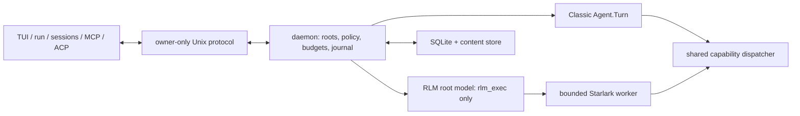

# RLM runtime

whip runs model work in a local background daemon. New sessions use RLM mode
by default: the root model sees one `rlm_exec` tool and uses bounded Starlark
cells to inspect context, delegate work, and call daemon-owned capabilities.
Classic mode keeps the existing JSON tool loop and never starts a Starlark
worker.

The point is not “more agents” by itself. The runtime keeps large inputs out
of the root prompt, makes delegation and shared state durable, gives built-in
file and shell effects one authorization path, and lets work survive a UI or
protocol client disconnect without guessing whether a command ran twice.

## Ownership and data flow

The daemon is the only process that opens `sessions.db`, owns live agents,
invokes capabilities, starts helper processes, and commits runtime state.
The TUI, `whip run`, `whip sessions`, `whip mcp serve`, and `whip acp` are
protocol clients. They render, submit stable commands, answer permission
requests when authorized, and reconstruct state from replay or a snapshot.



An RLM turn receives the current request, at most four recent user/assistant
exchanges, an at-most-8-KiB summary, and handles for full history or supplied
content. Reads return bounded excerpts with source identifiers and byte spans.
Interpreter globals can survive between cells in one worker, but they are
scratch space: only daemon-hosted state, content, messages, artifacts, and
child records survive a worker restart.

## Runtime files and local security

The default home is `~/.whip`; `WHIP_HOME` overrides it. The daemon creates
the directory owner-only and uses these runtime files:

| Path | Purpose |
| --- | --- |
| `daemon.sock` | owner-only (`0600`) Unix socket; a long home path uses an owner-specific hashed directory under the system temp directory |
| `daemon.lock` | non-blocking process lock acquired before SQLite is opened or inspected |
| `daemon.log` | owner-only detached-daemon stdout/stderr |
| `sessions.db`, `sessions.db-wal`, `sessions.db-shm` | durable session, command, event, swarm, capability, budget, permission, and reference metadata |
| `artifacts/sha256/` | immutable content-addressed bodies kept outside SQLite; references and grants live in the database |

Clients reject a socket that is not a Unix socket, is not `0600`, or has a
different owner. Stable client identities and Ed25519 private keys live in the
OS credential store; there is no plaintext credential fallback. A connection
must prove possession of its key before it can make a human permission
decision. Approval resumes only the exact persisted request after authority,
scope, budget, path, and digest are revalidated.

The Starlark worker is a re-execution of the `whip` binary in hidden kernel
mode. It receives an allowlisted environment, closed unintended descriptors,
no daemon/client credentials, and no ambient filesystem, process, network,
provider, or database primitive. All useful work crosses the typed host-module
boundary. File and shell calls enter the same dispatcher used by Classic
built-ins; state, messages, artifacts, schedules, budgets, and children enter
daemon-owned root APIs.

## Configuration and modes

RLM is enabled by default. To make newly created sessions Classic, add this to
`~/.whip/config.json`:

```json
{
  "rlm": {
    "enabled": false
  }
}
```

Mode is persisted per session. Changing the default does not silently convert
existing sessions.

Zero or omitted limits use these defaults:

| Config field | Default | Scope |
| --- | ---: | --- |
| `rlm.steps` | 1,000,000 | Starlark steps per cell |
| `rlm.hostRequests` | 1,024 | host calls per cell |
| `rlm.wallMillis` | 30,000 | wall time per cell |
| `rlm.memoryMiB` | 256 | worker address-space/RSS limit |
| `rlm.outputBytes` | 65,536 | captured cell output |
| `rlm.frameBytes` | 1,048,576 | worker control frame |
| `rlm.maxWorkers` | 4 | daemon-wide concurrent kernel workers |

The durable root budget ledger is independent of those interpreter limits.
It accounts tokens, cost, elapsed time, content bytes, record count, schedules
and subscriptions, active operations, active children, concurrent child turns,
and tree depth. Descendant limits clamp inherited authority; reservations are
settled or released atomically and roll up to the root.

## Starlark modules

Every operation uses keyword arguments. Large arguments and results become
handles instead of crossing the protocol inline.

| Module | Operations |
| --- | --- |
| `context` | `inspect`, `search`, `read` |
| `files` | `list`, `search`, `read`, `write`, `patch` |
| `shell` | `run`, `read` |
| `models` | `call`, `batch` — stateless calls; batches fan out concurrently and do not create agent identities |
| `agents` | `spawn`, `inspect`, `list`, `steer`, `stop`, `await` — durable children |
| `messages` | `send`, `receive` |
| `state` | private and blackboard get/set/append/CAS/list, history, subscribe/list/cancel |
| `artifacts` | `put`, `inspect`, `read` |
| `schedules` | `create`, `list`, `cancel` |
| `permissions` | `request`, `status`; a kernel can never approve its own request |
| `answer` | `submit` with grounded source handles and spans |

File and shell calls do not bypass normal tool policy. Mutations are ordered
by the daemon-wide workspace coordinator, and shell authority is separate
because arbitrary shell effects cannot be proven path-contained. Child agents
receive explicit, non-escalating capabilities and budgets.

## Disconnects, replay, and recovery

Each logical client command has a stable command ID. The daemon durably admits
it once, assigns an ingress sequence, and returns the stored outcome on retry.
A disconnected client moves through `disconnected`, `reconnecting`, and
`snapshotting` before becoming `live`; it cannot submit new commands until it
has applied ordered events after its cursor or replaced local state with an
authoritative snapshot.

Closing a client does not cancel daemon-owned work. After reconnect, the
client sees the same event sequence and one command outcome. If a daemon dies,
committed outcomes remain committed. Work that may have crossed an external
side-effect boundary is marked `interrupted` on the next generation and is
never replayed automatically. Retry means “ask for the outcome of this stable
command,” not “run it again.”

Snapshots contain behavioral state—messages, agents, inbox, shared state,
budgets, capabilities, permissions, schedules, tasks, and presentation
events—not just transcript text. Old-generation or unsigned permission
decisions are rejected.

## Verification and evaluation

Run the deterministic release suite with:

```sh
task acceptance
```

It includes real daemon and kernel subprocesses under isolated storage plus
the focused swarm, policy, budget, reconnect, ACP, headless, sessions, and MCP
contract tests. `task ci` includes this suite. Hosted CI also runs the Unix
runtime subset under the race detector on Linux and macOS, builds all release
targets, and makes both the runtime matrix and Swift driver prerequisites of
the aggregate `go` gate.

The comparison fixture is deterministic in normal tests. A release operator
can run the same oversized-context task against the configured live provider:

```sh
WHIP_RLM_LIVE_EVAL=1 \
WHIP_RLM_EVAL_REPORT=/tmp/whip-rlm-comparison.json \
go test ./evals/rlm -run '^TestLiveRLMClassicComparison$' -v
```

The live comparison defaults to the configured `deepseek-v4-flash-0731`
task route so the result does not depend on the interactive default model.
Set `WHIP_RLM_EVAL_MODEL` and, if necessary, `WHIP_RLM_EVAL_PROVIDER` to pin
a different release candidate.

The report records correctness, latency, total model calls, maximum batch
fan-out, host calls, input/output/context tokens, and estimated cost for both
modes under the same root context and model-call cap. This spends provider
tokens and is intentionally not a per-commit CI gate.

## Troubleshooting

- **Client stays disconnected:** inspect `~/.whip/daemon.log`, then verify the
  home, socket, and lock are owned by your user. Do not loosen socket modes.
- **A new binary keeps reconnecting:** the client asks the old generation to
  checkpoint and replace itself. A persistent loop usually means the daemon
  log contains a startup/config error.
- **Command returns `interrupted`:** the previous daemon generation could not
  prove that in-flight work was safe to replay. Inspect the workspace and
  submit a new command only after deciding whether the side effect occurred.
- **Replay is expired:** the client automatically requests a snapshot and
  remains unable to submit until replacement completes.
- **Kernel limit error:** reduce one cell's work or raise the corresponding
  `rlm` limit deliberately. Prefer bounded reads and smaller batches before
  increasing memory, frame, or output ceilings.
- **Permission remains pending:** an attached, paired human client must decide
  it. MCP stdio and unpaired clients cannot answer permission prompts.
- **Classic is required:** set `rlm.enabled` to `false` before creating the
  session. A Classic session uses the daemon and durable journal but creates
  no kernel worker.
