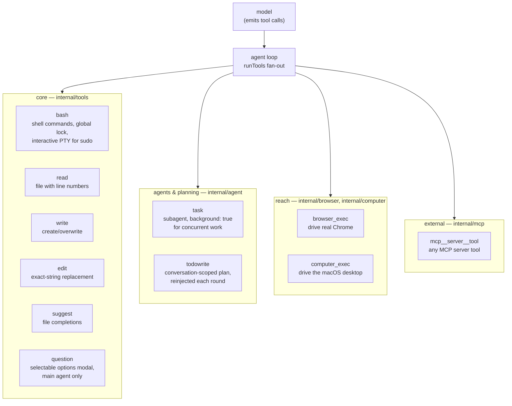

# Tools

The tools are the model's hands. whip keeps the set small and code-shaped:
each tool is a function with a JSON schema, defined in `internal/tools`, run
by the agent loop with per-path mutation locks (see
[agent-loop.md](agent-loop.md#parallel-tool-calls)).

## The set

## Design rules

1. **Few, composable tools beat many special cases.** There is no "search
   the web" tool — there is `bash` and `curl`. There is no "rename symbol"
   tool — there is `edit` plus LSP diagnostics that catch what the edit
   broke. The model composes the primitives.
2. **Reads are free, mutations are locked.** `read` and `suggest` never
   block. `write`/`edit` serialize per canonical path; `bash` serializes
   globally because its side effects can't be attributed to one file.
3. **Failure is data.** Tool errors return as results the model can act on —
   a failed `bash` includes exit code and stderr tail; a slow MCP server
   fails fast with an actionable message instead of blocking the loop.
4. **Schemas teach.** Each tool's JSON schema carries usage guidance (the
   `bash` schema documents the per-path locking behavior so the model batches
   independent calls and serializes same-file ones).

## bash

Runs through `internal/tools/bashrun` so the agent can:

- **interrupt** — ctrl+c once interrupts the foreground command; twice quits
  whip and kills agent-spawned child processes (process-group cleanup).
- **authenticate** — `interactive: true` runs in a PTY so `sudo`/ssh-style
  password prompts reach the user; whip forwards keystrokes and kills the
  command after 15s of no input.
- **suggest next steps** — the schema nudges the model toward batching
  independent calls in one turn, which the loop then runs in parallel.

## question

The model asks the user to pick from 2-6 options when a decision is theirs
(opencode's `question` tool, one question per call). The TUI shows a modal:
numbered rows with dim descriptions, a "type your own answer" row, `multiple`
for checkbox selection. Same hand-off as the permission gate: the tool
goroutine blocks on `tools.Ask` until the UI answers; esc dismisses and the
model is told so. Registered for the main agent only — subagents are told not
to ask, and the MCP server has no user.

## Subagents (`subagent`)

A `subagent` call launches a fresh `Agent` with its own context — used for
context-heavy exploration or self-contained work. With `background: true` it
runs concurrently with the parent and reports back as a steered message when
done; `/subagents` shows live status. The parent only ever receives the final
report, which keeps the main conversation small.

## MCP tools

External MCP servers contribute tools named `mcp__<server>__<tool>`. They
connect lazily (a broken server never blocks startup) and auto-reconnect
with backoff. `whip mcp serve` runs whip's own read/bash/edit/write as an
MCP server for other harnesses — the interop works both ways.
Config styles and management: README §MCP,
[features.md](features.md#mcp).

## LSP diagnostics

After an `edit` or `write`, gopls diagnostics for the touched file are
attached to the tool result, so the model sees "this edit broke three
callers" immediately instead of on the next compile. See
[features.md](features.md#lsp-diagnostics).

## Read next

- [browser-computer-use.md](browser-computer-use.md) — `browser_exec` and
  `computer_exec` in depth
- [agent-loop.md](agent-loop.md) — how calls are scheduled and locked
