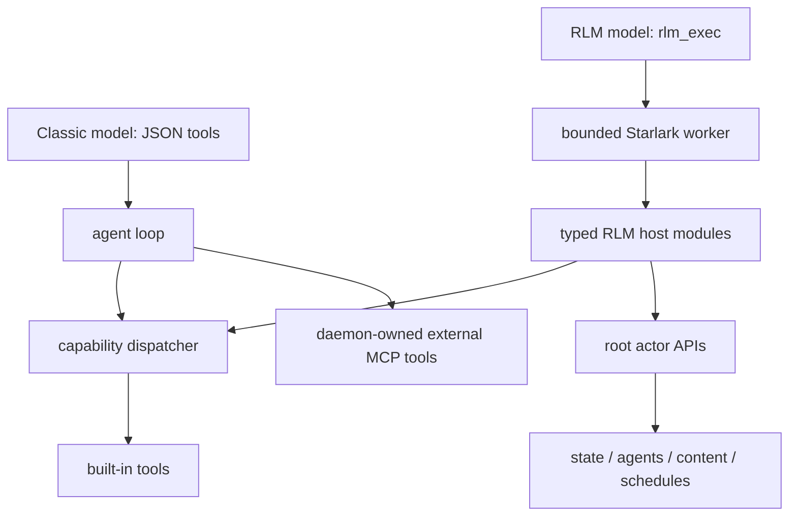

# Tools and RLM modules

whip has two model-facing tool surfaces under one daemon owner. Classic
sessions expose JSON tools. RLM sessions expose only `rlm_exec`, whose
Starlark modules map to daemon-owned capabilities and root APIs. Neither a
client nor a kernel invokes concrete handlers directly.

## Shared execution rules

1. **Authority is explicit.** The dispatcher validates the root and agent,
   capability, workspace/path scope, budget, permission, operation state, and
   canonical request digest. Permission approval triggers revalidation; it is
   not authority by itself.
2. **Large values become handles.** Runtime values over the inline limit are
   stored content-addressed and returned as bounded previews plus references.
3. **Mutations are ordered.** Same-path file mutations serialize; unrelated
   paths may run concurrently. Shell requires separate authority and takes the
   workspace-wide mutation side.
4. **Failure is data.** Tool errors return bounded results the model can act
   on. A failed integration does not kill an otherwise healthy daemon root.
5. **The daemon owns lifetime.** Tool, MCP, browser, computer, LSP, shell, and
   kernel processes are registered with the root/service owner and cleaned up
   on stop or replacement.

## Classic tools

The core definitions live in `internal/tools`; `internal/agent` adds planning
and subagent operations.

| Tool | Purpose |
| --- | --- |
| `read` | line-numbered file reads; RLM list/search/read also reuse it |
| `write` | create or overwrite a file |
| `edit` | exact-string replacement with a rendered diff |
| `bash` | bounded shell execution, optional interactive PTY, managed process group |
| `todowrite` | conversation-scoped plan persisted with the root |
| `subagent`, `subagent_*` | foreground/background child work, steering, inspection, cancellation |
| `browser_exec` | Chrome automation through configured daemon-owned backend |
| `computer_exec` | macOS accessibility/screenshot automation through the embedded helper |
| `mcp__<server>__<tool>` | tools discovered from configured MCP servers |

Classic tool calls in one provider response fan out concurrently. Results are
appended in call order. Output over the shared tool limit is elided with a
pointer to owner-only spilled output.

`bash` child processes receive `WHIP`, `WHIP_SESSION_ID`, `WHIP_MODEL`, and
`WHIP_PID` markers. Interactive commands stream terminal events through the
daemon protocol; client input is routed back by terminal ID.

## RLM modules

Starlark module operations accept keyword arguments. The exact registry is in
`internal/rlm/modules.go`.

| Module | Operations and semantics |
| --- | --- |
| `context` | `inspect`, `search`, `read` a supplied/history handle and return cited byte spans |
| `files` | `list`, `search`, `read`, `write`, `patch`; maps to dispatcher-owned file tools |
| `shell` | `run`; `read` resolves a handle-backed shell result |
| `models` | `call` or concurrent `batch` for stateless model work; accounts usage but creates no child identity |
| `agents` | `spawn`, `inspect`, `list`, `steer`, `stop`, `await` durable children with capabilities and budgets |
| `messages` | `send`, `receive` durable peer/root inbox messages with evidence grants |
| `state` | private and blackboard get/set/append/CAS/list/history plus subscriptions |
| `artifacts` | `put`, `inspect`, `read` durable content with source metadata and spans |
| `schedules` | `create`, `list`, `cancel` daemon-owned wakeups |
| `permissions` | `request` explains the flow; `status` inspects it. No approval operation exists in the worker. |
| `answer` | `submit(text=..., citations=...)` returns a grounded final value |

Use `models.batch` for independent, stateless analysis. Use `agents.spawn`
when work needs identity, tools, durable state, peer messaging, follow-ups, or
lifecycle control. Treat Starlark globals as a small scratchpad; use `state`
or `artifacts` for anything that must survive a worker crash.

## MCP tools

External MCP servers connect lazily and auto-reconnect with generation guards.
Calls serialize per server, time out, and flatten structured/media results into
bounded model-visible output. Server instructions join the system prompt and a
live tool-list change updates future Classic turns.

`whip mcp serve` is itself a thin stdio protocol client. It creates a
daemon-owned local MCP root and forwards read/bash/edit/write requests as
stable commands through the dispatcher. The stdio process does not open the
session database, call a concrete tool handler, or approve permissions. A
pending request is returned to the MCP caller instead of being decided by a
non-human adapter.

Configuration and lifecycle commands are documented in [README.md](README.md#mcp).

## LSP diagnostics

After an `edit`, `write`, or corresponding RLM file mutation, diagnostics for
the touched file and relevant siblings are attached to the result. LSP waits
are bounded, so an unresponsive server cannot park the root.

## Read next

- [rlm-runtime.md](rlm-runtime.md) — limits, handles, recovery, and evaluation
- [agent-loop.md](agent-loop.md) — how model calls and tools cycle
- [concurrency.md](concurrency.md) — actors, fan-out, ordering, and cleanup
- [browser-computer-use.md](browser-computer-use.md) — browser and desktop tools
